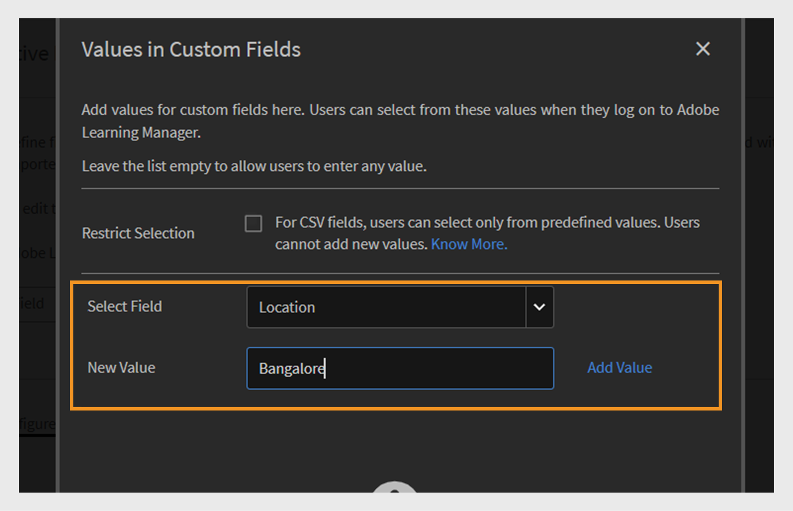

# Active fields

Active fields in Adobe Learning Manager are custom user attributes that help administrators organize and manage users effectively. They allow you to capture extra information about user, such as department, location, or job title. Administrators can use this data to create user groups, personalize learning, and filter reports more effectively.

User attributes are pieces of information such as a user's first name, last name, and email address. These attributes help administrators to:

* Identify users
* Group users
* Manage user permissions and access restrictions

By adding custom attributes to user profiles, active fields capture additional information relevant to your organization.

>[!INFO]
>
>Watch this ALM Academy training to learn how to add, customize, and configure active fields.  

## Add active fields

Active fields apply to both internal and external learners, allowing organizations to define and manage custom user attributes for all users.

To add or manage active fields for internal users:

1. Select **Users** on the administrator homepage.

2. Select **Active Fields**.

3. Type the active field name and then select **Add**. The process to add active fields for external learners is the same as for internal learners.

   
   _Field to enter the name of a new custom attribute for users_

4. Select **Save**.

## Add custom values to active fields

Active fields can include predefined or custom values that match your organization's structure. Adding custom values helps capture details that are specific to your internal users, such as department names, job levels, or regional offices.

To add custom values for internal users:

1. Select **View Values** under the **Active Field** section.
2. In the **Values in Custom Fields** dialog:
 
   * Select an active field from the **Select Field** dropdown.
   * Type the values of the active field in the **New Value** field.
   
   
   _Dialog to input custom values for a specific active field_

3. Select **Done** and then select **Save** to apply changes.

## Configure active field settings

Customize active fields to help with user management and reporting tasks, and configure the active fields properties:

* **Groupable**: This option allows you to group learners based on active field values.
* **Reportable**: This option allows you create a reporting user group based on the active field value and enables the reporting filter for the field in dashboard reports.
* **Learner-Configurable**: This option allows learners to configure the field themselves.
* **Exportable**: This option includes the active field in exported user group reports.
* **Multi-Valued**: This option supports multiple values for the active field.

To configure active fields settings:

1. Select the **Settings** tab and then navigate to the **User Display** section.

   
   _Select the Settings tab to customize the active fields_

2. Select one or both options, as needed.:

   * **Show only unfilled fields on learner login:** When selected, learners will see only the active fields they haven't filled out yet. This prompts them to complete their profile, helping ensure that user data is accurate and up to date. Displaying these fields supports complete learner profiles and enables personalized learning experiences.
   * **If unchecked, the 'Complete Your Profile' page is not shown to users:** When this option is disabled, learners won't see the **Complete Your Profile** page upon login. They will not be prompted to update or fill in any profile information and can access the platform directly.
   
   
   _Settings interface to control how and when active fields are shown_

3. Select **Save** to apply your changes.

## Multi-valued active fields

Multi-valued active fields allow you to assign multiple values to a single user attribute, such as locations, job titles, or project teams. This helps capture more detailed and flexible user information.

You can configure up to three multi-valued active fields per account. These are available for both internal and external users. After a field is set as multi-valued, this setting cannot be changed back.

To assign multiple values to an active field:

1. Select **Users** and then select **Active Fields**.
2. In the **Settings** tab, select **Multi-valued**.

_Settings interface to control how and when active fields are shown_

You can add multiple values via the CSV or through User Interface. Once the multi-valued field is used in a user group, it cannot be changed to single-valued.

## Add active fields by uploading a CSV

Add active fields when uploading users via CSV by including matching headers for each defined field. Administrators can upload users in bulk using a CSV file. The CSV should include the new active fields that define the users to be imported. Ensure the header names in the file exactly match the active fields set up in the system so the data maps correctly. Upload the CSV file from the **Users** section.

View this [article](/help/migrated/administrators/feature-summary/add-users-user-groups.md) for more information about adding users in bulk.

## Restrict values for CSV fields

The **Restrict Selection** option in **Values in Custom Fields** controls whether users importing data through CSV files can only select from predefined values for custom fields. When enabled, users must choose from the set list of values, ensuring data consistency and preventing new or unexpected entries. If disabled, users can enter any value, offering more flexibility but less control over data accuracy.

_Checkbox to enable value restriction during CSV upload_

## Manage missing active fields in user CSV import

In some cases, administrators prefer learners to manually fill certain active fields when they log in to Adobe Learning Manager. This is supported for users imported via a CSV file. Refer to this [article](/help/migrated/administrators/feature-summary/add-users-user-groups.md) for how to add users in bulk.

If a CSV file does not include all active fields, the administrator must manually enter the missing values after the import.

By default, every active field must be mapped to a corresponding field in the source CSV. However, if you do not want to map a specific active field to any column in the CSV, you can select the value **DontImportFromSource** from the drop-down list during both the Box and FTP import processes. This option is available when importing users via FTP or Box connectors. Refer to this [article](https://experienceleague.adobe.com/en/docs/learning-manager/using/integration/connectors) for more information about the connectors.
