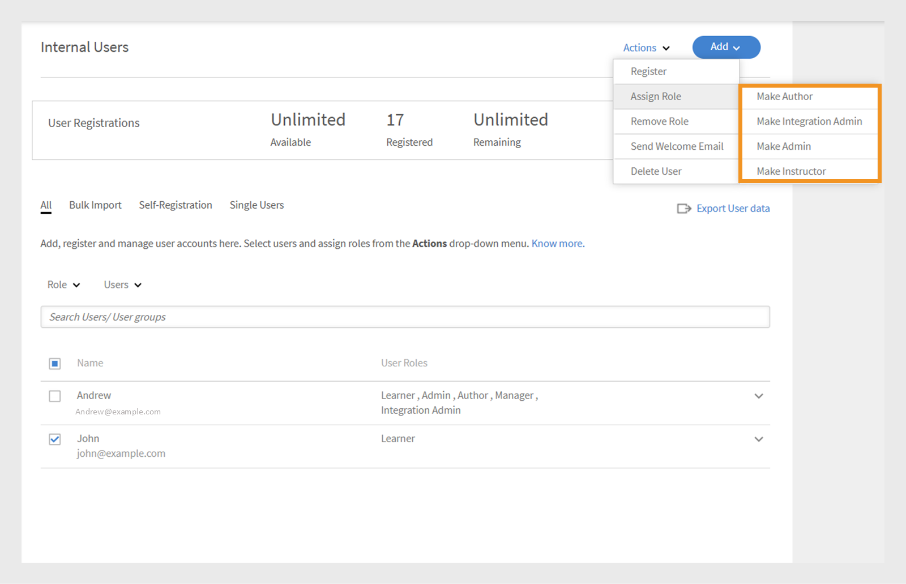

# Add users in Adobe Learning Manager

In Adobe Learning Manager, users are learners who use the platform for learning or training. There are two types of users: internal users and external users.

Internal users are employees or team members from your organization.

External users are learners outside your company, such as customers, partners, vendors, or clients, who can access your learning content.

Adobe Learning Manager (ALM) allows administrators to onboard and manage both internal and external users using various methods, including manual entry, CSV upload, self-registration, and system integrations.

## Internal users

Internal users in Adobe Learning Manager refer to employees or team members within your organization. You can add them manually, upload them in bulk, or import them through system integrations. After adding these users, you can organize them into groups, assign courses, and monitor their learning progress.

Users in Adobe Learning Manager can take on different responsibilities and manage various tasks based on their assigned roles. Each role, including Administrator, Author, Instructor, and Integration Administrator, offers a set of specific capabilities tailored to support the user's responsibilities within the platform.

### Methods to add internal users

Administrators can add internal users using the following methods:

* **Add a single user**: Manually add one user at a time.
* **Self-Registration profile**: Allow learners to self-register as learners in Adobe Learning Manager using a registration link created by the administrator.
* **Bulk upload via CSV**: Upload a CSV file to add multiple users at once.

### Manually add an internal user

Administrators can manually add a user by providing their name, email, unique identifier, and manager's name. The Unique Identifier in Adobe Learning Manager is a required identifier that administrators assign when creating a user. It must be unique for each user and serve as a consistent reference throughout the system.

>[!INFO]
>
>Watch this ALM Academy training to learn more about adding single users in Adobe Learning Manager.  

To add a single user to Adobe Learning Manager:

1. Log in as an administrator.
2. Select **Users**, then choose **Internal**.
3. Select **Add**, then choose **Single User**. 
   
   
   _Administrator interface showing the option to manually add a single internal user_
4. On the **Add User** prompt, type the **Name**, **E-mail** and **Profile** (job title) of the user. 

   
   _Fields to enter name, email, unique identifier, and profile for a new user_
5. Search for the user's manager and select the name from the list of managers.
6. Select **Add**. 
   The user receives a welcome email containing a login URL for access. 

### Allow self-registration for internal users

Self-registration is a self-service onboarding process where users can visit a registration URL, input their details, and automatically enroll in the platform. This method minimizes administrative effort by allowing users to register themselves through the provided URL.

To create a self-registration URL for a user:

1. Log in as an administrator.
2. Select **Users**, then choose **Internal**. 
3. Select **Add**, then choose **Self-Registration.**

   
   _Dropdown menu for selecting the self-registration option_
4. On the **Add Self-Registration Profile** prompt, type the profile in the **Profile Name** (Job title of the user) field.
5. Select the user's manager by searching for the manager in the **Manager's Name** field. The manager assigned to the self-registration profile should be a registered user in Adobe Learning Manager.

   
   _Input fields for setting the profile name and assigning a manager to a self-registration profile_
6. Select an image using **Add Image** option. This image will be visible to the learners in the profile section.
7. Select **Save**.

   Adobe Learning Manager creates a user profile and generates a self-registration URL, which can be shared with the users to complete their registration.

   
   _Confirmation message indicating successful creation of a self-registration URL_
8. Share the URL with the users who want to self-register.

   
   The URL can be shared with multiple users for registration. For example, you can generate a URL for the **Sales Associate** profile and share it with the Sales Associate team so they can register themselves.

_Self-registration link opens a sign-up page_

### View the list of self-registration URLs

To view the list of self-registration URLs:

1. Select **Users**, then choose **Internal**. 
2. Select **Self-Registration**.

   Administrators can see the list of self-registration URLs.

_List view showing existing self-registration URLs available for internal users_

### Bulk upload internal users

Administrators can add multiple users at once by uploading a CSV file with user information such as name, email address, and manager's name. This bulk upload feature saves time and effort compared to adding users individually.

>[!INFO]
>
>Watch this ALM Academy training to learn how to add users in bulk through a CSV.   

To add multiple users:

1. Log in as an administrator.
2. Select **Users**, then choose **Internal**.
3. Select **Add**, then choose **Upload a CSV**.

   
   _Option to upload a CSV file for bulk user import_

4. Prepare a CSV file with the following fields:

   * Employee's Name*
   * Employee's Email*
   * Employee's Profile/Designation
   * Manager's ID/Email  
   (*) Required fields.

5. Before adding a manager's email ID for any employee, make sure the manager is already included as an employee in the CSV file. For example, see the employee named Howard Walters in the snapshot below.

   
   _Image of sample CSV with all the fields_

6. Upload the CSV file and map the data fields accordingly.
   
   
   _CSV mapping interface to align spreadsheet columns with system fields_
7. Select **Save** to import the users.

   A confirmation message appears after the upload is successful.
   
   
   _Image shows the status of the CSV upload as successful_

>[!NOTE]
>
>Maintain a master CSV for all additions and deletions. Updating and re-uploading an existing CSV file is not supported.

When uploading a CSV file to add users, it's important to include all related information in the correct order. If you assign a manager's email ID to an employee, the manager's details must appear earlier in the CSV file. This ensures the system recognizes the manager as an existing user before linking them to their team members. For example, if Howard Walters is a manager, include his full user details in the CSV before listing employees who report to him.

### Manage user registration

After adding users individually or in bulk, you need to register them to activate their accounts. This allows users to access Adobe Learning Manager and start using the platform.

To register the users:

1. Select **Users** on the administrator home page.
2. Select the checkboxes next to the names of the users you want to register.
3. Select **Actions**, then choose **Register**.
   
   
   _Register button to activate selected users in Adobe Learning Manager_

4. Select **Yes** to activate the user.

A verification email is sent to the user. The user must select the link in the email to activate their account and start using Adobe Learning Manager.

## External users

Adobe Learning Manager allows you to add users outside your company, such as customers, partners, vendors, or clients, to access the learning content. After they are added, you can group them, assign courses, and track their learning progress.

Adding external users in Adobe Learning Manager involves the following steps:

* Create an external registration profile
* Enable the registration profile
* Share the registration link with external users
* Pause or resume the profile when needed

Adobe Learning Manager supports enrollment of such users through external registration profiles.

To create an external user, follow these steps:

1. Log in as an administrator.
2. Select **Users**, then choose **External**.
3. Select **Add** to create a registration for an external user.
4. In the **Add External Registration Profile** dialog, provide the following:

   * **Profile Name:** Type the name.
   * **Manager Email:** Type the manager's email address.
   * **Seat Limit:** Set the maximum number of enrollments allowed.
   * **Expiry:** Define the last date for new registrations. After it expires, the link will not work for new user registration.

   
   _Dialog box for entering profile name, manager's email, seat limit, and expiration_

5. Select an image using the **Add Image** option. This image will be visible to the learners in the profile section.
6. Select the **Advanced Settings** section to expand it and type the required details:
   * **Login Requirement:** Type the number of days. If learners remain inactive for the entire period, they will be automatically removed.
   * **Allowed Domains:** Type the comma-separated list of allowed email domains. Only users with email addresses from approved domains can sign up.
   * **Email Verification Required:** Select this to enforce email verification during registration.
   
   
   _Advanced Settings panel to set login requirements, allowed domains, and email verification_

7. Select **Save**.

A registration URL is generated.

### Enable the external profile

To enable the external profile:

1. Locate the newly created profile in the list of external profiles.
2. Select the **Status** toggle button to enable it.

The administrator can share this URL with the external partner so they can sign up and log in to Adobe Learning Manager using it.

_Select the toggle to enable the external profile_

### Copy and share registration URL of external profile

The registration URL for an external profile can be copied from the **External Users** section. 

_Copy the registration URL of an external profile_

### Key differences between internal and external user registrations

There are a few differences between internal and external registrations:

|Internal users|External users|
|---|---|
|Can log in using Adobe ID or SSO credentials.|Can log in using any email ID.|
|Gamification is available. |Gamification is available. The administrator must enable gamification for external learners in the [Gamification settings](https://experienceleague.adobe.com/en/docs/learning-manager/using/admin/gamification).|

### Pause external registration profile

In Adobe Learning Manager, administrators can manage external user registration by pausing their profiles. This is helpful when you want to temporarily pause new users from joining using a specific external registration profile. Pausing a profile prevents users who have received invitations but have not registered yet from completing the sign-up process. This action does not affect users who have already completed their registration.

To pause an external profile:

1. Select **Actions** in the upper-right corner of the **External Users** page.
2. Select **Pause** to pause the external registration profile.

This blocks new registrations for users who haven't accepted their invitations. Note that this action only affects users who have yet to complete their registration.

_Option to pause an existing external registration profile from the Actions menu_

### Resume external registration profile

If an external profile was previously paused, administrators can resume it to allow new users to complete their registration. This reactivates the registration process for users who were invited but did not complete their sign up.

To resume an external user:

1. Select **Actions** in the upper-right corner of the page.
2. Select **Resume** to resume a paused partner's access.

_Option to resume a previously paused external registration profile_

### Monitor external seat usage

Administrators can track the number of users added to each external profile in Adobe Learning.

To check the used seats:

1. Select **Seats Used** in the list of external profiles.

You can view the number of learners added to the partner organization and whether the learners are active.

## Manage users

Administrators can edit user details, delete users, assign roles, and remove roles. This helps make sure each user has the right access and tasks.

>[!INFO]
>
>Watch this ALM Academy training to learn how to assign and remove roles, send a welcome email, and delete and purge users. [![button]](https://content.adobelearningmanageracademy.com/app/learner?accountId=98632#/course/7555586) 

### Edit a user

Use the **Edit User** option in Adobe Learning Manager to update a user's profile information, such as name, email address, unique identifier, profile and manager's name. Administrators can make these changes to ensure user data remains accurate and up to date.

To edit a user:

1. Select **Users** on the administrator home page.
2. Select the user you want to edit from the **Users** list.
3. Select **Edit Profile**.

   
   _Delete User option under Actions menu to remove a user from the platform_ 

4. Select **Yes** to delete the user.

A confirmation message appears when the user is successfully deleted.

## Assign a role to a user

User roles in Adobe Learning Manager define what actions each person can perform in the system. Each role comes with specific permissions based on the user's responsibilities.

Adobe Learning Manager supports the following user roles:

* **Administrator**: Manages users and user groups, assign roles, and configure system-wide preferences such as data sources, allowed domains, and display options. Administrators are also responsible for creating and organizing learning content, tracking learner progress, generating reports, and setting up integrations with external systems. 
* **Author**: Creates and manages content, including modules and courses.
* **Manager**: Oversees team learning activities, nominates team members for courses, approves requests, and provides feedback.
* **Integration Administrator**: Manages system integrations and data connections between ALM and external platforms. 
* **Custom roles**: Administrators can create custom roles to give users tailored access based on their responsibilities. Refer to this [article](/help/migrated/administrators/feature-summary/custom-role.md) for more information about the custom roles.

To assign roles to users:

1. Select **Users** on the administrator home page.
2. Select the user you want to assign a role.
3. Select **Actions** in the upper-right corner.
4. Select **Assign Role**.
5. Select the required role.

   
   _Assign Role menu options display available roles for the selected user_

6. Select **Yes** on the confirmation dialog.

## Remove a role

Removing a user role revokes the permissions granted by that role.

To remove roles from users:

1. Select **Users** on the administrator homepage.
2. Select the user(s) whose roles you want to remove.
3. Select **Actions** and then select **Remove Role**.

   
   _Option to remove assigned roles from a user under the Actions menu_

4. Select **Yes** on the confirmation dialog.

