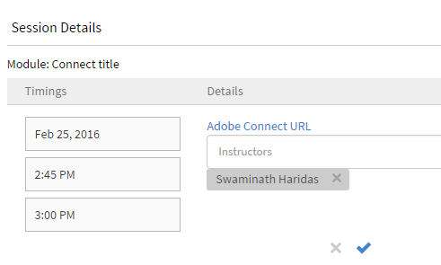

# Adobe Connect integration {#adobe-connect-integration}

Administrators of an organization can configure the settings of Learning Manager account to enable Adobe Connect integration.

# Configure Adobe Connect {#configureadobeconnect}

1. In Administrator login, click **Settings** at the left pane to view the basic information about your company. Click **Adobe Connect **on the left pane.   
   

1. Click&nbsp;**configure Now&nbsp;**link in&nbsp;**Adobe Connect Configuration**&nbsp;section.

   

1. Provide your company's Adobe Connect domain name and log in credentials.

   

   A sample Adobe Connect URL: mycompany.adobeconnect.com  
   You need to provide email id of the Adobe connect account's Administrator.&nbsp;

   Only Adobe hosted connect accounts are supported in Learning Manager. Example; '.adobeconnect.com'.

1. Click **Integrate.**

   After authenticating the email id, Learning Manager displays the message as&nbsp;Connect is successfully integrated. You can start viewing your virtual classroom courses using Adobe Connect automatically.

   Adobe Connect account administrator should accept the Terms and Conditions of using Adobe Connect. If this is not accepted, your login authentication may fail. After creating the Adobe Connect account, log in to the account once. During first time login, a terms and conditions page appears.

   

# Add virtual classroom session information {#addvirtualclassroomsessioninformation}

If the author of a virtual classroom course has not provided the session information, then Administrator can include the session details.

In Administrator login, click the VC course name. Click&nbsp;**Instances**&nbsp;on the left pane and&nbsp;**Session Details**. &nbsp;Click the Edit icon at the right corner of the Session Details page to add the session information.

With the integration of Adobe Learning Manager and Adobe Connect for creating virtual classroom modules or sessions, your Connect account should support Meeting rooms with adequate number of rooms and concurrent users for your use case. These meeting rooms are used to host Learning Manager virtual classroom modules. A new Connect meeting room is dynamically created by Prime for each virtual classroom module or session within Prime.

You must purchase Adobe Connect separately, apart from Adobe Learning Manager.

# Learners attendance {#learnersattendance}

If the host of Virtual classroom course do not attend the session, then attendance does not register automatically for learners who attended the session. In such scenarios, Administrator can record&nbsp;the attendance manually.

Click the virtual classroom course, click&nbsp;Attendance&nbsp;on the left pane of the following page and record the attendance.
