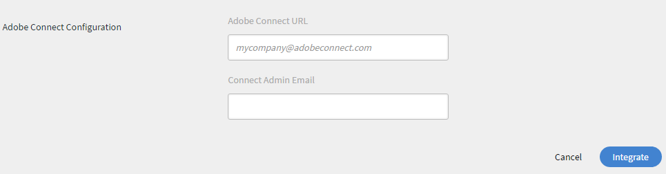

# Adobe Connect integration

Administrators of an organization can configure the settings of Learning Manager account to enable Adobe Connect integration.

## Configure Adobe Connect {#configureadobeconnect}

1. In Administrator login, click **[!UICONTROL Settings]** at the left pane to view the basic information about your company. Click **[!UICONTROL Adobe Connect]** on the left pane.

   

   *Select Adobe Connect in the left pane*

1. Click **[!UICONTROL Configure Now]** link in **[!UICONTROL Adobe Connect Configuration]** section.

   <!---->

1. Provide your company's Adobe Connect domain name and log in credentials.

   

   *Add domain name and credentials*

   A sample Adobe Connect URL: mycompany.adobeconnect.com  
   You need to provide email id of the Adobe connect account's Administrator. 

   Only Adobe hosted connect accounts are supported in Learning Manager. Example; '.adobeconnect.com'.

1. Click **[!UICONTROL Integrate].**

   After authenticating the email id, Learning Manager displays the message as Connect is successfully integrated. You can start viewing your virtual classroom courses using Adobe Connect automatically.

   Adobe Connect account administrator should accept the Terms and Conditions of using Adobe Connect. If this is not accepted, your login authentication may fail. After creating the Adobe Connect account, log in to the account once. During first time login, a terms and conditions page appears.

   <!---->

## Add virtual classroom session information {#addvirtualclassroomsessioninformation}

If the author of a virtual classroom course has not provided the session information, then Administrator can include the session details.

In Administrator login, click the VC course name. Click **[!UICONTROL Instances]** on the left pane and click **[!UICONTROL Session Details]**.  Click the Edit icon at the right corner of the Session Details page to add the session information.

*Add virtual classroom session information*

With the integration of Adobe Learning Manager and Adobe Connect for creating virtual classroom modules or sessions, your Connect account should support Meeting rooms with adequate number of rooms and concurrent users for your use case. These meeting rooms are used to host Learning Manager virtual classroom modules. A new Connect meeting room is dynamically created by Learning Manager for each virtual classroom module or session within Learning Manager.

You must purchase Adobe Connect separately, apart from Adobe Learning Manager.

## Learners attendance {#learnersattendance}

If the host of Virtual classroom course do not attend the session, then attendance does not register automatically for learners who attended the session. In such scenarios, Administrator can record the attendance manually.

Click the virtual classroom course, click Attendance on the left pane of the following page and record the attendance.

## Support for Adobe Connect seminars with large audiences

Adobe Learning Manager supports selecting Seminar rooms from Adobe Connect while setting up a virtual classroom session in Connect. Previously, administrator could only select the Meeting room type. This feature enables administrator with a valid seminar license to schedule and manage one-time or large-scale events (up to 1,500 attendees) within ALM.

Refer to this [article](https://helpx.adobe.com/adobe-connect/using/creating-seminars.html) for more information about the Seminar room.

### Support for access to session analytics

Instructors can access Session Analytics for their completed Adobe Connect sessions via a new link provided in their session dashboard.

_Select session URL_

This link opens the session analytics dashboard in Connect, which provides detailed insights into session engagement.
This feature is available only for sessions conducted through Adobe Connect. The session analytics include: 

* **[!UICONTROL Engagement]**: Overview of the live session's overall performance
* **[!UICONTROL Interactions]**: Detailed breakdown of participant activity across different pods 
* **[!UICONTROL Attendee Activity]**: Summary of participant engagement 
* **[!UICONTROL Download Reports]**: Option to download reports for pod-specific engagement data

_Session dashboard_

Refer this [article](https://helpx.adobe.com/in/adobe-connect/using/session-dashboard.html) for more information about Session Analytics.
