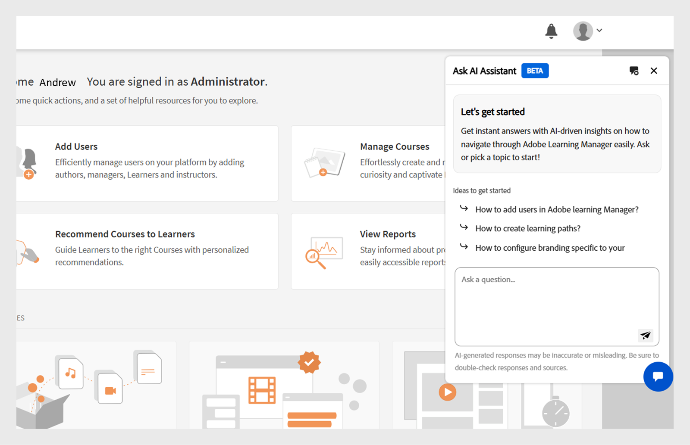

# ALM AI assistant (beta)

The AI Assistant in Adobe Learning Manager (ALM) is a powerful tool designed to help administrators manage their learning environment efficiently. Using natural language conversation, administrator can ask questions, get in-app information, receive suggestions, and execute administrative workflows without leaving the platform.

## Key benefits

* Perform common administrator tasks faster with conversational guidance.
* Get instant answers without browsing through extensive menus.
* Gain real-time insights and step-by-step guidance for administrative workflows.

>[!IMPORTANT]
>
>The ALM AI Assistant (Beta) is designed solely for requests related to Adobe Learning Manager and it's available only for administrator.

## Privacy, security, and governance

The ALM AI Assistant (Beta) is designed with a strong focus on privacy, security, and governance. Here's what you can expect:

* The ALM AI Assistant does not use any personal data, including for training purposes.
* It does not have access to consumer data.
* The ALM AI Assistant does not access or share any Personally Identifiable Information (PII) and does not share data across different customers.
* Any prompts provided by users (such as questions or queries) are not shared with other customers.

## Enable AI assistant 

The AI Assistant will be enabled by default on all new accounts. For existing accounts, please contact your CSM for assistance.
Access the ALM AI Assistant

To access the AI Assistant in ALM, follow these steps:

1. Log in to your Adobe Learning Manager administrator account.
2. Select the Chat icon in the lower-right corner.
 
   
   _Select the chat icon_
3. Select Get started.
 
   
   _Get started_
4. You're now ready to use the AI Assistant.
 
  
   _ALM AI Assistant_

## Using the AI assistant

The AI Assistant can help you with various administrator tasks such as:

* Managing user enrollments
* Generating course completion reports
* Creating custom learning plans

## Example prompts

1. How do I assign a course to a user?
2. Show me the latest enrollment report.
3. How can I customize the catalog view?

## Best Practices

* Use clear and specific language for better results.
* Ask one question at a time for more precise responses.
* Start your prompt with "How do I..." or "Show me..." for optimal guidance.

The ALM AI Assistant is trained only on publicly available, Adobe-owned documentation such as **[!UICONTROL Experience League]** resources. It does not learn from or access customer content, internal training material, or user-generated data.

