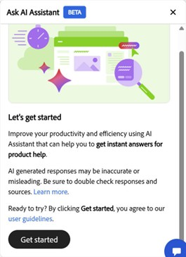
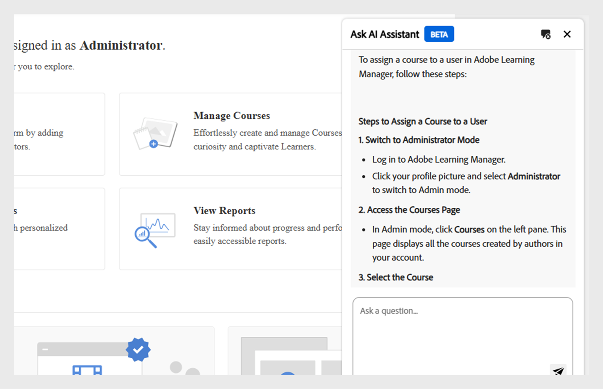

# AI Assistant (Beta) in Adobe Learning Manager: Helping administrators work smarter

In complex learning environments, administrators often face challenges locating relevant content or performing routine tasks because of deeply nested menus and fragmented workflows. Tasks like running reports or accessing specific information can require navigating multiple screens. The AI Assistant simplifies this experience by providing an intelligent conversational interface that streamlines content discovery and reporting in Adobe Learning Manager, improving speed, accuracy, and ease of use.

The AI Assistant (Beta) in Adobe Learning Manager offers a smart, conversational way to help administrators get answers faster, receive suggestions, and execute key tasks without leaving the platform. 

It uses Adobe's AI capabilities to enable natural language queries across learning content and system workflows.  Administrators can ask questions like **How to add users to Adobe Learning Manager** or **How to add Learning Paths**. The ALM AI Assistant is trained only on publicly available, Adobe-owned documentation such as **[!UICONTROL Experience League]** resources. It does not learn from or access customer content, internal training material, or user-generated data.

This assistant reduces reliance on manual navigation, shortens discovery time, and helps surface actionable insights quickly.

<!--## Key benefits

* Perform common administrator tasks faster with conversational guidance.
* Get instant answers without browsing through extensive menus.
* Gain real-time insights and step-by-step guidance for administrative workflows.-->

>[!IMPORTANT]
>
>The ALM AI Assistant (Beta) is designed solely for requests related to Adobe Learning Manager and it's available only for administrator.

## Privacy, security, and governance

The ALM AI Assistant (Beta) is designed with a strong focus on privacy, security, and governance. Here's what you can expect:

* The ALM AI Assistant does not use any personal data, including for training purposes.
* It does not have access to consumer data.
* The ALM AI Assistant does not access or share any Personally Identifiable Information (PII) and does not share data across different customers.
* Any prompts provided by users (such as questions or queries) are not shared with other customers.

## Enable AI Assistant 

The AI Assistant will be enabled by default on all new accounts. For existing accounts, please contact your CSM for assistance.

Follow these steps to enable the AI Assistant:

1. Log in to your Adobe Learning Manager administrator account.
2. Select the chat icon to launch the AI Assistant
 
   
   _Select the chat icon_

   >[!NOTE]
   >
   >When launching the AI Assistant (Beta) for the first time, you must provide your consent before using it. The consent dialog will only appear during this initial launch. For all subsequent launches, you will be taken directly to the AI Assistant to enter your prompts.
   
3. Select **[!UICONTROL Get started]**. You're now ready to use the AI Assistant (Beta).
 
   
   _Get started_
4. Type your prompt and hit **[!UICONTROL Enter]**. The response appears in the AI Assistant (Beta).

   
  _Response in AI Assistant (Beta)_
 
## Using the AI Assistant

The AI Assistant can help you with various administrator tasks such as:

* Managing user enrollments
* Generating course completion reports
* Creating custom learning plans

## Example prompts

The following are some example prompts that hosts can use to use the AI Assistant (Beta) effectively:

* **Assign a course to a user**
   * **Prompt**: "How do I assign a course to a user?"
   * **Response**: The AI Assistant (Beta) will guide you through the steps to assign a course to a user, including navigating to the course section, selecting the desired users, and completing the assignment process.

* **Latest enrollment report**
   * **Prompt**: Show me the latest enrollment report.
   * **Response**: The Adobe Learning Manager AI Assistant will guide you through the steps to access the latest enrollment report, including navigating to the Reports section, selecting the enrollment report option, and applying the latest filters to view the most recent data.

* **Customize catalog view**
   * **Prompt**: "How can I delete a user?"
   * **Response**: The Adobe Learning Manager AI Assistant will guide you through the steps to delete a user, including navigating to the Users section, selecting the specific user profile, and using the delete option while ensuring all dependencies and assignments are appropriately managed.

## Provide feedback on AI Assistant responses

Your feedback on the responses generated by the AI Assistant helps improve its accuracy, relevance, and overall performance.

### Like or dislike a response

* Select **[!UICONTROL Thumbs Up]** if the response was helpful and accurate.
* Select **[!UICONTROL Thumbs Down]** if the response was incorrect or unhelpful.

### Report inaccurate responses

Follow these steps to report a response:

1. Click **[!UICONTROL Report]** at the end of the response.
   
   
   _Select Report in AI Assistant screen_

2. Select one or more reasons, add comments if needed, and them select **[!UICONTROL Submit]**.

   
   _Select Submit to add your response_

This feedback will be reviewed to help enhance the Assistant's capabilities.

## Tips for using the AI Assistant (Beta) effectively

* **Be specific with your prompts**: When asking a question, include clear context and details. For example, instead of asking "How do I add a user in Learning Manager?", ask "How do I assign a course to a user in Learning Manager?"
* **Use clear and concise language**: Keep your questions straightforward and focused. This helps the AI Assistant (Beta) understand your intent and provide a more accurate response.
* **Explore different capabilities**: Ask about a variety of features such as enrollment reports, learner progress, content assignment, or certification tracking to discover the full range of support available.
* **Provide feedback**: After receiving a response, let us know if it was helpful. Use the thumbs up, thumbs down, report, or comment features to share your input. Your feedback plays a key role in improving the Assistant.
