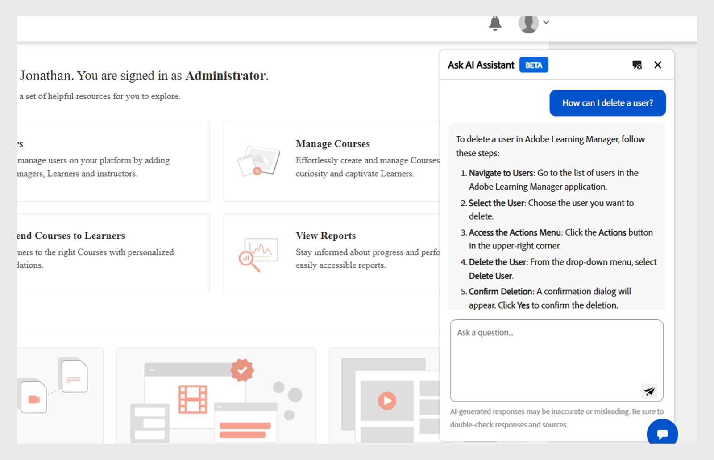

# Admin AI Assistant (Beta) in Adobe Learning Manager

In complex learning setups, Administrators may struggle to find content or complete tasks because of complicated menus and disconnected workflows. For instance, tasks like running reports or accessing specific information may require navigating multiple screens. The Admin AI Assistant (Beta) helps you find the right information to understand and complete tasks efficiently.

The Admin AI Assistant (Beta) in Adobe Learning Manager helps administrators quickly find answers to common questions, explore system features, and understand how to complete key task, just by asking in plain language. Whether you're new to Adobe Learning Manager or looking for faster ways to troubleshoot, the Admin AI Assistant (Beta) simplifies your workflow by providing context-aware help directly in the platform.

It uses Adobe's AI capabilities to enable natural language queries across learning content and system workflows.  Administrators can ask questions like **How to add users to Adobe Learning Manager** or **How to add Learning Paths**. The Adobe Learning Manager Admin AI Assistant (Beta) is trained exclusively on publicly available, Adobe-owned documentation such as, resources hosted on **[!UICONTROL Experience League]**. It does not learn from or access customer content, internal training material, or user-generated data.

This assistant reduces reliance on manual navigation, shortens discovery time, and helps surface actionable insights quickly.

<!--## Key benefits

* Perform common administrator tasks faster with conversational guidance.
* Get instant answers without browsing through extensive menus.
* Gain real-time insights and step-by-step guidance for administrative workflows.-->

>[!IMPORTANT]
>
>It is available only for administrators and currently supports English only.

## Privacy, security, and governance

The Admin AI Assistant (Beta) is designed keeping in focus security and data privacy. Here's what you can expect:

* The Admin AI Assistant (Beta) does not use any personal data, including training purposes.
* It does not have access to learning data or content stored in Adobe Learning Manager.
* The Admin AI Assistant (Beta) does not access or share any Personally Identifiable Information (PII) and does not share private or sensitive information.
* Any prompts provided by users (such as questions or queries) are not shared with other customers.

>[!IMPORTANT]
>
>The Admin AI Assistant (Beta) will be rolled out in phases, with customers receiving a two-week advance notice. For any assistance, contact your Customer Success Manager (CSM).

## How to access the Admin AI Assistant (Beta)

Follow these steps to launch the Admin AI Assistant (Beta):

1. Log in as an Administrator.
2. Select the chat icon to launch the Admin AI Assistant (Beta).
 
   
   _Select the chat bubble to launch the Admin AI Assistant (Beta)_

   >[!NOTE]
   >
   >When launching the Admin AI Assistant (Beta) for the first time, you must provide your consent before using it. The consent dialog will only appear during this initial launch. For all subsequent launches, you will be taken directly to the Admin AI Assistant (Beta) to enter your prompts.
   
3. Select **[!UICONTROL Get started]**. You're now ready to use the Admin AI Assistant (Beta).
 
   
   _Prompt to accept the usage policy before first use_

## How to use the Admin AI Assistant (Beta)

To use the Admin AI Assistant (Beta):

1. Type your prompt and hit **[!UICONTROL Enter]**. The response appears in the Admin AI Assistant (Beta).

   
  _A sample query and response from the Admin AI Assistant (Beta)_

### Example prompts

The following are some example prompts that administrators can use to effectively utilize the Admin AI Assistant (Beta):

* **Assign a course to a user**
   * **Prompt**: "How do I assign a course to a user?"

   
   _Response for the prompt How do I assign a course to a user_

* **Latest enrollment report**
   * **Prompt**: Show me the latest enrollment report.

   
   _Response for the prompt Show me the latest enrollment report_

* **Delete a user**
   * **Prompt**: "How can I delete a user?"
   
   
   _Response for the prompt How can I delete a user_

### Tips for using the Admin AI Assistant (Beta) effectively

* **Be specific with your prompts**: When asking a question, include clear context and details. For example, instead of asking "How do I add a user in Adobe Learning Manager?", ask "How do I assign a course to a user in Adobe Learning Manager?"
* **Use clear and concise language**: Keep your questions straightforward and focused. This helps the Admin AI Assistant (Beta) understand your intent and provide a more accurate response.
* **Explore different capabilities**: Ask about a variety of features such as enrollment reports, learner progress, content assignment, or certification tracking to discover the full range of support available.
* **Provide feedback**: After receiving a response, let us know if it was helpful. Use the thumbs up, thumbs down, report, or comment features to share your feedback. Your feedback plays a key role in improving the Assistant.

## Provide feedback on Admin AI Assistant (Beta) responses

Your feedback on the responses generated by the Admin AI Assistant (Beta) helps improve its accuracy, relevance, and overall performance.

### Like or dislike a response

* Select **[!UICONTROL Thumbs Up]** if the response was helpful and accurate.
* Select **[!UICONTROL Thumbs Down]** if the response was incorrect or unhelpful.

### Flag a responses

Follow these steps to flag a response:

1. Select **[!UICONTROL Flag]** at the end of the response.
   
   
   _Select Report in Admin AI Assistant screen_

2. Select one or more reasons, add comments if needed, and then select **[!UICONTROL Submit]**.

   
   _Administrators rate the response using thumbs up or down with optional comments_

Adobe uses this feedback to improve the Admin AI Assistant (Beta) over time.

## Frequently Asked Questions

+++Can I use the Admin AI Assistant (Beta) as a learner?

No. This assistant is only available for administrators.

+++

+++Is it available in the mobile app?   

Not at this time.

+++

+++Can it perform admin actions?    

No. The Admin AI Assistant (Beta) only provides guidance.

+++

+++Will it support more languages?

The Adobe Learning Manager team is evaluating multi-language support for future updates.

+++
