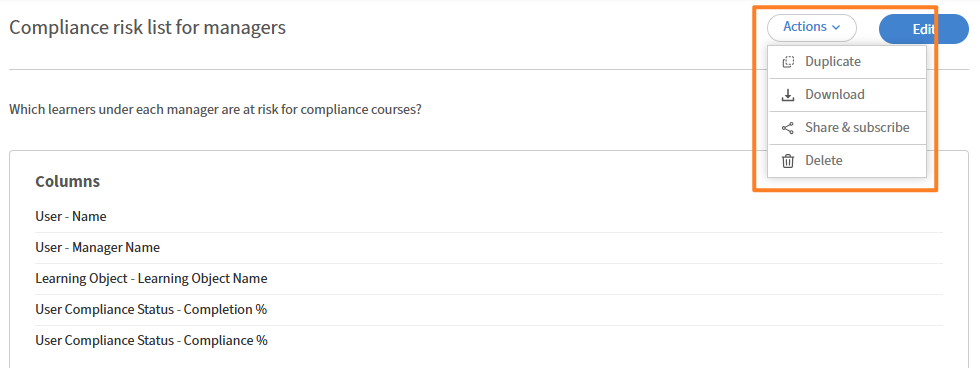
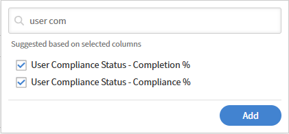

# Add and combine filters in a report

Filters let you scope your report to exactly the records you need. You can apply a single filter, combine multiple filters with AND or OR logic, and create nested groups for complex conditions.

## Add a filter

Use filters to limit your report to a specific subset of data instead of viewing everything.

For example, you may want to understand how many learners enrolled in courses in the last 365 days. In this case, you apply a date filter on enrollment date to include only recent activity.

1. Launch Report Builder and select **Create Report**.
2. Type the name and description of the report\.
3. Select the following columns: <`dataset>:<column name>`
    a. Enrollment-Enrolled Date
    b. User-Name
    
4. In the Reports section, select **Add filter**.
5. Search for or browse to the field you want to filter on. In this example, select **Enrollment-Enrolled Date**.
    
6. Select **Add**.
7. Select an operator. Available operators depend on the field's data type:
    a. String fields — contains, equals, starts with
    b. Numeric fields — greater than, less than, equals, between
    c. Date fields — equals, before, after, between, last N days
    d. List (enum) fields — is in, is not in
8. In this case, select **is within last year**.
    
9. Select **Save Report** and select **Actions** > **Download** to download the report.

The downloaded report lists all users who've enrolled in a Learning Object in the past 365 days.

### Add multiple filters with AND / OR logic

When you add a second filter, the default relationship between filters is AND; both conditions must be true for a row to appear. 

For example, you may want to identify learners who enrolled in courses in the last 365 days AND report to a specific manager. In this case, both conditions must be true, so filters are combined using AND logic.

1. Launch Report Builder and select **Create Report**.
2. Type the name and description of the report.
3. Select the following columns: `<dataset>:<column name>`
    a. User-Name
    b. User-Manager Name
    c. Enrollment-Enrolled Date
        

4. Group by the column **User-Manager Name**.
5. In the **Filter** section, select the following filters:
    a. Enrollment-Enrolled Date **is within last year**
    b. User-Manager Name **starts with N**
    c. User-Manager Name **is not empty**
        
6. Select **Save Report** and select **Actions** > **Download** to download the report.

The downloaded report lists all users who've enrolled in a Learning Object in the past 365 days and report to a manager whose name starts with N.

### Create nested filter groups

Nested groups let you build conditions with multiple logical levels, equivalent to brackets in a formula\. For example: (Catalog = Safety OR Catalog = Hygiene) AND Completion Date is in the last 90 days.

Use nested filter groups when your logic includes a mix of AND and OR conditions that must be evaluated together.

For example, use nested filter logic to identify incomplete enrollments where learners have progress below 50% or overdue training, demonstrating how AND and OR conditions work together. 

1. Launch **Report Builder** and select **Create Report**.
2. Type the name and description of the report.
3. Select the following columns: `<dataset>:<column name>`
    a. Enrollment - Status
    b. Enrollment - Progress Percent
    c. Enrollment - Overdue
        
4. In the **Filter** section, select the following filters:
    a. Enrollment-Status **does not equal any of** Completed.
    b. Select **+**.
    c. Search for Enrollment-Progress Percent.
    d. Select the filter.
    e. Select **Add as group**.
        
    f. Add Enrollment-Progress Percent **less than** 50
        
    g. Select **+**.
    h. Search for Enrollment-Overdue.
    i. Select the filter.
    j. Select **Add as group**.
        
    k. Add Enrollment-Overdue equals TRUE.
    l. Change the nested AND to OR.
        
5. Select **Save Report** and select **Actions** > **Download** to download the report.

The downloaded report lists all enrollments that are in progress or not started, whose progress percent is less than 50%, or are overdue.
