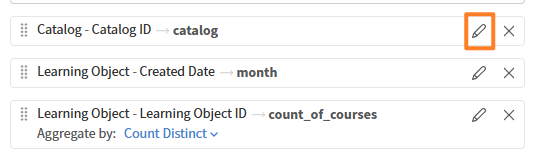

# Build a custom report in Report Builder

Creating from scratch works best when you have a clear picture of the columns and output you need, and no existing template matches your use case\. If you're new to Report Builder, consider starting with a template\.

In this example, you'll identify the learners under each manager who are at risk for compliance courses\.

1. Log in to Adobe Learning Manager as an administrator.
2. Select **Reports**, then select **Report Builder**.
3. Select the **Reports** tab, then select **Create report**. 
4. Enter a report name. A name is required. Optionally, enter a description.
    
5. In the column panel, select the following datasets and expand them:
    a. User
    b. Learning Object
    c. User Compliance Status
6. Select **+** next to the following columns you want to include. Selected columns appear in the report canvas.
    a. User\Name
    b. User\Manager Name
    c. Learning Object\Learning Object Name
    d. User Compliance Status\Completion %
    e. User Compliance Status\Compliance %
    
7. Reorder columns by dragging them in the canvas.
8. To rename a column, enter a name in the column's alias field. The alias appears as the column header in the downloaded file.
9. Select **Save Report**.

## Download the report

1. Select **Actions** in the upper-right corner.
    
2. Select Download. You can download the report from the notifications icon when it's ready.

The downloaded report in .csv file extension contains the following columns:

1. name    
2. managerName    
3. name    
4. completionPct    
5. compliancePct

## Apply group by, filters, and sorting

### Filter

Now that you've downloaded the report, apply a filter where completionPct OR compliancePct is equal to 100.

1. Open the report and select **Edit** in the upper-right corner.
2. Select **Add filter** and search the columns where you want to apply the filters.
    
3. Select **Add**.
4. Combine the filters with AND/OR logic; select the operator toggle between filter rows.
    
5. Select **Save report** and download the report.

The downloaded report contains records where completionPct OR compliancePct equals 100.

### Group by

Group the records by manager to:

* Aggregate learner data by manager
* Compute manager-level averages
* Count learners under each manager

1. Open the report and select **Edit** in the upper-right corner.
2. Select **Group by:Select** and select **User-Manager Name** column.
    
3. Aggregate the following columns:
    a. User\Name
    b. Learning Object\Learning Object Name
4. Select **Count** as an aggregate function for the columns.
    
5. Repeat for Learning Object\Learning Object Name.
    
6. Select **Save report** and download the report.

The downloaded report contains a manager-wise summary of learner training performance. It shows average completion rates, average compliance scores, and total learner counts for each manager. The data indicate universal training completion across all groups, while compliance performance varies significantly between managers.

### Sort

Sort the report in descending order by the number of learners for each manager.

1. Open the report and select **Edit** in the upper-right corner.
2. Select **Add sorting**.
3. Search for the user name and select **User\Name**.
4. Select **Descending**.
    
5. Select **Add**.
6. Select **Save report** and download the report.

The downloaded report contains the number of learners per manager in descending order.
