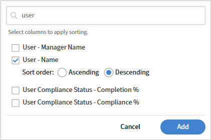

# Review instructor performance with Report Builder

This report helps training managers identify which instructors are most active, how many learners they reach, and how many learners complete the courses they deliver.

## Build an instructor efficiency report

1. Launch Report Builder and select **Create Report**.
2. Type a name such as _Instructor efficiency_. 
3. Add **Instructor Names** from the **Module Session** dataset.
4. Add **Module Session ID** from the **Module Session** dataset. You'll aggregate this to count sessions.
5. Add **Status** from the **Module Transcript** dataset. You'll use count if to count completions.
6. Select **Group by** on **Instructor Names**.
7. Apply **Count** to **Module Session ID**. Type the alias _Total sessions_.
8. Apply **Count if** to **Status** and select **Completed**. Type the alias _Total completions_.
9. To also show total enrollments, add **Status** a second time. Apply **Count if** to **Not Started**. Type the alias _Total enrollments_. 
    
10. Filter **Instructor Names** to not empty.
    
11. Sort by **Total completions** descending to surface the highest-performing instructors first.
    
12. Select Save Report and select **Actions** > **Download** to download the report.

The downloaded report summarizes instructor efficiency by comparing total training sessions, learner completions, and unstarted enrollments for each instructor, helping evaluate engagement, completion performance, and potential training follow-up needs.

## Best practices

* Use catalog labels to scope instructor reports to a specific business unit, location, or program\. This is more precise than filtering by catalog name alone.
* Add a date filter, such as **Enrollment Date** in the last 90 days, to scope the report to a recent period rather than all-time data.
* Sort by a meaningful metric, such as **Total completions**, rather than by instructor name, so performance differences are immediately visible.
