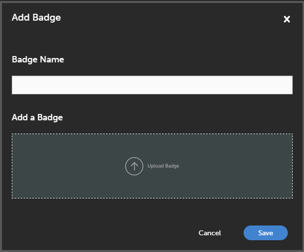

# Badges

Badges are a measure of achievement that your employee can earn upon completing a course. Adobe Learning Manager introduces one of the latest e-learning concepts called Badges. Professionals across the globe use these badges as a representation of particular skill or a learning achievement.

You can define Badges that could serve as a motivation to users.

Administrators can create the badges for learners as follows:

1. Log in as Administrator and click **Badges** on the left pane. A list of badges for the learner appears.

   >[!NOTE]
   >
   >By default, a list of few sample badges are available.

1. Click **Add Badge** at the upper-right corner of the page. Add Badge dialog appears.

   

1. Enter Badge Name. Upload the badge by clicking **Upload Badge** and click **Save**.
