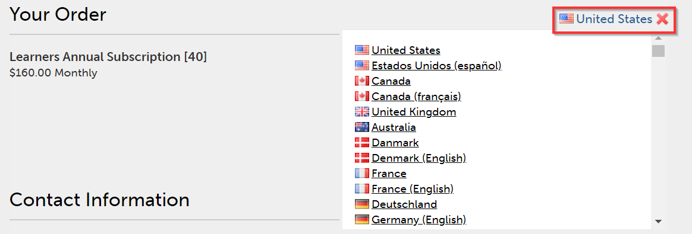

# Manage Captivate Prime orders and billing

Captivate Prime Learning Programs are renamed to Learning Paths. This change happens immediately after the October 2021 release and the terminology of Learning Path is reflected for all roles.

Credit card-based purchase is only available in the [US region](http://captivateprime.adobe.com/).

Manage Captivate Prime billing, place orders by using a credit card, subscribe using a Purchase Order, or via a Monthly Active Users plan.

Adobe Learning Manager has a flexible, customer-friendly, and one of the best pricing models to cater to your organization needs. For more information, see the [Captivate Prime](https://www.adobe.com/products/captivateprime.html) page.

Only the Administrators of your organization can manage billing.

If you want to contact Adobe for more information about Captivate Prime subscription and billing, write to us at [captivateprimesales@adobe.com](mailto:captivateprimesales@adobe.com).

## Place orders using credit cards {#placeordersusingcreditcards}

You can buy a subscription for a maximum of 3500 learners through any single credit card payment order. The first order in the account must be for a minimum of 10 learners.

1. On the Administrator app, click **Billing** on the left navigation pane.

   

1. On the Billing Information page, add the number of users in the **Add Users** field. When using a credit card for pre-paid subscriptions, you can see the number of users that you can add for the subscription. The number of users you can add must not exceed the number mentioned in the section Remaining.1. 

   

1. After specifying the number of users to add, click Place Order in the upper-right corner of the page.

   

1. Review the estimate that appears on the screen.

   

   The annual subscription fee is calculated based on the number of users who are added for the subscription. For example, if four users are being added, the annual fee is calculated using the expression 4 usersX$4X$12, which returns $192.

   Click **Proceed**.

1. On the Payment Details page, you can view the estimated price of the order. The

   currency appears based on the current locale.

   

   You can also change the locale by choosing the country from the drop-down list.

   

1. Enter your contact information, choose the credit card type, and provide the details of the credit card. After you've entered the required details, click **Complete Order**.
1. After you've placed the order, to see the recently ordered packages, click the **Order History** tab on the **Billing** page.

   

## Check order status {#checkorderstatus}

All orders can have one of the four statuses:

**Active:** An order is active, and users are registered successfully.

**Suspended:** An order moves into suspended state in the following scenarios:

* Delay in receipt of payment from the credit card
* Expiry of the credit card.
* Payment is declined for any recurring payment cycle.

**Canceled initiated:** An order moves into this state when the Captivate Prime Administrator deactivates the account. The order then moves into a canceled state after receiving the cancellation confirmation of the order.

## Update subscription details {#updatesubscriptiondetails}

1. In the list of orders, click **Edit**.

   

1. In the Subscription details page, click **Edit Subscription**.
1. Choose the item that you want to edit:

   * Payment method: Use this option to update payment details, such as, credit card.
   * Address: Use this option to update address details.

## Cancel a subscription {#cancelasubscription}

To cancel an order:

1. In the left pane of the Administrator page, click Billing.
1. In the Billing page, on the upper-right corner, choose **Actions** > **Deactivate Account**.
1. Once the Administrator deactivates the account, all existing orders in the account are canceled from the next billing cycle.

When an account is deactivated by the customer, it enters a trial state for the next 30 days. The account owner receives three reminder emails to revive the account. If the owner does not reactivate the account, none of the users are able to access Captivate Prime apart from the owner.

## Place orders using Purchase Order {#placeordersusingpurchaseorder}

You can choose purchase order process as an alternative mode of payment. As a pre-requisite, your organization's account must be registered with Adobe. Your organization account is charged for this process. The account is charged based on a learner's activities. Only Learning Object-level activities are charged. To place an order using PO:

1. Send an email to [captivateprimesales@adobe.com](mailto:captivateprimesales@adobe.com) and mention the number of required learners.
1. The Captivate Prime team sends you an activation key.
1. In the Billing page of the Administrator app, enter the activation key.
1. Click Activate in the upper-right corner of the page.

## Check account status {#checkaccountstatus}

After an account gets activated, the account can be in any of the following states:

* **Trial** - You can create an Adobe Learning Manager account and use it without any payment for a period of 30 days. There is no limit on the number of learners registered during the trial period.
* **Active** - In this state, the account has active learner subscriptions with recurring monthly payment as per the subscription order.
* **Inactive** - An account moves into inactive state in the following scenarios:

  * After the trial period if there are no active subscription orders in the account.
  * Administrator deactivates the account, which results in canceling all the existing orders in an account from the next billing cycle of subscription.
  * Payment is declined for active orders in an account even after reminders.

An inactive state does not cancel your account with immediate effect. You receive at least a couple of reminders from the Captivate Prime team asking you to provide the latest information about

your credit card if it has expired. In an inactive state, only an administrator can log in to the Captivate

Prime account. All other users cannot access the account.

* **Activation required** - Your account moves into this state when the Captivate Prime administrator chooses to deactivate the account. All the orders of this account get canceled. The collection of payment for these orders does not happen from the next billing cycle. The status of the account remains in this state until the day of the last billing cycle. In this state, all users can continue to use the application without any impact until the end of the last recurring payment date.

## Cancel a subscription {#Cancelasubscription-1}

To cancel an active subscription, contact the Captivate Prime support team.

## Account termination fee {#accountterminationfee}

If you want to cancel the subscription before the completion of the annual term, an early termination fee is charged. The termination fee is equivalent to 50% of the subscription price of the remaining commitment period.

## Monthly Active Users (MAU) plan {#monthlyactiveusersmauplan}

You can choose a MAU plan as your preferred way of billing. This option generates billing based on the number of monthly unique active users. The monthly unique active users are added cumulatively for a period of 12 months starting from the month of plan activation. This number is used for billing for the period.

Use the following example to understand how MAU is calculated.

Let there be a case where the number of users per month are as follows:

* Month 1 = 50
* Month 2 = 500
* Month 3 = 5000
* Month 4 to 12 = 10

Total Monthly Active Users that are billed = Month 1 + Month 2 + Month 3 + Month 4 to 12 = 50 + 500 + 5000 + 90 = 5640.

The billing for the period would be for 5640 users.

At the end of the 12-month period, the usage count is reset back to zero and a new period for MAU plan starts. You can add multiple activation keys to increase the purchased number of seats.

Any user who performs the following actions or achieves completions due to actions taken by others is considered as a monthly unique active user for that calendar month.

* Consuming a course, learning program or certification.
* Consuming, downloading a Job Aid or course attachments.
* Consuming, downloading or creating personal notes.
* Participating in Social Learning by creating Boards, posts or comments.
* Achieving completions due to External Certificate submission approvals or attendance for a classroom/virtual classroom sessions.

## View usage details {#viewusagedetails}

1. To view the number of active users by month, click **View Usage Details**.

   

1. On the page that displays, you can view the following:

   * **Overall usage:** You can check the total number of active users, users who are consuming Captivate Prime in a month, and the number of users who have not yet signed up for any course.

   * **Monthly usage:** You can see a table of unique active users per month.

## Download usage report {#downloadusagereport}

You can also download the data of the number of active users by month and year. To download, click **Download Detailed Report**.

On the **Generate Report Request** dialog, enter the required months and year, and click **Generate**.

If you close the browser window, the download starts the next time you visit Prime.

The reports are saved in the Downloads folder of your browser.

## Cancel a subscription

To cancel an active subscription, contact the Captivate Prime support team.

## Frequently Asked Questions {#frequentlyaskedquestions}

**1. How to add/remove subscriptions from an account?**

To add subscriptions in an account, add the number of users for who you'd like to purchase subscriptions. Then on the upper-right corner, click **Place Order**. Review the estimate and click **Proceed**. Enter your account details and also your credit card details. Then to purchase the subscriptions, click **Complete Order**.

To remove an active subscription, contact the Captivate Prime support team.

**2. How to change a credit card for subscriptions?**

In the **Order History** tab, for an active account, click **Edit**. Then on the Subscription Details page, click **Edit Subscription**. Enter your new credit card details and click **Update Payment Method**.

**3. How to update the Billing information on Captivate Prime?**

To update the billing information, follow the steps below:

1. Log in as **Admin** and click **Billing**.

1. In the list of orders, click **Edit**.
1. In the Subscription details page, click **Edit Subscription**.

Choose the item that you want to edit:

1. **Payment method:** Use this option to update payment details, such as, credit card.
1. **Address:** Use this option to update address details.

**4. Can I partially cancel a subscription?**

No, you cannot cancel a subscription partially. If you need to reduce the number of seats that you have purchased, you can cancel the subscription at the end of the billing cycle and then purchase the number of seats required.

**5. How do I get an Invoice for my Credit card payments?**

Contact [FastSpring](https://fastspring.com/) to get an invoice for your payments, using one of the following ways:

* Create a service request with FastSpring using the link `https://questionacharge.com`.
* Send an email to FastSpring on `orders@fastspring.com` requesting for the invoice.
