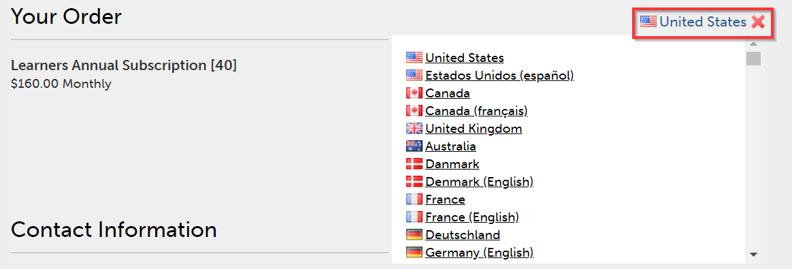
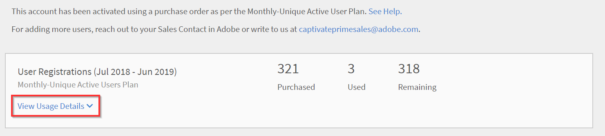
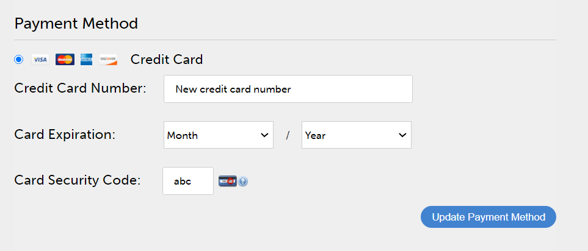

# Manage Learning Manager orders and billing

Credit card-based purchase is only available in the [US region](http://learningmanager.adobe.com/).

Manage Learning Manager billing, place orders by using a credit card, subscribe using a Purchase Order, or via a Monthly Active Users plan.

Adobe Learning Manager has a flexible, customer-friendly, and one of the best pricing models to cater to your organization needs. For more information, see the [Learning Manager](https://www.adobe.com/products/learningmanager.html) page.

Only the Administrators of your organization can manage billing.

If you want to contact Adobe for more information about Learning Manager subscription and billing, write to us at [learningmanagersales@adobe.com](mailto:learningmanagersales@adobe.com).

## The Billing page

To access the Billing page, sign in to Adobe Learning Manager as an administrator and select **[!UICONTROL Billing]** in the left navigation pane.

The Billing page contains the following tabs:

| Tab | Purpose |
|---|---|
| **Subscription** | View account details, license entitlements, and seat consumption. Manage plan activation. |
| **Order History** | Review past orders placed on the account. |

### Subscription tab

**Account details**

The **Account details** card at the top of the **Subscription** tab displays four read-only identifiers for your account.

| Field | Description |
|---|---|
| **ECCID** | Adobe's reference number for your account. Quote this when contacting Adobe support. |
| **Account ID** | Your unique Adobe Learning Manager account identifier. |
| **Account Name** | The display name of your Adobe Learning Manager account. |
| **IMS Org ID** | The Adobe Admin Console organization linked to this account. Blank if not yet linked. |

**Licenses**

The **Licenses** section lists every active license or entitlement on the account. Each block shows the license name, a plan description where applicable, and a stats row showing consumption figures for the current contract period.

Stats row columns vary by license type:

| License type | Columns shown |
|---|---|
| Paid license (for example, Adobe Learning Manager Ultimate) | Purchased / Used / Used by peer accounts / Remaining |
| Trial license (for example, Virtual Coach) | Available / Used / Remaining |

Select **[!UICONTROL View Usage Details]** below the stats row to expand an inline breakdown. The expanded section shows:

- A **Select period** dropdown to filter by contract period, including historical periods
- An **Overall Usage** table with columns: Purchased / Used by this Account / Used by Peer Accounts / Remaining
- A **View Account Breakup** link to see usage distributed across individual peer accounts
- A **Download Detailed Report** link to export usage data as a file

**Agent Orchestrator license block**

When an Agent Orchestrator license is linked, the stats row shows:

| Column | Description |
|---|---|
| **Purchased** | Total Gen AI credits purchased for the contract period. |
| **Used** | Credits consumed across all services using this license. |
| **Used by ALM** | Credits consumed specifically by Adobe Learning Manager. |
| **Remaining** | Credits still available. |

If your organization uses parent and child accounts, the parent account's **Licenses** section shows a **Used by Peer Accounts** column reflecting credit consumption across all linked child accounts. Child accounts display their allocation as **Seats Sanctioned** rather than Purchased.

## Link your Adobe Learning Manager account to Adobe Admin Console

Before Gen AI features can activate, your Adobe Learning Manager account must be connected to an Adobe Admin Console organization. Once linked, Adobe Learning Manager detects the Agent Orchestrator license and makes the **Credits** tab available.

Linking is established automatically when your account was purchased through Adobe's standard ordering process, or when you activated your account using an activation key. You can verify the link on the **Subscription** tab — if the **IMS Org ID** field in **Account details** is populated, the account is already linked.

### Link your account manually

If your account was set up independently and the **IMS Org ID** field is blank, link manually.

**Prerequisites:**
- You must be an administrator of the Adobe Learning Manager account.
- You must hold the System Administrator role in the Adobe Admin Console organization you want to link.
- The Adobe Admin Console organization must have an active Agent Orchestrator license.

1. Select **[!UICONTROL Billing]**, then select the **[!UICONTROL Subscription]** tab.
2. In the **Account details** card, select **[!UICONTROL Link IMS Org]**.
3. A sign-in window opens. Enter your Adobe account credentials and select your organization from the list. Adobe Learning Manager confirms that the account signing in holds the System Administrator role in the Adobe Admin Console organization, and that the same account holds the Administrator role in Adobe Learning Manager.
4. If both checks pass, the link is established. The **IMS Org ID** field updates with your organization's identifier, and the credit balance appears in the **Licenses** section.
5. If either check fails, an error message is displayed. Confirm the prerequisites above and try again.

### Unlink your account

After unlinking, Gen AI features are disabled for all learners and the **Credits** tab is unavailable until the account is linked again.

1. Select **[!UICONTROL Billing]**, then select the **[!UICONTROL Subscription]** tab.
2. In the **Account details** card, select **[!UICONTROL Unlink IMS Org]**.
3. Sign in again to confirm your administrator role in the organization.
4. The link is removed. The **IMS Org ID** field returns to blank and the **Credits** tab is hidden.

To restore access, repeat the manual linking steps above.

## Place orders using credit cards {#placeordersusingcreditcards}

You can buy a subscription for a maximum of 3500 learners through any single credit card payment order. The first order in the account must be for a minimum of 10 learners.

1. On the Administrator app, click **[!UICONTROL Billing]** on the left navigation pane.

   

   *Launch Adobe Learning Manager billing*

1. On the **[!UICONTROL Billing Information]** page, add the number of users in the **[!UICONTROL Add Users]** field. When using a credit card for pre-paid subscriptions, you can see the number of users that you can add for the subscription. The number of users you can add must not exceed the number mentioned in the section Remaining.1.

   

   *Add number of users*

1. After specifying the number of users to add, click Place Order in the upper-right corner of the page.

   

1. Review the estimate that appears on the screen.

   

   *Place an order*

   The annual subscription fee is calculated based on the number of users who are added for the subscription. For example, if four users are being added, the annual fee is calculated using the expression 4 usersX$4X$12, which returns $192.

   Click **[!UICONTROL Proceed]**.

   *Review the estimate*

1. On the Payment Details page, you can view the estimated price of the order. The currency appears based on the current locale.

   

   *View payment details*

   You can also change the locale by choosing the country from the drop-down list.

   

   *Select the country of billing*

1. Enter your contact information, choose the credit card type, and provide the details of the credit card. After you've entered the required details, click **[!UICONTROL Complete Order]**.
1. After you've placed the order, to see the recently ordered packages, click the **[!UICONTROL Order History]** tab on the **[!UICONTROL Billing]** page.

   

   *View order history*

## Check order status {#checkorderstatus}

All orders can have one of the four statuses:

**Active:** An order is active, and users are registered successfully.

**Suspended:** An order moves into suspended state in the following scenarios:

- Delay in receipt of payment from the credit card
- Expiry of the credit card.
- Payment is declined for any recurring payment cycle.

**Canceled initiated:** An order moves into this state when the Learning Manager Administrator deactivates the account. The order then moves into a canceled state after receiving the cancellation confirmation of the order.

## Update subscription details {#updatesubscriptiondetails}

1. In the list of orders, click **[!UICONTROL Edit]**.

   

   *Update subscription details*

1. In the Subscription details page, click **[!UICONTROL Edit Subscription]**.
1. Choose the item that you want to edit:

   - Payment method: Use this option to update payment details, such as, credit card.
   - Address: Use this option to update address details.

## Cancel a subscription {#cancelasubscription}

To cancel an order:

1. In the left pane of the Administrator page, click Billing.
1. In the Billing page, on the upper-right corner, choose **[!UICONTROL Actions]** > **[!UICONTROL Deactivate Account]**.
1. Once the Administrator deactivates the account, all existing orders in the account are canceled from the next billing cycle.

When an account is deactivated by the customer, it enters a trial state for the next 30 days. The account owner receives three reminder emails to revive the account. If the owner does not reactivate the account, none of the users are able to access Learning Manager apart from the owner.

## Place orders using Purchase Order {#placeordersusingpurchaseorder}

You can choose purchase order process as an alternative mode of payment. As a pre-requisite, your organization's account must be registered with Adobe. Your organization account is charged for this process. The account is charged based on a learner's activities. Only Learning Object-level activities are charged. To place an order using PO:

1. Send an email to [learningmanagersales@adobe.com](mailto:learningmanagersales@adobe.com) and mention the number of required learners.
1. The Learning Manager team sends you an activation key.
1. In the Billing page of the Administrator app, enter the activation key.
1. Click Activate in the upper-right corner of the page.

## Check account status {#checkaccountstatus}

After an account gets activated, the account can be in any of the following states:

- **Trial** - You can create an Adobe Learning Manager account and use it without any payment for a period of 30 days. There is no limit on the number of learners registered during the trial period.
- **Active** - In this state, the account has active learner subscriptions with recurring monthly payment as per the subscription order.
- **Inactive** - An account moves into inactive state in the following scenarios:

  - After the trial period if there are no active subscription orders in the account.
  - Administrator deactivates the account, which results in canceling all the existing orders in an account from the next billing cycle of subscription.
  - Payment is declined for active orders in an account even after reminders.

An inactive state does not cancel your account with immediate effect. You receive at least a couple of reminders from the Learning Manager team asking you to provide the latest information about your credit card if it has expired. In an inactive state, only an administrator can log in to the Adobe Learning Manager account. All other users cannot access the account.

- **Activation required** - Your account moves into this state when the Learning Manager administrator chooses to deactivate the account. All the orders of this account get canceled. The collection of payment for these orders does not happen from the next billing cycle. The status of the account remains in this state until the day of the last billing cycle. In this state, all users can continue to use the application without any impact until the end of the last recurring payment date.

## Cancel a subscription {#Cancelasubscription-1}

To cancel an active subscription, contact the Learning Manager support team.

## Account termination fee {#accountterminationfee}

If you want to cancel the subscription before the completion of the annual term, an early termination fee is charged. The termination fee is equivalent to 50% of the subscription price of the remaining commitment period.

## Monthly Active Users (MAU) plan {#monthlyactiveusersmauplan}

You can choose a MAU plan as your preferred way of billing. This option generates billing based on the number of monthly unique active users. The monthly unique active users are added cumulatively for a period of 12 months starting from the month of plan activation. This number is used for billing for the period.

Use the following example to understand how MAU is calculated.

Let there be a case where the number of users per month are as follows:

- Month 1 = 50
- Month 2 = 500
- Month 3 = 5000
- Month 4 to 12 = 10

Total Monthly Active Users that are billed = Month 1 + Month 2 + Month 3 + Month 4 to 12 = 50 + 500 + 5000 + 90 = 5640.

The billing for the period would be for 5640 users.

At the end of the 12-month period, the usage count is reset back to zero and a new period for MAU plan starts. You can add multiple activation keys to increase the purchased number of seats.

Any user who performs the following actions or achieves completions due to actions taken by others is considered as a monthly unique active user for that calendar month.

- Consuming a course, learning program or certification.
- Consuming, downloading a Job Aid or course attachments.
- Consuming, downloading or creating personal notes.
- Participating in Social Learning by creating Boards, posts or comments.
- Achieving completions due to External Certificate submission approvals or attendance for a classroom/virtual classroom sessions.

## View usage details {#viewusagedetails}

1. To view the number of active users by month, click **[!UICONTROL View Usage Details]**.

   

   *View active users by month*

1. On the page that displays, you can view the following:

   - **Overall usage:** You can check the total number of active users, users who are consuming Learning Manager in a month, and the number of users who have not yet signed up for any course.
   - **Monthly usage:** You can see a table of unique active users per month.

## Download usage report {#downloadusagereport}

You can also download the data of the number of active users by month and year. To download, click **[!UICONTROL Download Detailed Report]**.

On the **Generate Report Request** dialog, enter the required months and year, and click **[!UICONTROL Generate]**.

*Download active usage report*

If you close the browser window, the download starts the next time you visit Learning Manager.

The reports are saved in the Downloads folder of your browser.

## Cancel a subscription

To cancel an active subscription, contact the Learning Manager support team.

<!--
## Gen AI credits {#genaicredits}

### How Gen AI credits work

Gen AI credits are consumed each time a learner interacts with an AI-powered feature — for example, when asking a question through the AI Assistant or generating a personalized learning recommendation. Before each interaction begins, Adobe Learning Manager checks that credits are available. If credits are available, the interaction proceeds. If the balance has been exhausted, the learner sees a message that the feature is temporarily unavailable.

Credits are purchased as part of an Adobe Experience Platform Agent Orchestrator license. That license is managed in your Adobe Admin Console, and Adobe Learning Manager connects to it automatically to detect available credits.

**Credit priority rule:** If your Adobe Learning Manager plan includes bundled Gen AI credits and you also have an Agent Orchestrator license, the bundled credits are consumed first. Agent Orchestrator credits are used only after the bundled credits are exhausted.

**Shared credit pools:** If your organization has multiple Adobe Learning Manager accounts all linked to the same Adobe Admin Console organization, all accounts draw from a single shared credit pool.

>[!IMPORTANT]
>
>All Gen AI features are turned off by default. You must enable each feature and set a credit usage limit before learners can access it.

### Access the Gen AI Credits tab

1. Select **[!UICONTROL Admin]** > **[!UICONTROL Billing]**.
2. Select the **[!UICONTROL Credits]** tab.

The **Credits** tab is visible only when Gen AI credits have been purchased or were historically active on the account. If the tab is not visible, verify that your account is linked to an Adobe Admin Console organization that has an active Agent Orchestrator license.

### Gen AI Features table

The **Gen AI Features** table lists every AI feature available on the account.

| Column | Description |
|---|---|
| **Feature Name** | Name of the AI feature. Select the name to go to that feature's settings page. |
| **Status** | Whether the feature is on or off. Toggle the feature from its settings page. |
| **Max Credits Usage Limit** | Maximum credits this feature can consume during the contract period. Must be set before the feature can be enabled. Applies to learner-facing features only. |
| **Credits Used** | Total credits consumed by this feature since the contract start date, updated in real time. |

### Enable a Gen AI feature

1. On the **[!UICONTROL Credits]** tab, locate the feature in the **Gen AI Features** table.
2. In the **Max Credits Usage Limit** column, enter the maximum number of credits this feature can consume during the contract period.
3. Select the feature name to go to its **Feature Settings** page.
4. On the **Feature Settings** page, toggle the feature on.
5. Complete any additional configuration, such as assigning learners and catalogs to the AI Assistant.

### What happens when credits run out

- If a feature reaches its **Max Credits Usage Limit**, learners see a message that the feature is temporarily unavailable. Raise the limit at any time from the **Credits** tab.
- If overall account credits are exhausted, all Gen AI features stop working for learners until additional credits are purchased. Usage reports and credit metrics remain accessible to admins.
- If a learner is mid-interaction when credits are exhausted, that interaction completes. All subsequent interactions are blocked.
- Admins can set a credit limit higher than the number of purchased credits. Over-allocation is permitted, and a true-up can happen at renewal.

### Monthly Credits Usage chart

Below the Gen AI Features table, a **Monthly Credits Usage** chart shows credits consumed per feature per month. By default, the chart shows the current contract year period based on the Agent Orchestrator contract start date. Select **[!UICONTROL Download]** to export the monthly report for the selected period. Report generation is asynchronous — you receive an in-app notification and email when the file is ready.

### Gen AI usage reports

Adobe Learning Manager provides two Gen AI usage reports under **[!UICONTROL Reports]** > **[!UICONTROL AI Reports]**.

**Monthly credits usage report**

Shows credits consumed per feature per month. Useful for budget planning and contract renewal.

- **Columns:** Month | Feature | Credits Used
- **Filter:** Select a date range spanning one or more contract periods
- **Download:** Asynchronous — you receive an in-app notification and email when the file is ready

**Learner Gen AI credits usage report**

An audit trail showing which learners used which features and how many credits each interaction consumed.

- **Columns:** Date | Learner Name | Learner Email | Feature | Credits Used
- **Filter:** Select the date range you want to audit
- **Download:** Asynchronous — you receive an in-app notification and email when the file is ready

### Credit usage alerts

Adobe Learning Manager automatically notifies you when credit consumption crosses key thresholds. Notifications are delivered both in-app and by email.

| Trigger | Notification |
|---|---|
| Account credits reach 90% of total purchased | Warning — credits are nearly exhausted at the account level |
| Account credits reach 100% of total purchased | Alert — all credits are consumed and Gen AI features stop for learners |
| A feature reaches its individual Max Credits Usage Limit | Alert — names the specific feature; that feature stops for learners |

When you receive a 90% warning, contact your Adobe account team to purchase additional credits before the 100% threshold is reached.
-->

## Frequently Asked Questions {#frequentlyaskedquestions}

**How to add/remove subscriptions from an account?**

To add subscriptions in an account, add the number of users for who you'd like to purchase subscriptions. Then on the upper-right corner, click **[!UICONTROL Place Order]**. Review the estimate and click **[!UICONTROL Proceed]**. Enter your account details and also your credit card details. Then to purchase the subscriptions, click **[!UICONTROL Complete Order]**.

To remove an active subscription, contact the Learning Manager support team.

**How to change a credit card for subscriptions?**

In the **[!UICONTROL Order History]** tab, for an active account, click **[!UICONTROL Edit]**. Then on the Subscription Details page, click **[!UICONTROL Edit Subscription]**. Enter your new credit card details and click **[!UICONTROL Update Payment Method]**.

*View credit card details*

**How to update the Billing information on Learning Manager?**

To update the billing information, follow the steps below:

1. Log in as **Admin** and click **[!UICONTROL Billing]**.
1. In the list of orders, click **[!UICONTROL Edit]**.
1. In the Subscription details page, click **[!UICONTROL Edit Subscription]**.

Choose the item that you want to edit:

1. **[!UICONTROL Payment method]:** Use this option to update payment details, such as, credit card.
1. **[!UICONTROL Address]:** Use this option to update address details.

**Can I partially cancel a subscription?**

No, you cannot cancel a subscription partially. If you need to reduce the number of seats that you have purchased, you can cancel the subscription at the end of the billing cycle and then purchase the number of seats required.

**How do I get an Invoice for my Credit card payments?**

Contact [FastSpring](https://fastspring.com/) to get an invoice for your payments, using one of the following ways:

- Create a service request with FastSpring using the link `https://questionacharge.com`.
- Send an email to FastSpring on `orders@fastspring.com` requesting for the invoice.

## Troubleshoot Gen AI credit issues

| Issue | Solution |
|---|---|
| **Credits tab is not visible** | Gen AI credits have not been purchased or applied to this account. Verify your Agent Orchestrator license in your Adobe Admin Console, then confirm an organization is linked under **[!UICONTROL Billing]** > **[!UICONTROL Subscription]** > **Account details**. |
| **IMS Org ID field is blank** | Your account is not yet linked. Select **[!UICONTROL Link IMS Org]** in the **Account details** card and follow the linking steps above. |
| **Linking fails with an error** | Confirm that you have the Administrator role in both Adobe Learning Manager and the Adobe Admin Console organization you are trying to link. Both checks must pass for the link to be established. |
| **IMS Org ID field is blank after applying an activation key** | Automatic linking occurs only for accounts activated through Adobe's standard ordering flow. For independently set-up accounts, complete the manual linking steps above after activating the key. |
| **After unlinking, Gen AI features are unavailable** | Unlinking removes access to all Gen AI features and hides the Credits tab. Re-link your account to an Adobe Admin Console organization with an active Agent Orchestrator license to restore access. |

<!-- 
# Manage Learning Manager orders and billing

Credit card-based purchase is only available in the [US region](http://learningmanager.adobe.com/).

Manage Learning Manager billing, place orders by using a credit card, subscribe using a Purchase Order, or via a Monthly Active Users plan.

Adobe Learning Manager has a flexible, customer-friendly, and one of the best pricing models to cater to your organization needs. For more information, see the [Learning Manager](https://www.adobe.com/products/learningmanager.html) page.

Only the Administrators of your organization can manage billing.

If you want to contact Adobe for more information about Learning Manager subscription and billing, write to us at [learningmanagersales@adobe.com](mailto:learningmanagersales@adobe.com).

## Place orders using credit cards {#placeordersusingcreditcards}

You can buy a subscription for a maximum of 3500 learners through any single credit card payment order. The first order in the account must be for a minimum of 10 learners.

1. On the Administrator app, click **[!UICONTROL Billing]** on the left navigation pane.

   

   *Launch Adobe Learning Manager billing*

1. On the **[!UICONTROL Billing Information]** page, add the number of users in the **[!UICONTROL Add Users]** field. When using a credit card for pre-paid subscriptions, you can see the number of users that you can add for the subscription. The number of users you can add must not exceed the number mentioned in the section Remaining.1. 

   

   *Add number of users*

1. After specifying the number of users to add, click Place Order in the upper-right corner of the page.

   

1. Review the estimate that appears on the screen.

   

   *Place an order*

   The annual subscription fee is calculated based on the number of users who are added for the subscription. For example, if four users are being added, the annual fee is calculated using the expression 4 usersX$4X$12, which returns $192.

   Click **[!UICONTROL Proceed]**.

   *Review the estimate*

1. On the Payment Details page, you can view the estimated price of the order. The currency appears based on the current locale.

   

   *View payment details*

   You can also change the locale by choosing the country from the drop-down list.

   

   *Select the country of billing*

1. Enter your contact information, choose the credit card type, and provide the details of the credit card. After you've entered the required details, click **[!UICONTROL Complete Order]**.
1. After you've placed the order, to see the recently ordered packages, click the **[!UICONTROL Order History]** tab on the **[!UICONTROL Billing]** page.

   

   *View order history*

## Check order status {#checkorderstatus}

All orders can have one of the four statuses:

**Active:** An order is active, and users are registered successfully.

**Suspended:** An order moves into suspended state in the following scenarios:

* Delay in receipt of payment from the credit card
* Expiry of the credit card.
* Payment is declined for any recurring payment cycle.

**Canceled initiated:** An order moves into this state when the Learning Manager Administrator deactivates the account. The order then moves into a canceled state after receiving the cancellation confirmation of the order.

## Update subscription details {#updatesubscriptiondetails}

1. In the list of orders, click **[!UICONTROL Edit]**.

   

   *Update subscription details*

1. In the Subscription details page, click **[!UICONTROL Edit Subscription]**.
1. Choose the item that you want to edit:

   * Payment method: Use this option to update payment details, such as, credit card.
   * Address: Use this option to update address details.

## Cancel a subscription {#cancelasubscription}

To cancel an order:

1. In the left pane of the Administrator page, click Billing.
1. In the Billing page, on the upper-right corner, choose **[!UICONTROL Actions]** > **[!UICONTROL Deactivate Account]**.
1. Once the Administrator deactivates the account, all existing orders in the account are canceled from the next billing cycle.

When an account is deactivated by the customer, it enters a trial state for the next 30 days. The account owner receives three reminder emails to revive the account. If the owner does not reactivate the account, none of the users are able to access Learning Manager apart from the owner.

## Place orders using Purchase Order {#placeordersusingpurchaseorder}

You can choose purchase order process as an alternative mode of payment. As a pre-requisite, your organization's account must be registered with Adobe. Your organization account is charged for this process. The account is charged based on a learner's activities. Only Learning Object-level activities are charged. To place an order using PO:

1. Send an email to [learningmanagersales@adobe.com](mailto:learningmanagersales@adobe.com) and mention the number of required learners.
1. The Learning Manager team sends you an activation key.
1. In the Billing page of the Administrator app, enter the activation key.
1. Click Activate in the upper-right corner of the page.

## Check account status {#checkaccountstatus}

After an account gets activated, the account can be in any of the following states:

* **Trial** - You can create an Adobe Learning Manager account and use it without any payment for a period of 30 days. There is no limit on the number of learners registered during the trial period.
* **Active** - In this state, the account has active learner subscriptions with recurring monthly payment as per the subscription order.
* **Inactive** - An account moves into inactive state in the following scenarios:

  * After the trial period if there are no active subscription orders in the account.
  * Administrator deactivates the account, which results in canceling all the existing orders in an account from the next billing cycle of subscription.
  * Payment is declined for active orders in an account even after reminders.

An inactive state does not cancel your account with immediate effect. You receive at least a couple of reminders from the Learning Manager team asking you to provide the latest information about

your credit card if it has expired. In an inactive state, only an administrator can log in to the Captivate

Learning Manager account. All other users cannot access the account.

* **Activation required** - Your account moves into this state when the Learning Manager administrator chooses to deactivate the account. All the orders of this account get canceled. The collection of payment for these orders does not happen from the next billing cycle. The status of the account remains in this state until the day of the last billing cycle. In this state, all users can continue to use the application without any impact until the end of the last recurring payment date.

## Cancel a subscription {#Cancelasubscription-1}

To cancel an active subscription, contact the Learning Manager support team.

## Account termination fee {#accountterminationfee}

If you want to cancel the subscription before the completion of the annual term, an early termination fee is charged. The termination fee is equivalent to 50% of the subscription price of the remaining commitment period.

## Monthly Active Users (MAU) plan {#monthlyactiveusersmauplan}

You can choose a MAU plan as your preferred way of billing. This option generates billing based on the number of monthly unique active users. The monthly unique active users are added cumulatively for a period of 12 months starting from the month of plan activation. This number is used for billing for the period.

Use the following example to understand how MAU is calculated.

Let there be a case where the number of users per month are as follows:

* Month 1 = 50
* Month 2 = 500
* Month 3 = 5000
* Month 4 to 12 = 10

Total Monthly Active Users that are billed = Month 1 + Month 2 + Month 3 + Month 4 to 12 = 50 + 500 + 5000 + 90 = 5640.

The billing for the period would be for 5640 users.

At the end of the 12-month period, the usage count is reset back to zero and a new period for MAU plan starts. You can add multiple activation keys to increase the purchased number of seats.

Any user who performs the following actions or achieves completions due to actions taken by others is considered as a monthly unique active user for that calendar month.

* Consuming a course, learning program or certification.
* Consuming, downloading a Job Aid or course attachments.
* Consuming, downloading or creating personal notes.
* Participating in Social Learning by creating Boards, posts or comments.
* Achieving completions due to External Certificate submission approvals or attendance for a classroom/virtual classroom sessions.

## View usage details {#viewusagedetails}

1. To view the number of active users by month, click **[!UICONTROL View Usage Details]**.

   

   *View active users by month*

1. On the page that displays, you can view the following:

   * **Overall usage:** You can check the total number of active users, users who are consuming Learning Manager in a month, and the number of users who have not yet signed up for any course.

   * **Monthly usage:** You can see a table of unique active users per month.

## Download usage report {#downloadusagereport}

You can also download the data of the number of active users by month and year. To download, click **[!UICONTROL Download Detailed Report]**.

On the **Generate Report Request** dialog, enter the required months and year, and click **[!UICONTROL Generate]**.

*Download active usage report*

If you close the browser window, the download starts the next time you visit Learning Manager.

The reports are saved in the Downloads folder of your browser.

## Cancel a subscription

To cancel an active subscription, contact the Learning Manager support team.

## Frequently Asked Questions {#frequentlyaskedquestions}

+++How to add/remove subscriptions from an account?

To add subscriptions in an account, add the number of users for who you'd like to purchase subscriptions. Then on the upper-right corner, click **[!UICONTROL Place Order]**. Review the estimate and click **[!UICONTROL Proceed]**. Enter your account details and also your credit card details. Then to purchase the subscriptions, click **[!UICONTROL Complete Order]**.

To remove an active subscription, contact the Learning Manager support team.
+++

+++How to change a credit card for subscriptions?

In the **[!UICONTROL Order History]** tab, for an active account, click **[!UICONTROL Edit]**. Then on the Subscription Details page, click **[!UICONTROL Edit Subscription]**. Enter your new credit card details and click **[!UICONTROL Update Payment Method]**.

*View credit card details*
+++

+++How to update the Billing information on Learning Manager?

To update the billing information, follow the steps below:

1. Log in as **Admin** and click **[!UICONTROL Billing]**.
1. In the list of orders, click **[!UICONTROL Edit]**.
1. In the Subscription details page, click **[!UICONTROL Edit Subscription]**.

Choose the item that you want to edit:

1. **[!UICONTROL Payment method]:** Use this option to update payment details, such as, credit card.
1. **[!UICONTROL Address]:** Use this option to update address details.
+++

+++Can I partially cancel a subscription?

No, you cannot cancel a subscription partially. If you need to reduce the number of seats that you have purchased, you can cancel the subscription at the end of the billing cycle and then purchase the number of seats required.
+++

+++How do I get an Invoice for my Credit card payments?

Contact [FastSpring](https://fastspring.com/) to get an invoice for your payments, using one of the following ways:

* Create a service request with FastSpring using the link `https://questionacharge.com`.
* Send an email to FastSpring on `orders@fastspring.com` requesting for the invoice.
-->
