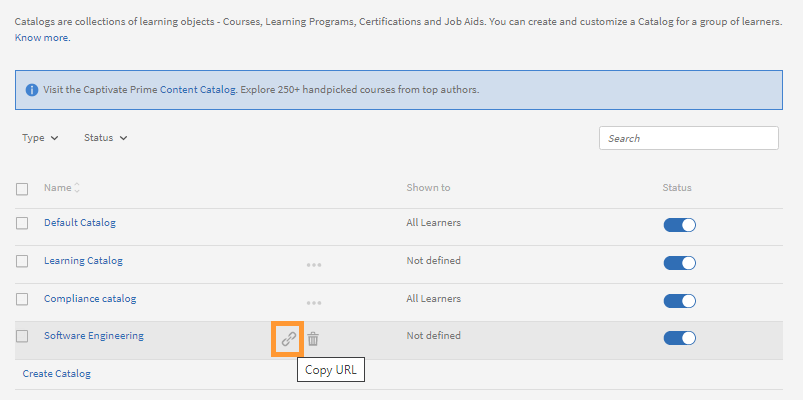

# Catalogs

Catalogs are a collection of learning - Courses, Learning Programs, and Certifications. Use Catalogs to provide Learners with access to a customized set of learning. You can associate learning with a Catalog during the creation of a new Catalog.

As an administrator, you can create custom catalogs, if you want to make selective courses available for different learners in your account or across accounts.

## Introduction to Catalogs

In this training, you will learn how to create and manage catalogs.

If you're unable to launch the training, write to <almacademy@adobe.com>.

## Create a catalog {#createacatalog}

To create a catalog, perform the following steps:

1. As an Admin, on the left pane, click Catalogs. On this page, there is a default catalog, which is automatically created when you create a Learning Manager account. And by default, all the learning objects in this catalog are shared with all the learners. 
1. To create a catalog, on the upper-right corner of the page, click **[!UICONTROL Create]**. Optionally, you can also click **[!UICONTROL Create Catalog]**, which is located below the list of catalogs.
1. On the **[!UICONTROL Create Catalog]** page, enter the name and description of the catalog that you want to create.

   

   To proceed, click **[!UICONTROL Next]**.

   The thumbnails can only be viewed in the Immersive UI, not in the Classic UI.

1. On the Catalog page, you can add the following in the new catalog:

   * [Courses](catalogs.md#course)
   * [Learning Programs](catalogs.md#lp)
   * [Certifications](catalogs.md#cert)
   * [Job Aids](catalogs.md#job)

## Add a course to the catalog {#course}

1. From the list of courses, choose a course that you want to add to the catalog.

   

   *Create a catalog*

   You can add multiple courses to the catalog.

1. Save the changes. Go back to the list of catalogs and click the new catalog in the list.
1. In the page for the new catalog, on the left pane, click **[!UICONTROL Content]**.

   

   *Select a course to add to the catalog*

   The course that you have added appears in the **[!UICONTROL Courses]** tab.

## Add a Learning Program to the catalog {#lp}

1. From the list of Learning Programs, choose a Learning Program that you want to add to the catalog.
1. Save the changes. Go back to the list of catalogs and click the new catalog in the list.
1. In the page for the new catalog, on the left pane, click **[!UICONTROL Content]**.

   The Learning Program that you have added appears in the **[!UICONTROL Learning Programs]** tab.

## Add a certification to the catalog {#cert}

1. From the list of Certifications, choose a Certification that you want to add to the catalog.
1. Save the changes. Go back to the list of catalogs and click the new catalog in the list.
1. In the page for the new catalog, on the left pane, click **[!UICONTROL Content]**.

   The  Certification that you have added appears in the **[!UICONTROL Certifications]** tab.

## Add a Job Aid to the catalog {#job}

1. From the list of Job Aids, choose a Job Aid that you want to add to the catalog.
1. Save the changes. Go back to the list of catalogs and click the new catalog in the list.
1. In the page for the new catalog, on the left pane, click **[!UICONTROL Content]**.

   The  Job Aid that you have added appears in the **[!UICONTROL Job Aids]** tab.

The content appears in each of these tabs if it is already available in the account. Otherwise, you need to create the content first. For example, if you have not added any of the courses or learning programs already in Learning Manager application, then you have to start creating them first. 

## Deep link to catalog for learners {#deep-link}

An Admin can generate a deep link for a catalog that can take the learners to the specific catalog page.

On the **[!UICONTROL Catalogs]** page, mouse over on the catalog that you the deep link for and click the highlighted icon.

*Generate a deep link for learners*

## Enable the catalog {#enablethecatalog}

Once you create a catalog and add Learning Objects to it, to make the catalog visible to learners, you must enable the catalog.

To enable the catalog, 

1. In the list of catalogs, toggle the option near the catalog that you want to enable. Alternatively, you can select the check-box near the catalog, click **[!UICONTROL Actions]** on the upper-right corner, and click **[!UICONTROL Enable]**.

1. You can also enable multiple catalogs in the list. Select the catalogs, and from the **[!UICONTROL Action]** menu, choose the option **[!UICONTROL Enable]**.

## Disable the catalog {#disablethecatalog}

To disable a catalog, toggle off the option near the catalog.

Alternatively, you can select the check-box near the catalog, click Actions on the upper-right corner, and click **[!UICONTROL Disable]**.

You can also disable multiple catalogs in the list. Select the catalogs, and from the Action menu, choose the option **[!UICONTROL Disable]**.

## Delete the catalog {#deletethecatalog}

To delete a catalog, select a catalog in the list. Either click the Delete button near the catalog or click **[!UICONTROL Actions]** > **[!UICONTROL Delete]**.

You can also delete multiple catalogs.

## Share the catalog {#shared}

An Administrator can share the catalogs with internal users of an organization or with any external users. However, sharing is exclusive. In other words, an internally shared catalog cannot be shared with external groups and vice versa.

Courses, Learning programs, Job Aids, and certifications are the supported learning objects in a catalog that you want to share.

### Share Catalogs

This training will teach you how to share catalogs with internal user groups and external Adobe Learning Manager accounts.

If you're unable to launch the training, write to <almacademy@adobe.com>.

## Share the catalog internally {#int}

Choose a catalog that you want to share internally. 

In the left pane, click **[!UICONTROL Share Internally]**.

If there are no groups present, you must add an internal user group. 

To add an internal user group, click **[!UICONTROL Add User Groups]**.

*Share a catalog internally*

There is no option available to enable/disable a shared user group. To disable, you have to delete the user group. To delete, hover the mouse over the triple dots and click delete icon. Alternatively, click Actions drop-down at the upper-right corner of the page and click Delete. 

## Share the catalog externally {#ext}

In Catalogs page, click the catalog you want to share. In the left panel click **[!UICONTROL Share Externally]**.

*Share a catalog externally*

Enter the subdomain associated with your Learning Manager account. Click **[!UICONTROL How to get subdomain?]** to learn about the subdomain usage. You can also click **[!UICONTROL Branding]** on the left pane in Administrator home page to view the subdomain associated with your organization account.

**Enrollments limit**

You can set the limit for number of enrollments per course on the shared catalog by adding the number in **Enrollments Allowed field**. The receiver of shared catalog cannot use the courses with enrollment limit in learning plans.

**Expiry**

You can set the validity of the shared catalog by setting up an expiry date in **[!UICONTROL Expiry]** field. After the expiry date of shared catalog, enrollments are not allowed for courses. Existing learners can still have access to the content. Learning objects are retired but the badges and skills are active. At this state, the shared catalog receiver cannot un-retire the retired learning objects. 

Click **[!UICONTROL Save]** after adding all the required information. Click **[!UICONTROL Actions]** drop-down at the upper-right corner of the page and click **[!UICONTROL Share]** to share the catalog with external accounts. 

The catalogs owned by the sharing account holder are only allowed to be shared with external accounts. You cannot share the catalogs that are already shared by other accounts to you. 

The Administrator of the external shared account receives a notification in the application and email. The receiver has to click the unique URL provided in the email or click the notification message and accept the shared catalog request. In the application, the receiver can choose to click Accept or Reject. Before accepting the shared catalog, the receiver can view the catalog details such as shared by whom, shared on date, expiry date and so on. 

The shared catalog appears in the receiver account. The learning objects associated with the shared catalog appears in the respective Administrator and author roles of the application. You can differentiate the shared catalogs received by you by locating the <-- arrow icon displayed for the catalogs acquired by you. 

The learning objects with open/active state for enrollment are only added to shared catalogs.

**Unshare catalogs**

Unsharing a catalog is to disable an external account in the application. To unshare a catalog, click **[!UICONTROL Actions]** at the upper-right corner of the page and click **[!UICONTROL Unshare]**. You can Unshare a catalog anytime. When a catalog is unshared, all the learning objects in that shared catalog moves into retired state. The disabled catalogs appear as retired in receiver's application. 

You can remove an external account from a shared list only before the receiver accepts the request. 

**Delete catalogs**

To delete a shared catalog, click **[!UICONTROL Actions]** drop-down and click **[!UICONTROL Delete]**. 

* You cannot share a default catalog with external accounts. 
* You cannot delete a catalog that has been shared externally by you. 
* You cannot delete a catalog which was shared to you from other accounts. 

## Enable full control of shared catalog {#enablefullcontrolofsharedcatalog}

You can grant full access to your catalog to external accounts. The administrator of the account can then accept the catalog and can accordingly add or delete learning(s) or modules.

For more information, see [Full control of shared catalog](shared-catalog-full-control.md).

## Shared catalog learning objects properties {#sharedcataloglearningobjectsproperties}

Any modifications performed for learning objects at the owner application are carried forward to the shared catalog receiver. A list of learning object properties that reflect in the receiver application are shown as follows: 

<table>
 <tbody>
  <tr>
   <td>
    
<strong>Course</strong>
</td>
   <td>
    
Name, description and other fields on Course object except gamification points, badgeId
</td>
  </tr>
  <tr>
   <td>
    
<strong>Learning program</strong>
</td>
   <td>
    
Name, description and other fields on LP object except badgeId, retiring
</td>
  </tr>
  <tr>
   <td>
    
<strong>Certification</strong>
</td>
   <td>
    
All properties of certification object except badgeId, retiring of certification
</td>
  </tr>
  <tr>
   <td>
    
<strong>Badge</strong>
</td>
   <td>
    
Name and retiring of badge
</td>
  </tr>
  <tr>
   <td>
    
<strong>Category </strong>
</td>
   <td>
    
Name, description, color and retiring of category, addition of new level
</td>
  </tr>
  <tr>
   <td>
    
<strong>Job-Aid</strong>
</td>
   <td>
    
All properties of jobAid object
</td>
  </tr>
  <tr>
   <td>
    
<strong>Module</strong>
</td>
   <td>
    
All properties of module object
</td>
  </tr>
 </tbody>
</table>

## Shared catalog features in receiver application {#sharedcatalogfeaturesinreceiverapplication}

* Learning objects from shared catalog appear in Author and Admin application but modules are not listed. They are hidden. 
* Shared Learning objects can be used for all workflows in receiver's account. For example, adding shared course to Learning programs, certifications, catalogs, but those Learning programs, certifications & catalogs cannot be shared again (as they already have a shared Learning object from another account).
* All the job aids that are associated with course/learning program/certification but not part of the catalog are copied in receiver's account. 
* Shared catalog receivers are not allowed to add Learning objects to the shared catalog.
* Shared catalog receiver cannot modify modules of shared Learning objects.
* Shared catalog receiver cannot add courses to shared Learning program/certification. 
* Duplication or re-sharing of shared learning objects is not allowed.
* Newly added assets to shared catalog are visible to receivers automatically.
* Skills associated with the Learning objects are copied to shared catalog receiver accounts. 

* If the shared catalog receiver account had same skill name already, then new skill will be created adding &#42; after the name.
* Data (for example, Badges, L1, L3, notifications) in the default instances of Courses and learning programs also is copied to receiver's account along with courses and learning programs. 

Recurring certifications cannot be part of an externally shared catalog. Receiver cannot use acquired learning objects in recurring certifications if they have enrollment limit or expiry date set on the catalog. 

## Propagation of shared catalog features {#propagation}

Administrators across the accounts in an organization can share the catalogs to multiple accounts. The receivers of the shared catalogs can acquire the learning objects associated with the shared catalogs. In addition to this feature, from November 2016 release of Learning Manager, the receivers can acquire the properties of learning objects shared through the Catalogs. 

After sharing the Catalogs, if an Administrator of an account makes any changes to the learning objects the same changes will be propagated to all the learning objects acquired by the receiver of shared catalogs.

The learning objects that are supported as part of this propagation feature are as follows: 

* Skills
* Courses 
* Learning Programs
* Certifications 
* Job Aids
* Default instances of Courses and Learning Programs

If the receivers of shared catalogs modify any of the received learning object fields in Learning Manager application, then further propagation of updates to those fields do not take place for such learning objects. For example, if the receiver edits the course fields such as Course Name or Short Description, then propagation does not occur when owner changes these fields. In other words, such edited learning object fields become local to receiver's Learning Manager account. 

## Frequently Asked Questions {#frequentlyaskedquestions}

+++How to add courses, LP,  and, Certifications to a Catalog?

To add courses, certifications, and Learning Programs to the catalog, see the [steps](catalogs.md#q1) to include these in the catalog.

+++

+++How to share a catalog externally and internally?

To share the catalog internally or externally, see the sections below:

* [Share internally](catalogs.md#int)
* [Share externally](catalogs.md#ext)

+++

+++How to allow learners see all the Catalog they are a part of?

Catalogs can be shared with Learners inside your organization by using the User Groups. To allow learner or learners view the catalogs they are a part of, follow the steps below:

1. Open a catalog and click **[!UICONTROL Share Internally]**.
1. To add learners, on the upper-right corner of the page, click **[!UICONTROL Add]**.
1. On the **[!UICONTROL User Groups]** dialog, start adding learners.
1. Click **[!UICONTROL Save]**.

When a learner logs in to Learning Manager, he/she has view the Catalogs that were shared with him/her. 

+++

+++How to create and use Catalog labels?

Catalog Labels allow you to associate learning objects with relevant field-value information. Catalog Labels and values are visible only to Administrators and Authors. For more information, see [***Catalog labels***](/help/migrated/administrators/feature-summary/catalog-labels.md).

Once you have created catalog labels, you can apply them to specific catalogs by following these steps:

1. Open Catalogs from the left pane.
1. Select the Catalog and apply to the label.
1. Open Catalog labels from the left pane.
1. Click **[!UICONTROL Edit]** on the upper-right corner. The page shows the list of available Catalog Labels.
1. To add a label to the Catalog, click **[!UICONTROL Add to Catalog]**.
1. To remove existing labels added to a Catalog, click **[!UICONTROL Remove]**.

+++

+++How do I provide access to certain catalogs to newly created external users?

1. As an Administrator, select the catalog that you want to provide access to an external user profile.
1. Share internally > Add more > Select the respective External user profile
1. Toggle to enable the catalog.

+++

+++How do I limit users to see only specific catalogs? 

Disable the default catalog and enable only the catalog that was created and granted access to external users.

+++
