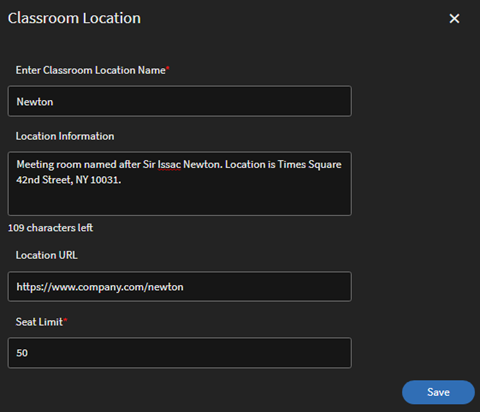

# Classroom {#classroom}

Administrators can now set up a library of classroom locations. For each Classroom Location, the administrators can set the metadata that includes Location Name, Seat Limit as well as additional information such as the Location URL. Authors and Administrators can then use these pre-configured classroom locations for setting up instructor-led training events (classroom modules).

You can use the following two ways to add a classroom location.

## Add classroom using the UI

You can add a classroom location by using the UI:

1. In the Admin app (the UI for administrator roles), click **Settings > Classroom Locations**.  
1. Click the **Add More** button.  
1. In the **Classroom Location** dialog box, enter the following details:

   * Type the **Classroom Location Name**. Use a unique name. Otherwise, Learning Manager displays an error message.
   * Type the location description in the **Location Information** field. This field is optional.
   * Type the **Location URL**. Learner can see this information in the classroom details. The URL can also be a maps location URL, if required. This is an optional field.
   * Type the number of available seats in the **Seat Limit** field. This indicates the seat capacity of the classroom. This value can be changed when creating the actual instructor-led training event.

   

After adding the location, the **Settings > Classroom Locations** page lists the meeting rooms:

The list has the following fields:

**Location Name** - Name of the classroom location.

**Future Sessions** - Number of events that will occur in the corresponding location. Click the number to view the details in a dialog box.

The dialog box displays the details of each session including the name of the session, name of the training that includes the session, and session schedule. The displayed time aligns with the system time zone of the learner.

The **Future Sessions** field displays **zero** when the classroom is not used for any session or when the classroom is associated with past sessions.

**Location URL** - URL that you provided when creating the classroom location.

**Location Information** - The classroom information that you provided when creating the classroom.

## Add classroom using CSV

Alternatively, you can add one or more classroom locations by importing a CSV that contains the classroom information.

In **Admin app > Settings > Classroom Locations**, click the **Import Locations CSV** button. Browse to the location containing the CSV file and select the file.

The CSV file uses these fields to store details about one or more classroom locations:

* name
* info
* url
* seatLimit

You can customize the headers.

The CSV file must mandatorily contain all columns in the same order as specified here.

After the system imports the CSV file, the locations are added in the library.

## Search for classrooms

An Author or Administrator can start typing the location name to see the relevant results that start appearing. An Author or Administrator can then select a location from the displayed results. If no location is displayed in the typeahead results, the user can still add the new classroom location name. Note that this location name created using the session creation workflow is not added to the location library created by the Administrator.

When a classroom is added, the learning platform also indicates if the classroom is already booked for the mentioned time-period. It even provides alternate time slots as suggestions. Therefore, this enables the Author to adjust the meeting time if he decides to use the same classroom location.

 

## Confine to pre-determined list of instructors

Presently, the users can add any registered user as an instructor when creating a classroom or virtual-classroom session. This functionality remains unchanged in this release.

However, Administrators now have an additional option to further control who gets assigned as an instructor on the learning platform. This prevents any accidental addition of a new Instructor when creating a session.

### Administrator

An Administrator can select the **Instructor Management** option (available under **Admin app > Settings > General**) to ensure that only the users who are pre-determined Instructors can be added as an instructor for a session.

To set up an Instructor, Administrators can select **MANAGE > Users** to open the User management page, select a user, and then assign the instructor role to the user (using **Actions > Assign Role**).

### Author

If the Administrator selects the **Instructor Management** option, an author can only search for and add the users with Instructor role to the classroom sessions, virtual classroom sessions, checklists, and the file submission modules.

In addition, an author can:

* Add and remove instructors from the existing sessions.
* Add instructors to the existing sessions that already have one or more instructors.

Therefore, after an Administrator enables the **Instructor Management** option, only the users with Instructor role can be added as an instructor.

>[!NOTE]
>
>This is not applicable when you migrate sessions using the sessions CSV file. In this case, a user who does not have the instructor role can be added as an instructor.

## Cancel existing session

An Author or Administrator can cancel a session and reschedule it, if required.

When a user cancels a session, the system sends a meeting cancellation email to all the enrolled learners and instructors. The email includes the updated session details.

There is a template called **Session Cancellation** that helps in cancelling a session.

On the **Course Instance** page, every session listed under a course instance includes an option to cancel the session.

When you click the **Cancel Session** link, a warning message appears.

On the warning message dialog box, if you click **Proceed**, the system cancels the session.

The system also clears the following details after cancelling a session:

* Start date of the session
* End date of the session
* Start time of the session
* End time of the session
* Instructors added to the session
* Virtual classroom URL
* Location/venue added to the session
* Waitlist limit added by the instructor

### Administrator

On the **Course Instance** page, an Administrator can cancel one or more sessions. After the Administrator cancels a session, the system clears all the session details except the seat limit.

In addition, an Administrator can:

* View the enrolled learners and waitlisted learners of a session.
* Unenroll learners from a course with one or more cancelled sessions.
* Mark attendance for sessions that are cancelled.
* Mark a course as complete that contains one or more cancelled sessions.
* Reschedule a session that was cancelled.
* Add an instructor to a cancelled session when rescheduling it.

Note that even after cancellation, the learners enrolled in the training instance continue to stay enrolled. Their enrollment statuses - including confirmed enrollment, waitlisted, and awaiting manager approval - does not change. This is useful because the Administrator can setup and reschedule the cancelled session in the future.

### Author

On the **Course Instance** page, an Author can cancel one or more sessions. After the Author cancels a session, the system clears all the session details except the seat limit.

Therefore, an Author can use the **Cancel Session** links to cancel one or more classroom sessions or virtual classroom sessions available in the same or different course instances.  
