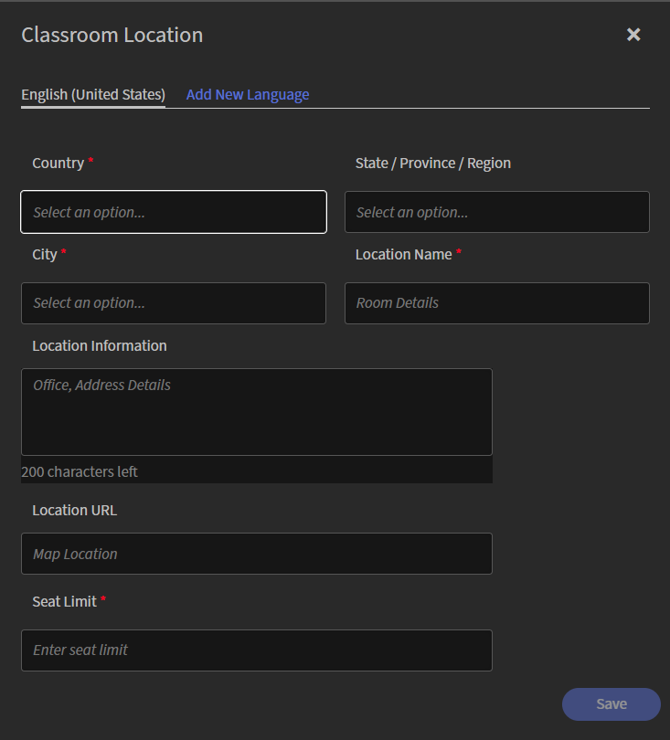
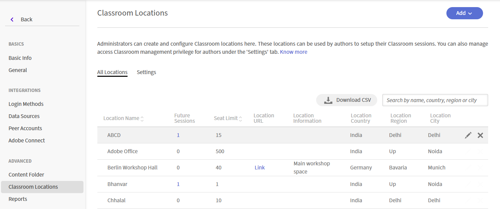

# Add Classroom Locations

Administrators can create and manage a library of Classroom Locations to reuse when setting up instructor-led training events in the Classroom and Virtual Classrooms module. For each location, you can define details such as the location name, seat limit, and additional information, including a location URL. Authors can then select these predefined locations when creating a course.

By default, Adobe Learning Manager uses a single-field location format. For organizations that manage Classroom Locations across multiple countries and languages, Learning Manager also supports a structured four-field format that includes **Country**, **State/Province/Region**, **City**, and **Location Name**. This format provides additional capabilities such as location-based filtering and language support for individual locations. Administrators can switch to the four-field format through a one-time migration.

>[!NOTE]
>
>If the four-field location format is not enabled, Authors and learners can continue using Classroom Locations as usual. The existing single-field location format remains available, and no changes are required. View [Migrate to the four-field method](#migrate-classroom-locations-to-the-four-field-format) for more information.

## Configure Classroom Location settings

Administrators can control whether Authors can create and manage classroom locations. Use the **Classroom Locations** settings to define the level of access available to Authors.

To configure **Classroom Locations** settings:

1. Login to the Adobe Learning Manager as an **Administrator**.
1. Select **Settings** > **Classroom Locations**.

   This displays the **Classroom Locations** page.

1. Select the **Settings** tab.

   

   *Enable Author privileges for Classroom and Virtual Classroom locations from the **Settings** tab.*

1. Select **Edit**.

   The toggle becomes editable, allowing you to update the following settings:

   |**Setting**|**Description**|
   |---|---|
   |**Allow authors to create locations**|Enable this option to allow Authors to create Classroom and Virtual Classroom module locations when creating instructor-led training sessions.|
   |**Allow authors to modify and delete locations**|Enable this option to allow Authors to edit or delete Classroom and Virtual Classroom Locations.|

1. Select **Save**.

## Create and manage Classroom Locations

Administrators can create and manage Classroom Locations that Authors can reuse when creating Classroom and Virtual Classroom training sessions. Adobe Learning Manager supports two location formats:

* **Single-field format**: Each Classroom Location is identified by a single **Location Name** field. View [Add a Classroom Location using a single-field format](#add-a-classroom-location-using-a-single-field-format) for more information.
* **Four-field format**: Each Classroom Location is organized into **Country**, **State/Province/Region**, **City**, and **Location Name**, making it easier to manage locations across multiple regions. If your account currently uses the single-field format, complete the one-time migration before switching to the four-field format. View [Migrate to the four-field method](#migrate-classroom-locations-to-the-four-field-format) for more information.

### Add a Classroom Location using a single-field format

You can add a Classroom Location by using the single-field format:

1. Login to the Adobe Learning Manager as an **Administrator**.
1. Select **Settings** > **Classroom Locations**.
1. Select **Add** > **New Location**.
1. Enter the following details in the **Classroom Locations** dialog box:

   1. Type the **Location Name**. Use a unique name. Otherwise, Learning Manager displays an error message.
   1. Type the location description in the **Location Information** field. This field is optional.
   1. Type the **Location URL**. Learners can see this information in the classroom details. The URL can also be a maps location URL, if required. This is an optional field.
   1. Type and select the **Location Region**. This field is optional.
   1. Type the number of available seats in the **Seat Limit** field. This indicates the classroom's seating capacity. This value can be changed when creating the actual instructor-led training event.

*Add a Classroom Location using the single-field format.*

### Migrate Classroom Locations to the four-field format

If your account uses the legacy single-field Classroom Location format, migrate your existing Classroom Locations before enabling the four-field format. The four-field format organizes location data into **Country**, **State/Province/Region**, **City**, and **Location Name**, making it easier to manage locations across multiple regions.

This migration is a one-time process. After you switch to the four-field format, you cannot revert the account to the single-field format.

To migrate existing locations:

1. Navigate to **Admin** > **Classroom Locations** and select the **Settings** tab.
1. Select **Export** in the **Location format migration** section.

   A CSV file with your existing Classroom Locations is downloaded. The following columns are available:

   1. **room_id**: Unique identifier for the location.
   1. **locale**: Locale for the translated Location Name and Location Information.
   1. **name**: Name of the classroom.
   1. **country**: Country where the classroom is located.
   1. **state**: State, province, or region where the classroom is located.
   1. **city**: City where the classroom is located.
   1. **info**: Additional details, such as building name, floor, or room number.
   1. **url**: URL associated with the location, such as a map link.
   1. **seatlimit**: Maximum seating capacity of the classroom.

   >[!NOTE]
   >
   >The exported CSV always includes the four-field location format columns, even when the four-field format is not enabled.

   

   *Check migration progress before switching to the four-field location format.*

1. For each column name, update the CSV file with the required information, such as Country, State, City, along with any other required information.
1. Select **Import** and then upload the updated CSV file.

   Adobe Learning Manager validates the data and updates the migration progress.

1. When the migration progress bar reaches 100%, select **Switch to new 4-field format**. The **Location format migration** status updates to **Migration complete**.

   

   *Location format migration updates to the Migration complete status.*

## Add Classroom Locations using a four-field format

After completing the one-time migration, Administrators can create Classroom Locations in the four-field format. Authors can then reuse these locations when creating instructor-led training sessions. Administrators can add Classroom Locations individually or import multiple Classroom Locations from a CSV file.

### Add a Classroom Location

Use Classroom Locations to standardize training venues and simplify session scheduling for Authors.

To add a Classroom Location:

1. In the Admin app, select **Settings** > **Classroom Locations**.

   

   *Select the **All Locations** tab to add a Classroom Location.*

1. Select **Add** > **New location** from the upper-right corner.

   The **Classroom Location** pop-up window appears.

   

   *Enter the details in the Classroom Location pop-up window.*

1. In the **Classroom Location** pop-up window, enter the following details:

   |**Field**|**Description**|
   |---|---|
   |**Country**|Select the country where the classroom is located.|
   |**State/Province/Region**|Select the state, province, or region.|
   |**City**|Select the city where the classroom is located.|
   |**Location Name**|Enter the name of the classroom or room.|
   |**Location Information**|Enter additional details, such as the building name, floor, or room number.|
   |**Location URL**|Enter a URL for the location, such as a map link.|
   |**Seat Limit**|Enter the classroom's maximum seating capacity.|

1. Select **Save**.

   The Classroom Location is saved and listed in the **All Locations** tab.

### Import Classroom Locations in bulk

Use bulk import to add multiple Classroom Locations or update existing locations using a CSV file.

To import Classroom Locations in bulk:

1. In the Admin app, select **Settings** > **Classroom Locations**.
1. Select **Download CSV** from the **All Locations** tab.

   A CSV file containing your existing Classroom Locations is downloaded. The following columns are available:

   1. **room_id**: Unique identifier for the location.
   1. **locale**: Locale for the translated Location Name and Location Information.
   1. **name**: Name of the classroom.
   1. **country**: Country where the classroom is located.
   1. **state**: State, province, or region where the classroom is located.
   1. **city**: City where the classroom is located.
   1. **info**: Additional details, such as building name, floor, or room number.
   1. **url**: URL associated with the location, such as a map link.
   1. **seatlimit**: Maximum seating capacity of the classroom.

1. For each column name, update the CSV file with the required information, such as Country, State, City, along with any other required information.
1. Select **Add** > **Bulk Import locations** from the upper-right corner.

   The **Import Locations CSV** pop-up window appears.

   

   *Drag and drop the CSV with the updated information.*

1. Drag and drop the updated CSV file into the upload area.
1. Select **Import**.

   The Classroom Locations are updated.

## Add translations for a Classroom Location

Add translations for the **Location Name** and **Location Information** fields to display Classroom Location details in learner's preferred languages.

To add translations for a Classroom Location:

1. Select **All Locations** > **Add** from the **Classroom Locations**.
1. Select **New Location**.

   The **Classroom Location** pop-up window appears.

1. Select **Add New Language**.

   The **Add New Language** pop-up window appears.

   

   *Select the languages from the Add New Language pop-up window.*

1. Select **Save**.

   The translations are saved and displayed to users.

>[!NOTE]
>
>Only the **Location Name** and **Location Information** fields support translations. Location details such as **Country**, **State/Province/Region**, and **City** are not translated.

## Edit a Classroom Location

To edit a Classroom Location, follow these steps:

1. In the Admin app, select **Settings** > **Classroom Locations**.
1. Hover over the desired Classroom Location you want to edit.

   

   *Hover over the required Classroom Location and select the edit icon.*

1. Select the **Edit Classroom Location** icon.

   The Classroom Location pop-up window appears.

1. Modify the Classroom Location and select **Save**.

## Delete a Classroom Location

To delete a Classroom Location, follow these steps:

1. In the Admin app, select **Settings** > **Classroom Locations**.
1. Hover over the desired Classroom Location you want to delete.
1. Select the **Delete Classroom Location** icon.

   The Confirmation Required pop-up window appears.

   

   *Select Delete to confirm the deletion of a Classroom Location.*

1. Select **Delete**.

## Frequently asked questions

1. **What happens to existing Classroom Locations after the migration is complete?** 
You can enable the four-field location format only after all existing locations have been migrated, either manually or through a CSV upload. Once the four-field format is enabled, all existing courses that use Classroom Locations display locations in the new format.

1. **Do I need to manually restructure the exported CSV to match the four-field location format?** 
No. The exported CSV file always uses the four-field location format, regardless of whether it is currently enabled. You only need to update any missing values before importing the file.

1. **Does the migration affect Adobe Learning Manager reports?** 
Yes. After migration, reports that include Classroom Location information display locations in the following format:

   **Country > State/Province/Region > City > Location Name**

   This format replaces the previous single-field location value.

1. **What happens if I do not enable the four-field location format?** 
Nothing changes for Authors or learners. Classroom Locations continue to appear and function as they do today, using the existing single-field format until an Administrator completes the migration and enables the four-field format.
