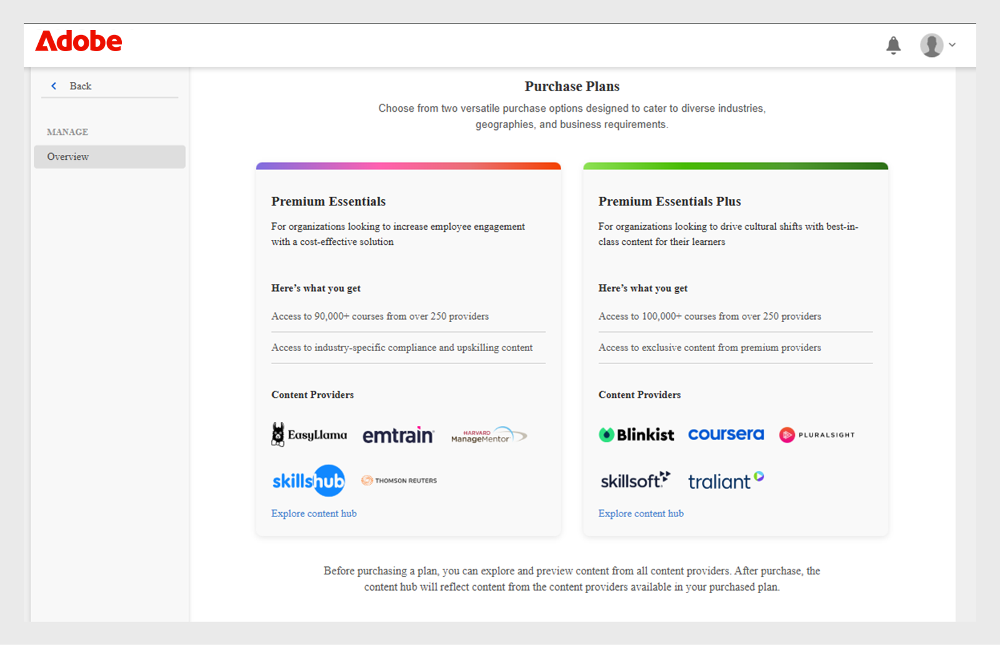
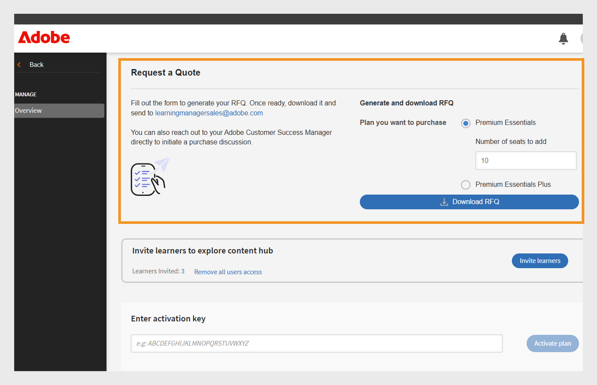

# Content marketplace

Learning administrators often struggle to find high-quality content on various topics and add it to their learning platform. Without an integrated marketplace, bringing third-party content into the LMS usually requires external procurement, formatting, and manual uploads. The Content Marketplace solves this problem by letting you license premium courses from trusted providers with one click, directly in Adobe Learning Manager. This ensures faster rollout and more scalable learning programs.

The Content Marketplace in Adobe Learning Manager (ALM) lets administrators browse, preview, and license third-party courses from top providers. Organizations can easily add off-the-shelf learning to their training catalogs, delivering fast, scalable learning across many topics.

As an admin, you have two plan options:

* **[!UICONTROL Premium Essentials]**
* **[!UICONTROL Premium Essentials Plus]**

These plans are designed to fit different: Business needs, Locations and Budgets

**[!UICONTROL Premium Essentials]**:
A cost-effective solution designed to enhance employee engagement. 

* Access to over 90,000 courses
* Content from more than 250 providers
* Focus on compliance and skill improvement
* Cost-effective option
* Exclusive content from trusted providers such as:
   * EasyLlama
   * Skillshub
   * Thomson Reuters
   * Emtrain
   * Harvard ManageMentor

**[!UICONTROL Premium Essentials Plus]**:

* Access to more than 100,000 courses
* Includes all Premium Essentials content
* Exclusive courses from top providers like:
   * Blinkist
   * Pluralsight
   * Skillsoft
   * Traliant
   * Coursera

Select the plan that best meets your organization's learning goals and budget.

## Acquire content from providers

To browse and acquire content from Go1 and other providers, follow these steps:

1. Select the **[!UICONTROL Content Marketplace]** from the administrator homepage. 

   
   _Purchase plans_

2. Admins can preview and explore the Content Hub for both **[!UICONTROL Premium Essentials]** and **[!UICONTROL Premium Essentials Plus]** plans.

Adobe Learning Manager syncs regularly with the content hub, ensuring that new additions and updates are automatically reflected in the platform.

All content is mapped to supported languages, allowing administrators to filter and manage content more effectively based on language preferences.

Content providers manage the removal of outdated content, ensuring that no learning material is decommissioned without prior notice.

<!--Learning Manager now offers Content Marketplace for you to explore and purchase trainings. Explore 70,000+ courses that cover a wide range of topics, available in multiple formats. Choose from curated playlists that cater to a vast variety of roles and meet your learning and upskilling needs.

In the Administrator app, there is a new option **[!UICONTROL Content Marketplace]**, which you'll find on the left panel.

Users can purchase from curated playlists covering various topics or purchase the entire catalog. 

On the page, you can see two tiles, Enterprise Training and Creative Cloud Training. The first tile launches the marketplace, using which you can acquire courses for your learners. The latter launches the content catalog.

The Enterprise Training page in the Administrator app enables you to invite users and download the Express Interest report, and also purchase the entire catalog or curated playlist.-->

## Request a quote

Administrators can select a plan, such as Premium Essentials or Premium Essentials Plus, specify the number of seats required, and generate a downloadable RFQ form. Once completed, the form is sent to the Adobe Learning Manager sales team for processing. The RFQ process also allows Adobe to provide customized pricing based on the organization's needs, thereby unlocking access to the licensed content within the marketplace.

To download the  (Request for Quote), follow these steps:

1. Select the **[!UICONTROL Content Marketplace]** from the administrator homepage.

2. Select  the license type and type the number of seats to generate the quote in the **[!UICONTROL Request a Quote]** section.
 
3. Select **[!UICONTROL Download RFQ]** to download the quote. 

_Request for a quote_

Send the quote to [learningmanagersales@adobe.com](mailto:learningmanagersales@adobe.com) to activate your license. You can also contact your Adobe Customer Success Manager to start the purchase process.

## Invite users

Invite learners to explore and preview the **[!UICONTROL Content Hub]**. TO invite users, follow these steps:

1. Select the **[!UICONTROL Content Marketplace]** from the administrator homepage.
2. Select **[!UICONTROL Invite learners]** and select the required learners.
3. Select **[!UICONTROL Invite learners]**. 

Administrators can also revoke access to the **[!UICONTROL Content Hub]** by selecting the **[!UICONTROL Remove all users acces]** link. Once access is revoked, learners will no longer see the Content Hub page in their learner app.

_Invite users to access Content Hub_

By default, this option is enabled for all new accounts. For existing accounts, administrators must manually invite learners to access the Content Marketplace.

<!--## Purchase

You get unlimited access to the entire library of courses. Click the **[!UICONTROL Purchase]** button to download a Purchase Request form.

*Enter the number of seats to purchase*

Specify the number of seats for which you want to purchase the courses for. Download the purchase request form and then send the form to the sales team of Learning Manager.

The team will then validate the information and then generate a key, which will be provided to you. This is the activation key using which you'll grant access to your users to the content offering.

After the key is generated by the CSAM team, the Administrator can use the key to import the courses, and migrate the courses into the existing catalog or the new catalog.

During migration of courses, the status displays as **[!UICONTROL Importing Courses]**. Once the migration completes, the Administrator gets a notification that migration is complete and successful.

The **[!UICONTROL Licenses]** section then displays all the licenses that are acquired for the account.

The Administrator can see the links of the purchased catalogs in the Catalog Overview page.

Once the courses are added to the catalog, the Administrator can then grant access to the trainings to various user or user groups.

*Grant access to training to users and user groups*-->

<!--## Express interest report

When a learner clicks Express interest to Catalog in the Learner app, the interest is recorded in an Express interest report. The Administrator can download the report. The report (csv) contains the following fields:

* Name of the catalog
* Number of users expressing interest
* Email of the user expressing interest-->

## Email templates

Adobe Learning Manager offers pre-set email templates that notify administrators and learners about content purchases, system updates, and learning activities.

To support this workflow, there are three email templates that you can use:

1. **[!UICONTROL Content Activation Successful]:** Sent to administrators after a successful purchase of third-party content. This notification confirms that the activation is complete and that the purchased content is now available in the system for learner assignment.
2. **[!UICONTROL Automated User Upload Failure]:** Triggered when an automated user import via CSV fails. This alert helps administrators quickly identify issues in scheduled user updates, so corrective actions can be taken.
3. **[!UICONTROL Invite Users to Explore Content]:** An invitation email that's sent to learners once the administrator purchases content from the marketplace. After that, users can start their learning journey immediately.

<!--Purchased courses cannot be added in recurring certificates.
Purchased courses cannot be shared to peer accounts.
Purchased courses can be consumed by all users who get access to it. Configure the catalog visibility to restrict the visibility of purchased courses to limited users.
Purchased courses cannot be consumed once the activation key expires. Please purchase/activate another key to allow consumption.-->

<!--## Content Hub in Content Marketplace

Content Hub allows Administrators and Subject Matter Experts (SMEs) to shortlist required playlists from learner app. Once shortlisted, Admins can download the Purchase Request Form and share it with the Adobe Sales agent.

An Admin can invite SMEs to shortlist the playlist which they are interested in. 

*Launch Content Hub from the marketplace*

Content Hub is available in Learner role for all Administrators. Administrators allow SMEs to shortlist the playlist which they are interested in purchasing.

The Content Hub page is visible to Administrators in their learner role all the time as it allows them to shortlist playlists easily. To help you in shortlisting the right playlist, Admins can make this page accessible to limited Subject matter experts in their account. Just visit the Enterprise Training page on Admin side and take steps to provide access.  

*View resources in the Content hub*

Learning Manager also enables Administrators to download a shortlisted playlist and share it with Adobe Sales team. Before downloading the shortlist, visit the Content Hub and shortlist a playlist by adding a playlist to your library. 

Then as Administrator, click **[!UICONTROL Content Marketplace]** > **[!UICONTROL Enterprise Training]** > **[!UICONTROL Purchase section]** > **[!UICONTROL Curated Playlists]**. Click the **[!UICONTROL Purchase]** button to download the Purchase request form which contains the details of your shortlisted playlist.

*Download the Purchase Request form*

The courses and Playlist which you see in the Content Hub are the same as what you see in the Content Marketplace. Content Hub simply provides an ability for Administrators and limited SMEs to shortlist playlist easily for purchase.-->
