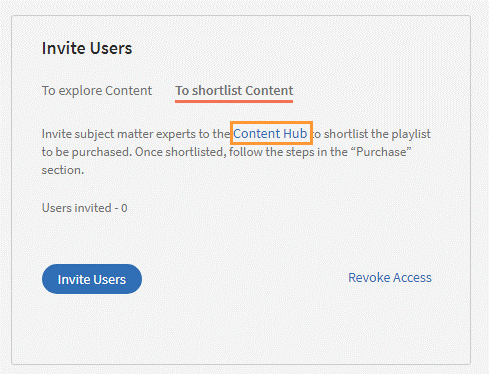

# Content marketplace

Learning Manager now offers Content Marketplace for you to explore and purchase trainings. Explore 70,000+ courses that cover a wide range of topics, available in multiple formats. Choose from curated playlists that cater to a vast variety of roles and meet your learning and upskilling needs.

In the Administrator app, there is a new option **Content Marketplace**, which you'll find on the left panel.

Users can purchase from curated playlists covering various topics or purchase the entire catalog. 

On the page, you can see two tiles, Enterprise Training and Creative Cloud Training. The first tile launches the marketplace, using which you can acquire courses for your learners. The latter launches the content catalog.

The Enterprise Training page in the Administrator app enables you to invite users and download the Express Interest report, and also purchase the entire catalog or curated playlist.

**Invite users**

Invite users to Content Marketplace to explore content and express interest. As an administrator, you can either invite all learners in the account or invite selected learners. To grant access to learners, you must invite them.

A learner can also be revoked from the Content marketplace option. To revoke access, click the **Revoke Access** link.  Users will no longer be able to see the Contet Marketplace page in the learner app. 

This option is selected by default for all new accounts. For existing accounts, the Administrator must invite the users to explore the marketplace.

## Purchase

You get unlimited access to the entire library of courses. Click the **Purchase** button to download a Purchase Request form.

*Enter the number of seats to purchase*

Specify the number of seats for which you want to purchase the courses for. Download the purchase request form and then send the form to the sales team of Learning Manager.

The team will then validate the information and then generate a key, which will be provided to you. This is the activation key using which you'll grant access to your users to the content offering.

After the key is generated by the CSAM team, the Administrator can use the key to import the courses, and migrate the courses into the existing catalog or the new catalog.

During migration of courses, the status displays as **Importing Courses**. Once the migration completes, the Administrator gets a notification that migration is complete and successful.

The **Licenses** section then displays all the licenses that are acquired for the account.

The Administrator can see the links of the purchased catalogs in the Catalog Overview page.

Once the courses are added to the catalog, the Administrator can then grant access to the trainings to various user or user groups.

*Grant access to training to users and user groups*

## Express interest report

When a learner clicks Express interest to Catalog in the Learner app, the interest is recorded in an Express interest report. The Administrator can download the report. The report (csv) contains the following fields:

* Name of the catalog
* Number of users expressing interest
* Email of the user expressing interest

## Email templates

To support this workflow, there are three email templates that you can use:

1. **Content Activation Successful:** This is sent when purchsing a content with a key name is successful. All training that is purchased is now available.
1. **Automated User Upload Failure:** This is sent when the auto-update of CSV in the account fails for some reason.
1. **Invite Users to Explore Content:** This is an invitation email sent to learners when the Administrator purchased courses. The administrator can view the Express Interest report to understand the overall requirements and take the purchase decision.

1. Purchased courses cannot be added in recurring certificates.
1. Purchased courses cannot be shared to peer accounts.
1. Purchased courses can be consumed by all users who get access to it. Configure the catalog visibility to restrict the visibility of purchased courses to limited users.
1. Purchased courses cannot be consumed once the activation key expires. Please purchase/activate another key to allow consumption.

## Content Hub in Content Marketplace

Content Hub allows Administrators and Subject Matter Experts (SMEs) to shortlist required playlists from learner app. Once shortlisted, Admins can download the Purchase Request Form and share it with the Adobe Sales agent.

An Admin can invite SMEs to shortlist the playlist which they are interested in. 

*Launch Content Hub from the marketplace*

Content Hub is available in Learner role for all Administrators. Administrators allow SMEs to shortlist the playlist which they are interested in purchasing.

The Content Hub page is visible to Administrators in their learner role all the time as it allows them to shortlist playlists easily. To help you in shortlisting the right playlist, Admins can make this page accessible to limited Subject matter experts in their account. Just visit the Enterprise Training page on Admin side and take steps to provide access.  

*View resources in the Content hub*

Learning Manager also enables Administrators to download a shortlisted playlist and share it with Adobe Sales team. Before downloading the shortlist, visit the Content Hub and shortlist a playlist by adding a playlist to your library. 

Then as Administrator, click **Content Marketplace** > **Enterprise Training** > **Purchase section** > **Curated Playlists**. Click the **Purchase** button to download the Purchase request form which contains the details of your shortlisted playlist.

*Download the Purchase Request form*

The courses and Playlist which you see in the Content Hub are the same as what you see in the Content Marketplace. Content Hub simply provides an ability for Administrators and limited SMEs to shortlist playlist easily for purchase.    
