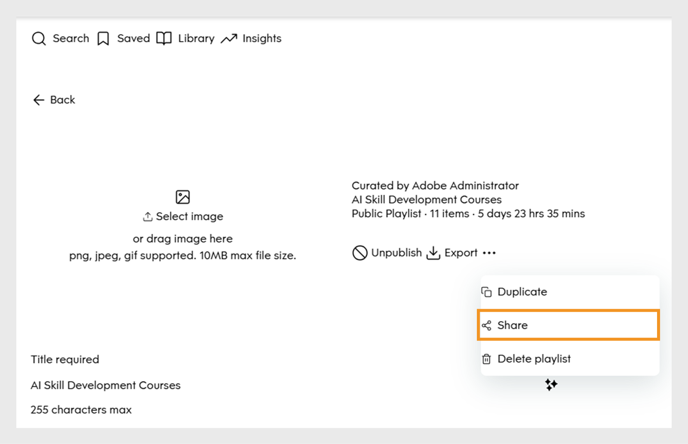

# Add Go1 courses to a Learning Path

Add Go1 courses directly to Learning Paths and certifications. Create Learning Paths that include a Go1 playlist, so learners can access selected Go1 courses as part of their training.

>[!INFO]
>
>You need an active Go1 license to add Go1 courses to Learning Paths or certifications. View this [article](/help/migrated/administrators/feature-summary/content-marketplace.md) to learn more about Go1 license details.

## Create a learning path 

To create a learning path with Go1 courses:

1. Log in to Adobe Learning Manager as an administrator.
2. Select **[!UICONTROL Learning Paths]** in the left navigation pane. 
3. Select **[!UICONTROL Add]**. 

   
   _Select Add in the Learning Paths section to create and organize new structured training programs for your learners_

4. Type the required details and select **[!UICONTROL Save]**. View this [article](/help/migrated/administrators/feature-summary/learning-paths.md) for more information. 
5. You can add courses to a learning path in the following ways:

   * **[!UICONTROL Add Courses or Learning Paths]**: Add existing courses or learning paths available in Adobe Learning Manager.
   * **[!UICONTROL Curate content from Go1]**: Add courses from the Go1 platform.
6. Select **[!UICONTROL Curate content from Go1]**.

   
   _Add Go1 courses to your Sales Engineers Skill Development playlist to expand learning options with curated third-party content_

7. In the **[!UICONTROL Library]**, search for and select **[!UICONTROL Create playlist]** and choose from one of the following:
    a. **[!UICONTROL with AI]**: Create a playlist with the help of AI.
    b. **[!UICONTROL by myself]**: Create a playlist by manually adding courses to it. 

### Create a playlist with AI**

Administrators can type the playlist description in the AI prompt. The AI will curate the related courses and create a playlist based on the requirements. AI generates playlists by interpreting the learning goal or prompt provided by the user. When creating a playlist, admins can select to curate content 'with AI' which allows the system to use large language models to understand the specified learning objectives and content preferences like duration and type. The AI then searches the content library for relevant learning objects that match these criteria.

To create a playlist with AI:

1. Select **[!UICONTROL Create playlist]** and then select **[!UICONTROL with AI]**.
   
   
   _Create curated playlists with AI, which enables automated course recommendations tailored to learner needs_

2. Type a short description about your playlist in the **[!UICONTROL Enter your learning goal]** text field. For example, _Create a curated learning playlist for sales engineers focused on enhancing product knowledge, technical communication, customer engagement, and solution selling_.
   
   
   _Type your learning goal to create a custom playlist, helping Adobe Learning Manager recommend targeted courses tailored to your learners' needs_

3. Select **[!UICONTROL Next]**. The prompt displays the required skills, course duration, and course type for selection.
4. Select the required skills.
   
   
   _Choose the skills from the list to curate the courses for the Sales Engineer_

5. Select the course duration and type for your playlist.
   
   _Choose the duration and type of courses to curate the courses for the Sales Engineer_

6. Select **[!UICONTROL Generate playlist]**. The playlist is created with 10 courses across 2 pages, and administrators can use it to create a learning path
   
   
   _Review your curated Sales Engineer Skills Enhancement Playlist in Adobe Learning Manager_

7. Browse and add an image to the playlist by selecting **[!UICONTROL Select Image]**.
8. Change the title using the available AI options:

   * **[!UICONTROL Improve writing]**: Refine the existing title to make it clearer.
   * **[!UICONTROL Generate title]**: Create a new title based on the content or context automatically.

   
   _Go1 playlist creation screen with AI options to enhance the playlist title_

9. Change the description using the available AI options:
   * **[!UICONTROL Improve writing]**: Refine the existing description to make it clearer.
   * **[!UICONTROL Generate description]**: Create a new description based on the content or context automatically.
   * **[!UICONTROL  Make it shorter]**: Shorten the text or title while keeping the main idea.

   
   _Go1 playlist creation screen with AI options to enhance the playlist description_

10. Select **[!UICONTROL Add item]** to add more courses to the playlist. 

11. Select **[!UICONTROL Publish]** to create the playlist. You can create additional playlists in Go1 and add them to a learning path. 
12. Select **Yes** in the confirmation prompt.
13. Select the playlist from the **[!UICONTROL Select playlist to import prompt]**. 

    
    _Select and import the Sales Engineer Skills Enhancement Playlist from the Go1 Library in Adobe Learning Manager_

14. Select **[!UICONTROL Add Playlists to Learning Path]** and then **[!UICONTROL Publish]**. 

The courses in the playlist will be added to the Learning Path. Administrators can then enroll learners, who can immediately begin taking the courses.

## Create a playlist manually

Manually select courses that best match learners' requirements and curate additional relevant courses.

To create a playlist manually:

1. Select **[!UICONTROL Create playlist]** and then select **[!UICONTROL by myself]**.
   
   
   _Manually create a playlist giving administrators full control to curate courses based on specific learner needs_

2. Browse and add an image to the playlist by selecting **[!UICONTROL Select Image]**.
3. Type the title and description of your playlist.
 
   
   _Add a title and description to your playlist in Adobe Learning Manager to clearly define its purpose and help guide learners toward targeted skill development_

4. Select **[!UICONTROL Create]**. 
5. Select **[!UICONTROL Add item]** to add the related courses. 
   
   
   _Add items to your Sales Engineers Skill Development playlist in Adobe Learning Manager to curate targeted courses_

6. Search and select the required courses. 
7. Select **[!UICONTROL Publish]**. The playlist has been created with related courses.
8. Select **Yes** in the confirmation prompt.
9. Select the playlist from the **[!UICONTROL Select playlist to import prompt]**. 
10. Select **[!UICONTROL Add Playlists to Learning Path]** and then **[!UICONTROL Publish]**. 

The courses in the playlist will be added to the Learning Path. Administrators can then enroll learners, who can immediately begin taking the courses.

## Manage Go1 playlists

Administrators can manage created Go1 playlists by duplicating, sharing, or deleting them.

### Duplicate the playlist

To duplicate the playlist:

1. Log in to Adobe Learning Manager as an administrator.
2. Select **[!UICONTROL Content Marketplace]**.
3. Select **[!UICONTROL Content Hub]** and then select **[!UICONTROL Library]**.
4. Select the playlist and then select **[!UICONTROL Edit]**.
   
   _Go1 playlist screen showing options to edit the playlist_
5. Select the ellipsis and then select **[!UICONTROL Duplicate]**.
   
   _Playlist management screen, highlighting Duplicate option_

The selected playlist will be duplicated and added to the Go1 content library 

### Delete the playlist

To delete the playlist:

1. Log in to Adobe Learning Manager as an administrator.
2. Select **[!UICONTROL Content Marketplace]**.
3. Select **[!UICONTROL Content Hub]** and then select **[!UICONTROL Library]**.
4. Select the playlist and then select **[!UICONTROL Edit]**.
   
   _Go1 playlist screen showing options to edit the playlist_
5. Select the ellipsis and then select **[!UICONTROL Delete playlist]**.
   
   _Playlist management screen, highlighting Delete playlist option_

The selected playlist will be deleted from the Go1 library. 

### Share the playlist

To share the playlist: 

1. Log in to Adobe Learning Manager as an administrator.
2. Select **[!UICONTROL Content Marketplace]**.
3. Select **[!UICONTROL Content Hub]** and then select **[!UICONTROL Library]**.
4. Select the playlist and then select **[!UICONTROL Edit]**.
   
   _Go1 playlist screen showing options to edit the playlist_
5. Select the ellipsis and then select **[!UICONTROL Share]**.
   
   _Playlist management screen, highlighting Share option_

6. Select the users to share the playlist.

The selected playlist will be shared with added users. 
