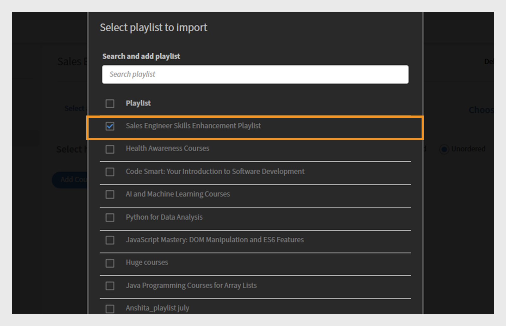
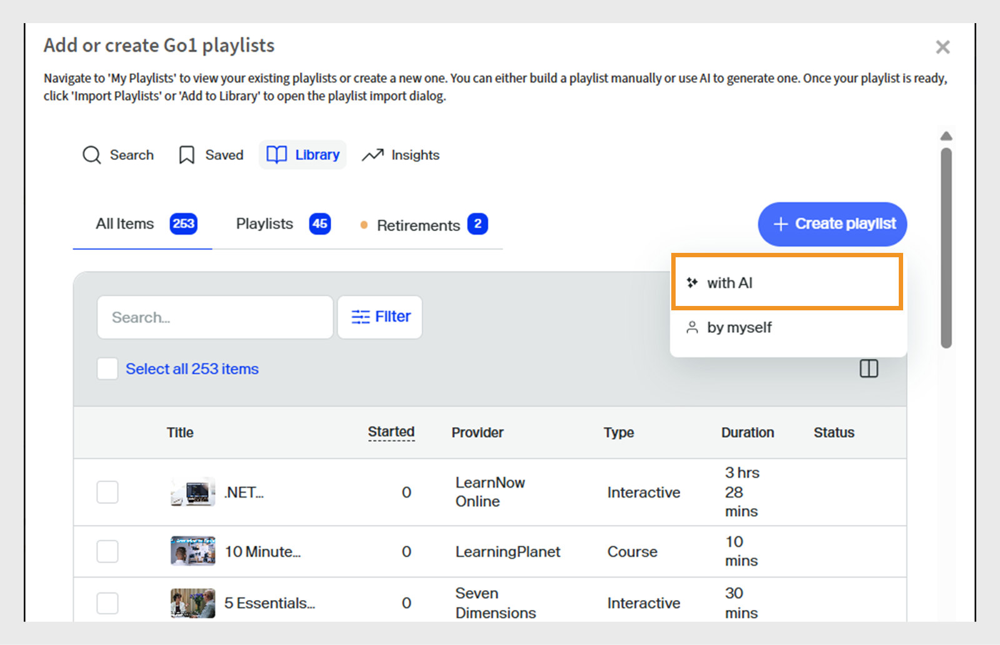
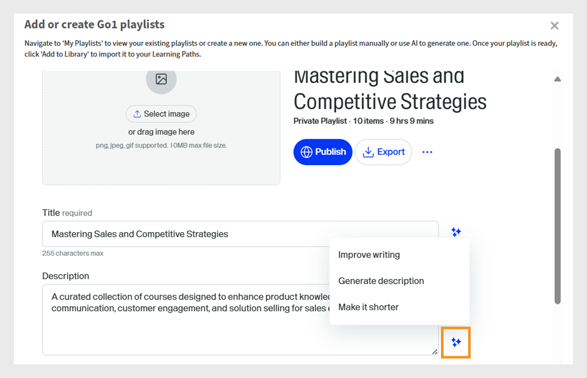
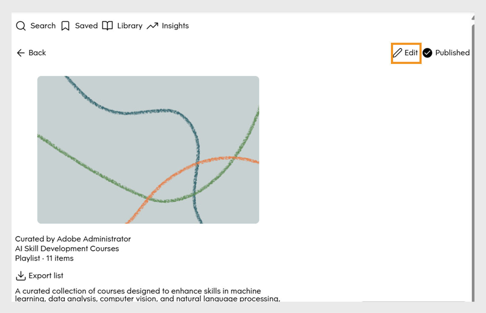
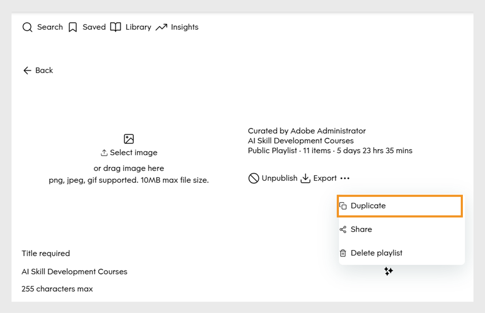
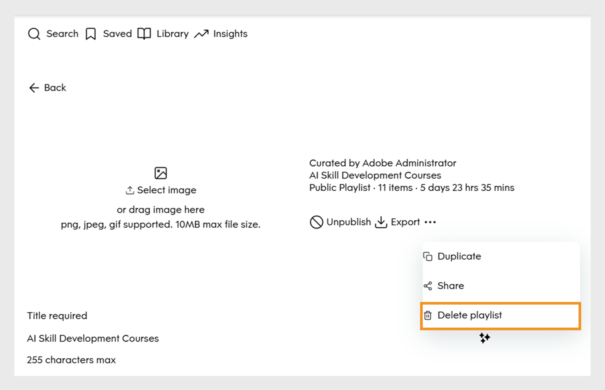

# Curate Go1 courses to a Learning Path

Administrators often need to curate courses from multiple repositories or catalogs, which makes it hard to identify the best options. This is especially challenging with Go1, where thousands of courses are available. To simplify this, we provide an AI-powered curation feature directly within the Learning Path creation flow. This helps admins quickly discover and select the most relevant courses

Add Go1 courses directly to Learning Paths and certifications. Create Learning Paths that include a Go1 courses, so learners can access selected Go1 courses as part of their training.

>[!INFO]
>
>You need an active Go1 license to add Go1 courses to Learning Paths or certifications. View this [article](/help/migrated/administrators/feature-summary/content-marketplace.md) to learn more about Go1 license details.

## Create a Learning Path

To create a Learning Path with Go1 courses:

1. Log in to Adobe Learning Manager as an administrator.
2. Select **[!UICONTROL Learning Paths]** in the left navigation pane. 
3. Select **[!UICONTROL Add]**. 

   
   _Select Add in the Learning Paths section to create and organize new structured training programs for your learners_

4. Type the required details and select **[!UICONTROL Save]**. View this [article](/help/migrated/administrators/feature-summary/learning-paths.md) for more information. 
5. You can add courses to a learning path in the following ways:

   * **[!UICONTROL Add Courses or Learning Paths]**: Add existing courses or Learning Paths available in Adobe Learning Manager.
   * **[!UICONTROL Curate content from Go1]**: Add courses from the Go1 platform.
6. Select **[!UICONTROL Curate content from Go1]**.

   
   _Add Go1 courses to your Sales Engineers Skill Development Playlist to expand learning options with curated third-party content_
7. Administrators can create a playlist in the following ways:
   
   * Using **[!UICONTROL Go1 AI Assistant]**. View [Go1 AI Assistant](/help/migrated/administrators/feature-summary/content-marketplace/curate-go1-playlist.md#go1-ai-assistant) for more information.
   * In the **[!UICONTROL Library]**, select **[!UICONTROL Create playlist]** and choose from one of the following:
      a. **[!UICONTROL with AI]**: Create a Playlist with the help of AI. View this [section](/help/migrated/administrators/feature-summary/content-marketplace/curate-go1-playlist.md#create-a-playlist-with-ai) for more information. 
      b. **[!UICONTROL by myself]**: Create a Playlist by manually adding courses to it. View this [section](/help/migrated/administrators/feature-summary/content-marketplace//curate-go1-playlist.md#create-a-playlist-manually) for more information.

### Go1 AI Assistant

Adobe Learning Manager offers AI-powered assistance to make course curation easier for administrators. With the AI Assistant available on the Content Hub page, administrators can ask questions, get personalized recommendations, and instantly create playlists. In addition, AI support is integrated into the Learning Path creation flow, helping admins quickly identify the most relevant courses from large catalogs such as Go1. These capabilities streamline the curation process, save time, and ensure learners receive the best content.

To create a Playlist with AI:

1. Select **[!UICONTROL Chat with AI]** option on the Go1 Content Hub.
   
   
   _Content Hub screen displaying the Chat with AI option, where administrators can interact with the AI Assistant to ask questions_

2. Type the question and select **[!UICONTROL Send]**. 

   
   _AI Assistant screen where administrators can type their questions, get course recommendations, and instantly create a playlist tailored to their needs_
3. Select the skills and then select **[!UICONTROL Compile into one list]**.

   
   _AI Assistant screen displaying the relevant skills to select and compile into playlist_
4. Select **[!UICONTROL Convert to Playlist]**.

   
   _AI Assistant screen displaying the Convert to Playlist option to compile all the courses into playlist_

5. Select **[!UICONTROL View Playlist]**. 

   
   _AI Assistant screen displaying the View Playlist option to publish and import the playlist into Learning Path_

6. Select **[!UICONTROL Publish]** to create the Playlist. You can create additional Playlists in Go1 and add them to a Learning Path. 
7. Select **Yes** in the confirmation prompt.
8. Select the Playlist from the **[!UICONTROL Select playlist to import prompt]**. 

    
    _Select and import the Sales Engineer Skills Enhancement Playlist from the Go1 Library in Adobe Learning Manager_

9. Select **[!UICONTROL Add Playlists to Learning Path]** and then **[!UICONTROL Publish]**. 

The courses in the Playlist will be added to the Learning Path. Administrators can then enroll learners, who can immediately begin taking the courses.

### Create a Playlist with AI

Administrators can type the Playlist description in the AI prompt. The AI will curate the related courses and create a playlist based on the requirements. AI generates Playlist by interpreting the learning goal or prompt provided by the user. When creating a playlist, admins can select to curate content 'with AI' which allows the system to use large language models to understand the specified learning objectives and content preferences like duration and type. The AI then searches the content library for relevant learning objects that match these criteria.

1. Select **[!UICONTROL Create playlist]** and then select **[!UICONTROL with AI]**.
   
   
   _Create curated Playlists with AI, which enables automated course recommendations tailored to learner needs_

2. Type a short description about your Playlist in the **[!UICONTROL Enter your learning goal]** text field. For example, _Create a curated learning Playlist for sales engineers focused on enhancing product knowledge, technical communication, customer engagement, and solution selling_.
   
   
   _Type your learning goal to create a custom Playlist, helping Adobe Learning Manager recommend targeted courses tailored to your learners' needs_

3. Select **[!UICONTROL Next]**. The prompt displays the required skills, course duration, and course type for selection.
4. Select the required skills.
   
   
   _Choose the skills from the list to curate the courses for the Sales Engineer_

5. Select the course duration and type for your Playlist.
   
   _Choose the duration and type of courses to curate the courses for the Sales Engineer_

6. Select **[!UICONTROL Generate playlist]**. The Playlist is created with 10 courses across 2 pages, and administrators can use it to create a Learning Path.
   
   
   _Review your curated Sales Engineer Skills Enhancement Playlist in Adobe Learning Manager_

7. Browse and add an image to the Playlist by selecting **[!UICONTROL Select Image]**.
8. Change the title using the available AI options:

   * **[!UICONTROL Improve writing]**: Refine the existing title to make it clearer.
   * **[!UICONTROL Generate title]**: Create a new title based on the content or context automatically.

   
   _Go1 Playlist creation screen with AI options to enhance the Playlist title_

9. Change the description using the available AI options:
   * **[!UICONTROL Improve writing]**: Refine the existing description to make it clearer.
   * **[!UICONTROL Generate description]**: Create a new description based on the content or context automatically.
   * **[!UICONTROL  Make it shorter]**: Shorten the text or title while keeping the main idea.

   
   _Go1 Playlist creation screen with AI options to enhance the Playlist description_

10. Select **[!UICONTROL Add item]** to add more courses to the Playlist. 

11. Select **[!UICONTROL Publish]** to create the Playlist. You can create additional Playlists in Go1 and add them to a Learning Path. 
12. Select **Yes** in the confirmation prompt.
13. Select the Playlist from the **[!UICONTROL Select playlist to import prompt]**. 

    
    _Select and import the Sales Engineer Skills Enhancement Playlist from the Go1 Library in Adobe Learning Manager_

14. Select **[!UICONTROL Add Playlists to Learning Path]** and then **[!UICONTROL Publish]**. 

The courses in the Playlist will be added to the Learning Path. Administrators can then enroll learners, who can immediately begin taking the courses.

>[!NOTE]
>
>Administrators can also create playlists directly from the Content Hub page. View [Content Hub](/help/migrated/administrators/feature-summary/content-marketplace.md#content-hub) for more information. 

## Create a playlist manually

Manually select courses that best match learners' requirements and curate additional relevant courses.

To create a Playlist manually:

1. Select **[!UICONTROL Create playlist]** and then select **[!UICONTROL by myself]**.
   
   
   _Manually create a Playlist giving administrators full control to curate courses based on specific learner needs_

2. Browse and add an image to the Playlist by selecting **[!UICONTROL Select Image]**.
3. Type the title and description of your Playlist.
 
   
   _Add a title and description to your Playlist in Adobe Learning Manager to clearly define its purpose and help guide learners toward targeted skill development_

4. Select **[!UICONTROL Create]**. 
5. Select **[!UICONTROL Add item]** to add the related courses. 
   
   
   _Add items to your Sales Engineers Skill Development Playlist in Adobe Learning Manager to curate targeted courses_

6. Search and select the required courses. 
7. Select **[!UICONTROL Publish]**. The Playlist has been created with related courses.
8. Select **Yes** in the confirmation prompt.
9. Select the Playlist from the **[!UICONTROL Select playlist to import prompt]**. 
10. Select **[!UICONTROL Add Playlists to Learning Path]** and then **[!UICONTROL Publish]**. 

The courses in the Playlist will be added to the Learning Path. Administrators can then enroll learners, who can immediately begin taking the courses.

## Manage Go1 playlists

Administrators can manage created Go1 Playlists by duplicating, sharing, or deleting them.

### Duplicate the Playlist

To duplicate the Playlist:

1. Log in to Adobe Learning Manager as an administrator.
2. Select **[!UICONTROL Content Marketplace]**.
3. Select **[!UICONTROL Content Hub]** and then select **[!UICONTROL Library]**.
4. Select the Playlist and then select **[!UICONTROL Edit]**.
   
   _Go1 playlist screen showing options to edit the Playlist_
5. Select the ellipsis and then select **[!UICONTROL Duplicate]**.
   
   _Playlist management screen, highlighting Duplicate option_

The selected Playlist will be duplicated and added to the Go1 content library 

### Delete the Playlist

To delete the Playlist:

1. Log in to Adobe Learning Manager as an administrator.
2. Select **[!UICONTROL Content Marketplace]**.
3. Select **[!UICONTROL Content Hub]** and then select **[!UICONTROL Library]**.
4. Select the Playlist and then select **[!UICONTROL Edit]**.
   
   _Go1 Playlist screen showing options to edit the Playlist
5. Select the ellipsis and then select **[!UICONTROL Delete playlist]**.
   
   _Playlist management screen, highlighting Delete Playlist option_

The selected Playlist will be deleted from the Go1 library. 

## Course limit exceeded

When adding Go1 courses to a Learning Path, administrators may see an error if the newly added courses have not yet been synced to Adobe Learning Manager. These courses will be available within 48 to 72 hours.

If you add the playlist now, only the courses that are already synced will be included.

To include all courses, it is recommended to wait until the sync is complete before adding the playlist to a Learning Path.

## Go1 courses in certifications

Administrators can add Go1 courses in certification programs within Adobe Learning Manager. While creating a certification, administrators can search and select courses from the Go1 content catalog. All Go1 courses imported through the Go1 plan are available for selection within the certification workflow.

Certifications that include Go1 courses can be configured as either perpetual or recurring. In the case of recurring certifications, the certificate automatically renews after the defined time interval, allowing learners to retake the Go1 courses and maintain their certification status.