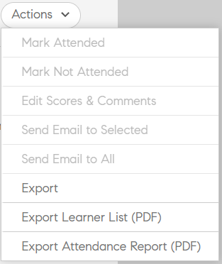

# Create course modules, instances, and learning programs

Learning Manager Learning Programs are renamed to Learning Paths. This change happens immediately after the October 2021 release and the terminology of Learning Path is reflected for all roles.

This document consists of Help to create course modules, instances and courses for Administrator role.

Authors create courses. Learners can take up the courses and Administrators can track the performance of learners based on course consumption.

## Overview {#overview}

Authors create courses. Learners then take the courses and Administrators can track the performance of learners based on course consumption. Administrators can view the courses created by authors and perform some activities as explained in this section. As an administrator, you can create unique learning programs with a predefined set of courses for learners.

## Create instance of a course {#createinstanceofacourse}

After an author has created a course, you can create instances of the course. By creating Instances of a course, you can offer the same course to your learners at different time periods. Learners can choose any instance and enroll. You can configure each instance to have its own set of badges, feedback, and other settings.

To create an instance,

1. On the Administrator web app, click **Courses** on the left pane.
1. On the list of courses, choose the required course, and click **View Course**.

   

1. To create instances, click **Instances** on the left pane. Every course has an instance by default. You can either modify the default instance or add instances. You cannot delete this course instance.
1. To create an instance, click **Add New Instance** on the upper-right corner of the course information. A new instance of the course is displayed.
1. Enter the properties of the instance:

   * In the **Instance Name** field, enter the name of the instance you want to associate with the course. Ensure that you use a unique name for the instance.
   * Specify the completion deadline for the instance. Learners must achieve course completion status by this date.
   * Click **Show More Options** to display other deadline options.
   * **Enrollment Deadline:** This is the date by which a learner is expected to enroll into a learning object in case of self-enrollment.
   * **Unenrollment deadline:** You can choose to restrict unenrollment by learner himself by having an unenrollment deadline.

   An Administrator can decide to have completion deadlines for a course or learning program based on requirements. However, it is recommended to have one for Classroom/Virtual classroom-based trainings.

   

## View properties of the instance {#viewpropertiesoftheinstance}

1. **Modules:** The number of modules created by the author of the course
1. **Learners Enrolled:** The number of learners that were enrolled in the course by the Administrator.
1. **Sessions:** The number of Virtual Classroom and Classroom modules in the course.
1. **Feedback Enabled:** Displays whether L1, L2, and L3 feedbacks are enabled for this course.

## Retire an instance {#retireaninstance}

To retire an instance, perform the steps below;

1. On the instance, click the drop-down menu and choose the option **Retire instance**.

   

1. To search for all retired instances, click the tab **Retired** on the Instances page.

## Restore an instance {#restoreaninstance}

To restore a retired instance to an activate state, perform the following steps:

1. On the instance, click the drop-down menu and choose the option **Reopen instance**.

   

1. The instance now gets restored to an active mode.

## Send instance-level emails

To send instance-level emails to enrolled learners:

1. On the Instances page, select the options on any instance, and then click **[!UICONTROL Email Enrolled Learners]**.

1. On the Create Announcement dialog, select Type as Email. Specify the subject, type the message, and click Save. The training is selected automatically.

   

   *Create announcement as email*

1. After you click **[!UICONTROL Save]**, you see a confirmation message for the successful creation of the announcement. To publish the announcement, click **[!UICONTROL Publish Now]**.

   

### Enroll learners in various instances

1. Select a course from the list of courses.
1. Select **[!UICONTROL Learners]** on the left panel.
1. Select **[!UICONTROL Enroll]**.

   

1. In the [!UICONTROL **Enroll Learners**] dialog, you can:

   * Select an instance to enroll a learner from the Select Instance dropdown.
   * Select the user or user groups or both in the Include Learners field.
   * Select the learners you want to be excluded from the instance in the Exclude Learners field.
   * At the bottom of the dialog, select Yes if you want a learner or learners enrolled in the selected instance.

1. Select **[!UICONTROL Proceed]**.

   

### View enrollment report of an instance

1. Select a course from the list of courses.
1. Select **[!UICONTROL Learners]** on the left panel.
1. Select **[!UICONTROL Actions]** > **[!UICONTROL Export]**.

The Excel file contains worksheets for each instance. A worksheet consists of the fields:

* Learners
* Email
* User Unique ID
* Course Name
* LO Unique ID
* Status
* Selection Criteria
* Enrollment Date / Unenrollment Date (UTC TimeZone)
* Completion Date (UTC TimeZone)
* Due Date (UTC TimeZone)
* Started Date (UTC TimeZone)
* Quiz Score
* Manager Name
* Address
* userState
* Area of Expertise
* Comments
* Number of Visits
* Visit Dates
* Timestamps (UTC TimeZone)
* Time Spent (mins)

>[!NOTE]
>
>Note: Enabling Multi-Enrollment results in multiple rows being added to the Learner Transcript Report for each course (one row for each instance).
>
>If you've reporting automation set up that anticipates only one row per course, you must make the necessary adjustments to the reporting automation before enabling the Multi-Enrollment feature.

## Set escalation level {#escalation}

For sending the email notifications, an Admin must explicitly choose the escalation level to:

* Manager
* Manager & Skip Level Manager

## Course moderation {#coursemoderation}

Whenever an author adds, updates, or deletes modules and republishes a course, all the administrators receive notification about the same. As an administrator, you can then view the changes, compare the old and new content by clicking on the link, and either approve or reject the changes accordingly.

To enable Course Moderation, click **Settings > General**. Select the **Course Moderation** check-box to enable this feature.

Click on the notification to view the changes the author has made to the course. Then, either approve or reject the changes made by the author. If you choose to approve, the course will be republished. If you reject the updates, the previous version of the course will continue to exist. In either case, a notification is sent to the author.

If there are multiple authors who are updating the same course, the latest or the last performed change will reflect in the administrator's notification. You can then approve or reject the latest changes.

## Add L1 and L3 feedback {#addl1andl3feedback}

You can add L1 and L3 feedback options while you create the courses:

1. Click Courses at the left pane after you log in as Administrator. List of all the courses appears on the right side page.
1. Click the course tile for which you want to add L1 or L3 feedback
1. Click instance default at the left pane.
1. Click the circle on toggle button adjacent to L1 or L3 feedback to enable it.
1. Add the L3 feedback question in the text area below L3 Question.

## Mandatory L1 feedback {#mandatory-l1-feedback}

You can make all questions or the first question mandatory in an L1 feedback. 

Now, you can create the questions, which now become mandatory.

If the two mandatory questions, for some reason, doesn't have any text, the questions will not appear in the feedback form.

>[!NOTE]
>
>It is not enough that you enable these settings at the Learning Program instance. You must also enable these settings at the Course Instance level for each course in the Learning Program.

In Instance Defaults page, if you enable **Make All Questions Mandatory**, then all new instances created thereafter will inherit these settings.

## L1 feedback at course level {#l1-feedback-course-level}

In previous versions of Learning Manager, an Administrator could enable L1 feedback for the Learning Program.

In this release of Learning Manager, the Administrator can send L1 feedback for all the courses that are part of the Learning Program. The Administrator must ensure that L1 feedback is enabled for all the courses at the course instance level.

1. To enable L1 feedback for each course, in the Admin app, click **Learning Programs > View Learning Program**.   

1. Click **Instances > L1 Feedback Enabled**.   

1. Enable the option **Enable for Each Course**.

   

   Only enabling this toggle at the Learning Program level will not trigger the L1 feedback for the courses inside this program. For enabling the L1 feedback, go to each course in the Learning Program and enable the L1 Feedback toggle. 

   

   If L1 feedback is enabled for all courses, but is disabled in the learning Program instance, then the L1 feedback will not be triggered for the courses.

## Language specific quiz reports

Quiz reports help in evaluating the performance of a learner post completion of a Learning program or course. 

Learning Manager currently facilitates learning in 13 interface languages and 32 content languages. Although, this option is learner-friendly and provides convenience in supporting our global learners, it is strenuous for Admins to fetch reports attempted in various locales.

Quiz reports, display data in different languages provided the course is being offered in multiple languages. Until now, reports generated by Admin displayed responses one below the other irrespective of the language in which the quiz was attempted. **For example**, If a user has taken a quiz in Dutch, Admin will only be able to view those quiz reports attempted by users in Dutch at a time. The Admin who has selected English as an interface language, was unable to view reports for all users at once irrespective of the locale attempted in.

This is now rectified as the Admin is now able to view all the reports in the respective language which the learner attempted all at once, regardless of the content locale chosen. Quiz attempted in different languages will be added as additional columns in the quiz report.

## Enable L1 feedback at account level {#l1-feedback-account-level}

An Admin will be able to enable L1 feedback for newly created courses and Learning Program by turning on this setting at account level. However, turning on this setting doesn't impact the existing courses and Learning Programs

If enabled, all new trainings and new instances will have the feedback enabled by default. In case an author/admin visits the instance, instance defaults and switches it off manually, then it gets honored.

To enable L1 feedback, in the Admin app, click **Settings > Feedback**.

Click **Edit** on the upper-right corner and toggle the option to enable L1 feedback.

When an author creates a course, on the Instance page of the Admin app, the **L1 feedback is automatically enabled** for the new course.

You can also disable the L1 feedback by toggling the **Enable** option, as shown below:

## Add descriptive questions for L1 and L3 feeedback {#descriptive}

As part of Learning Manager November release, an option to add descriptive questions has been provided. Administrators have an option to add these questions to learners. This provision is in addition to the default set of questions provided by Learning Manager. You can also make them mandatory if required by choosing the option below the question. 

You can add two descriptive questions for L1 feedback and one descriptive question for L3 feedback. 

Once you enable L1 feedback, you can view the options as shown in the following snapshot. 

If you want the questionnaire to appear to the learner immediately after course completion, you can choose the option accordingly.

A sample output of the L1 questionnaire is provided below for your reference. Learners can view the questionnaire in the below format. Test-1 and Test-2 are the descriptive questions. 

Once you enable the L3 feedback, you can view the options as shown in the below snapshot: 

Question 2 is the descriptive question for L3 feedback. You can make it mandatory by clicking the option accordingly below the question. 

A sample output of the L3 questionnaire is provided below for your reference. Learners can view the questionnaire in the below format. 

## Set up L1 and L3 feedback questionnaire {#setupl1andl3feedbackquestionnaire}

You can set up L1 and L3 feedback questionnaire and also set reminders at the account level. 

1. Click **Settings** and then **Feedback** on the left pane after you log in as Administrator.  
   Feedback settings page appears with two tabs:** L1 Feedback** and **L3 Feedback**.  
   **L1 Feedback** tab consists of a list of default **L1 feedback** questionnaire for class room and self-paced courses along with reminder settings. In **L3 Feedback** tab, you can view L3 feedback default statement and reminder settings.

1. Click Edit on the upper-right corner of the page, to modify the existing questionnaire.  
   In **L1 Feedback** tab, you can enable/disable each question by clicking the Yes/No toggle button.  
   In **L3 Feedback** tab, you can modify the default feedback statement.  
   Click **Add New Reminder** at the bottom of the page and choose when to send the reminders.

1. Click **Save** at the upper-right corner of the page.

In L1 feedback, you can see two sets of questionnaire along with a default question. First set of questionnaire refers to self paced courses which can also be used for activity based courses. Second set of questionnaire can be used for Class room and virtual class room type of courses.

## Export checklist data {#export-checklist-data}

From the list of courses, open a course that contains a checklist. On the left pane, you will see an option **Checklist**.

Click the option and on the course page, perform the following:

1. Select the instance and the module.
1. Click **Actions > Export**, and then export the learner checklist report.

On the **Checklist **page, an Instructor can export the checklist report from the **Actions **drop-down list.

The CSV report contains the following fields:

* User name
* User email
* Manager name and email
* Training name
* Training instance
* Instructor name and email
* Submitted on
* Evaluation Status
* Questions-with actual text
* User State
* Profile
* Active Field(s)

When you download a report after selecting a status filter, the downloaded Learner Transcript report will contain the learner data based on the status filter applied. This added filter will also be displayed to Custom Admin and Manager when they are about to generate a Learner Transcript.

## Viewing courses {#viewingcourses}

As an administrator, you can view a list of all available courses.   Click **Courses **on the left pane to view the list of courses with search and filter options. You can also view the course effectiveness percentage for each course on the course thumbnails.

>[!NOTE]
>
>You can retire a course after the course is consumed by learners or when you want to hold up any particular course after publishing it. You can retire a course only when it is in a published state. List of all the retired courses can be viewed by clicking the **Retired** tab.

## View quiz scores {#viewquizscores}

1. Click course name on the course thumbnail.
1. Click Quiz Score on the left pane.

You can view the quiz scores of any particular course based on user name or based on each question. Choose By User or By Question tabs accordingly.

Choose the instance type from the drop-down list to view the scores based on each instance of the course.

## Manage learners list for a course {#managelearnerslistforacourse}

1. Click course name on the course thumbnail.
1. From the left pane, click Learners.

You can perform the following actions from the Learners page:

* Select the Learner you want to remove, and click Actions > Remove.
* Select the Learner whose attendance you want to mark, and click Actions > Mark Complete.

To allow learners to reset a module and consume the module again, click Reset. From the pop-up dialog box, click Yes to confirm the Reset. Modules that have been completed cannot be reset. Only failed or incomplete modules can be reset.

You can also export the learners list in an excel sheet. To export the learners list, click Actions > Export.

>[!NOTE]
>
>If there are multiple instances for a course, the learners list in excel is provided in each tab separately. The learners list consists of learner name, status and selection criteria. Learners status can be **Not started**, or **In progress**, or **Completed**. 

## Export learners' attendance {#attendance}

For any classroom and VC course, you can download the list of learners who have attended this course, for any instance.

On the course details page, click **Attendance and Scoring** on the right pane.

On the top right-corner of the page, click the **Actions** drop-down list. Then click the option **Export Learner List (PDF)**.

On the PDF, you can view the same set of learners as an instructor does.

When you download the PDF, you can see the time zone (in UTC) that was used when creating the course.

## Export learners in pending approval state

An Administrator, Manager, or Custom Admin can export data of learners who are in pending approval enrollment state. You can export the data via **Course > Learner** tab, and click the Action drop-down list.

The option will be present when no learner is enrolled/pending approval to the manager approved course and an empty report will be generated. You can also export when learners are in pending approval state, enrolled state, pending state, and unenrolled state.

The report contains data of active, deleted, and suspended users if they are pending approval. Also the report contains data of internal and external users, who are in pending approval state.

If a learner who was earlier in pending approval state, unenrolls, then his/her record will not be present in the report. Also if a learner who was earlier in pending approval state, is enrolled to the course by admin/manager/custom admin enrollment, then his/her record is present in the report.

## View L1 and L3 feedback {#viewl1andl3feedback}

You can view the L1 feedback provided by learners for a course and the L3 feedback provided by Managers for learners.

1. Click any course tile in the Courses list.
1. Click L1 Feedback or L3 Feedback on the left pane to view the feedback received.
1. Select the instance from the drop-down list to view the feedback for that particular instance.

## Preview courses {#previewcourses}

Administrator can preview courses by clicking the **Preview as learner** option while viewing the course modules.

1. Click **Courses** on the left pane after you log in as an administrator.
1. Click any course tile from the list of courses on the page.
1. Click Preview as learner from the left pane and click the module name on the page to preview the course module in the player.

## Course effectiveness {#courseeffectiveness}

Course effectiveness is evaluated to understand the usefulness of a course to the learner. It is a combination of results from learner feedback on the course content, the course quiz results for a learner and the manager's feedback evaluating a learner based on learnings from the course.

Administrator can view the course effectiveness rating on the course thumbnails as shown in the below snapshot. You can see the rating for this course as 100.

The course effectiveness rating value is arrived considering L1, L2 & L3 feedback values. To view the breakup of each feedback, click the course effectiveness value. A pop-up appears as shown below.

In this sample snapshot, 1 out 1 users received all the three feedbacks, hence the score is 100/100. From this table, you can understand that if any of the three feedbacks (L1, L2 and L3 )are not provided for a course, there is a negative impact on the overall effectiveness. Click the down-arrow at the lower-right corner of the pop-up to view how course effectiveness calculations are done.

As per the pie-chart shown above, more weightage is given to L3 feedback from manager.

## Searching courses and learning programs {#searchingcoursesandlearningprograms}

Adobe Learning Manager makes it easier for you to find the courses/learning programs of your choice quickly. You can search for your courses in two ways:

1. Using Search field. Click search icon displayed at the upper-right corner. A search field appears. Type the course name or any keywords associated with your courses to locate your courses/learning programs. You can also search using predefined tags like Captivate, C, Java, and HTML. Tags are searchable inside Search field, which means the tags are displayed in search field as you type.
1. By filtering list of courses/learning programs using the filters. You can filter the courses by state such as All, published, draft, and Retired. In Administrator mode, draft filter does not appear.

You can search based on competencies by clicking Competencies and choosing them. As an admin you can sort the courses in four ways, to better locate your required course. Click Sort By and choose alphabetical ascending order, alphabetical descending order, course updated date, or effectiveness of courses:

You can sort learning programs in three ways: alphabetical ascending order, alphabetical descending order and based on updated date.

## Enrolling learners {#enrollinglearners}

You can follow the same steps to enroll learners into course, learning program and certifications. Managers can also enroll learners under him using the following steps.

Administrator enrolls some learners to mandatory courses as per organization requirements:

1. Hover your mouse on any published course tiles and click Enroll learners.  
   Alternatively, click any published course tile and click learners on the left pane. A page appears with a list of learners. Click Enroll.  
   Enroll learners dialog appears.

1. Select the instance from the select instance drop-down. The drop-down lists all instances including active, retired, and expired instances.

>[!NOTE] 
>
>Admin can remove any registered learners of a course by clicking the drop-down arrow on learners page and by clicking **Actions** > **Remove**.

## Users

+++Include learners

Select the user groups and individual learners (using email id or name) that you wish to include. Add all user groups in an intersection under the same set. To add another user group in union, use a new inclusion set.

+++

+++Exclude learners

Select the user groups and individual learners (using email id or name) that you wish to exclude. Add all user groups in an intersection under the same set. To add another user group in a union, use a new inclusion set.

+++

## User Email ID

+++Email ID

Copy-paste Email IDs of Learners you want to enroll, separated by semi-colons, commas or line spacing. Use the **[!UICONTROL Validate Email Ids]** option to validate the entries. All invalid entries would appear marked in red. Remove or correct those entries and proceed by clicking on **[!UICONTROL Proceed.]**

The summary dialog box appears with the number of users from inclusion set, exclusion set and users already enrolled in the course instance.

+++

### Add comments while enrolling learners {#enroll-comments}

As an Administrator or a Manager, you can add comments while enrolling learners in a course. You can mention additional information about the cohort of users who are getting enrolled. This data gets exported in course reports.

The comment is **not** displayed to the learner.

When an Administrator generates the course report of the learner, any comment, if added, appears in the report. The summary dialog box appears with the number of users from inclusion set, exclusion set and users already enrolled in the course instance.

On the **Enroll Learners** dialog, expand the option **Advanced Options**. In the **Additional Comment** field, enter the required comment. 

## Search for enrolled users {#searchforusers}

Search for enrolled users on the Learning Object's Learner section using type-ahead search. Using type-ahead search, you can progressively search for enrolled users using name, email id, and uuid.

This type of search is also sometimes known as auto-complete, incremental search, search-as-you-type, inline search, or instant search.

As you type for a learner or a user group in the search field, one or more matches for the search term(s) are found and immediately presented to you.

The process allows you to find what you are looking for in a much faster and less cumbersome way than executing a number of searches in a row.

Learners or user groups across all instances display after a search. For every learner, the instance in which the learner is enrolled displays in the Instance column.

Using type-ahead look up, you can:

* View all users, irrespective of instances, who are enrolled.
* View all user groups that have one or more enrolled users.

After a search is executed, you cannot filter learners by instances. The option to select an instance from the **Select Instance** drop-down list is disabled.

In addition, using the search results, you can choose a learner or user group, and perform the following actions: 

* Unenroll
* Mark completion
* Reset module

While performing a search,  the option Unenroll > Bulk in the  Actions drop-down list is disabled for the  Course/Learning Program.

## Share QR code with learners to enroll, complete or both {#shareqrcodewithlearnerstoenrollcompleteorboth}

Administrators in Adobe Learning Manager can share the QR codes with learners to quickly enroll into the course. The three different QR codes are used to mark the 'enrollment', 'completion' or 'enrollment & completion' of a course.

Learners can simply use the Adobe Learning Manager device app to scan the respective QR code.

**To download the QR code, do the following**:

1. Click **Courses** from Learning section in the left navigation panel.
1. Select a course > **view course**.
1. Click **Instances** > **More** > **QR code**.

   

1. Enable QR code and then click the 'Enroll', 'Complete', and 'Enroll and Complete' download icons to download a pdf containing the QR code for each. The admin can then share the QR code with learners.

   

## Course life cycle {#courselifecycle}

A typical course life cycle looks as follows:

**Draft** - When an author completes creating a course and saving it. At this state, course is not available yet for learners. You can delete a course at this state.

**Published** - When an author completes publishing a course. At this state, the course is available for learners to enroll.

**Retired** -  After publishing a course, an author can move it to a retired state if he doesn't want the course to appear in course catalog for learners. You can re-publish or delete a course at this state.

**Deleted** -  A course under deleted state is when it is removed completely from the Adobe Learning Manager application. Courses can be deleted by authors only when they are in draft state. You can also delete courses from retired state. 

## Notification settings {#notificationsettings}

As an Administrator you can adjust the notification settings. For more information, see [Notifications.](user-notifications.md)

## Frequently Asked Questions {#frequentlyaskedquestions}

**1 - How to reset module as an Admin?**

On the Learners page for a course, choose the learner or learners or a group, click **Actions** > **Reset Modules**.

After you click the option, the status of modules of all selected learners will be reset. The modules that are completed will not be reset.

**2 - How to add course URL so that learners are redirected directly to course?**

Mouse over on a course card and click **Copy URL**. After you copy the URL, learners can access the course directly with the URL.

**3 - How to reopen an instance?**

To reopen a retired instance, click the drop-down menu in the instance, and click **Reopen instance**.
