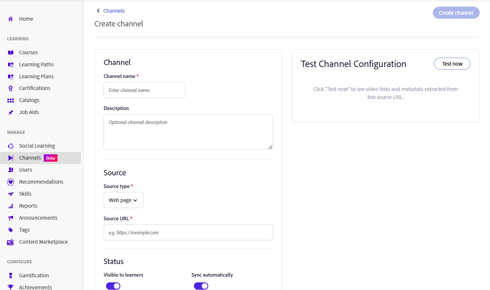
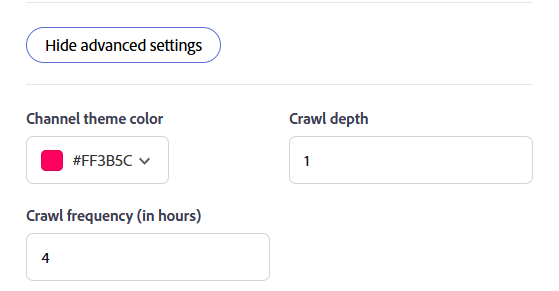
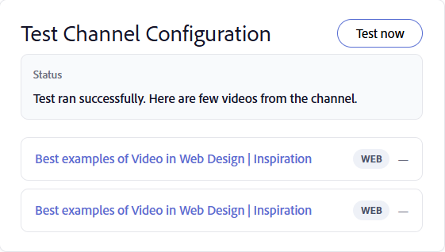

# Create Channels

Organizations often store knowledge-sharing sessions, training recordings, and other video content across informal learning content curated web and Confluence Cloud pages. Channels connect Adobe Learning Manager to these content sources, making videos easier to discover and consume without requiring learners to navigate multiple systems. Channels help you organize and share video-based learning content from enterprise web pages and Confluence Cloud pages in a single, searchable location. Instead of searching across multiple internal sites, learners can discover and access relevant recordings directly from Adobe Learning Manager. View [Discover and engage with Channels](../../learners/feature-summary/discover-and-engage-with-channels.md) for more information.

As an Administrator, you can create and manage channels, configure visibility settings, synchronize content with its source, and verify that videos are available before making the channel accessible to learners. This article explains how to perform these channel management
tasks.

**Key benefits**

- Consolidate video-based learning content from multiple internal sources in one location.
- Curate video content from multiple intranet locations into web pages, which are then displayed as Channels in ALM.
- Enable learners to find, play, and engage with content without navigating to multiple sites.
- Keep content synchronized with its original source.

## Enable Channels

Channels is a feature that Administrators turn on for the account. Once enabled, you can create channels that connect to enterprise web pages and to Cloud Confluence pages containing video content.

The channel crawler reliably extracts videos from source pages that present their content in the following formats:

- Tables
- Bulleted lists
- Articles

To enable the Channels feature:

1. Log in to Adobe Learning Manager as an Administrator.

1. Select **Channels** from the left navigation.
     The **Channels** page opens.

1. Select the **Settings** tab.

   

   *Enable the Channel feature in the **Settings** tab to let Administrators create channels for the account.*

1. Enable **Channel feature**.

     The channels are enabled for the account.

## Create a Channel

Create a channel to define the content source that Adobe Learning Manager scans for videos, and customize the channel and video page appearance.

1. Navigate to the **Channels** tab and select **Add channel**.
     The **Create channel** page opens.

   

   *Define the content source and configure visibility and sync options when creating a channel.*

1. In the **Channel** section, enter the **Channel name** and **Description**.

1. Select a **Source type** from the drop-down menu. The following options are available:

   1. **Web page**: Select this option to crawl a web page and import video links along with their associated metadata.

   1. **Confluence page**: Select this option to retrieve video links and metadata from a Confluence Cloud page. To connect to Confluence Cloud, provide the following details:
      - **Atlassian email address**: Enter the email address associated with your Atlassian account.
      - **Atlassian API token**: Enter the API token generated from your Atlassian account. Select **How to create an API token** for instructions on generating one. This token is used for authentication when crawling the source and is stored encrypted.

      

      *Enter the Atlassian email address and API token used to authenticate with Confluence Cloud.*

1. Enter the **Source URL** of the selected source type content.

1. In the **Status** section, configure the following options:

   1. **Visible to Learners**: Enable this option to make the channel available to learners. Disable it to hide the channel while you continue configuring or testing it.

   1. **Sync automatically**: Enable this option to automatically update the channel when new videos are added to the source. Disable it if you want to manually sync the channel.

1. (Optional) Select **Show advanced settings**, and then configure the following options as required:

   1. **Channel theme color**: Select a color to customize the visual appearance of the channel.

   1. **Crawl depth**: Enter the crawl depth for linked pages to scan for video content. It supports a maximum crawl depth of **2**.

   1. **Crawl frequency (in hours)**: Enter how often Adobe Learning Manager should check the source for new or updated content.

      

      *Select Show advanced settings to configure the channel theme color, crawl depth, and crawl frequency.*

1. Select **Test now** to validate the source. The sample videos are retrieved and displayed from the configured source.

   

   *Use **Test now** to confirm videos are retrieved from the source before you create the channel.*

1. Select **Create channel**. The channel is created and added to the **Channels** list.

## Edit a Channel

You can edit an existing channel to update its configuration and settings.

To edit a channel:

1. Select the required channel from the **Channels** list.
     The **Edit channel** page opens and displays the current channel configuration.

1. Update the channel settings as needed.

   

   *Update a channel's name, description, source, and settings from the **Edit channel** page.*

1. (Optional) Select **Test now**.

1. Select **Save changes**.
     The updated channel settings are saved.
