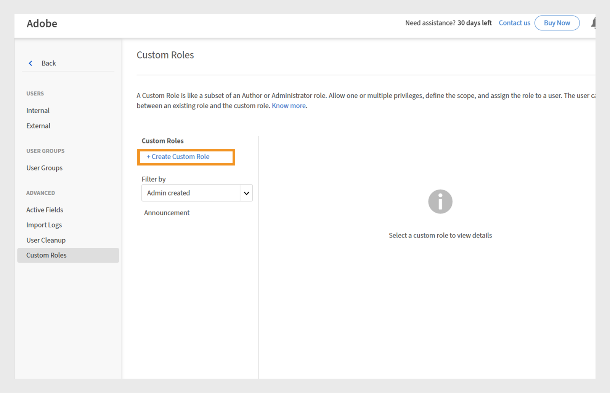

# Custom role with scoped announcement permissions

Administrators can create custom roles with announcement permissions restricted to specific catalogs and user groups. This ensures that announcements are targeted, relevant, and only visible to the intended learners. Scoped announcements ensure that the right users receive relevant announcement without sending details to others.

## Create a custom role with a specific scope

The administrator can create a custom role with announcement permissions limited to a specific catalog and user group.

To create a custom role with a specific scope:

1. Log in to Adobe Learning Manager as an administrator.
2. Select **[!UICONTROL Users]** in the left navigation pane.

    
    _Assign custom roles to users for targeted permissions and responsibilities in Adobe Learning Manager_

3. Select Custom Roles.
4. Select Create Custom Role.

    
   _Assign custom roles to users to customize permissions and streamline administrative control for specific user groups or catalogs_

5. Type the name and description of the custom role.
6. Select Announcement under Account Privileges.

    
    _Enable announcement permissions under Account Privileges to allow custom administrators to manage targeted communications within scope_

7. Select Set access per Catalog under Scope for Feature Privileges and select the catalog.
8. In the same section, choose Set access per User Group and select the required
user group.

    
    _Set user group and catalog scopes to ensure custom administrators can manage permissions and access only within their assigned scopes_

9. Select and add the user you want to assign this custom role. The assigned users can create an announcement for their scope.

A custom administrator can create announcements limited to their assigned user groups and catalogs, ensuring messages reach the right audience and preventing unnecessary notifications. For Notification and Email announcements, administrators can add extra user groups, but only users within the defined scope will receive them. For Recommendation and Masthead announcements, you can only select user groups within the assigned scope.

## Create announcement for the assigned scope

A custom administrator can create announcements limited to their assigned user groups and catalogs, ensuring messages reach the right audience and preventing unnecessary notifications.

To create an announcement for the assigned scope:

1. Log in to Adobe Learning Manager as a custom administrator.
2. Select **[!UICONTROL Announcement]** in the left navigation pane.
3. Select **[!UICONTROL Add]**. 
   
   
   _Announcements page in Adobe Learning Manager, where administrators can create and manage announcements for targeted user groups_

4. Select the **[!UICONTROL Announcement Type]** from the dropdown menu.
        a. **[!UICONTROL As Notification]**
        b. **[!UICONTROL As Masthead]**
        c. **[!UICONTROL As Recommendation]**
        d. **[!UICONTROL As Email]**
5. Select **[!UICONTROL As Masthead]**. 
6. Select the language and upload an image for the masthead. 
7. Optionally, add a URL for the action button. 
   
   
   _Create Announcement screen allowing administrators to set announcement type, upload attachments, and add action buttons_

    The assigned scope is pre-selected in the **[!UICONTROL Scope]** section and cannot be modified by custom administrators.
    
    >[!NOTE]
    >
    >**[!UICONTROL For Notification]** and **[!UICONTROL Email]** announcements, they can include additional user groups and catalogs if these overlap with their assigned scope.

8. Select **[!UICONTROL Save]**.

Only learners within the custom administrator's scope will be able to view the announcement. See this [article](/help/migrated/administrators/feature-summary/announcements.md) to learn how to create multiple types of announcements. 

## Reset the scope by custom administrators

Custom administrators can reset the scope of their published announcements if an administrator has changed the scope of them. Once the scope is reset, the updated scope will be applied to the announcement, and only learners within the new scope will be able to see the announcement.

To reset the scope:

1. Log in to Adobe Learning Manager as a custom administrator.
2. Select **[!UICONTROL Announcement]** in the left navigation pane.
3. Select **[!UICONTROL Published]** tab.
4. Select any announcement and then select setting icon. 
5. Select **[!UICONTROL Edit]**. 

   
   _Announcement screen showing the published announcements with edit, publish and other options_

6. Select **Reset**. 

   
   _Announcement showing a scope change notification, with an option for custom administrators to reset and update the scope selection to reflect new access permissions_

The scope will be updated, and only users within the updated scope will be able to view the announcement.

## Edit the announcement through administrator UI

Administrators can edit and manage all announcements created by custom admins. If an administrator tries to edit an announcement created by a custom administrator with a specific scope, a warning message will appear on the announcement stating **[!UICONTROL Remove]** scope. The administrator can remove the scope to make the announcement available to everyone. In this case, the custom administrator will receive a warning that the announcement's scope has been changed.

To edit the announcement through administrator UI:

1. Log in to Adobe Learning Manager as an administrator.
2. Select **[!UICONTROL Announcement]** in the left navigation pane.
3. Select **[!UICONTROL Published]** tab.
4. Select any announcement and then select setting icon.
5. Select **[!UICONTROL Edit]**. 

   
   _Announcement screen showing the published announcements with edit, publish and other options_

6. Select **[!UICONTROL Remove]**. 
   
   
   _Announcement screen indicating that scope must be removed to allow administrators to edit announcements created for scoped user groups_

Administrator can edit the announcement after removing the scope.
