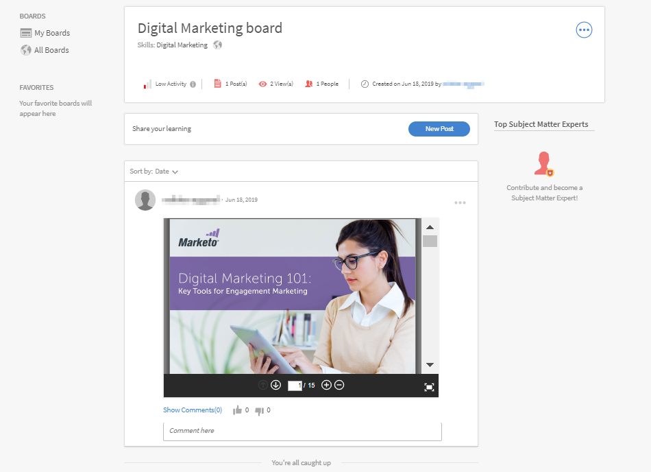

# Map skill with skill domains {#map-skill-with-skill-domains}

To auto curate a post that is posted by a user by the AI-enabled Curation Engine for a particular skill domain, the user's enterprise must have their customized skills to be mapped to the supported skill domains present in the Prime LMS.

While creating a skill, an Administrator can map it with the most relevant skill domains that Learning Manager supports. This will further be considered in Auto Curation process. Learning Manager LMS lists the following skills:

* Supply chain management
* Accounting
* Scientific research and engineering
* Computer security
* Strategic management
* Social media
* Medicine
* Finance
* Workplace safety
* Soft skills
* Business law
* Management
* Human resource management
* Technical communication
* Business ethics
* Customer relationship management
* Information technology
* Production and manufacturing
* Marketing
* Quality management
* Business process
* Learning
* Design
* Analytics
* Sales

To add a skill domain, follow the steps below:

1. On the left pane of the Administrator app, click **Skills**.
1. To add a skill, click **Add** on the top right of the page.
1. In the **Add Skill** dialog, add a skill and a description of the skill.
1. In the **Skill Domain** section, add the skill domains. As you enter a domain, the domains get added. These domains are populated from the list mentioned above.

   

1. To save the changes, click **Save**.

When a user posts a content in a board, the content gets curated and is approved or rejected, depending on the confidence score against the mapped skill to the board.

Depending on whether the content being uploaded has a confidence score of more than 50%, the content gets uploaded in the board. If your content meets the criteria, then you get to see a notification that says that the content has been successfully curated and is now available in the board.

