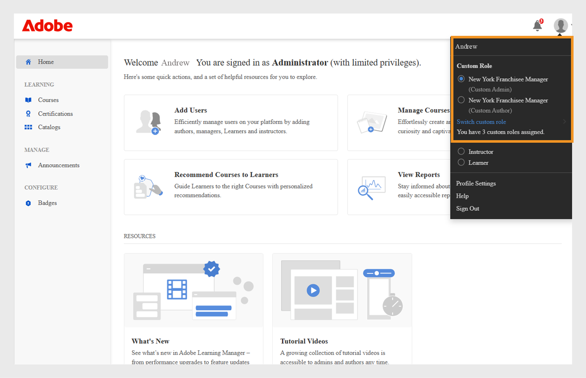
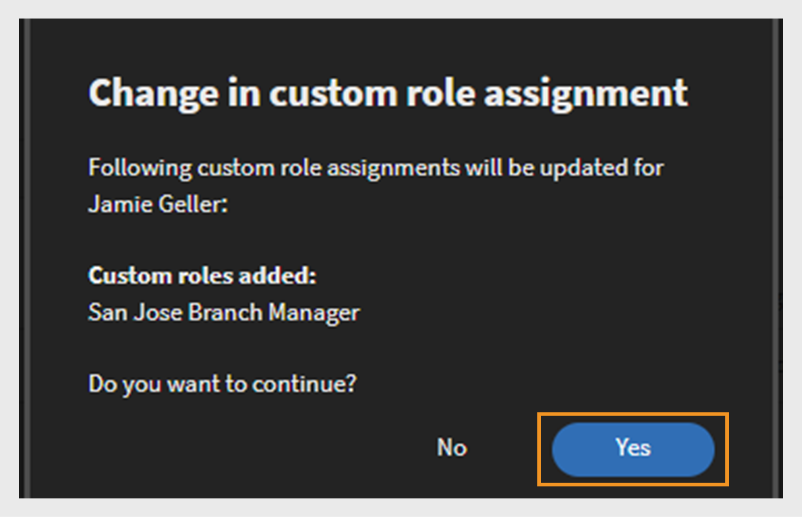
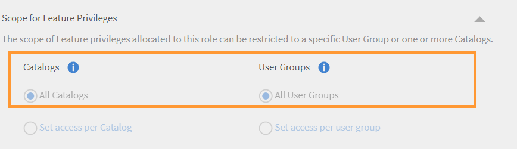

# Custom roles

This feature helps you define custom roles and assign specific responsibilities to set of users. This feature enables you to assign responsibilities outside the purview of the individual's existing role.

You can create a custom role to provide authoring capabilities limited to a particular catalog. You can also create a role dedicated to manage reporting. Such roles can then be assigned to individuals who are supposed to take up these specific responsibilities.

>[!NOTE]
>
>Adding a new custom role will not affect existing custom user groups or any role-based groups such as All Admins, All Authors, etc.

Admins have the ability to create custom admin and custom author roles with tailored permissions for each role. Below is an overview of the permissions associated with each role:

**Custom Author Role Permissions**

Custom authors can perform the following tasks:

* Access the content library to add, edit, or delete core content.
* Create, edit, and delete:
   * Courses
   * Job aids
   * Certifications
   * Learning paths
   * Learning plans

Admins and authors, including custom admins and custom authors, will have the ability to share learning objects (LOs) to externally shared catalogs. Admins and authors should be able to search for externally shared catalogs while creating learning objects (LOs).

**Custom administrator Role Permissions**

The custom admin role replicates a set of admin responsibilities, including access to account-level privileges. Custom admins are granted permissions for managing key features related to learning activities, such as:

* Learning plans
* Catalogs
* Reports
* Tags

In addition, custom admins can:

* Manage courses and job aids, including enrolling and deleting users.
* Create, edit, and delete certifications, learning paths, and learning plans.
* Access reporting and enrollment features for all learning objects (LOs).

Admins can now view CSV-created permissions within Adobe Learning Manager. The filter by option filters custom roles by admin created and those imported via a CSV. After you select a custom role, you can see its permissions.
 

_Filter custom roles_

## Create a custom role {#create-role}

1. Log in as an Administrator. Open **[!UICONTROL Users]** > **[!UICONTROL Custom Role]**.
2. Select **[!UICONTROL Create Role]**. The **[!UICONTROL Create New Role]** tab opens.

   

   *Create a custom role*

3. Enter the name in the **[!UICONTROL Name of the Role]** field.
4. **[!UICONTROL Account privileges]**: These privileges give the role owners access to specific system configuration aspects and which act on the entire account. Choose the access permissions. The user gets full control over assigned permissions. 

   Admins can grant detailed permissions for the User section, which has Internal/External Users, User Groups, and Advanced users.

   >[!NOTE]
   >
   >   Scope is not applicable on these privileges.

   

   *Set the scope*

5. **Feature privileges - Core features**: Used to grant access to specific features for managing learning activities. Permissions to the following features can be given using this option. 

   Admins can provide detailed permissions like read-only, create, edit, and delete permissions for the Catalogs.

   * Catalogs
   * Reports
   * Tags

   

   *Set scope for Catalogs, Reports, and Tags*

6. **Feature privileges- Learning Objects:**  Use this option to provide access to LOs related features. Admins can provide detailed permissions for all learning objects, including courses, learning paths, certifications, and job aids. They can assign users permissions like create, edit, delete, or read-only access.

   * Certifications
   * Courses
   * Job Aids
   * Learning Programs

   You can also grant specific operation control for the learning objects. The permission can be one of the following:

   * Read only
   * Create
   * Edit
   * Delete
   * Enrollment
   * Report

   You can also grant full control for the LOs. 

   

   *Grant specific permissions*

7. **Scope for feature privileges:** The scope of Feature privileges allocated to this role can be restricted to a specific User Group or one or more Catalogs.

   Catalogs: Use the radio button to provide control over **[!UICONTROL All catalogs]** or use the **[!UICONTROL Set access per Catalog]** option to provide access to specific catalogs. You can also select multiple catalogs.

   User Groups: Provide access to **[!UICONTROL All User Groups]** or use the **[!UICONTROL Set access per user group]** option to provide access to specific user groups. Only a single user group can be specified.

   >[!NOTE]
   >
   >If you have selected Announcement, Gamification, Email Templates, Skills, and Users under Account Privileges, the User Group access is provided to all user groups by default and this option is disabled.

   If you have selected Learning Plans under Account Privileges, access to all Catalogs and User Groups is provided by default and these options under Scope is disabled. 

   

   *Define scope of privileges*

>[!NOTE]
>
>   In Learning Manager 27.6, you can create a custom role to be scoped over multiple catalogs with each catalog being granted different set of permissions.

   To grant various permissions to the catalogs, follow the steps below:

   1. Click the option **[!UICONTROL Set access per Catalog]**.
   1. Choose the catalogs and you can see the level of permission for each catalog. The permissions are as follows:

      <table>
        <tbody>
        <tr>
          <td>
          
<b>Permission</b>
</td>
          <td>
          
<b>Description</b>
</td>
        </tr>
        <tr>
          <td>
          
Full Control
</td>
          <td>
          
Grants Full Control on all Learning Objects. Permissions include Add, Edit, Delete, Read, Enroll, and Report. 
</td>
        </tr>
        <tr>
          <td>
          
Report
</td>
          <td>
          
Grants access to the Reports tab only of the Learning Object.
</td>
        </tr>
        <tr>
          <td>
          
Enroll
</td>
          <td>
          
Grants permission to only enroll for the Learning Object.
</td>
        </tr>
        <tr>
          <td>
          
Read Only
</td>
          <td>
          
Grants permission to only view the Learning Objects in the Catalog.
</td>
        </tr>
        </tbody>
      </table>

   1. Enable or disable the permissions according to your requirements.
   1. To save the changes, click **[!UICONTROL OK]**. Then, to save the changes for the Custom Role, click **[!UICONTROL Save]**.

   For example, consider the following scenario.

   The resultant permission, a custom user would have on a Learning Object, is an intersection of the Learning Object Permission and Catalog Permission.

   A custom user has Full Permission on Courses and only Read Only access on Catalog A but Full Permission on Catalog B. The results are a Read Only access on the courses of Catalog A and Full Control over the courses of Catalog B.

   A user with a Custom Role can:

* Only view content from the catalogs he/she has access to.
* Access any Learning Object based on the permissions of the Catalog the Learning Object is a part of.

   As an Administrator, you can:

* Choose more than one catalog for a Custom Role.
* Modify the permissions of a catalog any time.
* Remove the catalogs from a scope to which you no longer want to grant permissions.
* Implicitly grant Read Only permission to a catalog, when you grant permissions to the catalog.

   The table below illustrates how permissions are granted.

   <table>
    <tbody>
     <tr>
      <td>
       
<strong> </strong>
</td>
      <td>
       
<strong>Catalog Level Permission</strong>
</td>
     </tr>
     <tr>
      <td>
       
<strong>Learning Object- Level Permission</strong>

       
<strong>(Ex: Courses)</strong>
</td>
      <td>
       
Full Control
</td>
      <td>
       
Enrol
</td>
      <td>
       
Report
</td>
      <td>
       
Read Only
</td>
     </tr>
     <tr>
      <td>
       
Full Control
</td>
      <td>
       
Full Control
</td>
      <td>
       
Enrol
</td>
      <td>
       
Report
</td>
      <td>
       
Read Only
</td>
     </tr>
     <tr>
      <td>
       
Enrol
</td>
      <td>
       
Enrol
</td>
      <td>
       
Enrol
</td>
      <td>
       
Read Only
</td>
      <td>
       
Read Only
</td>
     </tr>
     <tr>
      <td>
       
Edit &amp; Delete
</td>
      <td>
       
Edit &amp; Delete
</td>
      <td>
       
Read Only
</td>
      <td>
       
Read Only
</td>
      <td>
       
Read Only
</td>
     </tr>
     <tr>
      <td>
       
Report
</td>
      <td>
       
Report
</td>
      <td>
       
Read Only
</td>
      <td>
       
Report
</td>
      <td>
       
Read Only
</td>
     </tr>
    </tbody>
   </table>
   
1. **Users:** Use this option to determine which users are assigned this role. You can choose one or more users using the search box.

   **Add users to custom role CSV upload:** To add users via CSV uploaded, add a CustomRole column to the .csv file that the Administrator used to import users. Enter the role of the user under the CustomRole column for the users to whom you wish to assign a custom role. To upload the CSV file, click  **[!UICONTROL Add > Upload a CSV]**.

   * You cannot search User Groups.
   * You cannot search users who already have administrator role assigned to them.
   * Assigning a new custom role to a user overrides user's previous custom role.

   <!---->

   * A custom admin having permission to  Settings will be able to configure the schedule for sync or sync users from Data-source even if they don't have permission to the Users entity.
   * If a custom admin has permission on the Users entity, they can assign administrator role to themselves and become a standard administrator.

## Assign multiple custom roles to a user

Admins can assign more than one custom role to a single user. This feature is especially helpful for large organizations, allowing roles to be reassigned to existing custom admin users when custom admins move to other teams or leave the organization.

Custom roles have clear names in the user interface, so it's easier to know which role you're using. Custom admins can see their assigned roles in the profile section (top right corner) and switch between roles easily. 

 
_Switch custom roles_

To view and select any custom roles assigned to you, use the **[!UICONTROL Switch custom role]** option.  

_Select custom roles_

Users receive email notifications when the custom roles are assigned to them. The emails now includes role names for better clarity.

>[!NOTE]
>
>You can add up to 50 roles per user and 500 users per role.

To assign multiple custom roles to a user, follow these steps:

1. Log in as an admin and select **[!UICONTROL Users]**.
2. Select **[!UICONTROL Custom Roles]** on the left panel.
3. Create a new custom role and add account privileges, catalogs, learning objects, or scopes. Refer the steps mentioned [here](#create-a-custom-role). 
4. Add users to the custom role.
  
    
   _Assign users to a custom roles_

5. Select Save.

In a same way you can assign multiple roles to a same user. For each custom role assignment, the number of available roles decreases. A user can be assigned up to 50 custom roles.

After assigning the same users to another custom role, you can view the remaining number of custom roles available for those users.

### Manage custom roles

After you assign custom roles to users, you can add or remove custom roles from the **[!UICONTROL Users]** page.

1. Search for a user on the **[!UICONTROL Users]** page.
 
   
   _Search for a user in Users page_

2. Select the drop down near the user and select **[!UICONTROL Manage custom roles]**.

   
   _Select Manage custom roles in user page_

3. A dialog appears that displays the list of custom roles assigned to the user. Select **[!UICONTROL Add/remove roles]** to add or remove custom roles assigned to the user.

   
   _Select Add/Remove roles in Manage Custom Roles prompt_

4. Search for other custom roles to be assigned to the user. After you locate one, select the custom role. 
 
   
   _Select the custom role_

5. Select **[!UICONTROL Save]**. A confirmation dialog for the change in the custom role appears. Select **[!UICONTROL Yes]**.
 
   
   _Select yes in the confirmation prompt_

A third custom role is assigned to the user.

To remove the custom roles, follow these steps:

1. Search for a user on the **[!UICONTROL Users]** page.
2. Select the dropdown near the user and select **[!UICONTROL Manage custom roles]**.
3. Select **[!UICONTROL Add/remove roles]** to add or remove custom roles.
4. Select the **[!UICONTROL remove icon]** to delete the custom role.
 
   
   _Remove custom roles_

>[!NOTE]
>
>Custom admins cannot manage custom roles (add or remove custom role) or promote themselves to the administrator role.

## Custom role report

Admins can download a CSV report of all custom roles and their permissions. The report shows how each role was created, either by an admin or through a CSV file, and outlines the highlights the access given to each role.

To download the report, follow these steps:

1. Log in as an **[!UICONTROL Admin]**.
2. Select **[!UICONTROL Users]** > **[!UICONTROL Custom Roles]**.
3. Select the **[!UICONTROL Download]** option to download the CSV report. 
   
  
  _Download report of custom roles_

The report has two CSV files: role.csv and user_role.csv. The role.csv file includes:

* Custom role
* User IDs
* Source of creation. 

The user_role.csv file includes the fields, Custom role, Source of creation and detailed information for Catalogs, Users, Courses, Learning Paths, and more.

## Audit trail for custom roles

Admins can download the custom role audit report to tracks all changes made to the custom roles, including creating, modifying, and deleting custom roles and their associated feature access. 

Refer this article [Audit trail for custom roles](/help/migrated/administrators/feature-summary/reports.md#audit-trail-for-custom-roles) for more information.

## Restrict folder access for custom authors {#folder-custom-author}

Learning Manager already supports an ability to give access to content Library using custom roles. All custom authors who already have access to the content library, will continue to have access to all content files even after content folders are configured. This is to maintain the legacy behavior. Administrators need not make any changes in case they wish to continue to current behavior.  

In case they wish to restrict access to these custom authors, Administrators need to edit the existing custom role and configure them by providing access to only specific content folders. 

*Restrict folder access for custom authors*

While creating a custom author, you can now assign content folders to the author. Choose the option **Selected Folders**.

After you click the option, a new dialog opens, where you can assign the folders to the custom author.

*Select the folders for the custom author*

Choose the folders and click **[!UICONTROL OK]**. 

## Learning Summary Dashboard for Custom administrator {#custom-admin-dashboard}

Custom admins can see the same view as what an administrator sees. A custom admin may data outside his scope. This is only applicable if the custom admin has full scope. To grant full scope, while creating a custom admin, enable the option **[!UICONTROL Full Control]** in Account Summary Report.

*Create a custom role*

As a result, the options, **[!UICONTROL All Catalogs]** and **[!UICONTROL All User Groups]** will get selected and the rest disabled.

*Define scope of privileges*

## Implicit permissions {#implicitpermissions}

When a user is given a role with a specific entity, there might be cases where they need access to other entities as well to be able to perform tasks on the granted entity. For Instance, if a user is given Create access on Course entity, they need access to Skill and Tag entities so that they can associate them with the course being created. This tables gives you information of such implicit permissions.

<table>
 <tbody>
  <tr>
   <th>Access Type</th>
   <th>Entity Permission granted by admin</th>
   <th>Implicit Entity Permission</th>
   <th>Implicit Access</th>
  </tr>
  <tr>
   <td>Manage</td>
   <td>User</td>
   <td>Group</td>
   <td>Crud</td>
  </tr>
  <tr>
   <td>Enroll</td>
   <td>All los (course, job aid, learning program, certification)</td>
   <td>User 
     Learning plan</td>
   <td>Read</td>
  </tr>
  <tr>
   <td>Create</td>
   <td>
    
Content group 
      Job aid 
</td>
   <td>Tag</td>
   <td>Read</td>
  </tr>
  <tr>
   <td>Create</td>
   <td>Course</td>
   <td>Content group 
     Tag 
     Skill 
     Badge 
     Job aid</td>
   <td>Read on all</td>
  </tr>
  <tr>
   <td>Create</td>
   <td>Learning program 
     Certification </td>
   <td>Course 
     Tag 
     Skill 
     Badge</td>
   <td>Read</td>
  </tr>
  <tr>
   <td>Create</td>
   <td>Learning plan</td>
   <td>Catalog 
     Group 
     Skill 
     All los (course, job aid, learning program, certification)</td>
   <td>Read</td>
  </tr>
  <tr>
   <td>Create</td>
   <td>Announcement</td>
   <td>User 
     Group 
     All los (course, job aid, learning program, certification)</td>
   <td>Read</td>
  </tr>
  <tr>
   <td>Create</td>
   <td>Gamification</td>
   <td>Branding</td>
   <td>Write</td>
  </tr>
  <tr>
   <td>*</td>
   <td>User</td>
   <td>Billing</td>
   <td>Read</td>
  </tr>
  <tr>
   <td>*</td>
   <td>Catalog</td>
   <td>Group 
     All los (course, job aid, learning program, certification)</td>
   <td>Read</td>
  </tr>
  <tr>
   <td>*</td>
   <td>Setting</td>
   <td>Branding 
     User</td>
   <td>Read</td>
  </tr>
  <tr>
   <td>*</td>
   <td>Branding</td>
   <td>Setting</td>
   <td>Read</td>
  </tr>
  <tr>
   <td>*</td>
   <td>Billing 
     Gamification</td>
   <td>User</td>
   <td>Read</td>
  </tr>
 </tbody>
</table>

## Access a custom role {#accessacustomrole}

When an Administrator assigns a custom role, you receive an email notification. 

Note: If you are already logged in to Learning Manager under a custom role, you would require to relogin to Learning Manager to access the new role.

To switch between roles, click your profile icon on the upper-right corner of Learning Manager and select the role.

## Learning plans scoped by configurable roles {#scopeconfigure}

In earlier versions of Learning Manager, any Custom Role with permission to create learning plans could scope the learning plan for all types of user groups and Learning Objects.

The scope setting used to be disabled when learning plan access was granted, which gave the user access to All Catalogs and All User Groups by default.

All learning plans created by an administrator, by default, are applicable to all users. Users can also be assigned any Learning Object. On the other hand, users with Custom Roles have access to full scopes, for example, all catalogs, Learning Objects, or User Groups. This meant that admins were unable to create Custom Roles as expected that allowed access to Learning Plans for users with limited scope.

In this update of Learning Manager, you can create Custom Roles for Learning Plans that allow scoping of users and Learning Objects. In other words, Learning Plans can be created with a limited scope that is derived from a custom admin's role scope.

Now, an administrator can define or restrict the scope while granting learning plan management access.

Custom admins can create learning plans with a limited scope, determined by the scope of the custom admin's configurable role. Such learning plans are only accessible to custom admins with the same role, besides being accessible to regular admins. In addition, the custom admins cannot see any other Learning Plans in the account.

Existing custom admins, having access to Learning Plans, will always have full scope (by definition). They will have access to all learning plans in the account just like a regular admins do. New custom roles created with full scope and new custom admins added to such roles, will continue to have access to all learning plans.

Learning plans created by administrator and full scope custom admins will be created as usual and will not be limited by scope.

In the section **Scope for Feature Privileges**, grant access to User Groups and/or Catalog for the Custom Role.

*Grant  access to User Groups and/or Catalog for the Custom Role*

Assign a user to the Custom Role.

*Assign a user to a Custom Role*

The user now logs in to Learning Manager as Custom administrator and now adds a Learning Plan.

When a new learner is added, the Custom administrator can select a training from the configurable role's scoped catalogs only.

This learning plan is now applicable to the learner only if the user is also added to the group within the learning plan's scoped user group. All other learners get exempted from this learning plan.

## Learner gets added to the group {#learnergetsaddedtothegroup}

<!---->

The custom admin can select any user group that has users from within the role's scoped user group.

When a user is added to the specified group, only users that are already part of the learning plan's scoped user group and got added to the specified user group will be assigned the Learning Object.

## Change in scope {#changeinscope}

When the administrator changes the scope of the custom role, the change also cascades to the Custom administrator. When the Custom administrator chooses a Learning Plan that was already scoped by a previous custom role, a message is displayed, as shown below:

*Message after scope changes*

The Custom administrator now must update or refresh the earlier scope to the new scope.

Clicking **[!UICONTROL Refresh Scope]** updates the scope. There is a warning message that displays.

*Warning message after refreshing a scope*

Clicking **[!UICONTROL Yes]** updates the scope.

## Add gamification report to a custom role {#gamification-custom}

An administrator can enable gamification reports for a custom user.

1. In the **[!UICONTROL Custom Roles]** page, enter the name of the custom role.
1. In the **[!UICONTROL Feature Privileges: Core Features]** section,  enable the option **[!UICONTROL Full Control]** for the category **[!UICONTROL Reports]**.  

1. In the section **[!UICONTROL Users]**, select the user that will be assigned the newly created custom role.
1. Click **[!UICONTROL Save]**.

When a user logs in as Custom administrator and clicks **[!UICONTROL Reports]** on the left pane, the transcripts appear, as shown below:

*Download the gamification transcripts*

Click **[!UICONTROL Gamification Transcripts]**, choose a user, and generate the report.

If an Administrator changes the level points, the reports show levels according to the current points.

Resetting gamification does not reset the level achieved date.

## Frequently Asked Questions {#frequentlyaskedquestions}

+++How to create a Custom Role?

A Custom Role is like a subset of an Author or Administrator role. Allow one or multiple privileges, define the scope, and assign the role to a user.

Click **[!UICONTROL Users]** > **[!UICONTROL Custom Roles]**. In the Custom Roles page, click **[!UICONTROL Create Role]**. Enter the name of the custom role and set the privileges for the role. For more information, see [Create a custom role](custom-role.md#create-role).
+++

