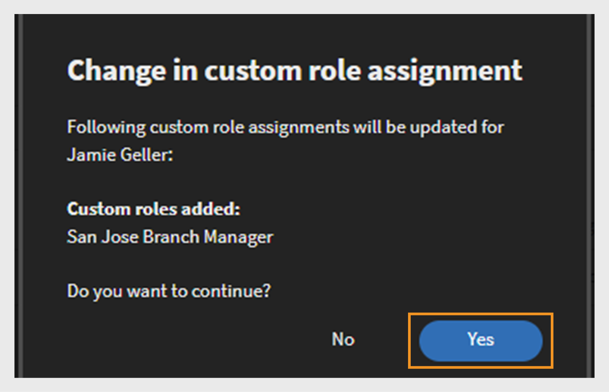
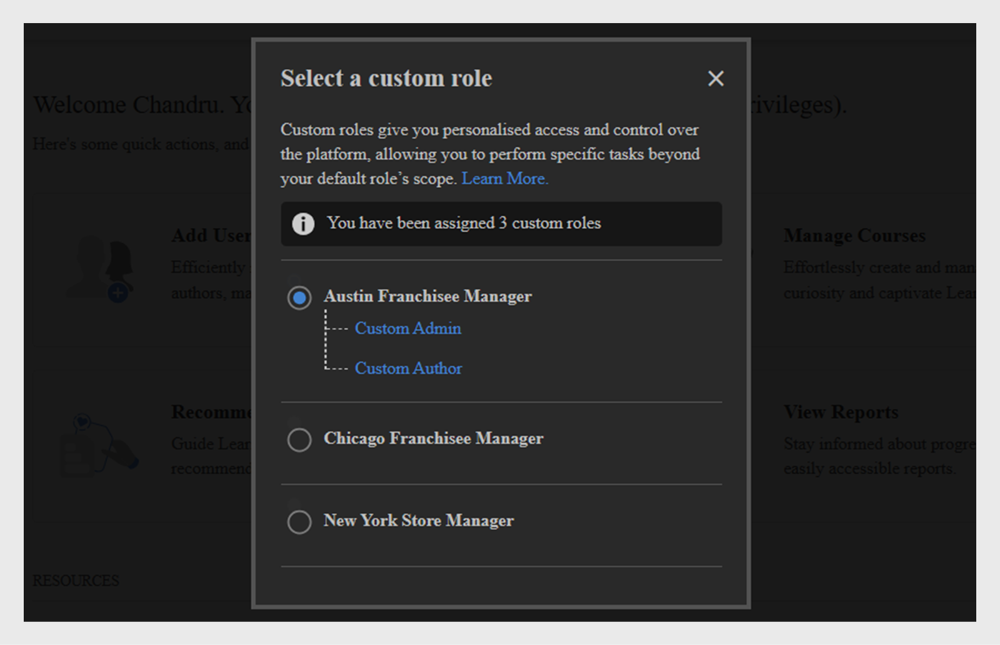
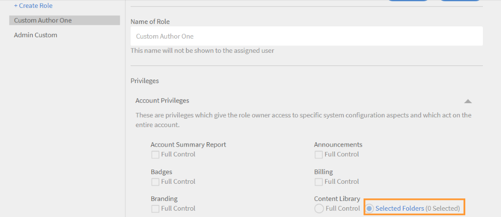
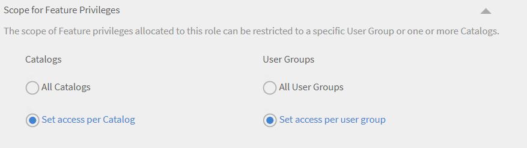
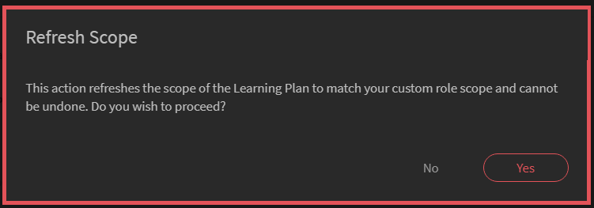

# Custom roles

This feature helps you define custom roles and assign specific responsibilities to set of users. This feature enables you to assign responsibilities outside the purview of the individual's existing role.

Adobe Learning Manager allows full administrators to delegate custom role management responsibilities to trusted custom administrators, including creating, editing, and assigning custom roles, without giving them full administrator credentials. This capability allows custom admins to manage other roles without overburdening admins with duties. This is controlled through the **Advanced** permission level under the **Users** section of a custom role definition. See [What the Advanced user permission unlocks](#advanced-user) for more information.

Organizations use this capability to delegate routine role management to designated custom administrators. For example, to allow a dedicated team to create and assign publisher or author roles on an ongoing basis, or to allow an operations team to clean up accounts of users who have left the organization. This avoids the need to give those teams full administrator access, which carries broader privileges than their responsibilities require.

You can create a custom role to provide authoring capabilities limited to a particular catalog. You can also create a role dedicated to manage reporting. Such roles can then be assigned to individuals who are supposed to take up these specific responsibilities.

>[!NOTE]
>
>Adding a new custom role will not affect existing custom user groups or any role-based groups such as All Admins, All Authors, etc.

Administrator have the ability to create custom admin and custom author roles with tailored permissions for each role. Below is an overview of the permissions associated with each role:

**Custom Author Role Permissions**

Custom authors can perform the following tasks:

* Access the content library to add, edit, or delete core content.
* Create, edit, and delete:
   * Courses
   * Job aids
   * Certifications
   * Learning paths
   * Learning plans

Administrators and authors, including custom administrators and custom authors, will have the ability to share learning objects (LOs) to externally shared catalogs. Administrators and authors should be able to search for externally shared catalogs while creating learning objects (LOs).

**Custom administrator Role Permissions**

The custom admin role replicates a set of admin responsibilities, including access to account-level privileges. Custom administrators are granted permissions for managing key features related to learning activities, such as:

* Learning plans
* Catalogs
* Reports
* Tags

In addition, custom administrators can:

* Manage courses and job aids, including enrolling and deleting users.
* Create, edit, and delete certifications, learning paths, and learning plans.
* Access reporting and enrollment features for all learning objects (LOs).

Administrators can now view CSV-created permissions within Adobe Learning Manager. The filter by option filters custom roles by admin created and those imported via a CSV. After you select a custom role, you can see its permissions.
 

_Filter custom roles_

## Create a custom role {#create-role}

1. Log in as an administrator. Open **[!UICONTROL Users]** > **[!UICONTROL Custom Role]**.
2. Select **[!UICONTROL Create Role]**. The **[!UICONTROL Create New Role]** tab opens.

   

   *Create a custom role*

3. Enter the name in the **[!UICONTROL Name of the Role]** field.
4. **[!UICONTROL Account privileges]**: These privileges give the role owners access to specific system configuration aspects and which act on the entire account. Choose the access permissions. The user gets full control over assigned permissions. 

   Administrators can grant detailed permissions for the User section, which has Internal/External Users, User Groups, and Advanced users.

   >[!NOTE]
   >
   >   Scope is not applicable on these privileges.

   

   *Set the scope*

5. **Feature privileges - Core features**: Used to grant access to specific features for managing learning activities. Permissions to the following features can be given using this option. 

   Administrators can provide detailed permissions like read-only, create, edit, and delete permissions for the Catalogs.

   * Catalogs
   * Reports
   * Tags

   

   *Set scope for Catalogs, Reports, and Tags*

6. **Feature privileges- Learning Objects:**  Use this option to provide access to LOs related features. Administrators can provide detailed permissions for all learning objects, including courses, learning paths, certifications, and job aids. They can assign users permissions like create, edit, delete, or read-only access.

   * Certifications
   * Courses
   * Job Aids
   * Learning Programs

   You can also grant specific operation control for the learning objects. The permission can be one of the following:

   * Read only
   * Create
   * Edit
   * Delete
   * Enrollment
   * Report

   You can also grant full control for the LOs. 

   

   *Grant specific permissions*

7. **Scope for feature privileges:** The scope of Feature privileges allocated to this role can be restricted to a specific User Group or one or more Catalogs.

   Catalogs: Use the radio button to provide control over **[!UICONTROL All catalogs]** or use the **[!UICONTROL Set access per Catalog]** option to provide access to specific catalogs. You can also select multiple catalogs.

   User Groups: Provide access to **[!UICONTROL All User Groups]** or use the **[!UICONTROL Set access per user group]** option to provide access to specific user groups. Only a single user group can be specified.

   >[!NOTE]
   >
   >If you have selected Announcement, Gamification, Email Templates, Skills, and Users under Account Privileges, the User Group access is provided to all user groups by default and this option is disabled.

   If you have selected Learning Plans under Account Privileges, access to all Catalogs and User Groups is provided by default and these options under Scope is disabled. 

   

   *Define scope of privileges*

>[!NOTE]
>
>   In Learning Manager 27.6, you can create a custom role to be scoped over multiple catalogs with each catalog being granted different set of permissions.

   To grant various permissions to the catalogs, follow the steps below:

   1. Click the option **[!UICONTROL Set access per Catalog]**.
   1. Choose the catalogs and you can see the level of permission for each catalog. The permissions are as follows:

      <table>
        <tbody>
        <tr>
          <td>
          
<b>Permission</b>
</td>
          <td>
          
<b>Description</b>
</td>
        </tr>
        <tr>
          <td>
          
Full Control
</td>
          <td>
          
Grants Full Control on all Learning Objects. Permissions include Add, Edit, Delete, Read, Enroll, and Report. 
</td>
        </tr>
        <tr>
          <td>
          
Report
</td>
          <td>
          
Grants access to the Reports tab only of the Learning Object.
</td>
        </tr>
        <tr>
          <td>
          
Enroll
</td>
          <td>
          
Grants permission to only enroll for the Learning Object.
</td>
        </tr>
        <tr>
          <td>
          
Read Only
</td>
          <td>
          
Grants permission to only view the Learning Objects in the Catalog.
</td>
        </tr>
        </tbody>
      </table>

   1. Enable or disable the permissions according to your requirements.
   1. To save the changes, click **[!UICONTROL OK]**. Then, to save the changes for the Custom Role, click **[!UICONTROL Save]**.

   For example, consider the following scenario.

   The resultant permission, a custom user would have on a Learning Object, is an intersection of the Learning Object Permission and Catalog Permission.

   A custom user has Full Permission on Courses and only Read Only access on Catalog A but Full Permission on Catalog B. The results are a Read Only access on the courses of Catalog A and Full Control over the courses of Catalog B.

   A user with a Custom Role can:

* Only view content from the catalogs he/she has access to.
* Access any Learning Object based on the permissions of the Catalog the Learning Object is a part of.

   As an administrator, you can:

* Choose more than one catalog for a Custom Role.
* Modify the permissions of a catalog any time.
* Remove the catalogs from a scope to which you no longer want to grant permissions.
* Implicitly grant Read Only permission to a catalog, when you grant permissions to the catalog.

   The table below illustrates how permissions are granted.

   <table>
    <tbody>
     <tr>
      <td>
       
<strong> </strong>
</td>
      <td>
       
<strong>Catalog Level Permission</strong>
</td>
     </tr>
     <tr>
      <td>
       
<strong>Learning Object- Level Permission</strong>

       
<strong>(Ex: Courses)</strong>
</td>
      <td>
       
Full Control
</td>
      <td>
       
Enrol
</td>
      <td>
       
Report
</td>
      <td>
       
Read Only
</td>
     </tr>
     <tr>
      <td>
       
Full Control
</td>
      <td>
       
Full Control
</td>
      <td>
       
Enrol
</td>
      <td>
       
Report
</td>
      <td>
       
Read Only
</td>
     </tr>
     <tr>
      <td>
       
Enrol
</td>
      <td>
       
Enrol
</td>
      <td>
       
Enrol
</td>
      <td>
       
Read Only
</td>
      <td>
       
Read Only
</td>
     </tr>
     <tr>
      <td>
       
Edit &amp; Delete
</td>
      <td>
       
Edit &amp; Delete
</td>
      <td>
       
Read Only
</td>
      <td>
       
Read Only
</td>
      <td>
       
Read Only
</td>
     </tr>
     <tr>
      <td>
       
Report
</td>
      <td>
       
Report
</td>
      <td>
       
Read Only
</td>
      <td>
       
Report
</td>
      <td>
       
Read Only
</td>
     </tr>
    </tbody>
   </table>
   
1. **Users:** Use this option to determine which users are assigned this role. You can choose one or more users using the search box.

   **Add users to custom role CSV upload:** To add users via CSV uploaded, add a CustomRole column to the .csv file that the Administrator used to import users. Enter the role of the user under the CustomRole column for the users to whom you wish to assign a custom role. To upload the CSV file, click  **[!UICONTROL Add > Upload a CSV]**.

   * You cannot search User Groups.
   * You cannot search users who already have administrator role assigned to them.
   * Assigning a new custom role to a user overrides user's previous custom role.

   <!---->

   * A custom admin having permission to  Settings will be able to configure the schedule for sync or sync users from Data-source even if they don't have permission to the Users entity.
   * If a custom admin has permission on the Users entity, they can assign administrator role to themselves and become a standard administrator.

## What the Advanced user permission unlocks {#whatadvanceduserpermissionunlocks}

When a full administrator enables **Advanced** access under **Users** in a custom role, the custom administrator gains access to four additional sections: **Custom Roles**, **Import Logs**, **Active Fields**, and **User Cleanup**.

Two access levels are available:

* **Read Only**: the custom administrator can view information and download reports, but cannot make changes.
* **Full Control**: the custom administrator can create, edit, and delete custom roles, import users, and purge deleted users.

### Permission and scope inheritance

When a custom administrator creates a new custom role or modifies an existing one, the permissions and scope they can assign are limited to what they themselves hold. A custom administrator cannot grant a role permissions that exceed their own, and cannot extend a role's scope beyond their own assigned scope.

This means a custom administrator with access to a specific catalog can only create roles scoped to that catalog or a subset of it. Similarly, they can only assign permissions they personally hold to the roles they create.

When assigning users to a role you have created, you can search and add any user in the account. User-related permissions in custom roles always apply to the full user group scope and full catalog scope. User group or catalog scoping does not apply when a custom role includes user management permissions.

If a full administrator reduces your scope or removes a permission from your role, any roles you have previously created are not immediately affected. Those roles continue to operate with their existing permissions until a full administrator opens and saves each one individually.

>[!IMPORTANT]
>
>**Manually created roles only**: The expanded custom role administration capabilities apply only to roles created through the Adobe Learning Manager administrtor interface. Roles imported via CSV upload are not supported.

## Grant Advanced user permissions to a custom role

Full administrators complete this procedure to enable expanded user management for a custom role.

1. Sign in to Adobe Learning Manager as an administrator.
2. Select **Users** in the left navigation, then select **Custom Roles**.
3. Select **Create Custom Role** to create a new role, or select an existing role to edit it.
4. Under **Account Privileges**, locate the **Users** section.
5. In the **Advanced Users** section, select **Read Only** or **Full Control** based on the required level of access.
6. Add users to the role in the **Users** section.
7. Select **Save**.

The assigned users can now access the **Custom Roles**, **Active Fields**, **Import Logs**, and **User Cleanup** sections upon signing in.

## What custom administrators can do with Read Only access

### Import Logs

Custom administrators with Read Only access can view all import logs in the account. The **Add** button is not available. No new imports can be initiated.

### User Cleanup

The **User Cleanup** section is available in view-only mode. Custom administrators can:

* View the list of deleted users
* Search for specific users
* Filter deleted users by deletion month
* View other users in the account

No actions, such as purging, are available under **Read Only** access.

### Custom Roles

Custom administrators can view all custom role definitions in the account, including their assigned permissions and user lists. They can download the custom roles report. They cannot edit, create, or delete any role.

## What custom administrators can do with Full Control access

**Import Logs**

Custom administrators with Full Control can view all logs and add or import new users via CSV.

**User Cleanup**

Full Control gives access to all user cleanup actions:

* View, search, and filter deleted users by deletion month
* Select individual users or select all
* Purge deleted users from the system
* Search for and purge other users

**Custom Roles**

Custom administrators with Full Control can:

* Create new custom roles, with permissions equal to or less than their own
* Edit existing custom roles
* Delete custom roles
* Assign users to custom roles
* Remove users from custom roles
* Download the custom roles report
* Filter the roles list by **All**, **Created from UI**, or **Created from CSV**

>[!NOTE]
>
>Custom administrators cannot add themselves to another role, and also cannot edit their own role with higher permissions.

>[!IMPORTANT]
>
>Roles created by a custom administrator can include Custom Roles access, including the Advanced user permission that enables Custom Roles management. This means a custom administrator with Full Control can create roles that grant other users the same Custom Roles capabilities they hold. The permissions available during role creation are still subject to the standard delegation model. The custom administrator can only assign permissions they personally hold, unless the account has expanded role administration enabled.

### Example - Creating scoped roles as a custom administrator

A full administrator grants a custom administrator Full Control with access to two product catalogs. The custom administrator then:

1. Creates a publisher role scoped to the first catalog and assigns authors to it
1. Creates a second publisher role scoped to the second catalog and assigns a different set of authors
1. Assigns new authors, who join the team, to the appropriate role without involving the full administrator

Each role the custom administrator creates inherits a subset of the custom administrator's permissions. The authors assigned to these roles can access and publish content in their respective catalogs. They cannot manage custom roles themselves, because the Custom Roles section is not available in roles created by custom administrators.

## Comparison of capabilities

|Section|Read Only|Full Control|
|---|---|---|
|Import Logs: view logs|✓|✓|
|Import Logs: add or import users via CSV|—|✓|
|User Cleanup: view deleted users, search, filter|✓|✓|
|User Cleanup: purge deleted users|—|✓|
|Custom Roles: view all roles and definitions|✓|✓|
|Custom Roles: download custom roles report|✓|✓|
|Custom Roles: create, edit, and delete roles|—|✓|
|Custom Roles: assign and remove users|—|✓|

## Backward compatibility

If an account has existing custom roles with **Advanced** access enabled, those roles automatically include access to Import Logs when your account is updated. If Advanced access is currently disabled on a role, there is no change. The role continues to behave as before.

>[!NOTE]
>
>If Advanced access options are enabled for users, review which roles have this privilege and confirm that those roles are intended to retain it.

## Audit trail for custom role changes

All changes to custom roles, including creation, editing, deletion, and user assignment, are recorded in the custom roles audit report. The audit report now shows the name of the custom role responsible for each change, rather than a generic administrator label. No configuration is required to enable this behavior.

Full administrators can access the audit report from the **Reports** section.

## Real-world use cases

### Role management team

A large organization has a dedicated team responsible for creating and assigning content author roles across dozens of product catalogs. Previously, every new role required a full administrator to create it. With Full Control access, the role management team can create publisher and author roles scoped to specific catalogs, assign new authors, and manage those roles independently, without any full administrator involvement for routine operations.

### HR operations and user lifecycle management

An HR operations team is responsible for cleaning up accounts when employees leave the organization. They need to purge deleted users regularly but should not have access to course content, learner data, or system settings. Granting Advanced Full Control access, scoped only to user management, gives the HR team the specific access they need for user cleanup and import without exposing any other administrative functions.

### Compliance and audit team

An internal audit team needs to periodically review which custom roles exist, what permissions they include, and who holds each role. With Read Only access, the audit team can view all role definitions and download the custom roles report for review, but cannot modify anything.

## What custom administrators can do

The following procedures apply to custom administrators with **Full Control** access. Sign in as a custom administrator and navigate to **Users** > **Custom Roles** to start with.

### Review existing custom roles

1. Select **Users** > **Custom Roles**.
1. Use the filter dropdown to narrow the list:

   * **All**: every role in the account
   * **Created from UI**: roles created manually
   * **Created from CSV**: roles imported via CSV

1. Select a role name to open its full definition, including permissions, scope, and assigned users.

### Create a new custom role

1. Select **Users** > **Custom Roles**, then select **Create Role**.
1. Enter a name for the role.
1. Under **Account Privileges**, configure the permissions. Only permissions within your own scope are available for selection. Permissions outside your scope appear disabled.
1. Set the catalog and user group scope for the role.
1. In the **Users** section, search for and add the users who will hold this role.
1. Select **Save**.

>[!NOTE]
>
>You cannot add yourself to a role you create, and you cannot create a role with permissions that exceed your own. If a permission is disabled during role creation, it is outside your current scope.

### Edit a custom role

1. Select **Users** > **Custom Roles** and open the role you want to update.
1. Select **Edit**.
1. Update the name, permissions, scope, or user assignments as needed.
1. Select **Save**.

>[!NOTE]
>
>You cannot edit the permissions of your own custom role. Contact a full administrator if changes to your own role are required.

### Assign users to a custom role

1. Open the custom role from **Users** > **Custom Roles**.
1. In the **Users** section, search for the user you want to add.
1. Select the user to add them to the role.
1. Select **Save**.

### Remove users from a custom role

1. Open the custom role from **Users** > **Custom Roles**.
1. In the **Users** section, locate the user you want to remove.
1. Select the remove action next to their name.
1. Select **Save**.

### Purge deleted users

1. Select **Users** in the left navigation.
1. Select **User Cleanup**.
1. Use the search field or the deletion month filter to locate the users you want to remove.
1. Select the checkbox next to individual users, or select **Select all** to select all results.
1. Select **Actions** > **Purge User**.

## Assign multiple custom roles to a user

You can assign multiple Custom roles to users using the following ways:

* Using the UI: You can assign more than one custom role to a user directly from the Adobe Learning Manager interface.
* Using CSV Upload: You can upload a CSV file to assign multiple custom roles to several users at once.

This makes it easier to manage user access and control permissions across the system.

### Assign multiple custom roles through the User Interface

Assigning multiple custom roles through the Admin Console in Adobe Learning Manager is a fast and intuitive option ideal for onboarding, permission adjustments, or smaller updates. Roles can be assigned visually, without the need for CSV uploads, which reduces the risk of errors and provides real-time visibility. This method supports quick updates as responsibilities shift and allows role switching and delegation as needed.

To assign multiple custom roles to a user, follow these steps:

1. Log in as an administrator and select **[!UICONTROL Users]**.
2. Select **[!UICONTROL Custom Roles]** on the left panel.
3. Create a new custom role and add account privileges, catalogs, learning objects, or scopes. Refer the [steps mentioned here](#create-a-custom-role). 
4. Add users to the custom role.
  
    
   _Assign users to a custom role_

5. Select **[!UICONTROL Save]**.

Select multiple custom roles for a user as needed. Each user can have up to 50 custom role assignments. The number of available roles decreases with each assignment.

After assigning users to an additional custom role, you can view how many role assignments remain available for each user.

>[!NOTE]
>
>You can assign up to 50 roles to each user and add up to 3500 users to each role.

### Assign multiple custom roles using CSV

Uploading a CSV file in Adobe Learning Manager enables the efficient bulk assignment of custom roles. This process is particularly beneficial for onboarding large number of employees, reorganizing teams, or updating access for new training. CSV imports save manual effort, ensure consistent assignments, and reduce errors. This method is especially useful during mergers, department-wide updates, or global training roll outs. This method helps administrators save time, standardize roles, and maintain governance.

You can now assign multiple roles to a user via CSV import by uploading two files to Box: 

* [role.csv](assets/role.csv)
* [user_role.csv](assets/user_role.csv)

The user_role.csv file includes the fields Custom role and User IDs.

The role.csv file includes the fields, Custom role, Source of creation and detailed information for Catalogs, Users, Courses, Learning Paths, and more.

If the CSV file has incorrect data or goes over the limits (50 roles per user and 3500 users per role), a message will appear showing the errors.
 

_Error notification for custom roles_
Users receive email notifications when roles are assigned, including the name of the role.

### Manage custom roles

Administrators can update, add, or remove custom roles for users in Adobe Learning Manager as responsibilities change. This ensures access aligns with current roles without affecting learning history or enrollment data. From the **[!UICONTROL Users]** page, administrator can search for users, view their roles, and adjust them using the Manage Custom Roles option. This guided interface allows easy addition or removal of roles while maintaining governance and security.

>[!NOTE]
>
>Custom administrators cannot manage custom roles (add or remove custom role) or promote themselves to the administrator role.

After you assign custom roles to users, you can add or remove custom roles from the **[!UICONTROL Users]** page.

1. Search for a user on the **[!UICONTROL Users]** page.
 
   
   _Search for a user in Users page_

2. Select the dropdown arrow at the end of the row where the user name is displayed, and then select **[!UICONTROL Manage custom roles]**.

   
   _Select Manage custom roles in user page_

3. A dialog appears that displays the list of custom roles assigned to the user. Select **[!UICONTROL Add/remove roles]** to add or remove custom roles assigned to the user.

   
   _Select Add/Remove roles in Manage Custom Roles prompt_

4. Search for other custom roles to be assigned to the user. After you locate one, select the custom role. 
 
   
   _Select the custom role_

5. Select **[!UICONTROL Save]**. A confirmation dialog for the change in the custom role appears. Select **[!UICONTROL Yes]**.
 
   
   _Select Yes in the confirmation prompt_

A third custom role is assigned to the user.

To remove the custom roles, follow these steps:

1. Search for a user on the **[!UICONTROL Users]** page.
2. Select the dropdown near the user and select **[!UICONTROL Manage custom roles]**.
3. Select **[!UICONTROL Add/remove roles]** to add or remove custom roles.
4. Select the **[!UICONTROL remove icon]** to delete the custom role.
 
   
   _Remove custom roles_

### Switch custom roles

To view and select any custom roles assigned to you, use the **[!UICONTROL Switch custom role]** option.  

_Select custom roles_

Users receive email notifications when the custom roles are assigned to them. The emails now includes role names for better clarity.

## Download the custom role report

Administrators can download a CSV report listing all custom roles and their associated permissions. The report indicates whether each role was created manually or via CSV upload and provides a summary of the access and privileges assigned to each role.

To download the report, follow these steps:

1. Log in as an **[!UICONTROL Admin]**.
2. Select **[!UICONTROL Users]** > **[!UICONTROL Custom Roles]**.
3. Select the **[!UICONTROL Download]** option to download the CSV report. 
   
  
  _Download report of custom roles_

The report has two CSV files: role.csv and user_role.csv. The role.csv file includes:

* Custom role
* User IDs
* Source of creation. 

The user_role.csv file includes the fields, Custom role, Source of creation and detailed information for Catalogs, Users, Courses, Learning Paths, and more.

## Audit trail for custom roles

Administrators can download the custom role audit report to tracks all changes made to the custom roles, including creating, modifying, and deleting custom roles and their associated feature access. 

Refer this article [Audit trail for custom roles](/help/migrated/administrators/feature-summary/reports.md#audit-trail-for-custom-roles) for more information.

## Restrict folder access for custom authors {#folder-custom-author}

Learning Manager already supports an ability to give access to content Library using custom roles. All custom authors who already have access to the content library, will continue to have access to all content files even after content folders are configured. This is to maintain the legacy behavior. Administrators need not make any changes in case they wish to continue to current behavior.  

In case they wish to restrict access to these custom authors, Administrators need to edit the existing custom role and configure them by providing access to only specific content folders. 

*Restrict folder access for custom authors*

While creating a custom author, you can now assign content folders to the author. Choose the option **Selected Folders**.

After you click the option, a new dialog opens, where you can assign the folders to the custom author.

*Select the folders for the custom author*

Choose the folders and click **[!UICONTROL OK]**. 

## Learning Summary Dashboard for Custom administrator {#custom-admin-dashboard}

Custom administrators can see the same view as what an administrator sees. A custom admin may data outside his scope. This is only applicable if the custom admin has full scope. To grant full scope, while creating a custom admin, enable the option **[!UICONTROL Full Control]** in Account Summary Report.

*Create a custom role*

As a result, the options, **[!UICONTROL All Catalogs]** and **[!UICONTROL All User Groups]** will get selected and the rest disabled.

*Define scope of privileges*

## Implicit permissions {#implicitpermissions}

When a user is given a role with a specific entity, there might be cases where they need access to other entities as well to be able to perform tasks on the granted entity. For Instance, if a user is given Create access on Course entity, they need access to Skill and Tag entities so that they can associate them with the course being created. This tables gives you information of such implicit permissions.

<table>
 <tbody>
  <tr>
   <th>Access Type</th>
   <th>Entity Permission granted by admin</th>
   <th>Implicit Entity Permission</th>
   <th>Implicit Access</th>
  </tr>
  <tr>
   <td>Manage</td>
   <td>User</td>
   <td>Group</td>
   <td>Crud</td>
  </tr>
  <tr>
   <td>Enroll</td>
   <td>All los (course, job aid, learning program, certification)</td>
   <td>User 
     Learning plan</td>
   <td>Read</td>
  </tr>
  <tr>
   <td>Create</td>
   <td>
    
Content group 
      Job aid 
</td>
   <td>Tag</td>
   <td>Read</td>
  </tr>
  <tr>
   <td>Create</td>
   <td>Course</td>
   <td>Content group 
     Tag 
     Skill 
     Badge 
     Job aid</td>
   <td>Read on all</td>
  </tr>
  <tr>
   <td>Create</td>
   <td>Learning program 
     Certification </td>
   <td>Course 
     Tag 
     Skill 
     Badge</td>
   <td>Read</td>
  </tr>
  <tr>
   <td>Create</td>
   <td>Learning plan</td>
   <td>Catalog 
     Group 
     Skill 
     All los (course, job aid, learning program, certification)</td>
   <td>Read</td>
  </tr>
  <tr>
   <td>Create</td>
   <td>Announcement</td>
   <td>User 
     Group 
     All los (course, job aid, learning program, certification)</td>
   <td>Read</td>
  </tr>
  <tr>
   <td>Create</td>
   <td>Gamification</td>
   <td>Branding</td>
   <td>Write</td>
  </tr>
  <tr>
   <td>*</td>
   <td>User</td>
   <td>Billing</td>
   <td>Read</td>
  </tr>
  <tr>
   <td>*</td>
   <td>Catalog</td>
   <td>Group 
     All los (course, job aid, learning program, certification)</td>
   <td>Read</td>
  </tr>
  <tr>
   <td>*</td>
   <td>Setting</td>
   <td>Branding 
     User</td>
   <td>Read</td>
  </tr>
  <tr>
   <td>*</td>
   <td>Branding</td>
   <td>Setting</td>
   <td>Read</td>
  </tr>
  <tr>
   <td>*</td>
   <td>Billing 
     Gamification</td>
   <td>User</td>
   <td>Read</td>
  </tr>
 </tbody>
</table>

## Access a custom role {#accessacustomrole}

When an Administrator assigns a custom role, you receive an email notification. 

Note: If you are already logged in to Learning Manager under a custom role, you would require to relogin to Learning Manager to access the new role.

To switch between roles, click your profile icon on the upper-right corner of Learning Manager and select the role.

## Learning plans scoped by configurable roles {#scopeconfigure}

In earlier versions of Learning Manager, any Custom Role with permission to create learning plans could scope the learning plan for all types of user groups and Learning Objects.

The scope setting used to be disabled when learning plan access was granted, which gave the user access to All Catalogs and All User Groups by default.

All learning plans created by an administrator, by default, are applicable to all users. Users can also be assigned any Learning Object. On the other hand, users with Custom Roles have access to full scopes, for example, all catalogs, Learning Objects, or User Groups. This meant that administrators were unable to create Custom Roles as expected that allowed access to Learning Plans for users with limited scope.

In this update of Learning Manager, you can create Custom Roles for Learning Plans that allow scoping of users and Learning Objects. In other words, Learning Plans can be created with a limited scope that is derived from a custom admin's role scope.

Now, an administrator can define or restrict the scope while granting learning plan management access.

Custom administrators can create learning plans with a limited scope, determined by the scope of the custom admin's configurable role. Such learning plans are only accessible to custom administrators with the same role, besides being accessible to regular administrators. In addition, the custom administrators cannot see any other Learning Plans in the account.

Existing custom administrators, having access to Learning Plans, will always have full scope (by definition). They will have access to all learning plans in the account just like a regular administrators do. New custom roles created with full scope and new custom administrators added to such roles, will continue to have access to all learning plans.

Learning plans created by administrator and full scope custom administrators will be created as usual and will not be limited by scope.

In the section **Scope for Feature Privileges**, grant access to User Groups and/or Catalog for the Custom Role.

*Grant  access to User Groups and/or Catalog for the Custom Role*

Assign a user to the Custom Role.

*Assign a user to a Custom Role*

The user now logs in to Learning Manager as Custom administrator and now adds a Learning Plan.

When a new learner is added, the Custom administrator can select a training from the configurable role's scoped catalogs only.

This learning plan is now applicable to the learner only if the user is also added to the group within the learning plan's scoped user group. All other learners get exempted from this learning plan.

## Learner gets added to the group {#learnergetsaddedtothegroup}

<!---->

The custom admin can select any user group that has users from within the role's scoped user group.

When a user is added to the specified group, only users that are already part of the learning plan's scoped user group and got added to the specified user group will be assigned the Learning Object.

## Change in scope {#changeinscope}

When the administrator changes the scope of the custom role, the change also cascades to the Custom administrator. When the Custom administrator chooses a Learning Plan that was already scoped by a previous custom role, a message is displayed, as shown below:

*Message after scope changes*

The Custom administrator now must update or refresh the earlier scope to the new scope.

Clicking **[!UICONTROL Refresh Scope]** updates the scope. There is a warning message that displays.

*Warning message after refreshing a scope*

Clicking **[!UICONTROL Yes]** updates the scope.

## Add gamification report to a custom role {#gamification-custom}

An administrator can enable gamification reports for a custom user.

1. In the **[!UICONTROL Custom Roles]** page, enter the name of the custom role.
1. In the **[!UICONTROL Feature Privileges: Core Features]** section,  enable the option **[!UICONTROL Full Control]** for the category **[!UICONTROL Reports]**.  

1. In the section **[!UICONTROL Users]**, select the user that will be assigned the newly created custom role.
1. Click **[!UICONTROL Save]**.

When a user logs in as Custom administrator and clicks **[!UICONTROL Reports]** on the left pane, the transcripts appear, as shown below:

*Download the gamification transcripts*

Click **[!UICONTROL Gamification Transcripts]**, choose a user, and generate the report.

If an Administrator changes the level points, the reports show levels according to the current points.

Resetting gamification does not reset the level achieved date.

## Frequently asked questions

**What happens if a full administrator removes a permission from my custom role?**

Your role retains its existing permissions until the next time a full administrator opens and saves your role definition. The change does not take effect immediately. Your current permissions remain in place until your role is explicitly edited and saved.

**Can I grant role catalog access to catalogs I cannot access?**

No. The scope of any role you create is limited to the catalogs and user groups within your own scope. You cannot create a role with broader access than you yourself hold, unless your administrator has configured your account to allow expanded role administration.

**What is the difference between Read Only and Full Control?**

**Read Only** gives you the ability to view **Custom Roles**, Active Fields, **Import Logs**, and **User Cleanup**. You can browse, search, and download reports, but cannot take any action. **Full Control** gives you all of those capabilities plus the ability to create, edit, and delete roles, import users via CSV, assign and remove users from roles, and purge deleted users.

**Can I give a role I create the same permissions I have?**

Yes. You can assign any permissions you personally hold to the roles you create. You cannot exceed your own permission set, but you can create roles with the same level of access you have, or any subset of it.

**Does the audit trail show who I am when I make changes?**

Yes. The audit report lists your custom role as the source of each change. This means full administrators can see which custom role made any given change to the system.

**What happens to existing roles when this feature is enabled for the account?**

Existing custom roles with **Advanced** access already enabled automatically gain access to **Import Logs**. All other existing behavior is unchanged. Roles that do not have Advanced access enabled are unaffected.

