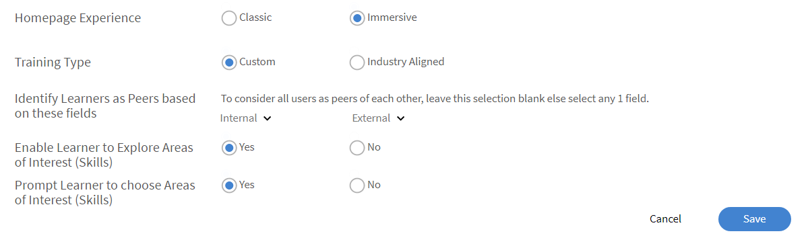
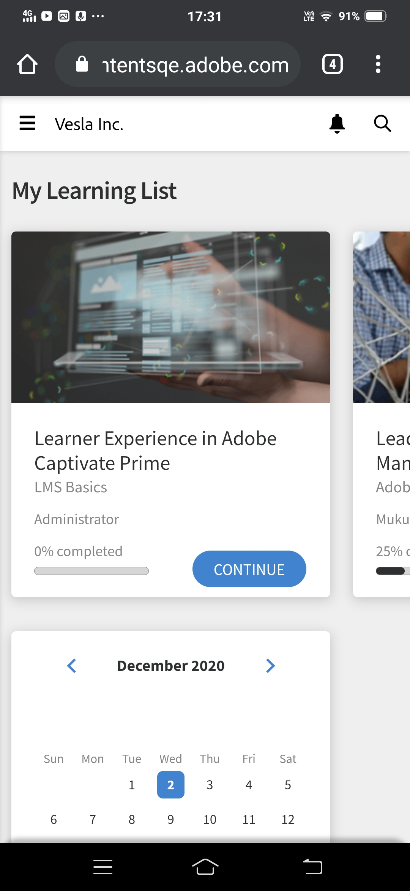

# Customize learner homepage

## Overview {#overview}

An Administrator can customize the learner's home page and make it more modern, content driven, and personalized to a learner.

The personalized approach offers a widget-based way of building a Learner Home page, which the admin of the organization can configure in the admin user interface in a WYSIWYG manner.

The experience is driven by a personalized training recommendations from an AI-driven algorithm that analyses third-party content for industry skills, incorporates peer activity, and learners' areas of interest using explicit and implicit data.

### Customize learner homepage

In this training, you will explore ways to customize the Learner Homepage.

If you're unable to launch the training, write to <almacademy@adobe.com>.

## Configure the learner homepage {#configurethelearnerhomepage}

On the **Branding** > **Learner Homepage** page, an Administrator can customize the homepage experience of a learner, so that when the learner signs into the learner app, he/she sees a completely revamped look and feel.

Admins can set the UI (look and feel) from the Admin app (**Branding** > **Learner Home Page** tab).

Admins can switch to Immersive UI Widget view, customize widgets/features accordingly, and then enable the immersive UI. 

The **Learner Homepage** screen contains these sections:

## Immersive layout option {#immersivelayoutoption}

To view the layout of an immersive-driven page, enable the option **Immersive**. You can toggle this option in **Branding > General**.

In previous versions, the Learner Homepage options was in Settings.

Here are the options that you can set:

**Homepage Experience:** Enable either **Classic** or **Immersive**. If you choose Immersive, the following options appear:

* **Training Type:** Choose either **Industry** or **Custom Aligned**. Custom trainings are created in-house. Industry-aligned trainings include off-the-shelf content from third-party providers.

*Set the home page experience by selecting Industry or Custom Aligned*

The option **Enable learner to explore Areas of Interest** is available to both Classic and Immersive experience.

<table>
 <tbody>
  <tr>
   <td>
    
<b>If you choose Custom...</b>
</td>
   <td>
    
<b>If you choose Industry Aligned...</b> 
</td>
  </tr>
  <tr>
   <td>
    
You can choose at most one Internal and External active field.
</td>
   <td>
    
You can choose at most five and at least one field. By default, the option <b>Profile </b>is selected.
</td>
  </tr>
 </tbody>
</table>

If there are less than 1000 learners, the entire account is considered as a single scope. This is specifically for the Custom Training type. If the account has less than 1000 users, it considers the complete account as its scope.

>[!NOTE]
>
>The check-box **Explore skills** has been moved to Settings > General.

This will be enabled and grayed out if Immersive experience is chosen. This check-box will be enabled only for Classic experience.

*Learner homepage settings*

The immersive layout is the default for all new accounts. The layout is controlled by widgets that an Admin can enable or disable. Based on how the widgets are positioned, the same is reflected on the learner homepage.

Here are the widgets that you can enable/disable.

Using this, you can preview the Learner UI before the learner UI goes live.

For existing accounts, the option **Immersive** will be **OFF**. It is enabled for new account with Social and Gamification ON.

*Preview the learner UI*

<table>
 <tbody>
  <tr>
   <td>
    
<b>Widget</b>
</td>
   <td>
    
<b>Description</b>
</td>
  </tr>
  <tr>
   <td>
    
Masthead
</td>
   <td>
    
<b>What is a Masthead and how do I customize the Learners Masthead? </b> 

    
It's a welcome banner for learners. The banner can be an image or a video. You can target the masthead to specific user groups and a learner views the Masthead as soon as he/she lands on the homepage. A User Group may see multiple hero images or videos according to the target plan set by the Admin. 

    
Here's how an Administrator uploads a banner:

    <ol>
     <li>On the left panel, click <b>Announcements</b>. </li>
     <li>On the upper-right corner of the page, click <b>Add</b>.</li>
     <li>From the <b>Type </b>drop-down list, choose <b>As Masthead</b>.</li>
     <li>Write a message that will feature in the masthead.</li>
     <li>Upload an image or a video.</li>
     <li>Choose target audience. Select a user group or training where the masthead will be displayed.</li>
     <li>Save the masthead announcement.</li>
    </ol></td>
  </tr>
  <tr>
   <td>
    
My Learning
</td>
   <td>
    
Shows the Learning Objects, which are recently visited by the learner. 
</td>
  </tr>
  <tr>
   <td>
    
Calendar
</td>
   <td>
    
Displays various upcoming Classroom and Virtual Classroom training trainings for the learners by month. Ones that the learner can enroll into or has already been enrolled into are displayed, including manager approved trainings. 
</td>
  </tr>
  <tr>
   <td>
    
Enrollments showing deadline
</td>
   <td>
    
Displays enrollments that are overdue, have upcoming deadlines, or are on track. 
</td>
  </tr>
  <tr>
   <td>
    
Gamification
</td>
   <td>
    
Displays the leaderboard based on learning activities.
</td>
  </tr>
  <tr>
   <td>
    
Social Learning
</td>
   <td>
    
Lists activities and posts by users who are in the same user scope as learner. 
</td>
  </tr>
  <tr>
   <td>
    
Recommended by organization
</td>
   <td>
    
When enabled, this widget recommends trainings to specific user groups. Each User group can be targeted one or more trainings and the target plan would be based on a time frame.  

    <ul>
     <li>
      
Firstly, the Admin <a href="announcements.md#recommendation">creates an announcement</a> of type <b>As Recommendation</b> and then selects the requisite training and uses groups. A learner belonging to a user group will get to see the recommended training.
</li>
     <li>
      
Secondly, the Admin can also decide if the recommendations kick in immediately or on a specified date.
</li>
    </ul></td>
  </tr>
  <!--<tr>
   <td>
    
Recommendation based on area of interest
</td>
   <td>
    
Displays Learning Objects based on the learner's chosen area of interest. The recommendation is driven by a Machine Learning algorithm.
</td>
  </tr>-->
  <tr>
   <td>
    
Browse by catalog 
</td>
   <td>
    
Displays catalogs as tiles on the homepage. 
</td>
  </tr>
  <!--<tr>
   <td>
    
Recommendation based on peer activity 
</td>
   <td>
    
Displays training based on what a learner's peers are taking. This is again driven by a Machine Learning algorithm.
</td>
  </tr>-->
 </tbody>
</table>

After you save the changes, the learner homepage reflects all the changes. 

When the learner signs in to the learner app via a browser, they can see the following immersive layout:

<table>
 <tbody>
  <tr>
   <td>
    
<strong>Home page</strong>
</td>
   <td>
    
<strong>My Learning List</strong>
</td>
   <td>
    
<strong>View catalog</strong>
</td>
  </tr>
 </tbody>
</table>

*View Immersive layout for various sections on the home page*

## Classic layout option {#classiclayoutoption}

The User Interface layout that has always existed till now, is now referred to as Classic Layout. When you choose this option, the learner homepage view reverts to the classic layout. 

*Preview the classic layout*

## Configure recommendation settings {#configurerecommendationsettings}

On **Branding** > **General**, you can configure recommendation scopes for internal and external learners, and enable learners choose skills on the learner homepage.

On the **General** page, you have the following options:

<table>
 <tbody>
  <tr>
   <td>
    
Organization Name
</td>
   <td>
    
The name of the organization which the learner belongs to.
</td>
  </tr>
  <tr>
   <td>
    
Subdomain
</td>
   <td>
    
The subdomain of the organization.
</td>
  </tr>
  <tr>
   <td>
    
Logo Styling
</td>
   <td>
    
This is how your logo and company name will appear on Learning Manager. 
</td>
  </tr>
  <tr>
   <td>
    
Themes
</td>
   <td>
    
The theme applied to Learning Manager.
</td>
  </tr>
  <tr>
   <td>
    
Customize
</td>
   <td>
    
Adobe Learning Manager allows you to customize your account to provide a richer experience to your users. 
</td>
  </tr>
  <tr>
   <td>
    
Learner Homepage
</td>
   <td>
    
Choose either <b>Classic </b>or <b>Immersive</b>. If you choose Immersive, then other options appear.
</td>
  </tr>
  <tr>
   <td>
    
Training type 
</td>
   <td>
    
Choose either <b>Custom </b>or <b>Industry Aligned</b>. If there are less than 1000 learners, the entire account is considered as a single scope. The recommendation is based on all learners. 
</td>
  </tr>
  <tr>
   <td>
    
Recommendation Scope Setting 
</td>
   <td>
    
Choose one or more active fields. For <b>Custom</b>, you can choose at most one active field. For <b>Industry Aligned</b>, you can choose at most five active fields. 
</td>
  </tr>
  <tr>
   <td>
    
Enable learner to explore Areas of Interest
</td>
   <td>
    
Only for Classic experience. Choose <b>Yes </b>or <b>No</b>. 
</td>
  </tr>
  <tr>
   <td>
    
Prompt users to select Areas of Interest (Skills)  
</td>
   <td>
    
Only for immersive experience. Choose <b>Yes</b> or <b>No</b>.  
</td>
  </tr>
 </tbody>
</table>

>[!NOTE]
>
>For the new account, the Learner Homepage, Training Type, and Recommendation Scope settings will not be visible.

