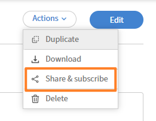

# Download, share, and subscribe to a report

## Overview

Generate, share with other administrators, and schedule delivery for reports in Adobe Learning Manager Report Builder.

After you save a report in Report Builder, you can download it on demand, share it with other administrators in your account, or subscribe to receive it on a recurring schedule.

## Download a report

1. In the **Reports** tab, locate the report you want to download.
2. Select **Download**.
3. Select **OK**.

    

    Report generation runs asynchronously. You'll receive an in-app notification when the file is ready.

4. Open the notification and download the file.

>[!NOTE]
>
>If your report has no matching data, for example, because filters return no results, an empty file is still generated. You won't receive an error; the downloaded file will have headers but no rows.

## Share and subscribe to a report in Report Builder

Give other admins access to a saved report and set up scheduled email delivery in Adobe Learning Manager Report Builder.

The **Share & Subscribe** dialog has two independent sections: one to share the report with other admins, and one to set up an email subscription. You can use either or both.

### Share a report with other admins

Shared admins can view, duplicate, and edit the report.

1. Open the report you want to share.
2. Select **Action** > **Share & Subscribe**.

    

3. Under **Admins with shared access**, select **Edit**. Then select **Select users / usergroups** field.
4. Search for and select the admins or user groups you want to share with.
5. Select **Save**.

The selected admins can now access the report in their Report Builder view.

Create a report once and share it with all administrators who need the same data for their regular tasks. This avoids duplicate reports where different administrators independently build variations of the same report, making it harder to maintain consistency and track the authoritative version. When you share a report, recipients can view, duplicate, and edit it, so one well-configured report can serve as the foundation for any team-specific variations.

>[!NOTE]
>
>Admins with shared access can view, duplicate, and edit the report. To remove access, return to **Share & Subscribe** and deselect the user or user group.

### Subscribe admins to a report

Subscribed admins receive the report by email on the frequency you choose.

1. Open the report you want to subscribe admins to.
2. Select **Actions**  **Share & Subscribe**.
3. Under **Admins with subscription**, select Edit.
4. Select the **Email frequency** dropdown.
5. Choose a frequency:

    * **Send daily**

    * **Send weekly**

    * **Send monthly**

6. In the **Select users / usergroups** field, search for and select the admins or user groups to subscribe.
7. Select **Save**.

Subscribed admins receive the report by email at the chosen frequency, that is, daily, weekly, or monthly.

>[!TIP]
>
>Apply at least one sort to the report before setting up a subscription. This ensures row order is consistent across every scheduled delivery.
