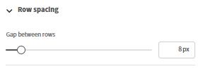

## Component-based email builder

Adobe Learning Manager includes a component-based email builder that lets administrators and authors create enterprise-grade, fully branded emails using a modern visual editor, without writing HTML. Every email your organization sends, from enrollment confirmations to session reminders, can match your brand's look and feel precisely.

**For administrators:** Design a global layout once* a reusable header and footer that wraps every email automatically, and then customize individual templates as needed. Compose emails in an inline drag-and-drop editor using rich components: text with full rich-text formatting, images, banners, buttons, social media links, dividers, and more.

**For authors:** Apply the same editor capabilities to emails scoped to specific courses and instances, so training communications can be tailored to each learning experience without affecting account-wide settings.

The builder supports a hierarchical model: the same email template can be configured at the instance, course, or account level. When a template has not been individually edited, it inherits the settings of its parent level automatically. When you need a fully custom design, you unlink the template and take complete control. A built-in preview lets you check exactly how an email will appear in recipients' inboxes before it is ever sent.

## How the email template system works

Every outgoing email in Adobe Learning Manager is composed of three structural parts:

* **Header:** the banner image or color, and the organization name
* **Body:** the dynamic content zone unique to each email type; contains the message text and variable placeholders
* **Footer:** the account URL, email signature, help link, and other elements

The **Global Layout** is the master design applied to all 130+ email templates simultaneously. When you update the global layout, every template that is still linked to it reflects the change automatically. Templates can be unlinked from the global layout at any time for independent customization.

### The email hierarchy

Settings and design flow from a higher level to lower levels through inheritance. Each level can override or fully customize what it inherits.

| Level | Who configures it | Default state | What can be edited |
| --- | --- | --- | --- |
|**Global Layout**| Administrator | Root; no parent | Full layout: all parts, all components |
|**Account email template**| Admin | Linked to Global Layout | Body only (linked); full layout (unlinked) |
|**Author- LO layout**| Author | Linked to account template | Full layout at LO scope |
|**Author- LO email template**| Author | Linked to LO layout | Body only (linked); full layout (unlinked) |
|**Author- Instance email template**| Author | Linked to LO template | Body only (linked); full layout (unlinked) |

### Core inheritance rules

* Every level starts linked to its immediate parent until explicitly changed.
* Editing a template's **body** does not unlink it. Header and footer continue to reflect the parent.
* Editing the **layout**, or selecting **Unlink** breaks the parent connection for that template only.
* **Revert to original** re-links the template to its parent and resets both layout and body to the parent version.
* Unlinking at one level has no effect on levels above or below it.

## Set up the global layout

The global layout defines the shared header, footer, and structural wrapper that flows into every linked email. Configure it first so that all templates start with consistent branding.

### Open the Global layout editor

1. Sign in to Adobe Learning Manager as an administrator.
2. In the left navigation, select **Email Templates**.
3. Select the **Global layout** tab.

    The editor canvas loads with the current global layout. The **Dynamic Body** zone, shown as a placeholder in the center, represents the area where each template's unique message content appears. You cannot edit the dynamic body from the global layout.

    

### Configure the email container

The email container is the outermost wrapper for every email. Its settings affect the visual frame around all content.

1. Select **Edit** near **Global email layout**
2. Select the email container on the canvas.
3. In the **Properties** panel on the right, set:
    * **Background color:** the color behind all email content

    

    * **Border:** style, width, and color of the outer border

    

    * **Spacing:** padding around the directions of the email content

    

    * **Row spacing:** the vertical gap applied between all rows in the layout

    

### Work with rows and columns

All content in the email editor is placed inside **rows**. Each row contains one or more **columns**, and each column holds one or more **components**.

To add a row:

1. Select **Row** at the top of the canvas.

    

2. Select a column layout: **1 column**, **2 columns**, **3 columns**, or **4 columns**.

    

    The new row appears on the canvas ready for components.

To configure a row:

1. Select the row on the canvas.

    

2. In the **Properties** panel, set:
    * **Background color:** row-level background, overrides the container color for this row
    * **Border:** row border style, width, and color
    * **Spacing:** horizontal gap between columns in this row

    

**To reorder rows:**

* Drag any row by its handle (shown when hovering the left edge) to move it up or down.

**To delete a row:**

* Select the row and select the **Delete** icon in the row toolbar.

### Add and arrange components

Components are building blocks of email content. Drag them from the **Components** panel at the top and drop them into any column cell. Use the **Properties** panel on the left to customize the selected component.

When dragging and dropping a component, a blue "+" indicator shows where the component can be placed.

**To add a component:**

1. In the component panel, locate the component you want.

    

2. Drag it into a column cell on the canvas.

    

3. The component is added to that cell. Select it to open its properties in the right panel.

    

**To move a component:**

* Drag the component by its handle to a different column or row position.

**To delete a component:**

* Select the component and select the **Delete** icon in the component toolbar.

### Edit preset components

The **Global layout** includes built-in preset components that correspond to the shared fields configured in email settings. Preset components can be edited directly on the canvas or removed entirely.

| Preset component | Default content | Can be removed? |
| --- | --- | --- |
|**Banner**| Default banner image or color | Yes |
|**Salutation**| "Hello {{user}}," | Yes |
|**Dynamic body**| Placeholder for per-template content | No- required |
|**Account URL**| Your account's platform URL | Yes |
|**Signature**| Your configured signature text | Yes |

**To edit a preset component:**

1. Add the preset component, for example, banner.

    

2. Select the banner on the canvas.
3. In the **Properties** panel, change the banner's font, font size, and other visual properties.

    

**To remove a preset component from all emails:**

1. Select the preset component on the canvas.
2. Select **Delete** in the component toolbar.

Removing a preset component from the global layout removes it from every linked email. Unlinked templates retain the component until you manually remove it from each one.

### Save the global layout

Select **Save** when your layout is complete. The updated design is immediately applied to all email templates that are still linked to the global layout.

## Configure global email presets

Define common elements such as banner, salutation, and signature to reuse across your emails. These can be used in the global layout or in individual event-based email templates within Adobe Learning Manager. Changes made here are automatically reflected wherever these presets are used. You can also choose to override these presets and design custom elements directly in the email builder.

Configure the following:

### Email Banner

1. Select **Edit** next to **Email Banner.**
2. Upload a banner image or set a solid background color.

    

3. Select **Save.**

### Email Salutation

1. Select **Edit** next to **Email Salutation**
2. The default is "Hello {{user}}," — the {{user}} variable populates with the recipient's name at runtime.

    

3. Modify the greeting text or remove the salutation entirely.
4. Select **Save**.

### Account URL

1. Select **Edit** next to **Account URL.**
2. Enter the URL of your learning platform; appears in all outgoing emails.

    

3. Select **Save**.

### Email Signature

1. Select **Edit** next to **Email Signature**
2. Enter closing text.

    

3. Select **Save**.

## Add and configure individual components

### Text component

The text component supports full rich-text editing.

1. Drag a **Text** component into a column cell.
2. Select it to enter edit mode.

    

3. Type or paste your content.
4. Apply the following formatting options:
    * **Font:** select from web-safe fonts (Arial, Helvetica, Georgia, and others) or custom fonts configured for your account
    * **Size:** font size in points
    * **Bold**, **Italic**, **Underline**, **Strikethrough**
    * **Superscript** and **Subscript**
    * **Text color** and **Background color** (text highlight)
    * **Alignment:** left, center, right, or justify
    * **Line spacing:** line height multiplier
    * **Horizontal and vertical padding:** internal spacing within the text block
5. To add a hyperlink:
    * Select the text you want to link
    * Select the **Link** icon in the toolbar
    * Enter the destination URL

    

6. Select **Apply**

### Image component

1. Drag an **Image** component into a column cell.
2. Select **Upload** to upload a new image file (JPEG and GIF supported), or select **Browse** to choose from your image library.
3. With the image selected, configure:

    

    * **Change Image:** Upload a new image or replace the currently selected image.
    * **Image URL:** Specifies the source URL of the image to be displayed. The image is loaded from this location.
    * **Link:** Adds a clickable hyperlink to the image. Users are redirected to the specified URL when the image is clicked.
    * **Border Type:** Defines the style of the image border. Available options include None, Solid, and Dotted.
    * **Border Color:** Sets the color of the image border when a border style is applied.
    * **Corner radius:** Controls the roundness of the image corners. Higher values create more rounded corners.
    * **Border line:** Adjusts the thickness (width) of the image border.
    * **Top Spacing:** Adds space above the image.
    * **Bottom Spacing:** Adds space below the image.
    * **Left Spacing:** Adds space to the left side of the image.
    * **Right Spacing:** Adds space to the right side of the image.
    * **Horizontal Alignment:** Determines the image position within its container. Options typically include Left, Center, and Right alignment.

### Button component

1. Drag a **Button** component into a column cell.
2. Select it and configure:

    

    * **Label:** the button text
    * **Link:** the destination URL when the button is clicked
    * **Font:** font family and size for the button label
    * **Text color:** label color
    * **Background color:** button fill color
    * **Size:** button width and height
    * **Corner style:** Rounded, Square, or Circular
    * **Alignment:** left, center, or right within the column
    * **Padding:** internal spacing between the label text and the button edges

### Divider and spacer components

**Divider:** adds a visible horizontal line between content sections.

1. Drag a **Divider** component into a column.
2. Set the **Line style** (solid, dashed, dotted), **Color**, **Width**, and **Height** (vertical space above and below the line) in the properties panel.

    **Spacer:** adds invisible vertical space between elements without a visible line.

3. Drag a **Spacer** component and set its **Height** in the properties panel.

## Insert and manage variables

Variables are dynamic placeholders replaced with real data when an email is sent. The variables available depend on the specific template type. An enrollment confirmation email has different variables from a session reminder.

### Insert a variable using the picker

1. Place your cursor in a text component where you want the variable to appear.
2. Select **Insert variable** in the text editor toolbar. The variable picker opens showing all variables available for this template type.
3. Select a variable. For example, **Course name**, **Learner name**, or **Learning Path name**.

    

### Insert a variable by typing

Type the variable name directly surrounded by double curly braces: {{variable_name}}. The editor automatically recognizes and highlights it as a variable token.

**Examples of common variables:**

| Variable | Replaced with |
| --- | --- |
| Recipient's full name | {\{learnerName}\} |
| Recipient's email | {\{learnerEmail}\} |
| User name of the recipient | {\{user}\} |
| User type | {\{userType}\} |
| Organization name | {\{organizationName}\} |
| Course name | {\{courseName}\} |
| Course description | {\{courseDescription}\} |
| Course author | {\{courseAuthor}\} |
| Course link | {\{courseLink}\} |
| Skills needed for the course | {\{courseSkillDetails}\} |
| Badges in the course | {\{courseBadge}\} |
| Course enrollment deadline | {\{courseEnrollmentDeadline}\} |
| Course completion deadline | {\{courseCompletionDeadline}\} |
| Course completion date | {\{courseCompletionDate}\} |
| Name of the Learning Path | {\{LPName}\} |
| Learning path link | {\{LPLink}\} |
| Learning path enrollment deadline | {\{LPEnrollmentDeadline}\} |
| Learning path completion deadline | {\{LPCompletionDeadline}\} |
| Learning path completion date | {\{LPCompletionDate}\} |
| Certification name | {\{certificationName}\} |
| Certification enrollment deadline | {\{certificationEnrollmentDeadline}\} |
| Certification completion date | {\{certificationCompletionDate}\} |
| Course deadline duration | {\{deadlineDuration}\} |
| Course expiry duration | {\{expiryDuration}\} |
| Course expiry date | \{\{expiryDate\}\} |
| Session name | \{\{sessionName\}\} |
| Session start date | \{\{sessionDate\}\} |
| Session end date | \{\{endSessionDate\}\} |
| Session start time | \{\{sessionTime\}\} |
| Session end time | \{\{endSessionTime\}\} |
| Venue name | \{\{venueName\}\} |
| Venue information | \{\{venueInfo\}\} |
| Venue URL | \{\{venueURL\}\} |
| Venue region | \{\{venueRegion\}\} |
| Virtual classroom URL | \{\{vcUrl\}\} |
| Virtual classroom provider account required | \{\{VCProviderAccountReq\}\} |
| Instructor name | \{\{instructorName\}\} |
| Module name | \{\{moduleName\}\} |
| Learning Object name | \{\{learningObjectName\}\} |
| Learning Object completion date | \{\{loCompletionDate\}\} |
| Alternate Learning Object names | \{\{alternateLoNameList\}\} |
| Alternate Learning Object links | \{\{alternateLoNameListLinks\}\} |
| Removed alternate Learning Object | \{\{removedAlternateLo\}\} |
| Prerequisite text | \{\{preRequisiteText\}\} |
| Prerequisite count | \{\{preRequisiteCountText\}\} |
| CI name | \{\{ciName\}\} |
| Report dashboard name | \{\{reportDashboardName\}\} |
| Job aid name | \{\{jobAidName\}\} |
| Announcement content | \{\{announcementContentText\}\} |
| Profile name | \{\{profileName\}\} |
| Seat limit for course | \{\{seatLimit\}\} |
| Link to help doc home page | \{\{captivatePrimeHelp\}\} |
| Link to help page | \{\{helpPageLink\}\} |
| Count | \{\{count\}\} |

>[!NOTE]
>
>Variables are template-specific. Not every variable is available in every template. Use the **Insert variable** picker to see only the variables that apply to the template you are editing. Typing an unrecognized variable name in curly braces will not generate an error in the editor, but it will appear as literal text in the sent email.

### Variables in the banner

1. The email subject line also supports variables. To add a variable to the subject:
2. Open a template and locate the **Email subject** field.
3. Type the variable directly. For example, "Your enrollment in {{course_name}} is confirmed". The variable renders with the actual course name when the email is sent.
4. Alternatively, select **Add variable**, then select **Course**.

    

### Variables and the global layout

Variables in the global layout are template-independent and resolve differently depending on context. Use only universally applicable variables, such as {\{user}\} and {\{account_url}\}, in the global layout. Template-specific variables (such as {\{course_name}\}) should be placed in individual template bodies, not in the global layout.

## Link and unlink templates

### Linked vs. unlinked state

Every template is either **linked** to its parent or **unlinked** and fully independent.

**When linked:**

* The header and footer appear **grayed out** in the editor. This is the visual indicator that the template is linked

* Only the body is editable
* Changes to the parent layout flow into this template automatically

**When unlinked:**

* The header and footer are fully editable. There are no grayed-out zones
* The template is entirely independent; parent changes do not affect it
* The template starts from the parent's design at the moment of unlinking

**Key rule:** Editing the **body** never unlinks a template. Editing the **layout** or explicitly selecting **Unlink** breaks the parent connection.

### When to link (stay linked)

* You want the global branding to keep flowing in automatically
* You only need to change the message text or variables in this template
* You are maintaining a large library of templates and want centralized brand control

### When to unlink

* You need a different banner, color scheme, or structural layout for a specific template
* You are building a distinct branded experience for a specific course, certification, or audience
* You are an author who wants full design control for one Learning Object or instance

### Unlink an account-level template- administrator

1. Select **Email Templates** and open a template. For example, Course - Self-enrollment.
2. Select **Unlink**.

    

3. Read the confirmation message and select **Yes**.
4. The header and footer become fully editable.
5. Customize any part of the template.
6. Select **Save**.

The template retains the parent's layout as its starting point but no longer receives future parent updates.

### Revert a template to its parent version

Revert to original re-links the template and resets it to exactly what the parent provides.

* If the template was **body-edited only** (still linked): reverts the body message to the parent's default. The header and footer are unchanged because they were already from the parent.
* If the template was **fully unlinked**: replaces everything, header, body, and footer, with the parent version. All independent customizations are permanently removed.

>[!CAUTION]
>
>Revert to original cannot be undone. Copy any content you want to keep before reverting.

**To revert:**

1. Open the template in the editor.
2. Select **Revert to original**.

    

### Unlink an instance-level template- author

1. Open a course and select **Email Templates**.
2. Open a template, for example, Course Completion.
3. Select **Unlink** and confirm.
4. Make changes and select **Save**.

This affects only this instance. Other instances are unaffected. The instance template starts from the LO-level template design at the moment of unlinking, not from the global layout.

Admin templates revert to the global layout version and re-link to the global layout. Author LO templates revert to the admin account template version. Author instance templates revert to the LO template version (or the account template if the LO template is linked).

## Customize an individual template

### Navigate to a template

1. In **Email Templates**, select a category from the list. For example, **General**, **Learning Activity**, or **Reminders & Updates**.
2. Find the template by name. Templates are listed with their trigger event and current enable/disable status.
3. Select the template name to open it in the editor.

### Edit the body (linked template)

When a template is linked, only the body is editable. The header and footer appear grayed out.

1. Open the template. Confirm the header and footer are grayed out (linked state).
2. Select anywhere in the body to enter edit mode.
3. Edit the message text, formatting, variables, and any components in the body.
4. Select **Save**.

### Edit a fully customized template (unlinked)

After unlinking, all three parts, header, body, and footer, are editable using the same drag-and-drop editor as the global layout.

1. Add, remove, or rearrange rows and components in any part.
2. Edit preset components (banner, salutation, signature, account URL) independently.
3. Insert variables specific to this template type.
4. Select **Save**.

### Edit templates in multiple languages

Every template supports all content languages configured for your account.

1. Open the template.
2. Select the **Language** dropdown. It shows all available languages for your account.
3. Select the language you want to edit.
4. Edit the body (and layout, if unlinked) for that language.
5. Select **Save**.

Each language version is stored independently. Editing one language does not affect others. If a language version has not been customized, learners receive the default content for that language.

>[!NOTE]
>
>If a template is unlinked and you edit its layout in one language, the layout change applies only to that language version. Other language versions retain their own states.

### Preview in the editor (visual check)

1. Select **Preview** in the editor toolbar.
2. A preview modal opens showing the email as it will appear to recipients.
3. Review layout, spacing, images, and variable placeholder tokens.
4. Close the preview to continue editing.

## Backward compatibility

### Existing accounts

All previously configured email templates are preserved exactly as they were. The new builder is available alongside the existing editor. Templates configured before the update are not automatically migrated to the new format. They continue to function as before.

### New accounts

Start with the new builder and a clean default global layout. The default layout uses a simplified design that avoids the known rendering issues (such as banner image display failures) present in older configurations.

If your account has both old-format and new-format templates, the two coexist without conflict. You can migrate individual templates to the new format at your own pace by opening them in the new editor and saving.

## Troubleshoot email templates

**Global layout changes are not appearing in a template**

The template has been unlinked. To confirm and fix:

1. Open the template.
2. If the header and footer are **editable** (not grayed out), the template is unlinked.
3. To restore global layout inheritance, select **Revert to original** and confirm.

**A template looks different from the global layout**

Same cause as above. The template was unlinked, either deliberately or due to a previous layout edit. Revert to original to re-link it.

**Variables are rendering as literal text in sent emails**

The variable name is either misspelled or not available for this template type.

1. Open the template and locate the variable.
2. Delete it and re-insert it using the **Insert variable** picker.
3. The picker only shows variables that are valid for this template. Select from the list to avoid typos.
