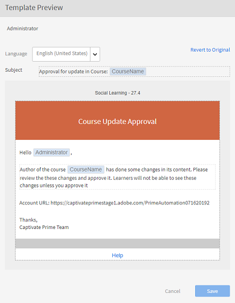
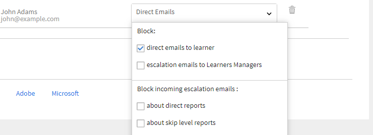

# Email templates

The events in your training activity trigger emails that are sent to learners. You as an administrator can easily enable, disable, or modify these email templates.

Learning Manager application sends email notifications to multiple roles of users based on events.

As an administrator, you can customize email templates by adding or modifying content and sending notifications to users for various events triggered by learners, managers, and authors.

Administrators can also choose not to send email notifications for certain events.

## Configure email templates {#configureemailtemplates}

You as an administrator can easily enable, disable, or modify these email templates.

1. To access the templates, click **[!UICONTROL Email Templates]** on the left pane. On this page you can see three different categories of templates, **[!UICONTROL General]**, **[!UICONTROL Learning Activity]**, and **[!UICONTROL Reminders and Updates]**. There is a fourth tab, **[!UICONTROL Settings]**, where you can configure the templates.

   

   *Select the General tab*

1. To view the list of email templates, click any tab.

   

   *View the list of email templates*

   You can easily enable or disable any of these email alerts by clicking the toggle button.

1. To modify the contents of the template, click the template name. Here you can see that for different type of users you have different templates.

   

   *View the template of an email*

1. To modify the contents of this email template, click the body of the email. Now make the changes to the template. You can modify the text, and you can also use one of these variables in your email. The changes made to the body section can only be applied to this email template. However, if you make changes to the signature of this email, it can be applied globally to all the templates. 

   Hover your mouse over each icon to view the names.

   

   *Modify the email template*

   You can reset the body of the message to the default content by clicking the link **[!UICONTROL Revert to Original]** above the template.

1. To confirm the changes applied to this template, click save. Now users can receive email notifications using the modified email template.

## Customize settings of an email template {#customizesettingsofanemailtemplate}

1. To open the settings page, click **[!UICONTROL Settings]**. You can now customize your email templates.
1. To customize the name and email id from which the learners receive emails, edit the **[!UICONTROL Sender Name and Address].**

   Contact [***Adobe Support***](https://helpx.adobe.com/contact/enterprise-support.other.html#learning-manager) to configure or change these details.

1. Customize your email banner from the **[!UICONTROL Email Banner]** option. Change the color of the banner by selecting **[!UICONTROL Banner Background]**.

   You can use a custom image as banner by selecting the **[!UICONTROL Custom Image]** option. Click **[!UICONTROL Save]** after making the changes.

    

   *Customize the image of a banner*

   The custom image size has to be 1240x200px and support .jpg, .jpeg and .png.

1. Edit your email signature by clicking **[!UICONTROL Edit]**. Make the necessary changes and save the change.

   

   *Customize your email signature*

1. Edit your account URL by clicking Edit on the option **[!UICONTROL Account URL]**. 

   The account URL link is shown in all emails, just before the signature. Enter the required URL and click **[!UICONTROL Save]**. Note that this URL is only be visible to internal users.

   

   *Customize the account URL*

1. Configure whether managers must also receive emails that are sent to their direct reports using the check box under **[!UICONTROL Optional Manager Email]** option.

## Set frequency of digest emails {#setfrequencyofdigestemails}

On the **[!UICONTROL Email templates]** > **[!UICONTROL Settings]** page, the Admin can change the frequency of Digest Emails to be sent to learners.

In the **[!UICONTROL Digest Email Settings]** section, click **[!UICONTROL Edit]**.

In the drop-down, choose either **[!UICONTROL Biweekly]** or **[!UICONTROL Monthly]**.

* **[!UICONTROL Biweekly]:** If you set the frequency to **[!UICONTROL Biweekly]**, learners receive the email once every two weeks.

* **[!UICONTROL Monthly]:** If you set the frequency to **[!UICONTROL Monthly]**, learners receive the email once every month.

*Set frequency of digest emails*

When you enable this option, the frequency is set to **[!UICONTROL Biweekly]** for existing/new active accounts by default.

### DND list of learners

Learners in a DND list cannot see user settings for digest emails. The option will remain disabled and learners will not receive any mails.

## Sample digest email to learners {#digest-email}

The following samples represent the mail that a learner receives.

*Sample email*

### Training activity

*Email of training activity*

### Recommended Trainings

*Email of recommened training*

### Leaderboard

*Email of leaderboard*

### Latest posts

*Email of latest posts*

### Download email access report

You can download the email access report by clicking the **[!UICONTROL Download]** button. This report contains the number of users who have received the email, and the number of users who've opened and clicked on the links.

## Customize email domain {#customizeemaildomain}

To customize the email domain and email id from which your learners receive notifications, contact the [***Learning Manager support***](https://helpx.adobe.com/contact/enterprise-support.other.html#learning-manager) and provide the details of the domain you would like to add, and your new email id.

Your request would be processed and an email with confirmation link would be sent to you on the new email address which you specify. Click the verification link provided in the email to confirm and complete the verification process.

## Configure Do Not Disturb email {#dnd}

As an Administrator, you can select users who can receive emails from Learning Manager and who cannot.

You can perform this by using the **[!UICONTROL Do Not Disturb]** option under the **[!UICONTROL Settings]** tab. Users can be added to this list using their name, email id, or unique user id.

Search for a user to add to the list.

<!---->

## Blocked emails {#blockedemails}

From the **Blocked Emails** drop-down list for each user to select the types of email to block for them.

<!---->

The following are the available options:

* **Direct email to learner:** This option restricts or allows emails sent to the learner.
* **Escalation emails to Learner's Manager:** This option restricts or allows emails sent to the Learner's Manager.
* **About direct reports:** This option restricts or allows incoming escalation emails sent to the users about their direct reports.
* **About skip level reports:** This option restricts or allows incoming escalation emails sent to the users about their second level reports.

If you want to delete a user from the list, you can use the delete option available individually for each user in the user tab.

You can add users to DND list using CSVs. Include True/False/Blank values for each of the following coloums:

* Block direct emails
* Block user escalations
* Block incoming direct escalations
* Block incoming skip escalations

Enter true in the value field to block users from receiving emails for that selected option. If false is entered as the value, blocked users are unblocked. No changes to previous selections are done if the column is left blank.

## Flexibility in customizing the templates

Email templates in Learning Manager now include fully editable sections, providing greater flexibility to customize email communications based on messaging and branding preferences.

The key enhancements to customizing email templates include the following:

### Customize email salutation at account-level

Select **[!UICONTROL Email Templates]** > **[!UICONTROL Settings]**. Select **[!UICONTROL Edit]** in the **[!UICONTROL Email Salutation]** section.

*Customize email salutation*

You can also customize the following:

* Email banner and email signature both at the Course-level and the Instance-level.
* Edit the email footer. The footer area contains predefined variables for the account URL, the Signature, and any free-form text the user adds.

The templates also support advanced editing capabilities such that formatting is retained when content is copied and pasted from and to Microsoft Word.

## Inline invitations {#inlineinvitations}

Learning Manager users will now receive inline email invites. ICS attachments are no longer used to send invitations. Any changes in the invite will automatically reflect in your calendar.

<!---->

## Frequently Asked Questions {#frequentlyaskedquestions}

+++How to disable Help in email templates?

At present, in Learning Manager, it is not possible to disable **Help** in email templates.

+++

+++How to modify email templates?

1. As an Administrator, log in to your Learning Manager account.
1. On the left panel, click **[!UICONTROL Email Templates]** and select the e-mail template that you want to modify.
1. To customize each template, click the text in the body of the template. You can insert variables in the text by clicking the appropriate icons as shown in the snapshot. Mouse over each icon to view the names and apply it to the template.
1. After making changes to the template, click **[!UICONTROL Save]**.   
    

+++

+++How to create your own e-mail templates?

At present, it is not possible to create custom email templates. However, you can edit and modify existing templates.

+++

+++How to turn off the email templates?

To turn off the e-mail template, select the template that needs to be disabled, and click the Yes/No circular toggle button. 

+++

+++How to change the Sender Name and Address in the template?

To change the sender name and e-mail address, contact [Adobe Learning Manager support](https://helpx.adobe.com/contact/enterprise-support.other.html#learning-manager). 

+++
