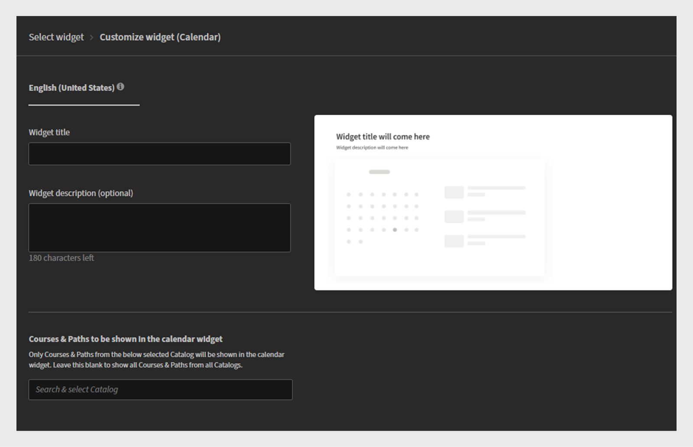

# Add and configure widgets

## Calendar widget

The Calendar widget displays your scheduled sessions and training. You can browse the calendar to view training planned for upcoming months. It allows viewing training sessions by month with the ability to scroll left or right.

The Calendar widget can be added to a page by an administrator to display training schedules. Learners can interact with the calendar by scrolling through months to see upcoming sessions. They can filter sessions to quickly find relevant training. 

### Add a calendar widget

In a financial company with separate Sales and Customer Success Manager (CSM) teams, administrators can use this widget to highlight team-specific training sessions. For example:

* The Sales team can see upcoming sessions on product updates, compliance training, and pitch workshops.
* The CSM team can view client onboarding workshops, customer communication training, and service excellence programs.

To configure the Calendar widget:

1. Log in to Adobe Learning Manager as an administrator.
2. Select **[!UICONTROL Branding]** in the left navigation pane.
3. Select **[!UICONTROL Custom Pages]**.
4. Select the required page and then select **[!UICONTROL Page Design]**. 
5. Select **[!UICONTROL Edit]** and then select the layout.
6. Select **[!UICONTROL Add Widget]**.
7. Select **[!UICONTROL Calendar]** and then select **[!UICONTROL Proceed]**.
 
   
   _Widget selection screen highlighting the Calendar widget option to display training sessions in a calendar_

8. Type a **[!UICONTROL Widget title]** and **[!UICONTROL Widget description]**.
 
   
   _Calendar widget customization screen, where administrators can set the widget title, description, and select catalogs_

9. Select a catalog by searching to display its courses and learning paths within the **[!UICONTROL Calendar]** widget.
10. Select **[!UICONTROL Add Widget]**.

The Calendar widget will be added to the page. Administrator can add other widgets and publish the page.

## Categories widget

The Categories widget displays learning content organized by Catalogs, Products, or Roles as categories. It helps learners easily browse and find training grouped by topics, departments, skills, or other relevant classifications. 

Administrators add the Categories widget to a page to showcase categorized learning options. Learners use the widget to explore training by selecting a category of interest, which then reveals related courses or paths. 

### Add a category widget

In a financial services company, different teams often need access to role-specific training. The Categories widget helps organize learning content into clear, clickable tiles, making it easier for Sales and CSM teams to quickly find what they need. 

To configure the Categories widget:

1. Log in to Adobe Learning Manager as an administrator.
2. Select **[!UICONTROL Branding]** in the left navigation pane.
3. Select **[!UICONTROL Custom Pages]**.
4. Select the required page and then select **[!UICONTROL Page Design]**. 
5. Select **[!UICONTROL Edit]** and then select the layout.
6. Select **[!UICONTROL Add Widget]**.
7. Select **[!UICONTROL Categories]** and then select **[!UICONTROL Proceed]**. 
 
   
   _Widget selection screen highlighting the Categories widget option to organize learning content by catalog, product, or role for easy navigation_

8. Select the details to display on the category cards:

    * **[!UICONTROL Category Image]**
    * **[!UICONTROL Category Description]**

9. Type a **[!UICONTROL Widget title]** and **[!UICONTROL Widget description]**.
10. Search for and choose a catalog from the **[!UICONTROL Category source]**.
 
    
    _Configure Categories widget options to set widget title and description, and select the category source_

11. Select **[!UICONTROL Add Widget]**.

The Categories widget will be added to the page. Administrators can add other widgets and publish the page.

## Compliance widget

The Compliance Status widget displays a learner's progress toward meeting compliance or certification requirements. It shows the status of mandatory training assigned to the user, including completed, pending, or overdue courses. 

Administrators add the Compliance Status widget to pages to provide visibility into compliance training progress. Learners use it to quickly check which mandatory courses they have completed and which still require attention. 

### Add a compliance status widget

In a financial services company, both the Sales team and the Customer Success Manager (CSM) team must complete compliance training on time. The Compliance Status widget makes it easier for learners to track upcoming deadlines and their training progress directly from their team-specific pages.

To configure the Compliance widget:

1. Log in to Adobe Learning Manager as an administrator.
2. Select **[!UICONTROL Branding]** in the left navigation pane.
3. Select **[!UICONTROL Custom Pages]**.
4. Select the required page and then select **[!UICONTROL Page Design]**. 
5. Select **[!UICONTROL Edit]** and then select the layout.
6. Select **[!UICONTROL Add Widget]**.
7. Select **[!UICONTROL Compliance Status]** and then select **[!UICONTROL Proceed]**.
 
   
   _Widget selection screen highlighting the Compliance Status widget used to display learner enrollments with deadlines and status indicators_

8. Type a **[!UICONTROL Widget title]** and **[!UICONTROL Widget description]**.
 
   
   _Compliance Status widget screen, where administrators can set the widget title and description to display enrollment deadlines and status for learners_

9. Select **[!UICONTROL Add widget]**.

The Compliance status widget will be added to the page. Administrators can add other widgets and publish the page.

## Courses and paths widget

The Courses & Paths widget displays recommended Courses and Learning Paths tailored to the learner's role, interests, or training needs. 

Administrators add the Courses & Paths widget to pages to highlight key learning content for specific audiences. Learners use the widget to browse recommended courses or paths and can directly enroll into the courses.

### Add a Courses and paths widget

A financial company wants to create role-specific training pages for its two teams: Sales and Customer Success Managers (CSM). The Courses & Paths widget can be used to display the most relevant learning programs for each team.

To configure the Courses and Paths widget:

1. Log in to Adobe Learning Manager as an administrator.
2. Select **[!UICONTROL Branding]** in the left navigation pane.
3. Select **[!UICONTROL Custom Pages]**.
4. Select the required page and then select **[!UICONTROL Page Design]**. 
5. Select **[!UICONTROL Edit]** and then select the layout.
6. Select **[!UICONTROL Add Widget]**. 
7. Select **[!UICONTROL Courses & Paths]**.
 
   
   _Widget selection screen highlighting the Courses & Paths widget for displaying Courses, Learning Paths, Certifications, and Job Aids as interactive cards for learners_

8. Select **[!UICONTROL Proceed]**. 
9. Type **[!UICONTROL Widget title]** and **[!UICONTROL Widget description]**. 
10. Select the catalogs or manually choose up to 25 courses to display.
    
   
   _Courses & Paths widget where administrators set the widget title, description, and select Courses or Learning Paths to display as interactive cards_
11. Select **[!UICONTROL Add widget]**. 

The Courses & Paths widget will be added to the page. Administrators can add other widgets and publish the page.

## Content Box widget

The Content Box widget allows administrators to add customized content such as text, images, announcements, or links to a page. It provides a flexible space for sharing important information, tips, updates, or promotional messages directly within the learning environment.

### Add a Content Box widget

A financial company wants to create role-specific training pages for its two teams: Sales and Customer Success Managers (CSM). The Content Box widget can be used to add customized sections with titles, descriptions, images, and call-to-action buttons that share targeted resources, updates, and motivational messages. 

To configure Content Box widget:

1. Log in to Adobe Learning Manager as an administrator.
2. Select **[!UICONTROL Branding]** in the left navigation pane.
3. Select **[!UICONTROL Custom Pages]**.
4. Select the required page and then select **[!UICONTROL Page Design]**. 
5. Select **[!UICONTROL Edit]** and then select the layout.
6. Select **[!UICONTROL Add Widget]**. 
7. Select **[!UICONTROL Content Box]** and then select **[!UICONTROL Proceed]**. 
 
   
   _Widget selection screen highlighting the Content Box widget for displaying custom images, text, and action buttons to enhance learner engagement_

8. Type the **[!UICONTROL Title]** and **[!UICONTROL Description]**.
9. Type the text into the **[!UICONTROL Action button label]** and provide a link. 
10. Select any of the options for Background fill:

    * **[!UICONTROL Color]**: Select the color from the color picker or type the color code in the text field.
    * **[!UICONTROL Image]**: Browse and upload a picture.

11. Adjust the box height using the **[!UICONTROL Content box height]** option. 
12. Select the text formatting options.
 
    
    _Content Box widget customization screen, where administrators can enter a title, description, action button label, and link_

13. Select **[!UICONTROL Add widgets]**. 

The Content Box widget will be added to the page. Administrators can add other widgets and publish the page.

## Gamification widget

Administrators add the Gamification widget to custom pages to showcase learners' achievements, such as earned badges, accumulated points, and leaderboard rankings. Learners can track their progress and compare results with peers, which fosters motivation and sustained participation. 

### Add a Gamification widget

A financial company wants to boost learner engagement and motivation across its two major teams: Sales and Customer Success Managers (CSM). The Gamification widget can be used to reward learners with points, badges, and leaderboard rankings for completing training and participating actively. 

For the Sales team, gamification could focus on rewarding achievements related to sales skills, product knowledge, and client engagement training. For the CSM team, it might emphasize customer service certifications, compliance training, and client management skills.

To configure the Gamification widget:

1. Log in to Adobe Learning Manager as an administrator.
2. Select **[!UICONTROL Branding]** in the left navigation pane.
3. Select **[!UICONTROL Custom Pages]**.
4. Select the required page and then select **[!UICONTROL Page Design]**. 
5. Select **[!UICONTROL Edit]** and then select the layout.
6. Select **[!UICONTROL Add Widget]**.  
7. Select **[!UICONTROL Gamification]** and then select **[!UICONTROL Proceed]**. 
 
   
   _Widget selection screen highlighting the Gamification widget used to display learning activities and achievements on the leaderboard_

8. Type the **[!UICONTROL Widget title]** and **[!UICONTROL Widget description]**. 
9. Select **[!UICONTROL Add widgets]**. 

The Gamification widget will be added to the page. Administrators can add other widgets and publish the page.

## HTML widget

The HTML widget allows administrators to embed custom HTML code directly into a page. This provides flexibility to add tailored content, integrate third-party tools, or include interactive elements that go beyond standard widget functionality. It supports rich customization through HTML, CSS, and even JavaScript, enabling unique designs and external integrations within the learning platform.

### Add an HTML widget

A financial company wants to provide customized, interactive content tailored to its two main teams: Sales and Customer Success Managers (CSM). The HTML widget can be used to embed custom HTML-based resources such as financial dashboards, data visualizations, interactive forms, or market analysis tools directly into their training or team pages.

To configure the HTML widget:

1. Log in to Adobe Learning Manager as an administrator.
2. Select **[!UICONTROL Branding]** in the left navigation pane.
3. Select **[!UICONTROL Custom Pages]**.
4. Select the required page and then select **[!UICONTROL Page Design]**. 
5. Select **[!UICONTROL Edit]** and then select the layout.
6. Select **[!UICONTROL Add Widget]**.  
7. Select **[!UICONTROL HTML]** and then select **[!UICONTROL Proceed]**. 
 
   
   _Widget selection screen highlighting the HTML widget for customizing pages using HTML, CSS, and JavaScript code_

8. Type your **[!UICONTROL HTML]**, **[!UICONTROL CSS]**, and **[!UICONTROL JavaScript]** code in the respective fields. 
9. Select **[!UICONTROL Add widget]**. 

The HTML widget will be added to the page. Administrators can add other widgets and publish the page.

## IFrame widget

The Iframe widget displays content from an external URL directly within a page on the learning platform. It embeds an external website, tool, or application inside a frame, allowing learners to view and interact with that content without leaving the LMS.

### Add a Iframe widget

A financial company wants to embed external tools and resources seamlessly within its internal training and collaboration pages for its Sales and Customer Success Managers (CSM) teams. The Iframe widget can be used to display third-party financial dashboards, market analysis platforms, or client management portals directly inside the LMS interface.

To configure the Iframe widget:

1. Log in to Adobe Learning Manager as an administrator.
2. Select **[!UICONTROL Branding]** in the left navigation pane.
3. Select **[!UICONTROL Custom Pages]**.
4. Select the required page and then select **[!UICONTROL Page Design]**. 
5. Select **[!UICONTROL Edit]** and then select the layout.
6. Select **[!UICONTROL Add Widget]**.   
7. Select **[!UICONTROL Iframe]** and then select **[!UICONTROL Proceed]**. 
 
   
   _Widget selection screen highlighting the Iframe widget for embedding external applications or web pages within a selected section_

8. Type the URL in the **[!UICONTROL Page linked to Action button]** option.
9. Adjust the Iframe height using the **[!UICONTROL Iframe height]** option.     
 
   
   _Iframe widget customization screen, where administrators can enter a page URL and specify iframe height to embed external content_

10. Select **[!UICONTROL Add widget]**. 

The Iframe widget will be added to the page. Administrators can add other widgets and publish the page.

## My Learning widget

The My Learning widget provides learners with a personalized view of all the courses, learning programs, and certifications that are assigned or enrolled by them. It organizes learning content by type and deadline, allowing learners to easily track their progress and access learning materials. This widget helps learners stay focused on their required training and see upcoming deadlines briefly.

### Add a My Learning widget

A financial company wants to provide personalized learning experiences tailored to its two major teams: Sales and Customer Success Managers (CSM). The My Learning widget can be used to offer each team member a consolidated view of their assigned courses, ongoing Learning Paths, and Certifications.

To configure the My Learning widget:

1. Log in to Adobe Learning Manager as an administrator.
2. Select **[!UICONTROL Branding]** in the left navigation pane.
3. Select **[!UICONTROL Custom Pages]**.
4. Select the required page and then select **[!UICONTROL Page Design]**. 
5. Select **[!UICONTROL Edit]** and then select the layout.
6. Select **[!UICONTROL Add Widget]**.   
7. Select **[!UICONTROL My Learning]** and then select **[!UICONTROL Proceed]**. 
 
   
   _Widget selection screen, highlighting the My Learning widget used to display the learner's personalized list of enrolled courses_

8. Type the **[!UICONTROL Widget title]** and **[!UICONTROL Widget description]**.
9. Select **[!UICONTROL Add widget]**.

My Learning widget will be added to the page. Administrators can add other widgets and publish the page.

## Social Learning widget

The Social Learning widget enables learners to interact, share ideas, and collaborate within the learning platform. It supports posting various types of content such as text, videos, audio, screenshots, questions, and polls. Learners can comment, reply, upvote or downvote posts, fostering peer-to-peer knowledge sharing and engagement. This widget creates an informal learning space that complements formal training by encouraging social interaction and continuous learning.

### Add a Social Learning widget

A financial company wants collaboration and knowledge sharing between its two major teams: Sales and Customer Success Managers (CSM). The Social Learning widget can be used to create interactive spaces where team members post questions, share best practices, upload helpful content, and engage in discussions.

To configure the Social Learning widget:

1. Log in to Adobe Learning Manager as an administrator.
2. Select **[!UICONTROL Branding]** in the left navigation pane.
3. Select **[!UICONTROL Custom Pages]**.
4. Select the required page and then select **[!UICONTROL Page Design]**. 
5. Select **[!UICONTROL Edit]** and then select the layout.
6. Select **[!UICONTROL Add Widget]**.
7. Select **[!UICONTROL Social Learning]** and then select **[!UICONTROL Proceed]**. 
 
    
   _Widget selection screen highlighting the Social Learning widget for displaying a posts to encourage collaboration and engagement_

8. Type the **[!UICONTROL Widget title]** and **[!UICONTROL Widget description]**.
9. Select **[!UICONTROL Add widget]**. 

The Social Learning widget will be added to the page. Administrators can add other widgets and publish the page.

## What's next

After configuring widgets on the pages, use menus to organize and group the pages together.
