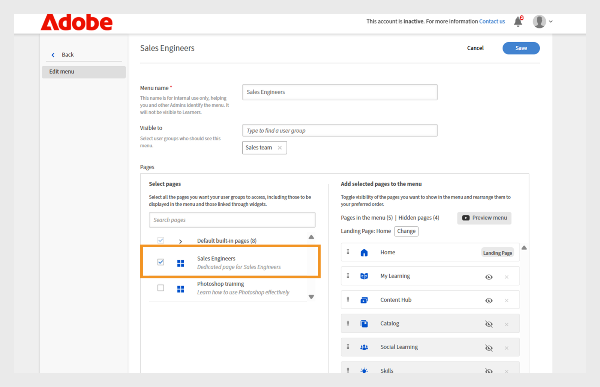

# Create a menu

As an administrator at a financial company with two main teams, Sales and Customer Success Managers (CSM), you should create separate menus with their respective pages. This allows learners to easily find courses that are relevant to their roles under their own menu.

By default, administrators can see default menu on the **[!UICONTROL Menu]** page, which cannot be deleted. This menu includes all the built-in pages currently visible in the learner app.

To create a menu:

1. Log in to Adobe Learning Manager as an administrator.
2. Select **[!UICONTROL Branding]** in the left navigation pane.
3. Select **[!UICONTROL Menu]** and then select **[!UICONTROL Create]**.
 
   
   _Menu screen showing options to view, organize, and create customized menus for different learner groups_

4. Type the **[!UICONTROL Menu name]** (for example, Product Training) and select the user group in the **[!UICONTROL Visible to]** option.
   
   
   _Create menu screen, where administrators can enter a menu name for internal use and specify user groups to control menu visibility_

5. Following are the type of pages available on the Menu:
   * **[!UICONTROL Built-in pages]**: These are the default pages that come with Adobe Learning Manager, such as Home, My Learning, and Catalog. Administrators can't remove the built-in pages from the menu. They can hide the pages from the menu. 
   * **[!UICONTROL Custom pages]**: These are administrator-created pages using Experience Builder. Custom pages allow organizations to design branded, role-specific, or event-based experiences by adding widgets, layouts, and menus tailored to different learner groups.
6. Select **[!UICONTROL Change]** next to **[!UICONTROL Landing Page]** to update the learner's landing page.
 
   
   _Menu configuration screen showing the option to select pages to change the landing page of the Learner's interface_

7. Choose the custom page from the **[!UICONTROL Select pages]** option. Administrators must be able to select only published custom pages, not those in the draft state.

   
   _Page selection screen, highlighting the option to include the custom page for user groups and customize the menu order_

8. Drag and drop to rearrange the pages in the menu.
9. Select **[!UICONTROL Preview menu]** to view the menu before saving it. 
10. Select **[!UICONTROL Save]**.

The created menu will be visible for the selected learners. They can access the custom pages through their Learner UI. 
 
 
_Learner UI displaying the custom page with featured training modules and easy navigation from the sidebar menu_

## Create a submenu

Administrators can create a submenu within the Menu and add custom pages to it. Submenus do not have a landing page.

To create a submenu:

1. Select **[!UICONTROL Create submenu]** in the **[!UICONTROL Menu configuration]** page.
  
   
   _Menu configuration pages highlighting Create submenu option to create submenus for the learners_

2. Select the language and type the submenu title.
3. Select an icon to display next to the submenu.
4. Select **[!UICONTROL Add New Language]** to create the same submenu for different locales. For example, if you add English and French, learners with the interface language English selected will see the English submenu, while learners with French selected will see the French submenu.
  
   
   _Submenu prompt showing options to select the submenu title, language, and icon for display in the menu_

5. Select **[!UICONTROL Proceed]**.
6. Drag and drop the pages under the submenu. 

## Set up hidden pages

The **[!UICONTROL Hide pages]** option allows administrators to keep the Learner UI clean by showing fewer pages. Administrators can hide pages from the menu so learners don't see them in learner UI, but learners can still reach those pages in other ways. For example, the Catalog page can be hidden from the menu but accessed through the learner homepage.
 

_Menu configuration screen showing hidden pages such as Catalog, Social Learning, Skills, and Badges_

>[!NOTE]
>
>Pages within a submenu cannot be hidden directly. To hide a page, first drag it out of the submenu, and then hide it.

## What's next

After setting up pages, widgets, and menus, enhance the overall learner experience by adding customizations using JavaScript and CSS.

