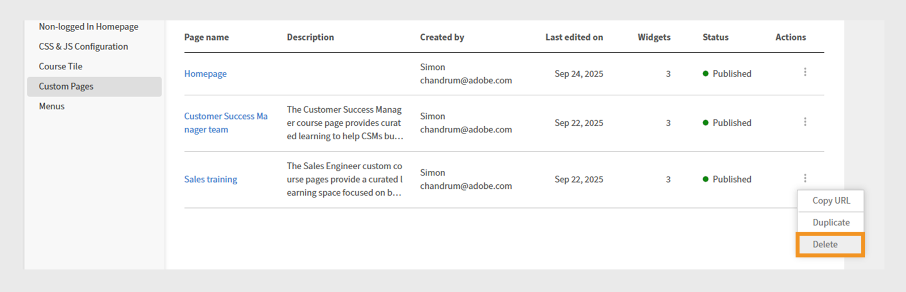

# Create a custom page in Experience Builder

As an administrator at a financial services company, you manage two teams: Sales and Customer Success. Each team has unique learning requirements, but both have been using the same standard learning portal. This has led to confusion, clutter, and low learner engagement.
To solve this challenge without investing in a headless build or waiting for a custom developer solution, you can use Experience Builder in Adobe Learning Manager. With pages, widgets, and menus, you can design branded, role-specific portals in just a few steps, without coding.

To create a custom page for Sales Engineering team in Adobe Learning Manager:

1. Log in to Adobe Learning Manager as an administrator. 
2. Select **[!UICONTROL Branding]** in the left navigation pane. 
3. Select **[!UICONTROL Custom Pages]**.
4. Select **[!UICONTROL Create page]**.

   
   _Custom Pages screen showing the Create page option to design new custom learning experiences_

5. Type the **[!UICONTROL Page name]** (for example, Sales training for Sales team).
6. Type the **[!UICONTROL Page description]**. 
 
   
   _Sales training page setup in Adobe Learning Manager, showing fields for page name, description, type, URL, and icon configuration for creating a targeted sales training portal_

7. Select the page type from the following:

   * **[!UICONTROL Build using ALM widgets]**: Administrator can create a page using the existing Adobe Learning Manager widgets. Type the custom string in the Page URL field. This string will be appended to your custom page's URL.
   * **[!UICONTROL External page]**: The administrator can add a URL for the external page. If you select the page type as external, type the external page URL in the Page URL text field.

8. Select the **[!UICONTROL Change icon]** to change the page's icon.
9. Select **[!UICONTROL Add New Language]** to add the default language for the page. 
10. Select **[!UICONTROL Save]**. 

The page has been created and saved as a draft in the Custom Pages section. Administrators can edit and design the drafted pages using the widgets. 

The next step is to add a layout to the custom page, where you can add and configure widgets.

## Page layout in Experience Builder

Design your page by selecting the appropriate section layout from the dropdown menu. The maximum width for any layout is 1212 pixels. Choose from the following section options based on how many widgets you want to add and their desired size:

* **[!UICONTROL 1 column - Full section width]**: The content spans the entire width of the section, providing maximum space.
* **[!UICONTROL 2 columns - 1/2 section width each]**: The section is split evenly into two equal-width columns.
* **[!UICONTROL 2 columns - 2/3 and 1/3 section width]**: The main content occupies two-thirds of the width, while side content uses one-third.
* **[!UICONTROL 2 columns - 1/3 and 2/3 section width]**: Side content takes one-third, and main content takes two-thirds of the section.
* **[!UICONTROL 3 columns - 1/3 section width each]**: The section divides into three equal-width columns.

>[!NOTE]
>
>A maximum of 10 widgets can be added vertically in all layouts, except the 1 column - Full section width layout.

To select the layout for Sales training page in Experience Builder:

1. Log in to Adobe Learning Manager as an administrator. 
2. Select **[!UICONTROL Branding]** in the left navigation pane. 
3. Select **[!UICONTROL Custom Pages]** and then select the required page. 
4. Select **[!UICONTROL Page Design]**.  
5. Select **[!UICONTROL Edit]**. 
 
   
   _Page design edit screen for a Sales training custom page, highlighting the Edit button for add page sections, widgets, and layout_

6. Choose the options from **[!UICONTROL Select section layout]** dropdown. 
 
   
   _Section layout selection dialog allows administrators to choose single or multi-column widget arrangements for custom page design_

7. Select **[!UICONTROL Proceed]**.

The added layout has the following options:

* **[!UICONTROL Delete row]**: Remove the row from the layout.
* **[!UICONTROL Fit screen width]**: Adjust the layout so it automatically resizes to fit your screen for better visibility.
* **[!UICONTROL Reorder]**: Change the order of layouts by dragging and dropping them into the desired position.
 

_Page layout displaying the layout options to reorder, expand, or delete the section_

The next step is to add and configure widgets on the custom page.

## Add and configure a widget

Add the required widgets to the Sales training custom pages based on the requirements.

To configure a widget in the Sales training custom page:

1. Select **[!UICONTROL Add widget]** in the layout.

   
   _The page design screen allows administrators to select and add widgets to customize their course pages_

2. Choose the **[!UICONTROL Content Box widget]** and then select **[!UICONTROL Proceed]**. 

   
   _Widget selection screen highlighting the Content Box widget for displaying custom images, text, and action buttons to enhance learner engagement_

3. Type the **[!UICONTROL Title]** and **[!UICONTROL Description]**.
4. Type the text into the **[!UICONTROL Action button label]** and provide a link. 
5. Configure the remaining options. View this [section](/help/migrated/administrators/feature-summary/experience-builder/add-a-widget.md#content-box-widget) to learn more about the **[!UICONTROL Content Box widget]**.

   
   _Content Box widgets screen showing the options to configure the widget_

6. Type the title, description, and action button label in the **[!UICONTROL Content Box widget]** configuration screen for Sales engineers
7. Select **[!UICONTROL Add widget]**.
8. Select **[!UICONTROL Save]** and choose from the following options:
   a. **[!UICONTROL Save as Draft]**: The page will be saved as a draft. The administrator can edit the page later.
   b. **[!UICONTROL Save & Publish]**: The page will be published, and the administrator can add this page to the Menu. 

   
   _Save options allow administrators to choose between saving a page as a draft for future editing or publishing it for learner access_

The page can be saved as a draft or published. Administrators can edit drafts before publishing and can also update and republish published pages.

Follow the same steps to create pages for the Customer Success Manager team.

## Preview the page 

To preview the pages:

1. Log in to Adobe Learning Manager as an administrator.
2. Select **[!UICONTROL Branding]** in the left navigation pane.
3. Select **[!UICONTROL Custom Pages]**.
4. Select the required page and then select **[!UICONTROL Page Design]**.
5. Select **[!UICONTROL Edit]** and then select **[!UICONTROL Preview page]** to view the portal's preview. 
 
   
   _Page preview showing a custom page layout with a banner, featured courses_

6. Select Inspect Mode to view the widget's height and width.
 
   
   _Page preview screen in Experience Builder with Inspect mode toggle highlighted, allowing administrators to review and inspect the widgets_

## Create a page in a different language

Administrators can create multiple locale-specific custom pages by selecting the required languages in Add New Language while creating the page. When multiple languages are added, widget details must be configured separately for each language in its corresponding tab, located next to the default language tab. 

_Administrators can add widget details for additional languages, such as French, alongside the default language_

## Manage the pages lifecycle

Administrators can use the Custom Pages section to edit, delete, and duplicate the pages.

### Edit the page

To edit the custom pages:

1. Log in to Adobe Learning Manager as an administrator.
2. Select Branding in the left navigation pane.
3. Select Custom Pages.
4. Select the required page and then select Edit. 
5. Select Save.

The page will be updated with the changes. 
 

_Edit the custom page, allowing administrators to update the page name, description, and type_

### Delete the page

To delete the page:

1. Log in to Adobe Learning Manager as an administrator.
2. Select Branding in the left navigation pane.
3. Select Custom Pages.
4. Select the required page.
5. Select Action and then select Delete.

_Custom Pages screen displaying options to delete custom pages created for product training_

### Duplicate the page

To delete the page:

1. Log in to Adobe Learning Manager as an administrator.
2. Select Branding in the left navigation pane.
3. Select Custom Pages.
4. Select the required page.
5. Select Action and then select Duplicate. 
 

_Custom Pages screen displaying options to duplicate the custom pages created for product training_

## What's next

After creating the page, add and configure widgets on the custom pages according to your training needs.
