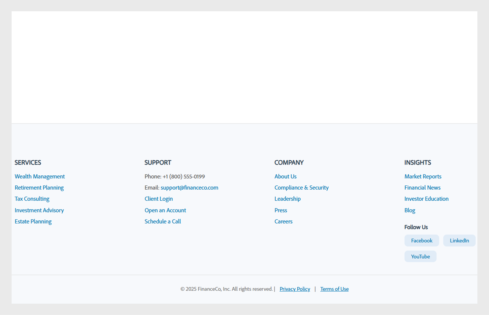
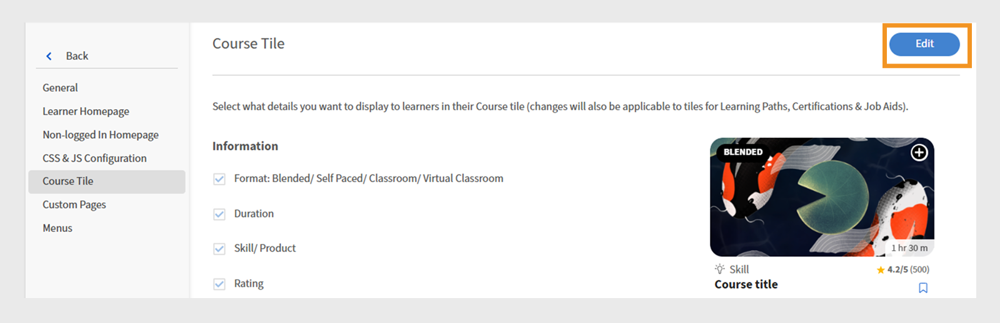

# Customize Experience Builder

## Customize a footer

The footer is displayed at the bottom of the learner interface and usually shows default information configured in the administrator settings. Administrators can replace this with a custom footer to create a branded experience. Using HTML and CSS, they can define the design, layout, and content of the footer to match organizational requirements.

As an administrator of a finance company, you can configure the footer using the custom option. This option allows you to add your own HTML and CSS, giving you complete flexibility to design the footer.

To customize the footer:

1. Log in to Adobe Learning Manager as an administrator.
2. Select **[!UICONTROL Branding]** and then select **[!UICONTROL General]**.
3. Select the **[!UICONTROL Edit]** next to the **[!UICONTROL Footer customization]** option.
 
   
   _General settings screen in Adobe Learning Manager, showing options to enable customization of the footer_

4. Select the toggle button to enable the **[!UICONTROL Footer customization]**.
 
   
   _Footer customization settings in Adobe Learning Manager, showing the toggle to enable custom footer and fields to add HTML or CSS for personalized branding_

5. Type your **[!UICONTROL HTML]** and **[!UICONTROL CSS]** in the respective tabs.
 
   
   _Footer customization screen in Adobe Learning Manager, displaying a custom HTML section for adding, editing, or styling the learner interface footer_

6. Select **[!UICONTROL Preview]** to view the customized footer before saving it.
 
   
   _Preview of a customized learner interface footer in Adobe Learning Manager, featuring categorized links_

7. Select **[!UICONTROL Save]**. 

The customized footer will be displayed to all the learners. 

## Customize course tiles

In a finance company, administrators can set up course tiles to decide what details learners see. For example, they might show the course description and skill name for compliance training but hide ratings or the author's name to keep the focus on mandatory requirements.

To customize the course tiles:

1. Log in to Adobe Learning Manager as an administrator.
2. Select **[!UICONTROL Branding]** and then select **[!UICONTROL Course Tile]**. 
3. Select **[!UICONTROL Edit]**.
    
   
   _Course Tile settings screen in Adobe Learning Manager, showing Edit option to customize the tile_

4. Select the options below to show or hide details related to the course information:

   a. **[!UICONTROL Format]**: Blended/ Self Paced/ Classroom/ Virtual Classroom: Type of the learning object.
   b. **[!UICONTROL Duration]**: Duration of the learning object.
   c. **[!UICONTROL Skill/ Product]**: Display the key skill or product the course covers. 
   d. **[!UICONTROL Rating]**: Display the learner rating of the course.
   e. **[!UICONTROL Author name]**: Displays the name of the course author
   f. **[!UICONTROL Description (appears on hover)]**: Display a short summary of the course when learners hover over the card.
   g. **[!UICONTROL Published date/ due date (appears on hover)]**: Display either when the course was published or the deadline for completion.

5. Select the options below to show or hide details related to course actions:

   a. **[!UICONTROL Add to Learning List button]**: Allow learners to save the course to their personal learning list for future reference.
   b. **[!UICONTROL Save button]**: Saves any changes made to the course settings or preferences.
   c. **[!UICONTROL Enroll / Continue button]**: Allows learners to either enroll in a new course or continue a course they have already started. Hiding this option will also remove the Do Not Recommend and Download actions that appear next to it.
 
   
   _Course tile configuration screen in Adobe Learning Manager, where administrators select the information and actions to display for learners_

6. A preview of the course tile is displayed on the right side of the screen.
 
   
   _Course tile configuration screen in Adobe Learning Manager, highlighting the preview of the course tile_

7. Select **Save**. 

The customized course tile will be displayed to all the learners. 

**Before Customization**


_Course tile in Adobe Learning Manager before customization_

**After customization**


_Course tile in Adobe Learning Manager after customization_

## Customize using JavaScript and CSS

As a finance company administrator, you can customize the learner app by injecting CSS and JavaScript to match your company's branding and regulatory requirements, giving you full control over the app's appearance, layout, and interactive features.

To customize the learner interface using CSS and JS:

1. Log in to Adobe Learning Manager as an administrator.
2. Select **[!UICONTROL Branding]** and then select **[!UICONTROL CSS & JS Configuration]**.
3. Select **[!UICONTROL Edit]**. 
4. Type your custom CSS and JS in the respective tabs.
 
   
   _CSS & JS Configuration screen in Adobe Learning Manager, where administrators can add custom CSS and JS_

5. Select Save. 

The customization will be displayed to all the learners.

**Before customization**

The Learner homepage menu design is based on the Adobe Learning Manager default design. 


_Adobe Learning Manager Learner home page before customization_

**After customization**

After adding the following CSS and JS, the learner homepage menu has been updated based on the customization.

Sample CSS:

```
p{
display:block;
}

.withExtraMargin{
margin-right: 100px!important;
}
.alm-footer-extraMargin{
margin-top:0;
}

.alm-layout-almLayoutContainer{
margin: 0;
    margin-bottom: 5rem;
}
#page-756 #category-970151 .alm-category-card-cardLink
{
    height: 400px;

}
#page-756 #category-970151 .alm-category-card-header
{
height: 240px!important;
}
#page-656 .alm-category-card-cardLink{
    height: 380px;
background: white;
}
#page-656 .alm-category-card-header{
height: 200px!important;
}

#page-746 #html-636797 {
    background-color: #f7f9fc;
}

#page-746 .alm-layout-almLayoutContainer{
row-gap:0;
margin-bottom:0;
}

.alm-category-card-cardLink{
transition: border .3s ease;
}
.navText{
       font-size: 16px;
    cursor: pointer;
}
.submenuDownCaret{
display:none;}
.alm-catalog-container-pageContainer{
max-width: 1720px;
    width: 100%;
    padding: 0 40px;
    padding: 0 40px;
}


.pagenavbarcontainer.newNavbarContainer{
width: 1230px;
    margin: 0 auto;
}
div[automationid="learner-menu-inside-header"]{
margin-right:100px!important;
}
#searchScope,.searchSeparator,#searchInDropdown{
display:none!important;
}
#right-navbar{
    margin-right: 0;
}
#companyLogoImg{
cursor:pointer;
max-width:190px;
}
.alm-catalog-container-filtersContainer{
width:340px;
}
.alm-training-card-v2-imageFlipContainer{
border:none;
}
.newSearchBoxContainer{
border-radius: 5px !important;
    border-width: 2px !important;
    border-color: rgb(5, 32, 34) !important;
}
.searchBoxFlex{
width:250px!important;
flex-direction: row-reverse;
    padding-right: 10px;
}
.searchPlaceholderIcon svg{
    height: 16px;
    width: 16px;
}
.searchPlaceholderIcon svg path{
fill: black;
}
#page-656 .alm-layout-almLayoutContainer {
    padding-bottom: 5rem;
margin-bottom:0!important;
}
#page-656 .alm-strip-widget-header-stripHeaderContainer{
display:none;
}
#page-656 .content-wrapper{
padding-bottom:50px;
}
.myspan{
position: absolute;
    bottom: 10px;
    display: block;
    width: 85%;
    margin-left: 20px;
    margin-right: 20px;
    border-top: 1px solid #efefef !important;
    color: #5a697c !important;
    text-align: right;
    padding-top: 5px;
}
.alm-app-wrapperComponent{
padding-bottom:100px;}


@media (max-width: 768px) {
#page-656 .alm-category-widget-cardRow{
   flex-direction: column;
gap: 40px;
 }
#page-656 .alm-category-widget-stripCardContainerRow{
    width: 100%;
    display: flex;
    justify-content: center;
  }
}

@media (max-width: 768px) {
    .container2-right {
        display: none!important;
    }
.container-1 .content-wrapper{
    padding: 0 20px!important;
 }
}
```

Sample JS:

```
console.error("Hello Error")

setTimeout(() =>{
// Step 1: Check if #category-284977 is present
const categoryElement = document.querySelector('#category-284977');

if (categoryElement) {
  // Step 2: Find all elements with .alm-category-card-cardLink
  const cardLinks = categoryElement.querySelectorAll('.alm-category-card-cardLink');

  // Step 3: Loop over them and append span with random calculation
  cardLinks.forEach((link, index) => {
    const span = document.createElement('span');


    // Calculate number = (index+1) * 5
    let number = (index + 1) * 5;
if(index === 2){
number = number +2;
}
if(index == 3){
number = number - 7;
}

    span.textContent = `${number} courses`;
    span.classList.add('myspan');
    link.appendChild(span);
  });
}

},2000)
```

 
_Adobe Learning Manager Learner homepage after customization_

## Customize a widget

Administrators can customize widgets on custom pages by applying CSS classes. For example, they can align the text in a Content Box widget or adjust the spacing between course tiles in the Course & Paths widget.

>[!TIP]
>
>Inspect the learner page to identify the styles you want to modify. Copy the relevant CSS classes and paste them into the CSS & JS Configuration page to apply your customizations.

**Before customization**

The following screen is the Sales Engineers training page before adding the CSS customization.


_Sales Engineer learner page before customization_

**After customization**

After adding the following CSS classes, the learner page is updated according to the styles defined in those classes. Based on the CSS, the text in the Content Box widget has been aligned to the left, and the course tiles now have increased spacing between them.

```
.alm-custom-content-box-center {
    align-items: baseline;
    text-align: initial;
}
.alm-training-card-v2-imageContainer {
    border: 14px solid var(--prime-color-white);
    border-radius: -1px;
    height: 106%;
    position: relative;
    transition: all .1s ease-in-out;
}
.alm-course-path-widget-cardRow {
    display: flex;
    gap: 135px;
    margin: 0 0 21px;
    padding: 10px;
}
```
 

_Sales Engineer learner page after customization_

### Predefined CSS Classes for Widgets

The following are some predefined CSS classes available for widgets.

|Widget Name |Container CSS|
|---|---|
|Calendar |alm-calendar-widget-container|
|Category |alm-category-widget-container|
|Category Cards |alm-category-card-container|
|Compliance |alm-compliance-container|
|Course & Paths |alm-course-path-widget-container|
|Course & Paths LO Cards|alm-training-card-v2-card|
|Content Box |alm-custom-content-box-container|
|Gamification |alm-leaderboard-container|
|Social Learning |alm-social-learning-container|
