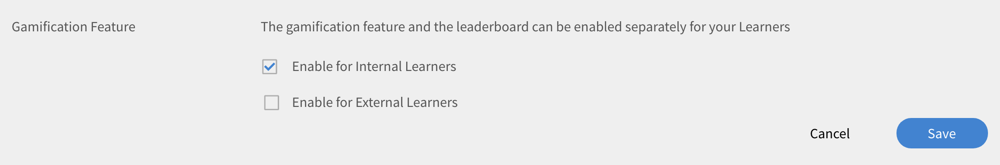

# Gamification {#gamification}

Gamification is the use of game thinking and game mechanics in non-game contexts to engage users in earning points while learning.

# Overview {#overview}

Learning Manager allows you to apply a structural gamification layer to the content to engage learners and motivate them to achieve their learning goals. It allows the learners to score points for various learning activities and achieve bronze, silver, gold and platinum levels.

By default, some sample gamification points and data is available for users to understand the pattern. You can modify the points accordingly.

A sample illustration is provided below that shows all the tasks and points.

 

# Gamification settings {#gamificationsettings}

To access the settings, follow the steps below:

1. Log in as an Administrator and on the left pane, click **Gamification**.
1. When you create a new Learning Manager account, gamification is disabled by default. To enable it, click **Enable** on the upper- right corner of the page.

# Administrator actions {#administratoractions}

Administrator can create a list of confidential users, reset gamification points, and disable/enable gamification feature for learners. Click the Actions drop-down list at the upper-right corner of the page to view the actions as shown in the below snapshot.

 

# Confidentiality settings {#confidentialitysettings}

If required, you can make some higher management users as confidential users. Confidential user's gamification activities are not visible to other learners in the leaderboard.

Confidentiality settings can be applied for both internal and external users.

1. Click Gamification > Settings > Confidentiality Settings.

1. From the listed users, click the check-box against user name and click Hide to make the user as confidential user.  
   **Note** 
   You can identify the confidential users in the listed users by the tick mark in check box against the user name.

1. Click Confidential Users tab to view the list of confidential users. By default, they are not visible. Click the drop-down arrow icon to view the list.
1. Click the check box against the user name in the confidential users list and click Add to remove the users from the confidential list.

# Reset gamification {#resetgamification}

You can reset the gamification points earned by learner and also reset the configuration settings. If you choose to reset user scores, all the points earned by users are erased and reset to zero. If you choose to reset user scores and configuration settings, then all the default points assigned to levels and tasks are reset to zero.

Reset gamification settings can be applied for both internal and external users.

To reset learner score and configuration, click Reset Gamification and choose an option as per your requirement. You can choose between Reset Learner Scores only and Reset Learner Scores & the Configuration Settings. Once selected, click OK.

 

# Disable gamification {#disablegamification}

Click Gamification > Gamification Feature. This allows you to enable the gamification feature and the leaderboard separately for your Learners. Select between Enable for Internal Learners and Enable for External Learners as per the requirement and click OK. All the points are retained when you enable the gamification again.

You can disable gamification for both internal and external users.

# Set up points {#setuppoints}

Administrators can set up gamification points for learners by following the steps below:

1. Click Gamification after you log in as an Administrator.  
   A page appears with a list of bronze, silver, gold, and platinum levels and the required points to achieve each level. A list of tasks and corresponding points are displayed.
1. Click Edit icon adjacent to each task to set up the points.
1. Modify the frequency of occurrence for tasks such as completing a specific number of courses per month or quarter or a year.
1. Click Save.

# Tasks {#tasks}

There are five gamification tasks of learners for which Administrator can set the points. An illustration depicting all the learners tasks and points is shown below:

**Note** 
Gamification points for learners within a particular task are not cumulative. But, the points are added to learners account cumulatively if the learners get these points across different tasks. 

While assigning courses to points, administrator has to ensure that the learners get the points progressively.

**For Fast learner**

This task is applicable when a learner completes a specific number of courses within a month/quarter/year. This task is to encourage fast learners.

You can see the following possible scenarios:

1. When learners complete two courses within a month/quarter/year, they get 20 points.
1. When learners complete four courses within a month/quarter/year, they get 100 points.
1. When learners complete eight courses, they get 300 points.
1. When learners complete ten courses, they get 500 points.

**Note** 
Administrator can modify the time period and the number of courses required to complete to earn corresponding points.

Within a task, points are not accorded to learners cumulatively. For example, say that a learner completes couple of courses and get 20 points. When learners complete four courses, they get 100 points but the existing 20 points are not considered.

**For Self driven learner (a)**

This task is applicable when learners enroll for the prescribed number of courses and complete within a month/quarter/year. In this case, Administrator can enable this task to allocate points and encourage them.

Possible scenarios:

1. When learners enroll for one course within a month/quarter/year, they get 50 points.
1. When learners enroll for two courses within a month/quarter/year, they get 150 points.

**Note** 
Administrator can modify the time period and the number of courses.

**For Self driven learner (b)**

This task is applicable when learners enroll and complete more number of courses than required to complete in a month/quarter/year. In such cases, Administrator can enable this task to allocate points and encourage them.

Possible scenarios for learners enrollment of courses in addition to their allotted courses:

1. When learners enroll for one course within a month/quarter/year, they get 20 points.
1. When learners enroll for two courses within a month/quarter/year, they get 100 points.
1. When learners enroll for three courses within a month/quarter/year, they get 300 points.
1. When learners enroll for four courses within a month/quarter/year, they get 500 points.

**Note** 
Administrator can modify the time period and the number of courses. For example, the third scenario can be modified to five courses instead of three to gain 80 points.

**For Upskill (a)**

This task is applicable when learners complete a particular number of competencies. The administrator can choose this task to encourage learners to gain as many competencies as possible.

Possible scenarios for Upskill in competencies:

1. When learner achieves one competency, they gain 100 points.
1. When a learner achieves two competencies, they gain 300 points.
1. When a learner achieves three competencies, they gain 600 points.
1. When a learner achieves four competencies, they gain 900 points.

**Note** 
The time period is not applicable for this task. The administrator can modify the number of courses for each scenario.

**For Upskill (b)**

This task is applicable whenever learners complete each higher level within a competency.

Possible scenarios for upskill in levels within a particular competency:

1. When learners achieve one level, they get 100 points.
1. When learners achieve two levels, they get 200 points.
1. When learners achieve three levels, they get 500 points.

**Note** 
Time period is not applicable for this task. If learners achieve higher level and then achieve lower level of a competency, then they gain points only for the higher level.

**Early completion points**

This task is applicable for learners when they become first N learners to complete the course.

Possible scenario:  
When a learner becomes one of the first 10 learners to complete the course he/she gets 100 points.

**Timely completion points**

This task is applicable for learners when they complete a course within a stipulated number of days after enrolling to the course.

Possible scenario:  
When learners complete a course within 10 days of course commencement, they get 100 points.

# Group level gamification {#grouplevelgamification}

Administrators can define the scope of gamification by changing the scope settings. You can selectively enable gamification among similar profile users, groups or location.

1. In Administrator login, click Gamification at the left pane.   
1. Open Gamifications > Settings > Scope settings. Gamification Scope Settings dialog appears.

   

1. 
   Click the option Enable Scope Settings. 

1. Select the User Characteristic from the drop-down list. A sample screenshot is shown as follows: 

   

1. Select the value corresponding to the user characteristic you have chosen. For example, if you selected user characteristic as profile, then you need to select the value from the drop-down list. A sample profile values are shown in the screenshot below for your reference.

   

1. Click **Save.**

