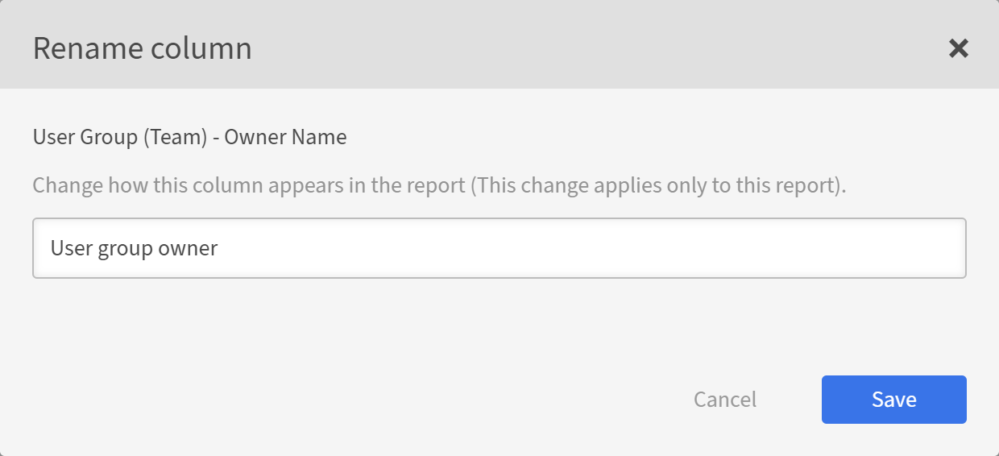
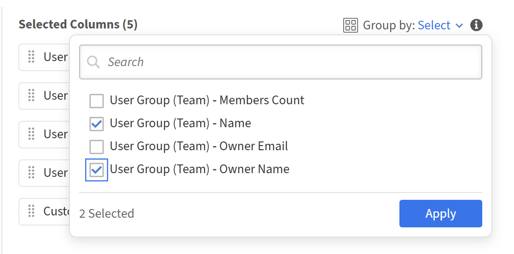

# Get started with Report Builder

## Overview

Report Builder includes 15 pre-built templates designed for the most common learning data reporting use cases. Each template is a ready-to-use report configuration with columns, filters, group-by settings, and sorting already applied. Templates are read-only. You can preview them or duplicate them to create an editable copy.

## About templates

Templates are ready-to-use report configurations provided by Adobe Learning Manager. Each template is designed for a specific use case, such as enrollment and completion tracking, compliance reporting, or instructor performance. Templates appear under the **Templates** tab in Report Builder. Each template is built from one or more datasets and produces a specific type of output. To customize a template, select **Duplicate** to create an editable copy in your **Reports** tab while leaving the original unchanged.

## Template catalog

### User Learning Transcript

**Category:** Transcripts, Completion & Progress Tracking

**Description:** Complete learning history for each learner, showing all enrollments, statuses, scores, deadlines, and time spent across all learning object types.

**Use when:** You need a full audit-ready export of learner activity for compliance audits, learner support cases, or integrating ALM data into an external system.

**Applicable audiences:** Customer education, partner education, employee education, sales enablement.

**Datasets used:** User, Learning Object, Transcript (Learning Object)

**Key columns:** User ID, User name, User email, Manager name, User status, Learning Object name, Learning Object type, Enrollment date, Completion date, Status, Progress percent, User highest score, Completion deadline, Overdue, Time spent (minutes)

**Filters applied:** Enrollment date within last year; Catalog = Default Catalog

### Learner Progress Summary

**Category:** Transcripts, Completion & Progress Tracking

**Description:** Tracks each learner's progress against assigned learning paths and courses, including hierarchy mapping via Parent LO ID.

**Use when:** You want to see where each learner stands within a learning path -* who is in progress, who is overdue, and who is at risk of missing a deadline.

**Applicable audiences:** Customer education, partner education, employee education, sales enablement.

**Datasets used:** User, Learning Object, Transcript (Learning Object)

**Key columns:** User ID, User name, User email, Manager name, Learning Object ID, Learning Object name, Learning Object type, Parent Learning Object ID, Enrollment date, Completion deadline, Status, Progress percent, Overdue, Starting date, Completion date

**Filters applied:** Enrollment date within last year; Learning Object type = Learning Path or Course; Catalog = Default Catalog

### Active Learners Dashboard

**Category:** Learner Engagement & Platform Usage

**Description:** Monthly summary of platform engagement per learner, showing courses accessed, completions, and total time spent.

**Use when:** You want to identify your most and least engaged learners over the past year and see how engagement trends month on month.

**Applicable audiences:** Customer education, partner education, employee education, sales enablement.

**Datasets used:** User, Transcript (Learning Object)

**Key columns:** User ID, User name, User email, Manager name, User status, Last access date (Month), Unique courses accessed, Completed enrollments, Total time spent (minutes)

**Filters applied:** User last access date within last year; User status = Active; Catalog = Default Catalog

**Group by:** User fields + Month of last access date

**Aggregates:** Count Unique on Learning Object ID (Unique courses accessed), Count If Status = Completed (Completed enrollments), Sum on Time Spent (Total time spent)

### Inactive Learners Report

**Category:** Learner Engagement & Platform Usage

**Description:** Identifies active users with no platform access in the last year, showing their last enrollment and completion dates.

**Use when:** You need to find dormant accounts for re-engagement campaigns, license reviews, or account cleanup.

**Applicable audiences:** Customer education, partner education, employee education, sales enablement.

**Datasets used:** User, Transcript (Learning Object)

**Key columns:** User ID, User name, User email, Manager name, User creation date, User last access date, Last enrollment date, Last completion date

**Filters applied:** User last access date NOT within last year; User status = Active; Catalog = Default Catalog

**Group by:** User ID, User name, User email, Manager name, User creation date, User last access date

**Aggregates:** Max on Enrollment date (Last enrollment date), Max on Completion date (Last completion date)

### New Learner Adoption

**Category:** Learner Engagement & Platform Usage

**Description:** Tracks onboarding engagement of users created in the last year, for example, first enrollments, completions, and total courses accessed.

**Use when:** You want to measure how quickly new users move from account creation to their first enrollment and completion, a key onboarding health metric.

**Applicable audiences:** Customer education, partner education, employee education, sales enablement.

**Datasets used:** User, Transcript (Learning Object)

**Key columns:** User ID, User name, User email, Manager name, User creation date, User last access date, First enrollment date, First completion date, Total courses accessed, Completed courses

**Filters applied:** User creation date within last year; User status = Active; Catalog = Default Catalog

>[!NOTE]
>
>This template uses a left join between User and Transcript datasets so that users with zero enrollments still appear in the report. This makes it possible to identify new users who have not yet started their learning journey.

**Group by:** User ID, User name, User email, Manager name, User creation date, User last access date

**Aggregates:** Min on Enrollment date (First enrollment date), Min on Completion date (First completion date), Count Unique on Learning Object ID (Total courses accessed), Count If Status = Completed (Completed courses)

### Learning by User Group

**Category:** Users, Groups & Org Structure

**Description:** Compares learning activity across organizational segments - active learners, courses accessed, completions, and time spent per group.

**Use when:** You want to benchmark engagement across departments, job functions, or any active field-based user group.

**Applicable audiences:** Customer education, partner education, employee education, sales enablement.

**Datasets used:** User Group (Active Field), Transcript (Learning Object)

**Key columns:** User Group ID, User group name, Members count, Active learners, Total unique courses accessed, Completed enrollments, Total time spent (minutes)

**Filters applied:** Enrollment date within last year; Catalog = Default Catalog; User Group (Active Field) name = Profile (Active Field)

**Group by:** User Group ID, User group name, Members count

**Aggregates:** Count Unique on User ID (Active learners), Count Unique on Learning Object ID (Total unique courses accessed), Count If Status = Completed (Completed enrollments), Sum on Time Spent (Total time spent)

### Learning by Location

**Category:** Users, Groups & Org Structure

**Description:** Compares learning activity across geographic locations - active learners, courses accessed, completions, and time spent per location.

**Use when:** You need to benchmark learning health across regions without manual data slicing. Useful for global organizations with geographically distributed learners.

**Applicable audiences:** Customer education, partner education, employee education, sales enablement.

**Datasets used:** User Group (Active Field), Transcript (Learning Object)

**Key columns:** User Group ID, User group name, Members count, Active learners, Total unique courses accessed, Completed enrollments, Total time spent (minutes)

**Filters applied:** Enrollment date within last year; Catalog = Default Catalog; User Group (Active Field) name contains "Location"

**Group by:** User Group ID, User group name, Members count

**Aggregates:** Count Unique on User ID (Active learners), Count Unique on Learning Object ID (Total unique courses accessed), Count If Status = Completed (Completed enrollments), Sum on Time Spent (Total time spent)

### Learning by Manager

**Category:** Users, Groups & Org Structure

**Description:** Summarizes learning performance of each manager's full team hierarchy - active learners, completions, and time spent.

**Use when:** You want to compare team engagement across managers and identify teams with low completion rates or time-spent relative to team size.

**Applicable audiences:** Employee education, sales enablement.

**Datasets used:** User Group (Team), Transcript (Learning Object)

**Key columns:** Manager ID, Manager name, Manager email, Members count (full team), Active learners, Total unique courses accessed, Completed enrollments, Total time spent (minutes)

**Filters applied:** Enrollment date within last year; Catalog = Default Catalog

**Group by:** Owner ID (Manager ID), Owner name, Owner email, Members count

**Aggregates:** Count Unique on User ID (Active learners), Count Unique on Learning Object ID (Total unique courses accessed), Count If Status = Completed (Completed enrollments), Sum on Time Spent (Total time spent)

>[!NOTE]
>
>This template uses the User Group (Team) dataset, which captures the full team hierarchy under each manager. No additional user group filter is needed.

### Enrollment Summary

**Category:** Transcripts, Completion & Progress Tracking

**Description:** Course-level enrollment counts broken down by status - completed, in progress, and not started - for each learning object.

**Use when:** You want a quick view of the enrollment funnel for each course - how many learners started, how many are in progress, and how many have finished.

**Applicable audiences:** Customer education, partner education, employee education, sales enablement.

**Datasets used:** Learning Object, Transcript (Learning Object)

**Key columns:** Learning Object ID, Learning Object name, Learning Object type, Learning Object status, Total enrolled learners, Completed enrollments, In progress enrollments, Not started enrollments

**Filters applied:** Enrollment date within last year; Catalog = Default Catalog

**Group by:** Learning Object ID, name, type, status

**Aggregates:** Count Unique on User ID (Total enrolled learners), Count If Status = Completed, Count If Status = In Progress, Count If Status = Not Started

### Enrollment Trend Analysis

**Category:** Transcripts, Completion & Progress Tracking

**Description:** Month-over-month enrollment and completion counts per learning object, showing how learner uptake evolves over time.

**Use when:** You want to see when enrollment spikes and fades for each course and whether completions follow enrollments in the same month.

**Applicable audiences:** Customer education, partner education, employee education, sales enablement.

**Datasets used:** Learning Object, Transcript (Learning Object)

**Key columns:** Learning Object name, Learning Object type, Enrollment date (Month), Total enrolled learners, Completed enrollments

**Filters applied:** Enrollment date within last year; Catalog = Default Catalog

**Group by:** Learning Object name, Learning Object type, Month of Enrollment date

**Aggregates:** Count Unique on User ID (Total enrolled learners), Count If Status = Completed (Completed enrollments)

### Course Completion Report

**Category:** Transcripts, Completion & Progress Tracking

**Description:** Per-course completion breakdown with status counts, last completion date, average progress, and average time spent.

**Use when:** You want to identify underperforming content - courses with high enrollment but low completion, or courses where average progress is low (indicating early drop-off).

**Applicable audiences:** Customer education, partner education, employee education, sales enablement.

**Datasets used:** Learning Object, Transcript (Learning Object)

**Key columns:** Learning Object ID, Learning Object name, Learning Object type, Learning Object status, Total enrolled learners, Completed enrollments, In progress enrollments, Not started enrollments, Last completion date, Average progress %, Average time spent (minutes)

**Filters applied:** Enrollment date within last year; Catalog = Default Catalog

**Group by:** Learning Object ID, name, type, status

**Aggregates:** Count Unique on User ID, Count If Status = Completed/In Progress/Not Started, Max on Completion date, Average on Progress percent, Average on Time Spent

### Completion Trend Dashboard

**Category:** Transcripts, Completion & Progress Tracking

**Description:** Monthly completion counts per learning object, with average time spent and progress, scoped only to completed enrollments.

**Use when:** You want to track whether completion rates are growing month on month, and whether learners who finish are doing so thoroughly or rushing through.

**Applicable audiences:** Customer education, partner education, employee education, sales enablement.

**Datasets used:** Learning Object, Transcript (Learning Object)

**Key columns:** Learning Object name, Learning Object type, Completion date (Month), Total learners completed, Average time spent (minutes), Average progress %

**Filters applied:** Completion date within last year; Status = Completed; Catalog = Default Catalog

**Group by:** Learning Object name, Learning Object type, Month of Completion date

**Aggregates:** Count Unique on User ID (Total learners completed), Average on Time Spent, Average on Progress percent

>[!NOTE]
>
>This template filters to Completed status before grouping, ensuring that only records with a valid Completion date are included and that null dates do not distort the monthly trend.

### Time to Completion

**Category:** Transcripts, Completion & Progress Tracking

**Description:** Measures actual time spent completing each course, average, minimum, and maximum, compared against the designed duration.

**Use when:** You want to identify courses where learners take significantly longer or shorter than expected to complete, which may indicate content length or difficulty issues.

**Applicable audiences:** Customer education, partner education, employee education, sales enablement.

**Datasets used:** Learning Object, Transcript (Learning Object)

**Key columns:** Learning Object ID, Learning Object name, Learning Object type, Duration (minutes, designed), Total learners completed, Average time spent (minutes), Min time spent (minutes), Max time spent (minutes)

**Filters applied:** Completion date within last year; Status = Completed; Catalog = Default Catalog

**Group by:** Learning Object ID, name, type, Duration (minutes)

**Aggregates:** Count Unique on User ID, Average/Min/Max on Time Spent

**Note:** Duration (the designed course length) is included in the Group By so it appears in the same row as actual time spent - enabling direct comparison without a calculated field. A wide gap between Min and Max time spent suggests inconsistent learner experiences.

### Overdue Learning Assignments

**Category:** Compliance & Certification

**Description:** Lists active users with overdue mandatory enrollments, showing deadline, current status, and progress for each.

**Use when:** You need an actionable list of non-compliant learners to escalate to managers or trigger re-enrollment workflows.

**Applicable audiences:** Partner education, employee education, sales enablement.

**Datasets used:** User, User Group (Active Field), Learning Object, Transcript (Learning Object)

**Key columns:** User ID, User name, User email, Manager name, User Group (Active Field) name, Learning Object ID, Learning Object name, Learning Object type, Enrollment date, Completion deadline, Status, Progress percent, Overdue

**Filters applied:** Overdue = Yes; Status = In Progress OR Not Started; Completion deadline within last year; Catalog = Default Catalog; User status = Active; User Group (Active Field) name = Profile (Active Field)

**No group by applied** The output is one row per overdue enrollment, preserving full learner and course detail for escalation.

>[!NOTE]
>
>The Status filter (In Progress OR Not Started) acts as a safeguard to exclude any records incorrectly flagged as overdue despite being completed.

### Mandatory Training Status

**Category:** Compliance & Certification

**Description:** Full compliance view of all enrollments with a completion deadline, with all statuses included, not just overdue.

**Use when:** You need a complete compliance picture rather than just violations, for example, to report overall mandatory training completion rates to leadership.

**Applicable audiences:** Employee education, sales enablement.

**Datasets used:** User, User Group (Active Field), Learning Object, Transcript (Learning Object)

**Key columns:** User ID, User name, User email, Manager name, User Group (Active Field) name, Learning Object ID, Learning Object name, Learning Object type, Enrollment date, Completion deadline, Completion date, Status, Progress percent, Overdue

**Filters applied:** Completion deadline is not blank; Enrollment date within last year; Catalog = Default Catalog; User status = Active; User Group (Active Field) name = Profile (Active Field)

**No group by applied** All statuses included (completed, in progress, not started, overdue), giving a full compliance picture.

**Note:** Filtering on "Completion deadline is not blank" is the key logic that consistently identifies mandatory training across all course types, regardless of how mandatory status is configured.

## Template quick-reference

| **#** | **Template name**            | **Category**                        | **Internal edu** | **External (customer/partner) edu** |
|--------|------------------------------|-------------------------------------|------------------|-------------------------------------|
| 1      | User Learning Transcript     | Transcripts, Completion & Progress  | ✓                | ✓                                   |
| 2      | Learner Progress Summary     | Transcripts, Completion & Progress  | ✓                | ✓                                   |
| 3      | Active Learners Dashboard    | Learner Engagement & Platform Usage | ✓                | ✓                                   |
| 4      | Inactive Learners Report     | Learner Engagement & Platform Usage | ✓                | ✓                                   |
| 5      | New Learner Adoption         | Learner Engagement & Platform Usage | ✓                | ✓                                   |
| 6      | Learning by User Group       | Users, Groups & Org Structure       | ✓                | ✓                                   |
| 7      | Learning by Location         | Users, Groups & Org Structure       | ✓                | ✓                                   |
| 8      | Learning by Manager          | Users, Groups & Org Structure       | ✓                | ✗                                   |
| 9      | Enrollment Summary           | Transcripts, Completion & Progress  | ✓                | ✓                                   |
| 10     | Enrollment Trend Analysis    | Transcripts, Completion & Progress  | ✓                | ✓                                   |
| 11     | Course Completion Report     | Transcripts, Completion & Progress  | ✓                | ✓                                   |
| 12     | Completion Trend Dashboard   | Transcripts, Completion & Progress  | ✓                | ✓                                   |
| 13     | Time to Completion           | Transcripts, Completion & Progress  | ✓                | ✓                                   |
| 14     | Overdue Learning Assignments | Compliance & Certification          | ✓                | ✓                                   |
| 15     | Mandatory Training Status    | Compliance & Certification          | ✓                | ✗                                   |

## Use a Report Builder template

Get started quickly in Adobe Learning Manager Report Builder by customizing a pre-built template for common reporting use cases.

1. Log in to Adobe Learning Manager as an administrator.
2. Select **Reports** in the left pane and then select **Report Builder**.

3. Select the **Templates** tab.
4. Browse the available templates. Each template is named for its use case.

    

5. Select a template name to open its read-only preview. For this example, select the **Compliance % for User's Team** template. Review the columns, applied filters, and sort order.
6. Select **Duplicate**.

    

When you duplicate a template, Report Builder opens an editable copy with the template's existing configuration pre-loaded. The report name, description, columns, filters, and sorting are all editable before you save.

## Name and describe the report

1. In the **Name** field, replace the default name (for example, *copy of Compliance % for User's Team*) with a unique name for your report. A name is required.
2. In the **Description** field, enter a short summary of what the report contains. This helps other admins understand the report's purpose when they view or edit it.

## Add and configure columns

The **Columns** section has two panels: **Select columns** on the left and **Selected Columns** on the right.

### Add a column

1. In the **Select columns** panel, expand a dataset by selecting its name. For example, **Catalog** or **Active Field User Group**.
2. Select the **+** icon next to the column you want to add. The column appears in the **Selected Columns** panel on the right.

    

3. To add the same column more than once. For example, to apply two different aggregates to the same field. Select **+** again for that column.

### Reorder columns

Drag the handle on the left of any column row in the **Selected Columns** panel to move it to a different position. The column order in the panel matches that in the downloaded report.

### Rename a column

1. Select the **edit** (pencil) icon on a column row.

    

2. Enter an alias. The alias appears as the column header in the downloaded report instead of the default field name.

    

### Remove a column

Select the **x** icon on a column row to remove it from the report.

## Apply group by

The **Group by** control appears at the top of the **Selected Columns** panel.

1. Select **Group by: Select**.

    

2. Select the columns to group by. You can select more than one. In the screenshot, the report is grouped by User Group (Team)-Name and User Group (Team)-Owner Name.
3. Each selected group-by column appears as a tag below the **Group by** control. To remove a group-by column, select **x** on its tag.

>[!NOTE]
>
>When group by is applied, every column that is not a group-by column must have an aggregate function applied. A column without an aggregate will cause an error.

### Apply an aggregate to a column

1. On any non-group-by column in the **Selected Columns** panel, select **Aggregate by**.
2. Choose a function from the dropdown. In the screenshot, **Learning Object Count** uses **Count Distinct**, aliased as count_of_courses.

    

Available aggregate functions:

| **Function**       | **What it returns**                         |
|--------------------|---------------------------------------------|
| **Count**          | Total number of rows in the group           |
| **Count Distinct** | Number of unique values in the group        |
| **Count If**       | Number of rows matching a value you specify |
| **Sum**            | Total of a numeric field across the group   |
| **Min**            | Lowest value in the group                   |
| **Max**            | Highest value in the group                  |
| **Average**        | Mean value across the group                 |

## Apply filters

The **Filters** section is below the **Columns** section. Filters restrict which rows appear in the report.

1. To add a filter, select the **+** icon at the right of the Filters section.
2. Choose the field to filter on.

    

3. Select an operator and enter or choose a value.

To edit an existing filter, select the **pencil** icon on the filter row. To add a nested filter group, select the **+** icon with brackets on the right of a filter row.

## **Configure sorting**

The **Sorting** section is below the **Filters** section.

1. Select **+ Add sorting** to add a sort.
2. Choose the column to sort by and select **Ascending** or **Descending**.

    

3. Repeat to add secondary sorts. Drag the handle on the left of each sort row to change priority.

>[!TIP]
>
>Always apply at least one sort. Without sorting, row order may differ between downloads of the same report.

## Save the report

Select **Save Report** in the top-right corner. The report is saved to your **Reports** tab and is ready to download.

## Best practices

* Use aliases on every column so the downloaded report has meaningful headers instead of field names like Learning Object - Learning Object ID.
* Use **Count Distinct** instead of **Count** when you want unique records, for example, distinct courses per catalog rather than total rows.

* Apply sorting before saving, especially for reports you'll share or subscribe to.
* Keep the description up to date. Other admins rely on it to understand the report's scope without opening it.
