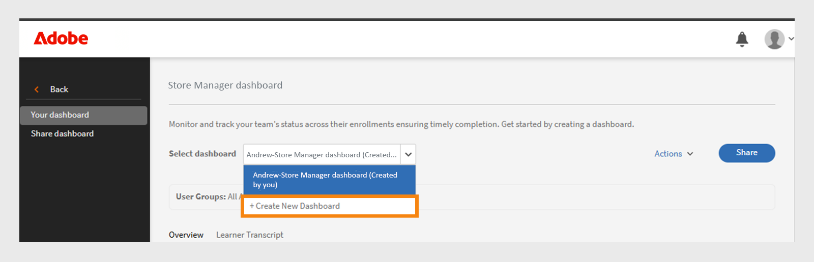

# Group Success Dashboard

The Group Success Dashboard helps administrators and managers track learner engagement, training completion, and skill development at a team level. 

The dashboard offers aggregated insights across various business units, regions, departments, or custom groups, enabling targeted learning interventions and strategic decisions. 

The Group Success Dashboard is utilized by organizations for a variety of purposes. HR teams monitor the onboarding process for new hires and identify any necessary support. Learning and Development leaders compare training completion rates across different regions. Compliance teams ensure that finance employees meet certification requirements. Sales training managers track the completion of product training before launches, while talent development teams monitor the adoption of leadership learning paths among mid-level managers for succession planning.

Group Success Dashboard offers the following:

* **Simplifies learner progress tracking**: The dashboard offers an alternative to the Excel-based learner transcript, allowing for easier and quicker access to information about learners' course enrollments and progress. 
* **Facilitates team management**: The dashboard is particularly useful for managers overseeing small teams, enabling them to frequently check their team members' learning progress on specific courses or learning paths.

Managers (or store managers) handling small teams (less than 50 people) can use the GSD to regularly check how their team is progressing with their courses. This is helpful for quick updates and making sure everyone is completing their training.
The Group Success Dashboard makes it easier to track learner progress. Instead of using Excel files, managers and administrators can use the dashboard to quickly see course enrollments and progress.

Administrator can create dashboards by giving them a name, selecting user groups, and choosing the courses or learning paths. The dashboards can be shared with other administrators or managers.

## Enable the Group Success Dashboard

Administrator must enable the Group Success Dashboard for the account. To enable the Group Success Dashboard in Adobe Learning Manager, follow these steps:

1. Log in as an administrator.
2. Select **[!UICONTROL Settings]** > **[!UICONTROL Reports]** and then select the **[!UICONTROL Dashboard visibility]** toggle.
   
   _Select Settings in the Administrator homepage_
3. Type the dashboard name (e.g., **[!UICONTROL Store Manager Dashboard]**).
   
   _Group Success Dashboard interface_
4. Select **[!UICONTROL Overview Visibility]** to enable the overview section in the dashboard. This section allows you to view the progress of up to 50 learners. 
5. For the **[!UICONTROL Learner Transcript]** section, select the required columns that you want to view.

   * Learner
   * Paths and Courses
   * Status
   * Enrollment date
   * Last access date
   * Completion date

After enabling this feature, administrators can view the **[!UICONTROL Group Success Dashboard]** in the **[!UICONTROL Reports]** section.

_Store Manager Dashboard enabled in Reports_

>[!NOTE]
>
>The **[!UICONTROL Last access date]** column currently displays data for Learning Paths and Certifications. Support for courses is planned for a future update.

## Create Group Success Dashboard

After enabling this feature, administrators can create a dashboard to view learners' progress. To create a dashboard, follow these steps:

1. Log in as an administrator and select the **[!UICONTROL Reports]** page.
 
   
   _Select Reports in the Administrator homepage_

2. Select the **[!UICONTROL Group Success Dashboard]**. The dashboard's name is **[!UICONTROL Store Manager Dashboard]**. 
 
   
   _Select Store Manager Dashboard_

   >[!NOTE]
   >
   >The name you set when enabling the Group Success Dashboard will appear as the dashboard name.

3. Select **[!UICONTROL Create New Dashboard]** from the Select dashboard drop down.
 
   
   _Create a dashboard_

4. Type the dashboard's name.
5. Select a user group to appear in the dashboard.
6. Search the courses or learning paths and select them from the results.
 
   
   _Select user group and courses_

   >[!NOTE]
   >
   >Recurring certificates are not supported in the dashboard.

7. Select **[!UICONTROL Create dashboard]**. 

>[!NOTE]
>
>You can create up to 100 dashboards. 

For larger teams, create a dashboard by selecting the **Default catalog** and **All learners** user group. This includes all courses and learners in the **[!UICONTROL Learner Transcript]** view, making it easier to search for and track each learner's progress.

## View the dashboard

After creating a dashboard, administrator can view the dashboard by following these steps:

1. Log in as an administrator and select **[!UICONTROL Reports]** > **[!UICONTROL Group Success Dashboard]**. The dashboard's name is Store Manager Dashboard. 
2. In the **[!UICONTROL Your dashboards]** section, select the created dashboard from the **[!UICONTROL Select dashboard]** drop down. 
3. The dashboard contains two sections:
   * **[!UICONTROL Overview]**: You can quickly see the learners' progress on individual courses or learning paths. You can view progress up to fifty courses or learning paths and fifty learners at once. If you want to see a specific learner's progress, select the Learner Transcript section.
 
   
   _Overview of the store manager's team_
  
   * **[!UICONTROL Learner Transcript]**: View learner progress by selecting a specific learner or course. Search for a learner within the dashboard to check their learning progress. If you've created the dashboard using the default catalog and included all learners, you can search for any learner to easily review their progress.

   
    _Learner Transcript view_

>[!NOTE]
>
>To download the detailed Learner Transcript, select Go to Report

## Share the dashboard

To share the dashboard with administrators or managers, follow these steps:

1. Select **[!UICONTROL Reports]** > **[!UICONTROL Group Success Dashboard]**. The dashboard's name is Store Manager Dashboard. 
2. Select **[!UICONTROL Share]** in the **[!UICONTROL Your dashboards]** section. 
 
   
   _Share dashboard_

3. Search users or user groups by name and select them.

    
   _Share the dashboard prompt_

4. Select Proceed to share the dashboard.

You can see the shared dashboard details under **[!UICONTROL Reports]** > **[!UICONTROL Group Success Dashboard]** (Store Manager Dashboard) > **[!UICONTROL Shared dashboards]**.
 
 
_Shared dashboard_

>[!NOTE]
>
>The manager or custom administrator can only see the enabled catalogs on the dashboard shared by the administrator.
