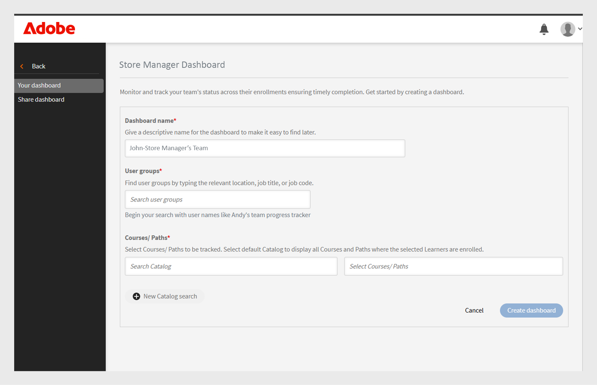
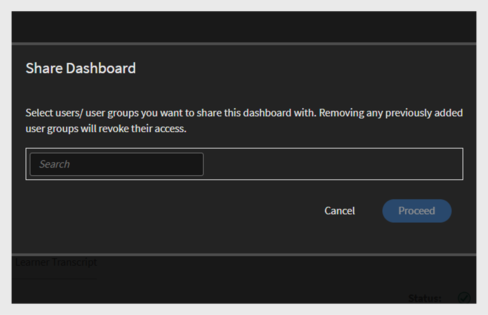
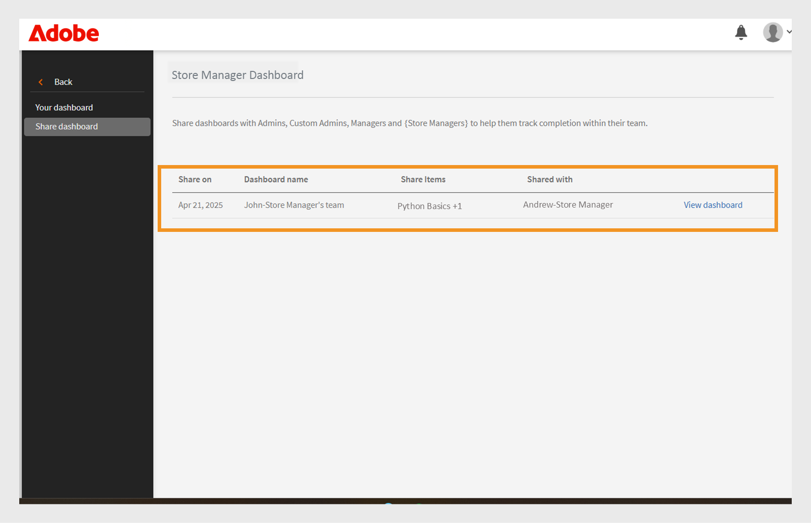

# Group Success Dashboard

## Overview of Group Success Dashboard

The Group Success Dashboard (GSD) in Adobe Learning Manager allows administrators and managers to monitor learner progress in near real time (60-minute delay from enrollment, progress, or completion to reflecting on the dashboard) across departments or user groups. It supports proactive tracking of course completion, enrollment, and pending actions, making it easier to manage learning for teams. View this [article](/help/migrated/administrators/feature-summary/add-users-user-groups.md) to learn more about User groups.

## Key use cases

Group Success Dashboard offers the following:

* **Simplifies learner progress tracking**: The Group Success Dashboard provides a user-friendly, real time view of learner data, reducing the need for Excel-based transcripts. Managers and administrators can quickly view learner enrollments and course progress to support key scenarios such as:

   * **Performance review readiness**: Managers can assess course progress for team members ahead of appraisal cycles.
   * **Compliance monitoring**: Identify learners who haven't completed mandatory trainings.
   * **Team-level tracking**: Franchise, store, or regional managers can ensure their teams are completing required learning on time.

* **Facilitates team management**: The Group Success Dashboard is useful for managers with small teams (under 50 people), like store managers, franchise managers, dealership managers or internal teams. It provides a team view and allows managers to quickly check whether their team has completed the required set of courses to achieve business goals.

## How to use the Group Success Dashboard

An administrator can enable and create the dashboards by giving them a name, selecting user groups, and choosing the courses or learning paths. The dashboards can be shared with other administrators or managers.

### Enable the Group Success Dashboard

Administrator must enable the Group Success Dashboard for the account. To enable the Group Success Dashboard, follow these steps:

1. Log in as an administrator.
2. Select **[!UICONTROL Settings]**and then select **[!UICONTROL Reports]**.
3. Select the **[!UICONTROL Dashboard visibility]** toggle.
4. Type the dashboard name (for example, **[!UICONTROL Store Manager Dashboard]**).
   
   _Fields for dashboard name, user group, and learning path selection_
5. Select **[!UICONTROL Overview Visibility]** to enable the overview section in the dashboard. This section allows you to view the progress of up to 50 learners. 
6. For the **[!UICONTROL Learner Transcript]** section, select the required columns that you want to view.

   * Learner
   * Paths and Courses
   * Status
   * Enrollment date
   * Last access date
   * Completion date

After enabling this feature, administrators can view the Group Success Dashboard in the **[!UICONTROL Reports]** section.

### Create a Group Success Dashboard

Administrators can create up to 100 dashboards to view learners' progress. To create a dashboard, follow these steps:

1. Log in as an administrator and select the **[!UICONTROL Reports]** page.
 
   
   _Select Reports in the Administrator homepage_

2. Select the Group Success Dashboard. The dashboard's name is **[!UICONTROL Store Manager Dashboard]**. 
 
   
   _Select Store Manager Dashboard_

   >[!NOTE]
   >
   >The name you set when enabling the Group Success Dashboard will appear as the dashboard name.

3. Select **[!UICONTROL Create New Dashboard]** from the Select dashboard drop down.
 
   
   _Select the option to create a GSD_

4. Type the dashboard's name.
5. Select a user group to appear in the dashboard.
6. Search the Courses or Learning Paths and select them from the results.
 
   
   _Select user group and courses_

7. Select **[!UICONTROL Create dashboard]**. 

For larger teams, create a dashboard by selecting the **Default catalog** and **All learners** user group in the **[!UICONTROL Learner Transcript]** tab. This includes all courses and learners in the **[!UICONTROL Learner Transcript]** view, making it easier to search for and track each learner's progress.

### View the Group Success Dashboard

After creating a dashboard, administrator can view the dashboard by following these steps:

1. Log in as an administrator.
2. Select **[!UICONTROL Reports]** and then **[!UICONTROL Group Success Dashboard]**. 
   The dashboard's name is Store Manager Dashboard. 
3. In the **[!UICONTROL Your dashboards]** section, select the created dashboard from the **[!UICONTROL Select dashboard]** drop down. 
4. The dashboard is divided into:
   * **[!UICONTROL Overview]**: You can quickly see the learners' progress on individual Courses or Learning Paths. You can view progress up to 50 courses or learning paths and 50 learners at once. If you want to check a specific learner's progress, select the **[!UICONTROL Learner Transcript]** section.
 
   
   _Learning status of learners in the store manager's team_
  
   * **[!UICONTROL Learner Transcript]**: View learner progress by selecting a specific learner or course. Search for a learner within the dashboard to check their learning progress. If you've created the dashboard using the default catalog and included all learners, you can search for any learner to easily review their progress.

   
    _Detailed learner transcript view with columns for enrollment and completion_

>[!NOTE]
>
>To download the detailed Learner Transcript, select **[!UICONTROL Go to Report]** in the **[!UICONTROL Learner Transcript]** tab.

### Share the Group Success Dashboard

Admins can share dashboards with other administrators or managers. Follow the steps to share a dashboard:

1. Select **[!UICONTROL Reports]** and then **[!UICONTROL Group Success Dashboard]**. The dashboard's name is **[!UICONTROL Store Manager Dashboard]**. 
2. Select **[!UICONTROL Share]** in the **[!UICONTROL Your dashboards]** option. 
 
   
   _Select Share button_

3. Search for users or user groups by name and select them.

    
   _Share dashboard with users or user groups_

4. Select **[!UICONTROL Proceed]** to share the dashboard.

You can see the shared dashboard details under **[!UICONTROL Reports]**, select **[!UICONTROL Group Success Dashboard]** (Store Manager Dashboard) and then select **[!UICONTROL Shared dashboards]**.
 
 
_View the shared dashboard_

>[!NOTE]
>
>The manager or custom administrator can only see the enabled catalogs on the Group Success Dashboard shared by the administrator.

### Limitations of Group Success Dashboard

The following are the limitation of Group Success Dashboard:

* Recurring certificates are not supported in the dashboard.
* The **[!UICONTROL Last access date]** column in the **[!UICONTROL Learner Transcript]** tab currently displays data for Learning Paths and Certifications. Support for courses is planned for a future update.

## Selecting learners across multiple user groups

When you select more than one user group, Adobe Learning Manager uses specific rules to determine which learners to include:

* **User groups with the same Active field**: If the user groups use the same field (for example, Location), the system includes all learners from both groups. It combines the values. For example: **Location = Bangalore** and **Location = Chennai**. It includes learners from both locations.
* **User groups with different Active fields**: If the user groups use different fields (for example, Location and Role), the system includes only learners who meet all conditions. For example: **Location = Bangalore or Chennai** and **Role = Manager**. It includes only learners who have the Manager role and are located in Bangalore or Chennai.

* Same Active field: Learners are combined (OR logic)
* Different Active fields: Learners must match all criteria (AND logic)

This approach helps you target the right learners based on your selected conditions.
