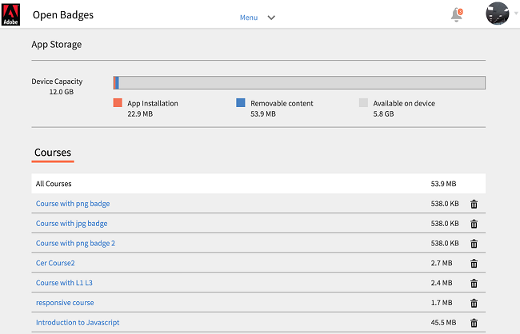

# iPad & Android tablet users {#ipad-android-tablet-users}

In Learning Manager app on iPad or Google Nexus 9 Android tablet, after you log in as a learner, you can see the following&nbsp;**Home&nbsp;**screen:

To navigate to learning and catalog features, tap the&nbsp;**Menu&nbsp;**drop-down and choose appropriate option.

 

# Access the app off-line {#accesstheappoffline}

You can access the Learning Manager app off-line in iPad and Google Nexus 9&nbsp;Android tablet. Download and take courses in off-line mode, and synchronize the content back with online app when you connect to the network.

1. Tap&nbsp;**Menu&nbsp;**drop-down at the top and tap&nbsp;**Learning&nbsp;**option. A list of all the available courses is displayed in tiles.

1. Tap the download icon at the bottom of each learning object tile, to download the learning content.

1. When you are online, a prompt appears in a bar at the top of the app to check if you want to synchronize your content online. Tap the red-colored bar if your answer is yes. A green colored bar indicates your content is in sync with the online app.

# Track device storage {#trackdevicestorage}

You can monitor your device storage periodically.

Tap the profile icon at the upper-right corner of the app and tap&nbsp;**Device Storage**&nbsp;menu option.

An app storage information dialog appears as shown below.

Using the app storage information, you can check the total space of device, app and the downloaded courses. This information enables you to download courses accordingly. To delete the downloaded courses in the device, tap X icon adjacent to each course name.
