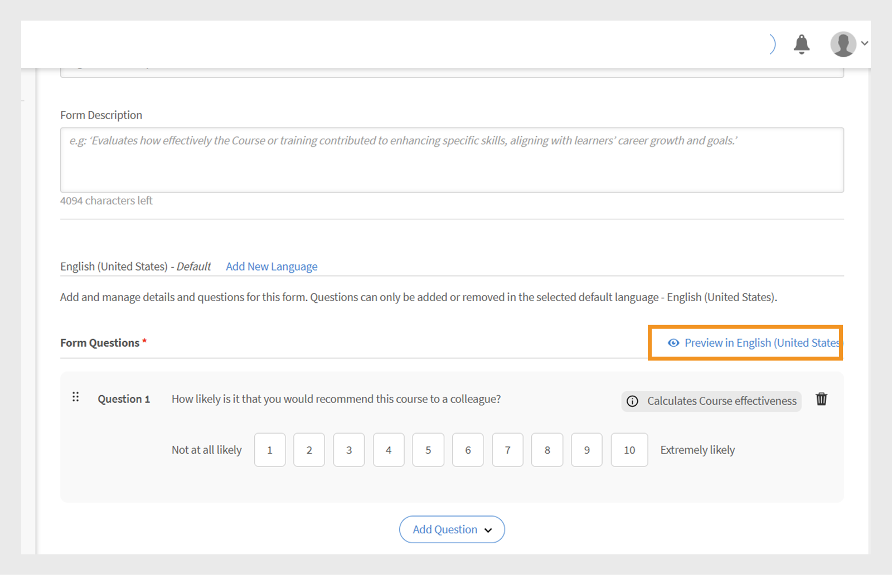
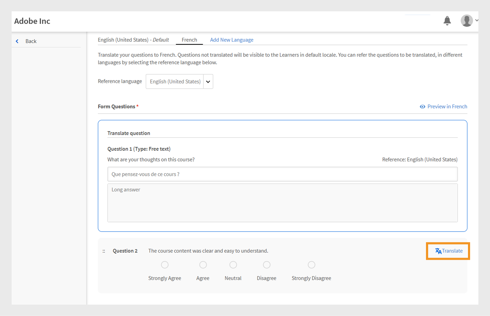
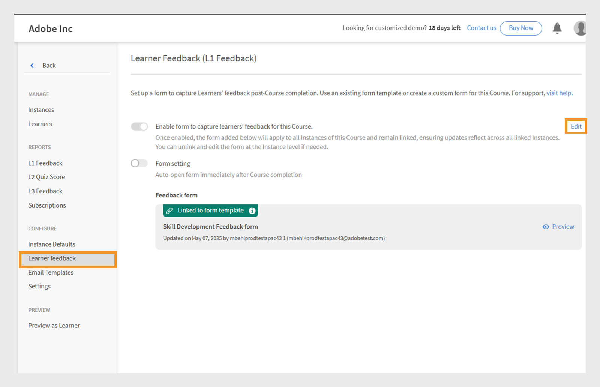

# L1 feedback form

>[!IMPORTANT]
>
>The enhanced L1 Feedback feature is being rolled out to select customers. If you don't see this feature in your account, View [Add L1 and L3 feedback](/help/migrated/administrators/feature-summary/courses.md#add-l1-and-l3-feedback) for more information on existing feedback feature. 
>
>Contact your Customer Success Manager (CSM) team to enable the new feedback system and learn about the migration timeline, c.

The Level 1 (L1) feedback feature in Adobe Learning Manager allows learners to share their feedback after completing a course or learning path. This feedback helps administrators evaluate course quality, instructor effectiveness, and overall learning experience.

Administrators can now create and manage multiple, reusable feedback forms and assign them to specific courses, learning paths, or certifications.

The feature provides greater flexibility by allowing administrators to:

* Create reusable feedback forms
* Customize feedback for different courses or learning paths
* Assign tailored forms as needed

The **[!UICONTROL L1 Feedback Report]** and the **[!UICONTROL Feedback Report]** (Custom Report) now include two new columns: Feedback Form Name and Feedback Version. These columns provide details about the feedback forms used.

## Create L1 feedback form

Administrators can create multiple L1 feedback forms at the account level and assign the right form to a course, learning path, or certification.

To create an L1 feedback form:

1. Log in to Adobe Learning Manager as an administrator.
2. Select **[!UICONTROL Feedback forms]**.
 
    
    _Administrator homepage displaying the Feedback forms option to create and manage feedback forms_
3. Select **[!UICONTROL Add form]**.
 
    
    _Feedback forms screen displaying Add form button to create the Feedback forms_
4. Choose the **[!UICONTROL Default template language]**, then select **[!UICONTROL Save]**.
 
    
    _Add a new template prompt showing option to select the default language_
5. Type the form title and description.
 
    
    _Add Feedback form page displaying option type the Form Title and Form Description_
6. From the **[!UICONTROL Add Question]** menu, select a question type from the following:

    a. **[!UICONTROL Free Text]**: Allows learners to provide answers in their own words. 
       
    * Type your question in the **[!UICONTROL Question]** text field.
    * To make the question mandatory, select the **[!UICONTROL Mandatory]** toggle.
    
    _Add a Free Text question to the feedback form_

    b. **[!UICONTROL Numerical Scale/NPS]**: Learners can rate their course satisfaction or likelihood to recommend the course using a numeric scale (typically 1 to 10).

    * Type your question in the **[!UICONTROL Question]** text field.
    * Select the rating range (1 to 10).
    * To make the question mandatory, select the **[!UICONTROL Mandatory]** toggle.
       
    _Add a Numerical/NPS Scale question to the feedback form_

    c. **[!UICONTROL Likert Scale]**: Learners can specify how much they agree with a statement, from Strongly Disagree to Strongly Agree.

    * Type your question in the **[!UICONTROL Question]** text field.
    * To make the question mandatory, select the **[!UICONTROL Mandatory]** toggle.
    
    _Add a Likert Scale question to the feedback form_

    d. **[!UICONTROL Course Effectiveness Score]**: A scale to measure how effectively a course influences learners, using a relative rating system.

    * A pre-defined question with a Likert scale from 1 to 10 will be added to the feedback form.
    * You can add only one **[!UICONTROL Course Effectiveness Score]** question, and it cannot be edited
    
    _Add Course Effectiveness Score question to the feedback form_
7. Select **[!UICONTROL Save]**. You can view the created forms in the Feedback Forms section.

### Preview the feedback form

You can preview the feedback form by selecting Preview in English (United States). If you've created the form in multiple languages, you can also preview it in each respective language. View this article to learn how to add feedback forms in other languages. 
 

_Feedback forms screen displaying Preview option to view the feedback form in the default language_

### Add feedback forms in other languages

Create versions of the feedback form in multiple languages. However, you can only add or remove questions in the default language (such as English). For other languages, you can only translate the questions that were initially added in the default language. It is not possible to add or remove questions directly in the translated versions.

1. Select **[!UICONTROL Add New Language]** in the feedback form.
   
   
   _Add a new language version to the feedback form_
2. Choose the desired language and select **[!UICONTROL Save]**.
3. Navigate to the tab for the language you added.
4. Select **[!UICONTROL Translate]** next to each question to add your translation.
   
   
   _Feedback form screen displaying the Translate option translate the questions to the respective languages_

   >[!NOTE]
   >
   >The Course Effectiveness Score question translates automatically.

5. After adding the translations, select **[!UICONTROL Save]**.

## Set a feedback form as default

Administrators can establish a default feedback forms for self-paced, classroom, virtual classroom, and blended courses. Once configured, this default form will automatically be presented to learners upon completion of any course. This default form will be applied to all courses unless the administrator opts to assign a different feedback form for specific courses.
 

_Feedback forms screen displaying option to set the default feedback form_

## Change the default feedback form of a course

The default feedback form applies to all courses. As an administrator, you can either create a new form or choose one from the existing list. 

To change the default feedback form:

1. Select **[!UICONTROL Courses]** on the administrator homepage.
2. Select any course on the **[!UICONTROL Course]** section.
3. Select **[!UICONTROL View Course]**, then select **[!UICONTROL Learner feedback]**.
   
   
   _Learner Feedback screens shows the Edit option to change the form_
4. Select **[!UICONTROL Edit]** in the **[!UICONTROL Learner feedback]** section,.
5. Select **[!UICONTROL Change form]**.
   
   
    _Learner Feedback screens shows the Change form option to change the feedback form for the course_
6. Choose another feedback form from the menu or select **[!UICONTROL Start with a blank form]** to create a new one.
    
    
    _Add a form screen displaying the option to select from the available template or create new form_
7. Select **[!UICONTROL Save]** to apply your changes.

If a course is using the default feedback form and the default form is updated at the account level, all such courses will automatically reflect the new form. However, if an administrator changes the form or assigns a new form at the course level, future changes to the default form will not impact that course's feedback form.

The instance will use the course-level feedback form as its default. If an administrator changes the feedback form at the course level, it will not affect the form already set at the instance level. However, any new instance created after the change will use the updated course-level feedback form by default.

>[!NOTE]
>
>If you don't change the form, the course will use the default feedback form.

### Configure learner feedback settings

Administrators can configure the following settings in the Learner Feedback section:

* **[!UICONTROL Enable form to capture learners' feedback for this Course]**: Enable this to collect feedback from learners for this course. 
* **[!UICONTROL Form setting]**: When enabled, the feedback form automatically opens for learners immediately after they complete the course, making it easier to collect timely feedback.
 

_Learner Feedback screen displaying the learner feedback settings_

>[!NOTE]
>
>Course instances use the default feedback form from the course level. When you create new instances, they also use the course-level default form rather than the account-level.

