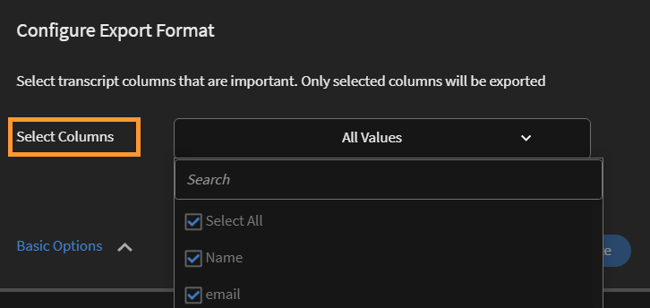

# Learner transcripts

Download learner transcript and manage reports using Learning Manager.

Adobe Learning Manager enables the administrators of an organization to generate the transcripts associated with learners. 

## Generate Learner transcripts {#generatelearnertranscripts}

1. To generate learner transcripts, click **[!UICONTROL Reports]** on the left pane in Administrator login.

   The Administrator navigates to the Excel Reports tab inside the **Reports** page.

1. Click the link **Learner Transcripts**.

   The **Learner Transcript** history page displays with the message- **No Learner Transcripts have been generated yet** or a list of downloads that have been triggered post Learning Transcripts history page implementation.

   <!---->

   A Learner transcripts dialog appears. Choose the date range for which you need the transcript generated.

   >[!NOTE]
   >
   >By default, from start date is the learner's registration date and the to date is always the current date. You can modify only the start date from when you need the data.

1. Choose the learners names from the **Select Learners** field, and click **[!UICONTROL Generate].**
1. You can choose single learner or groups of learners. To add more than one learner, click **[!UICONTROL Add More Learners]**.

   

   *Add more learners*

1. You can choose specific catalogs by enabling the check box. Transcript is only downloaded for the specified catalogs. You can choose specific catalogs by selecting the catalog from the **Select Catalogs** drop-down list.

   

1. When exporting Learner Transcripts, there is an option, **Enrollment Status**. This drop-down contains the following options:

   * Select All
   * Completed
   * In Progress
   * Not Started
   * Unenrolled

   

   *Select the catalog*

1. You can also download transcripts for learners who have been deleted from an account.

   To download Learner Transcripts of deleted users, click the **Advanced Options** arrow, and enable the check-box **Include data of Deleted Learners**.

   

   *Download Learner Transcripts of deleted learners*

1. You can choose to download module level information in the Learner transcript by enabling the "**Enable module level information**" check-box. In this case module names and the time spent on each module is fetched as a part of the transcript if this option is enabled.
1. You can choose to download skills data and summary sheets by enabling the option "**Include skills data and summary sheets**" check-box.

   Transcripts are generated and downloaded to your computer as .csv files when the skills data is not included. If the Skills data checkbox is enabled transcripts are generated and downloaded .xls files.

## Generate Learner transcript using copy-paste

Fetching Learner transcripts becomes a tedious process as it can be obtained only for a learner or user group one at a time. Here, with the copy-paste feature you can copy the list of Learner email ids and paste it at once. 

1. Log in as an **Administrator** or **Manager**.  
1. Go to **Reports** under **Manage**, it loads the **User Activity** page.  
1. Click **[!UICONTROL Custom Reports]** in the left pane and select **[!UICONTROL Learner Transcripts]** from the list.  
1. On the **Learner Transcripts** page, click **[!UICONTROL Generate New]** button in the upper-left corner.  
1. Select the preferred dates by clicking from **[!UICONTROL Select date range]** drop-down. Click **[!UICONTROL Email IDs]** tab to enter the copied list of unique email ids.

   

   *Copy-paste email IDs*

1. Use **Validate Email Ids** to verify if the entered id is correct.

   

   *Validate the email IDs*

   In case the entered email id is incorrect, it would be highlighted in red along with a validation message as above.

   **Generate** Button will not be available unless all the email IDs entered are correct.

   

   *Generate the Learner Transcripts*

1. Click **[!UICONTROL Generate]** button to generate Learner Transcripts for all the mentioned email ids. You will receive a confirmation message as below stating report generation.

   

   *Confirmation message of report being generated*

   Generating Learner Transcripts can be combined for Email IDs entered under both **Users** and **Email IDs** tab.

## History of Learner Transcript downloads {#ltdownload}

On the **Learner Transcript** download page, to generate  a report, when you click the **Generate New** button, the Learner Transcripts dialog displays.

*Generate a report of all Learner Transcripts*

Click **[!UICONTROL Advanced Options]** and expand the panel.

Choose the users and the catalog they belong to. After clicking the **[!UICONTROL Generate]** button, a dialog displays that mentions the approximate time that will be taken to download the report. To generate the report, click **[!UICONTROL Generate]**.

*Select the Generate button*

The transcript gets generated in the background, and you can continue with your tasks in Learning Manager. Once the transcript is generated, you can download the transcript from the list.

As an Admin, you can view all transcripts that are generated by anyone in the system.

*View history of downloads*

The download list displays the following attributes:

* **Learners:** The learners / learner groups whose transcripts are to be downloaded.
* **Additional Data Included:** Depends on the additional data admin wants to download from the Advanced option in the Add learner transcript modal
* **Status:** Downloaded, queued, or in progress.
* **From** and **To**: Duration of the transcripts to be downloaded.

* **Filters Applied:** Whether you'd applied the filters for Enrollment Status.
* **Generated by:** The user id of the Learning Manager user who has requested the download.
* **Status:** Downloaded, queued, or in progress.

You can cancel the download at any time. If a job is canceled by the admin, Learning Manager sends an in-app notification to the user who triggered the learner transcript.

*Learner Transcript download queue*

You can **cancel** the download at any time. If a job is canceled, Learning Manager sends an in-app notification to the user who has canceled the job. 

## Data of deleted learners {#dataofdeletedlearners}

You can include the data of deleted learners in the Learner Transcript list. On the Learner Transcripts dialog, enable the option **Include data of Deleted Learners**.

After enabling the option and clicking **Generate**, the deleted learners' data features in the Learner Transcript download page, as shown below:

*View data of deleted learbers*

## Customize columns {#customize-columns-lt}

An Administrator can customize the columns exported in a Learner Transcript report. Admins, Custom Admins, and Managers can configure the columns before exporting the report. 

On the **Learner Transcripts** dialog, click **[!UICONTROL Advanced Options]**. In the **Configure Export Format** section, choose the columns that you want to export.

*Customize columns to export*

Customization is allowed only when a user downloads the Learner Transcript in .CSV format. When downloaded in .XLSX format, the column preference selection will not be honored and all the default columns will be exported.

## Learner transcript file content {#learnertranscriptfilecontent}

A typical learner transcript file consists of six excel sheets in a single file. The learner transcript sheets give an overall insight into data including the number of learners involved per course, their skills, the completion percentage based on course or learner, and a compliance dashboard. The following are the dashboards available in learner transcripts:

**Learner Transcript**

In the learner transcript excel sheet, along with profile details about the learner, a learning object wise consumption details are provided such as enrollment date, started date, grade achieved, quiz score obtained. If courses are part of any learning program, they are listed separately apart from individual course consumption details. 

**1- Learning Activity Dashboard**

In this LO-specific dashboard, you can view the number of learners for each course, learning program, or certification. You can view the progress sheet for learners for a particular learning object. This sheet displays data like the number of learners who have completed the course or learning program, learners in progress, and learners' due dates.

The users' progress for the specific course is calculated based on the Input Fields where you specify the due date and progress percentage thresholds. For example, if you specify 7 days and 70% as the values in your Input field, the course progress for courses due in 7 days, and for courses that have more than 70% progress are displayed. You can also change the time period in this sheet, where the modified data is automatically displayed in this dashboard.

**2 - Learning Activity Dashboard**

This learning dashboard displays data for a specific user. From this dashboard, you can see the courses, learning programs, or certifications that a particular user has enrolled in. The table also displays data on which learning objects the user has completed, the learning objects in progress, and upcoming due dates for the user.

The users' progress for each course is calculated based on the inputs that you specify. That is, the due date and progress percentage values. For example, if you specify 7 days and 70% as the values in your Input field, the user's progress for different courses that are due in 7 days, and for courses that have more than 70% progress are displayed.

**Skill**

In the skills sheet, skill name, skill level, required credits, earned credits, completion percentage, and other profile details are provided. A sample snapshot of skills excel sheet is provided below for reference.  

*Sample of the skills Excel sheet*

**1- Skill Dashboard**

In this dashboard, you can see whether your organization is equipped on various skills. For a specific skill, you can check the number of users in an organization who are supposed to have this skill versus the number who actually has the skill. This dashboard also specifies the users who have to refresh their skills. This value is calculated based on the input that you enter in the Input field. For example, if you enter 50 days as your input, the dashboard provides data on users who need their skills refreshed after 50 days.

**2- Skill Dashboard**

This skill dashboard is more user-specific. You can filter a specific user or several users and view their skill level as a dashboard. This sheet can help managers and administrators track how skilled each learner is as compared to how skilled they are expected to be. The Skill dashboard also throws light on the learners who have to refresh their skills. The learners refresh list is calculated based on the number of days that you enter in the Input Field.

**Compliance Dashboard**

The Compliance Dashboard has two parts - compliance report per user and compliance report per training. For the user-based report, you can use the Compliance Dashboard to track users who have upcoming due dates for important compliance initiatives. For the training-based report, you can filter by learning program or certification.

For both the compliance reports, filter by the due date to view the appropriate data.

### Time and date columns in the transcript {#datetime}

The values in the following columns have minutes rounded to the nearest minute and seconds to 00:

* Enrollment Date (UTC TimeZone)
* Started Date (UTC TimeZone)
* Completion Date (UTC TimeZone)

*Time and date columns on the Excel sheet*

### Module duration and ID columns in the transcript {#moduledurationandidcolumnsinthetranscript}

The Learner Transcript also displays the columns- **Module Duration** and **ID**.

*Module duration and ID columns in the transcript*

### OTHER columns in the transcript {#ModuledurationandIDcolumnsinthetranscript-1}

| **Column** |**Description** |
|---|---|
| After |Number of learners who achieved the skill before the entered (value) number of days which needs refreshing |
| Skill |The Skill names that are assigned to Learners |
| Manager Name |The manager name whose subordinates skill engangement data is to be displayed on the Skill summary table |
| Row Labels |The Learner name with the list of Skills assigned |
| Number of Skills Each User Should Have |Number of Skills asigned to the learner |
| Number of Skills Each User Has |Number of Skills achieved by the learner |
| Number of Skills that need Refreshing |Number of learners whose Skill needs refreshing |
| Percentage of Compliance |The progress percentage of the assigned Skill |
| Embedded Path | These rows will show the name of the embedded Learning Program.   |
| Embedded Path ID |These rows will show the ids of the embedded Learning Program   |
| Embedded Path Language |These rows will display the language in which the Learning Program was created.  |
