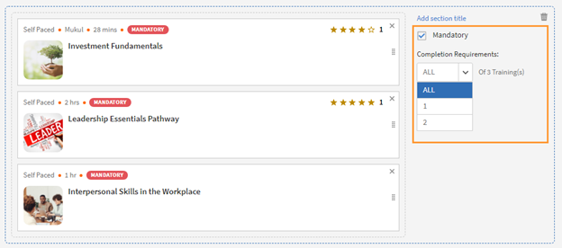

# Learning Paths

## What is a Learning Path?

Often, Administrators are interested in building a detailed curriculum which offers in-depth knowledge of a particular topic or an area of expertise. It can also be a sequence of training courses which the employees or customers are expected to complete. This requires bundling a set of courses and Programs together to create a complete training package. 

This is where Learning Path comes into picture. A Learning Path is a journey that a learner must go through to master some subject over time. Learners are in control over their training experience and can acquire and retain knowledge in a self-paced manner with greater effectiveness. 

For example, when on-boarding new employees, an organization conducts training on policies and procedures, culture, history, and so on. A Learning Path sets up the courses according to the needs of the employees, so that employees can enroll on the courses according to the learning path set for them. you choose, and you can enroll users on this path so they can progress from course to course.

## Advantages of a Learning Path

Learning paths makes the delivery of a training program convenient and hassle-free. Here are some of the key benefits of a Learning Path:

1. Assign a skill and skill level to a Learning Path directly. No need to match skill credits. Once learner completes a Learning Path, he/she achieves the mentioned skill level.   
1. Ability to embed an existing Learning Path into a new Learning Path. Embedding capability is available only for 1 level of embedding. Thus, a Learning Path already containing an embedded Path, cannot be embedded in a new Path.   
1. Ability to add Pre-requisites, Job Aids and resources at a Learning Path level.   
1. Ability to create sections. Each section can have a title.   
1. Ability to make sections mandatory and setup completion criteria.

## Add a Learning Path in Learning Manager 

In Learning Manager, in the Admin app, click **[!UICONTROL Learning Path]** on the left panel.

In the **Learning Path** page, click **[!UICONTROL Add]**. Enter the details.

*Add a new Learning Path*

After creating the Learning Path, select the newly created Learning Path, and add the courses in the path.

You can add skills and assign a badge to the Learning Path. To add a skill, select the required skill or skills from the **Pick a Skill** drop-down list. Also select the level for the skill or skills.

Assign a badge to the Learning Path. Pick a badge from the list of available badges.

Choose the sequencing type for the sections and training as Ordered or Unordered based on your preference.

If you choose Ordered, the courses appear in the same sequence as you created them. If you choose Unordered, the courses are not sequenced. Learners can complete the courses in any order.

To add a course in the Learning Path, click **[!UICONTROL Add Courses or Learning Paths]**.

In the dialog that appears, choose the training that you want to add to the Learning Path.

*Add training to the Learning Path*

You can further sort the courses according to the skills assigned, modified date, and course effectiveness.

After selecting the courses or Learning Path, click **[!UICONTROL Save]**.

In the Learning Path, you can perform the following:

**Create and configure a Section:** A Section is created to group multiple training courses which completes an area or substantial component of the training. Each Section can have a title. Each section can also be marked Mandatory with specific completion requirements.  

**Make the courses mandatory in each section:** Enable or disable the Mandatory checkbox if you want/do not want to make the trainings mandatory inside the Learning Path. If you enable the checkbox, you can either make all the trainings mandatory or some of the trainings mandatory.

*Make the courses mandatory in each section*

**Rearrange the order:** You can move the courses up or down and change their ordering. 

*Rearrange the order of the training*

**Remove a course:** On the course card, click X, and remove the course from the Learning Path. 

*Remove a course from the Learning Path*

After you've made the changes, to publish the Learning Path, click Publish.

## Nested Leaning Path

You can include a Learning Path inside a Learning Path, but you can nest at most one Learning Path inside.

Insert the Learning Path like inserting a course. 

*Add a Learning Path inside a Learning Path*

## Learning Path Settings

In the Settings section, you can add the pre-requisites and the Job Aids that a learner must take before starting the Learning Path. You can also add resources that are helpful to the learner.

*Change settings of a Learning Path*

## Instances

The Learning Path instances displays an additional tile, **Learning Paths**. The tile displays the number. of learning programs added to a Learning Path.

In the **Courses** tile, you can see the course instances that are visible to the learners who are enrolled in this instance.

The **Enable Learners to Choose instances (Flexible Learning Path)** check-box is only applicable to courses. All child Learning Paths will get an option to map a Learning Program instance with Learning Path. By default, the mapping is set to Default Instance.

*Learning Path instances*

## Notifications

There are three options:

1. **All Levels Courses and Learning Paths (selected by default):** The learner gets notifications for any incomplete course irrespective of the level inside a Learning Path.
1. **Root Learning Path:** The learner gets notifications for any incomplete course belonging to a parent Learning Path.
1. **Learning Path and first level child only:** The learner gets notifications of any incomplete course that is a first child of a parent Learning Path.

The notification reminders are triggered based on the option. By default, the option **All Levels Courses and Learning Paths** is enabled for an instance.

## Important Note

Please note that the existing feature of Learning Programs will be renamed to Learning Path immediately after the release. In case you wish to continue calling it as Learning Programs, we recommend you to use the 'Terminologies' feature to apply the required terminology. This way you can consume to use the word Learning Program.

Learning Paths bring to you a range of functionalities. Some of them are available immediately after the release. Admins/Authors can start using them. Extended capabilities like "Sections", "adding Learning Path in another Path" etc. are disabled and can be enabled by checking the check-box mentioned below.

 Learners can continue to consume Learning Programs (now called Learning Paths) and Authors/Admins can continue to create them as well. To take benefit of extended functionalities of Learning Path mentioned above, Administrator should enable the setting as mentioned below. Once enabled, all the new extended capabilities of Learning Path will become available. 

The **Settings** > **General** page has a new option to enable Learning Paths. If this option is enabled, you can add courses and Learning Programs in a Learning Path. You cannot change the option once it is enabled.

## Other Learning Path-related details 

### Learning Path option is disabled/unchecked in Admin Settings

**Accounts using Native Web apps**

**Learners**

* By default, learners will notice a change in terminology from "Learning Program" to Learning Path". This has been done to make the interface more intuitive. If you do not want this change, refer to the below points.  

* This change however will not be reflected in the UI if you have already used the 'Custom Terminology" function to replace the terminology "Learning Programs" with some custom text. 
* In case you had not used the Custom Terminology function yet but now wish to retain "Learning Programs" as the terminology, you can do so via the 'Custom Terminology' feature post the release.

* The overall cosmetic look and feel of erstwhile 'Learning Programs' will get updated to a more visually rich look and feel.

**Authors and Admins**

* The terminology within the Admin/Author apps is the same as that of learners.
* The UI for Authors and Admins to create, update the erstwhile 'Learning Program' objects will now be updated to the new UI. There is no loss of functionality, just that the User Interface to do the operation will be much more intuitive. These UI changes will reflect in your account, even if you have chosen not to enable 'Extended Features of Learning Path', with no loss in functionality. 

* Note that any existing Learning Program objects will not change so there is no impact on learners (other than the terminology point noted above). Authors/Admins might notice a default grouping called "Section" within their existing objects, which would be of no material impact as far as functionality goes. Authors/Admins will also see added functionalities like Skills, Job Aids etc. But as you haven't used it yet, it will not create any impact on the learner side till you actually start using it.

**Reporting**

* If you do not enable the option, Learning Path , there are no changes in the Learner Transcript report structure due to Learning Path. But as communicated in earlier notice (refer to the table shared in earlier communication); one new column will get added to the extreme right of the Learner Transcript immediately after the release.

**Accounts using Headless LMS**

**Learners**

* There are no changes for learners in headless interface. APIs as well that are used to generate the reports does not have immediate changes. 

**Authors and Admins**

* Same changes as that of Authors/Admins stated above.

**Reporting**

* Same changes as that of Reporting stated above.

### Learning Paths option is enabled/checked in Admin Settings

**Accounts using Native Web apps**

**Learners**

* Same changes as that of Learners when the option is disabled.
* As you start using the extended functionality of Learning Paths, Learners will benefit from seeing more elaborate paths with embedded paths and sections, Skills and badges being earned on path completion, resources at path level, and other benefits.

**Authors and Admins**

* Same changes as that of Authors and Admins when the option is disabled.

* Users will get more functionality in crafting elaborate paths. You can define Skill-Levels that would automatically be achieved by a learner on completion of path (not have to focus on the arithmetic of Credits for the levels). Resources can be added at the path level (Not possible as of today). Sections can be created with each section having the ability to have X of Y options. One can embed a Learning Path within another Learning Path (one level of hierarchy supported)

**Reporting**

* A few new columns will get added to the 'Learner Transcript' and 'Content Report' structures to incorporate the new feature of embedding of paths within paths. This may impact integration code that you may have written to export this data to your custom data warehouse/DB outside Learning Manager. This information is communicated in the table provided in earlier communication.

**Accounts using Headless LMS**

**Learners**

* There is no change for your learners, unless you make changes to your headless LMS implementation, as the APIs on which you have built your headless interface will not be changing.
* If you do start using the extended features of Learning Paths by creating new Learning Paths, however you will have to make changes to the headless LMS implementation to reflect those on your learner app. The Learning Manager APIs will allow you to do that.

**Authors and Admins**

* Same changes as that of Authors/Admins stated above.

**Reporting**

* Same changes as that of Reporting stated above.
