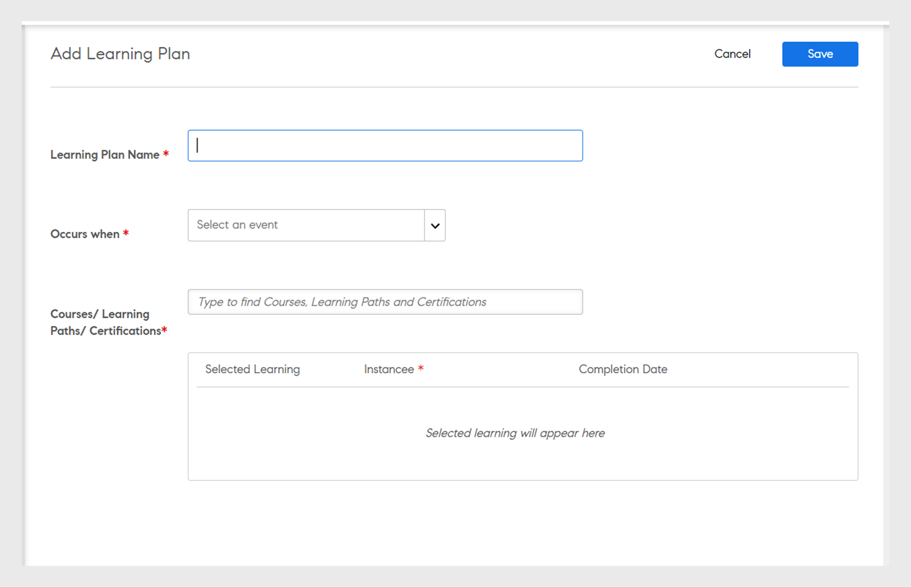

# Learning plans

Creating Learning Plans for Administrators in Learning Manager.

## Overview {#overview}

A Learning Plan is a set of rules, which enrol learners to specified trainings based on certain criteria.

A Learning Plan allows an administrator to automatically assign Courses, Learning Programs or Certifications based on the occurrence of certain events like on-boarding a new employee, or change in designation or location of the employees.

For example, when an employee joins an organization, the New Employee Orientation Program is automatically assigned to the employee. Similarly, if an employee is promoted as a manager, a New Manager Orientation Program is automatically assigned to the employee.

You can enroll learners to any courses and learning programs automatically based on a predefined set of events. You can create learning paths to the learners by automatically assigning a follow-up learning activity after a learner completes a skill, course, or a learning program.

## Create learning plans {#createlearningplans}

To create a learning plan, you must log in as an Administrator.

1. On the left pane, click **Learning Plans**. If there are any existing events, they are listed on the page. However, if you are setting up the learning plan feature for the first time, then continue to the next step.
1. On the top-right corner of the page, click **Add**. In the **Add Learning Plan** dialog, enter the name of the Learning Plan that an employee must take.

   

1. In the **Occurs when** drop-down list, choose the required event. The options determine when a learner takes the course. After selecting the type of event, select the appropriate training, Courses, Learning Program or Certification.

   **Note:** Both Administrators and Authors can create auto enrollment events.

   The events are:

   **1 - New Learner is added:** When a new user or an employee joins the organization.

   

   **2 - Learner gets added to a group:** When a new user or an employee joins a group.  Enter and select the user group from drop-down list, to which this event is applicable. You can choose multiple groups. Also, you can assign this event to all the existing members of these groups by selecting the option.

   

   This Learning Plan is specifically designed for ***Custom- Groupe*** users. Type the name of the group in the field, and using type-ahead search, choose the group or groups.

   **3 - Learner completes a learning object:** The event gets trigerred when a learner completes any learning object such as course, learning program, and so on. Select the learning object for which this event is applicable. Select the completion status for the event. Optionally, you can also choose the user group to which this learner belongs to. Enter the number of days, after completing the learning object, this event gets triggered. Select the option if you want to assign this event to existing users who already completed this learning object. 

   

   **4 - Learner achieves a skill level:** Enter the skill name and select the skill level. You can also choose the user group to which this learner belongs to. It is optional. Enter the number of days, after achieving the skill, this event gets triggered. Select the option if you want to assign this event to existing learners who have already achieved this skill.

   

   Additionally, set the number of days after which the Learning Plan must be assigned to the learners.

   

   **5 - On a specific date:** When the events must occur on a specific date. Select the date on which the event must be assigned. Select the user groups for whom the event needs to be auto assigned. Select the instances that need to be assigned, and optionally enter after how many days the event needs to be triggered.

   

1. For all the events, you can select the instance from the **Instance** drop-down list. You can also select instances of the assigned Learning for any event.

   

   In Learning Manager, a Learning Plan creates its own instance, Auto. When you choose a group, for example, All Learners, then by default, all learners in the Learning Plan get enrolled in the instance Auto.

   When you save the learning Plan, the instance Auto appears as an option in the **Select Instance** drop-down list in the Learners section of a course.

1. To save the Learning Plan, click **Save**.

## Unenroll from training {#unenroll-training}

When adding a Learning Plan, an Administrator can unenroll users from specific trainings based on certain triggers.

On the Admin app, click **Learning Plans > Add**.

The next sections represent the triggers where the option **Unenroll from Training** has been added.

## Learner gets removed from a group {#learnergetsremovedfromagroup}

1. Add one or more user groups. In case when multiple groups are selected, the plan is triggered when a learner gets removed from either of the mentioned group.
1. Choose the action as **Unenroll from training**. 

   1. The Admin can choose the trainings from which the user will be unenrolled when removed from user group.
   1. The Instance and Completion Date will not be applicable in this scenario.

## Learner completes a training {#learnercompletesatraining}

1. Add one or more user groups. In case when multiple groups are selected, the plan is triggered when a learner completes the specified training. 
1. Choose the action as **Unenroll from training**.

   1. The Admin can choose the trainings from which the user will be unenrolled when added to user group. 
   1. The Instance and Completion Date will not be applicable in this case.

## Learner gets added to a group {#learnergetsaddedtoagroup}

1. Add one or more user groups. In case when multiple groups are selected, the plan is triggered when a learner gets added to either mentioned group.
1. Choose the action as Unenroll from training.

   1. The Admin can choose the trainings from which the user will be unenrolled when added to user group. 
   1. The Instance and Completion Date will not be applicable in this case.

## Learner achieves a skill level {#learnerachievesaskilllevel}

1. Specify the skill to be achieved.
1. Add one or more user groups. In case when multiple groups are selected, the plan is triggered when a learner achieves the selected skill.

## On a specific date {#onaspecificdate}

1. Pick the date on which learners should be unenrolled.
1. Add one or more user groups. In case when multiple groups are selected, the plan is triggered on the date and unenrolls the users, who are a part of the selected groups.
1. Choose the action as Unenroll from training.

   1. The Admin can choose the trainings from which the user will be unenrolled when unenrolled on the specified date.
   1. The Instance and Completion Date will not be applicable in this case.

## Edit a learning plan {#editalearningplan}

After creating a learning plan, Administrator can edit/update the learning plan at any point in time. To Edit, click the name of the learning plan and modify the values in the **Edit Learning Plan** pop-up dialog that appears. Click **Save**. 

## Enable a learning plan {#enablealearningplan}

By default, all new Learning Plans that you have created are in a disabled state. You must enable a plan for a learner to be assigned to. When you enable the check-box **Current Learners**, the event gets enabled by itself. 

To enable a learning plan,

1. From the list of Learning Plans, choose the plan that you want to enable.

   

1. On the top-right corner of the page, click **Actions > Enable**. This enables the Learning Plan.

## Delete a learning plan {#deletealearningplan}

To delete a Learning Plan,

1. From the list of Learning Plans, choose the plan that you want to delete.
1. On the top-right corner of the page, click **Actions > Delete**.

## Disable a learning plan {#disablealearningplan}

To disable a Learning Plan,

1. Click the tab **Enabled**.
1. From the list of Learning Plans, choose the plan that you want to disable.
1. On the top-right corner of the page, click **Actions > Disable**. This moves the plan to the **Disabled** tab.

## Filter a learning plan {#filteralearningplan}

You can filter Learning Plans according to the type of event that was used while creating a Learning Plan. Click **Type** and choose any option to display Learning Plans that match the selection.

## Frequently Asked Questions {#frequentlyaskedquestions}

1. How do I setup Learning Manager to configure auto enrollments for on-boarding of new hires?

   In the **Occurs when** drop-down list, choose the option **New Learner is added**. Then assign the Learning Objects, the instance, and the completion date for the learner. Both Administrators and Authors can create auto enrollment events. Enable the event after creating it.

1. How do I set up a learning plan/auto enrollment for classroom and virtual classroom course?

   It is recommended that you setup the course instance with required session details. Then set up a learning plan and map it to the course instance, which has already been created.

1. How do I view the list of learners enrolled into a specific learning plan?

   When the instance, Auto, gets created, click **Course** > **Learners**, and choose the required instance from the **Instance** drop-down list.
