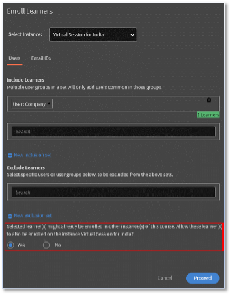

# Multiple enrollment in Adobe Learning Manager

In Adobe Learning Manager, each course can have different instances. As an account Administrator, one of your primary duties is to create different instances of VILT sessions across different time zones, and possibly create sessions for specific user groups.

Before the July 2023 release, when an Admin enrolled a learner, they could enroll in only one instance. If a learner wished to take a course in different instances, the Admin would create many courses, one for each instance.

Adobe Learning Manager's multi-enrollment feature helps an Admin avoid such scenarios.

## What is multi-enrollment

Multi-enrollment enrolls a learner multiple times in a course through various available instances.  A learner can enroll in multiple course instances irrespective of the state they're in-enrolled, completed, or yet to start. When the Author enables the [!UICONTROL Multiple Enrollment] toggle, a learner can then enroll in multiple instances of the course.

*Launch Multiple Enrollment from Settings*

The progress of each instance can be tracked individually, and a report can be exported to track the progress of each instance.

## Important points

* Multi-enrollment is applicable only when a course has multiple instances.
* Once the multi-enrollment option is enabled and users are enrolled in multiple instances, new rows are created for each course in the Learner Transcript report (one row for each instance and each learner)
* If reporting automation is set up that anticipates only one row per course, you must make the necessary adjustments to the reporting automation before enabling the Multi-Enrollment feature.

## How to enable Multi-enrollment

1. Log in to your Adobe Learning Manager account as an author. 
1. Select the course on which you want learners to enroll multiple times. 
1. In the left panel, select **[!UICONTROL Settings]** > **[!UICONTROL Edit]** > **[!UICONTROL Instance configuration]** > **[!UICONTROL Enable Multiple Enrollment]**.

*Enable Multi-Enrollment*

>[!NOTE]
>
>As an author, you cannot have Instance Switch and Multiple Enrollment enabled simultaneously.

## Learner view

Multiple enrollments are helpful when a learner wants to enroll in a Classroom or VC course or wants to complete a course again before moving on to another course.

For learners who didn't enroll, when they select a course, they will view the screen under the course with multiple instances. Then, they can select each instance and enroll.

*View the instances*

After enrolling in one instance, they can enroll in other instances by selecting the View All Instances option in the right pane.

*Enroll into an instance*

The progress on each instance can be tracked as below:

*Track progress of each instance*

## Multi-Enrollment changes in the administrator

**Enrollment:**

While enrolling the learners, you can enable the following checkbox:

*"Selected learner(s) might already be enrolled in other instance(s) of this course. Allow these learner(s) to also be enrolled on the instance …"*

*Enrollment option for Admins*

If the learner is already enrolled in one instance and you, as an administrator, are trying to enroll the learner in a different course instance, select Yes.

## Reporting

For a learner who is enrolled in two instances of the same course, two rows are created for each course instance. The report also displays the progress of the instances.
