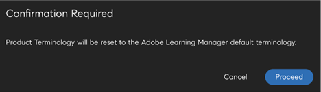

# Product Terminology

>[!IMPORTANT]
>
>Product Terminology is only available for the English version of Adobe Learning Manager.

## What is Product Terminology in Adobe Learning Manager

Adobe Learning Manager uses a standard set of terminologies on the User Interface. As an Administrator, you can modify the terminologies to match your organization's needs.

Using the Product Terminology feature, you can rename these terminologies, and be consistent with your organization's learning standards.

## Download the terminology csv file

To change the terminologies, follow the steps below:

1. As an Administrator, select **[!UICONTROL Settings]** > **[!UICONTROL General]**.
1. In the **[!UICONTROL Product Terminology]**, select **[!UICONTROL Edit]**.

   
   _Product Terminology_

1. Select **[!UICONTROL Download Here]** and download the template of the terminologies.

   
   _Download the template_

## Change the terminologies

1. After downloading the CSV, change the required terminologies in the second column. For example, you can change Module to Training or Leaderboard to Ranking.

   
   _Edit the csv_

1. Save the changes.

## Upload the updated CSV

1. In the **[!UICONTROL Product Terminology]** section, select the link to upload the CSV.

   
   _Upload the csv_

1. Upload the updated CSV.
1. Select **[!UICONTROL Save]**.

The changes in the terminologies now reflect an Author, Learner, Manager, Instructor, or Custom Administrator for that account.

## Reset the terminologies

After uploading the CSV with the new terminologies, you can reset to the default terminologies.

Select **[!UICONTROL Reset Product Terminology]**.

_Reset the product terminology_

On clicking the link, you can see a confirmation pop-up message.

_Confirmation prompt_

The terminologies are reverted to their original names.

## What does not get changed

The terminology changes are not applicable to:

* Email templates (**[!UICONTROL Admin]** > **[!UICONTROL Email Templates]**)
* Reports (**[!UICONTROL Admin]** > **[!UICONTROL Reports]**)
