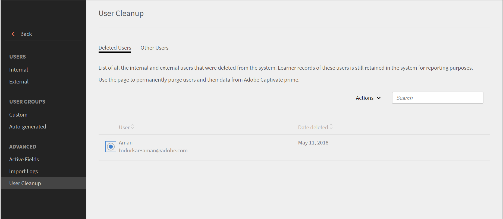
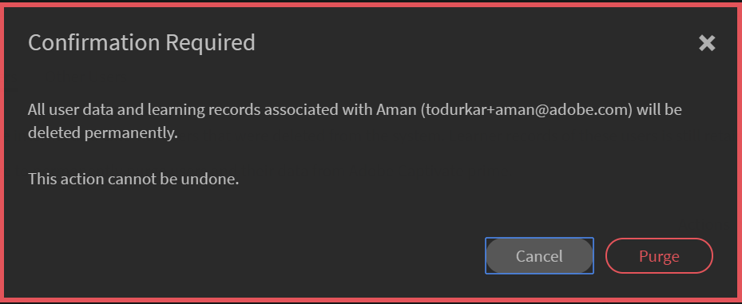

# Purge users

Know more about purging user data in Learning Manager.

## Overview {#overview}

Use the purge user feature to remove personal identifiable information and learning records of the user from Learning Manager. Note that Delete and Purge User are two different features. While a deleted user can be restored, all user data and learning records associated with a purged user cannot be restored.

Purge user action can have the following results:

* If a user is purged, the links in import logs does not work to avoid the download of old CSVs and bringing back the user data again into the system.
* If an Author is purged, his name is replaced by the name of the Admin who purged that user.
* If Instructors are purged, they are removed from sessions. Admin has to replace/add instructors for such sessions.
* Purging a user in Learning Manager does not remove the user in any external applications (third-party systems or other applications written by you). Contact external application owners to get the users removed from such applications.
* If a purged user is referred in the configuration settings of a connector, the connector is disabled. The connector needs to be reconfigured by the Admin to resume.

To purge users, follow these steps:

1. As an Administrator, select **[!UICONTROL Users]** from the left pane. The **[!UICONTROL Internal Users]** page opens.
1. Delete the users you want to purge. To delete, select one or more users using the checkbox. Open the **[!UICONTROL Action]** drop-down and select **[!UICONTROL Delete User.]**
1. In the left pane, select **[!UICONTROL User Cleanup]**. The **[!UICONTROL User Cleanup]** page appears with the list of deleted users. Use the radio buttons to select the user to purge. You can only purge one user at a time.

   

1. Open the **[!UICONTROL Actions]** drop-down menu and select **[!UICONTROL Purge User]**. 

   

1. A dialogue box appears seeking confirmation. Once purged, all user data and learning records associated with the selected user is deleted permanently. Once purged the action cannot be undone. To confirm, click **[!UICONTROL Purge]**.

   

1. Once you confirm and click Purge, the purge request is accepted. You receive a notification once the action is complete. A purge request ID is also provided. You can provide this ID to the CSM to track the request.

## Bulk purge of users

You can select the first 50 users and purge the users in one shot. This allows Administrators to select 50 users at once and purge them together. This helps Administrators when they wish to purge users in bulk. It's always a best practice to check the users who are selected for purging. This is important to ensure only the correct set of users are getting purged. 

 

+++Read about the results of Purge User action

<table>
 <tbody>
  <tr>
   <th><strong>Purge using Learning Manager UI- Enterprise</strong></th>
   <th> </th>
  </tr>
  <tr>
   <td>Delete selected user from the requesting enterprise account. </td>
   <td>Yes</td>
  </tr>
  <tr>
   <td>Delete all users from all Trial accounts whose email, adobe_id matches selected users email.</td>
   <td>Yes</td>
  </tr>
  <tr>
   <td>Delete all users from all Trial accounts whose email, adobe_id matches selected users email and he/she is the creator of the trial account.</td>
   <td>No</td>
  </tr>
  <tr>
   <td>Delete User's email from all the other fields of the requesting Enterprise account and All Trial Accounts.</td>
   <td>Yes</td>
  </tr>
  <tr>
   <td>Notify initiator of deletion confirmation.</td>
   <td>Yes</td>
  </tr>
  <tr>
   <td><strong>Purge using Learning Manager UI- Non-Enterprise</strong></td>
   <td> </td>
  </tr>
  <tr>
   <td>Delete Selected User from the requesting Trial Account.</td>
   <td>Yes</td>
  </tr>
  <tr>
   <td>Delete all users from all Trial accounts whose email, adobe_id matches selected users email.</td>
   <td>Yes</td>
  </tr>
  <tr>
   <td>Delete all users from all Trial accounts whose email, adobe_id matches selected users email and he/she is the creator of the trial account.</td>
   <td>No</td>
  </tr>
  <tr>
   <td>Delete User's email from all the other fields of the All Trial Accounts.</td>
   <td>Yes</td>
  </tr>
  <tr>
   <td>Notify initiator of deletion confirmation.</td>
   <td>Yes</td>
  </tr>
  <tr>
   <td><strong>Purge other users- Enterprise (individuals who are not internal or external Learning Manager users)</strong></td>
   <td> </td>
  </tr>
  <tr>
   <td>Delete selected user from all other fields of the requesting Enterprise account and All Trial Accounts.</td>
   <td>Yes</td>
  </tr>
  <tr>
   <td>User deletion from accounts.</td>
   <td>No</td>
  </tr>
  <tr>
   <td>Notify initiator of deletion confirmation. </td>
   <td>Yes</td>
  </tr>
  <tr>
   <td><strong>Purge</strong> <strong>other users- Non-Enterprise (individuals who are not internal or external Learning Manager users)</strong></td>
   <td> </td>
  </tr>
  <tr>
   <td>Delete selected user from all other fields of All Trial accounts.</td>
   <td>Yes</td>
  </tr>
  <tr>
   <td>User deletion from accounts.</td>
   <td>No</td>
  </tr>
  <tr>
   <td>Notify initiator of deletion confirmation.</td>
   <td>Yes</td>
  </tr>
  <tr>
   <td><strong>Purge using Adobe IMS- Enterprise</strong></td>
   <td> </td>
  </tr>
  <tr>
   <td>Notify Enterprise Admin about the request.</td>
   <td>Yes</td>
  </tr>
  <tr>
   <td>Check Email fields for sending notifications.</td>
   <td>No</td>
  </tr>
  <tr>
   <td><strong>Purge using Adobe IMS- Non-Enterprise</strong></td>
   <td> </td>
  </tr>
  <tr>
   <td>Delete all users having the provided AdobeID/Email from All Trial Accounts.</td>
   <td>Yes</td>
  </tr>
  <tr>
   <td>Delete all users of a Trial account if the provided Email/AdobeId was the creator of the Account.</td>
   <td>Yes</td>
  </tr>
  <tr>
   <td>Delete the select email id from all other fields of all Trial Accounts.</td>
   <td>Yes</td>
  </tr>
 </tbody>
</table>

+++

Learning Manager is now GDPR compliant. For more information on GDPR compliance, see  [Learning Manager compliance to GDPR](../../kb/prime-gdpr.md).

## Frequently Asked Questions {#frequentlyaskedquestions}

**1. How many days does it take for a purge request to complete?**

A request to purge users takes a maximum of 30 days to complete.

**2. Can you perform a bulk purge in Learning Manager?**

Yes, you can perform a purge in bulk. However, you can only perform a bulk purge of 50 users.
