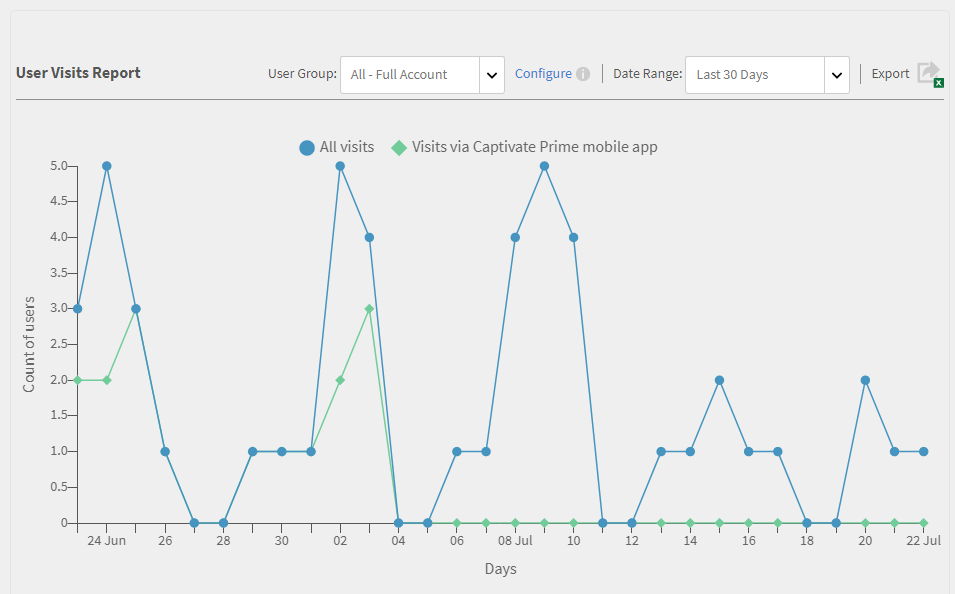
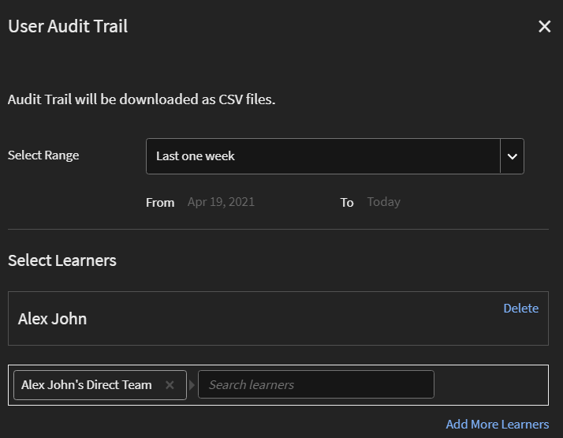
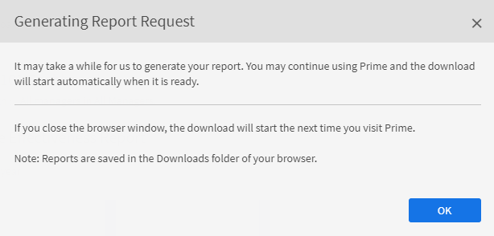
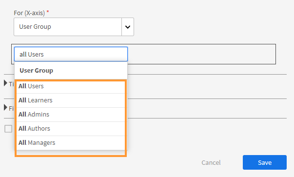

# Reports

Learn about the Reports associated with Administrator role in Learning Manager application.

Adobe Learning Manager enables you to create varied reports to track, monitor, and control learner activities. Learners activities are tracked and captured automatically into the database. Manager and Administrator reports are generated from the database.

## Overview {#overview}

Reports generation process is similar for both Administrator and Manager. Managers can view reports corresponding to their subordinates whereas Administrator can view all organization-wide reports.

Reports are aggregated in a dashboard. A report has to exist inside a dashboard. A **[!UICONTROL Default Dashboard]** exists by default in the reports page. Any report added by you moves into this default dashboard. To add reports to individual dashboards, use the drop-down arrow and choose **[!UICONTROL Add Report]**. For more information on creating dashboards, refer to Dashboards section on this page.

## Types of reports {#typesofreports}

Adobe Learning Manager supports four major types of reports such as completion, time spent, skills, and effectiveness. You can use the following report types to generate reports of 300+ variations:

* Course delivery statistics for learners
* Effectiveness of courses report
* Learner skill-based report
* Learning program enrollment statistics for learners
* Learning time spent by learners
* Learner count
* Certification completion

## User Activity dashboards {#useractivitydashboards}

See a summary of all user activity on the platform over time. Configure user groups and apply filters.

The user activity dashboard displays the activity of users in the account. The three reports that are listed are:

* **Registered Users:** This report provides information of the number of users registered in your account week over week. For accounts with Monthly Active Units licensing, the report shows the MAU units instead.

* **User Visits Report:** This report provides information about the number of users accessing the platform on a day to day basis. Monthly report is also available.

* **Learning Time Spent Report:** This report provides information about the Learning Time Spent in the platform on a day to day basis. Monthly report is also available.

### Registered Users {#registeredusers}

Learning Manager records the number of users registered in the system every week. Administrators can view this report to understand the registered count of users on that day of the week. Registered count once stored for a week does not change. Hence historical registered count is not related to the current set of learners in the system. 

This report provides information of the number of users registered in your account week over week.

For accounts with Monthly Active Units licensing, the report shows the MAU units instead.

*Registered Users report*

***For Monthly Access Unit accounts:***

**Monthly Active Users report**

This report shows the count of learner active in the learning platform each month. User is considered active for the month if he/she performs any of the learning actions mentioned here. It is the same way Monthly Active Units are counted.

The monthly active count once counted and stored for a month, does not change. Hence the historical count displayed is not related to the current set of learners in the system.

### User Visits {#uservisits}

This report shows the total learners accessing the system in a day or month period. Browsing the learning platform without consuming any learning is also considered as 'accessing' the learning platform. This helps the Administrator understand the total set of users accessing the system. On the first of the month, Learning Manager creates a record of total users accessing the platform for the previous month. It also captures the user group information for these users.

Only those user groups configured by the Administrator are recorded. This allows the Administrators to apply filter on user groups for historical monthly data as well. Note that incase user groups configuration is modified and Learning Manager has not recorded data for this user group in earlier months, then Learning Manager cannot display the data for this newly configured user groups for previous months. 

This report contains users accessing the platform using all formats like web, mobile app, headless custom solutions, and so on. The device app usage graph specifically mentions only the users accessing the platform using Learning Manager's device app. This helps Administrators identify the usage of mobile app in their account. 

*User Visit report*

### Learning Time Spent Report {#learningtimespentreport}

Here, you can see a dual-axis line charts that show total learning time spent for all learners across a 12-month period. The second axis represent the median time spent in learning for an individual.

The time spent for different Learning Objects, such as, Learning Programs and Certifications, is calculated for the following:

* Self-paced course with static and interactive content
* Activity courses with url.
* Weekend sessions with the weekend flag enabled. 
* VC connect session where attendance is auto marked.
* The time spent for different Learning Objects, such as, Learning Programs and Certifications
* xAPI statements for an xAPI activity course.

You can further export the graph as an Excel spreadsheet.

A filter to choose User group configuration is provided which will help in viewing the data with respect to different user groups.

The selected date and user group filter is applied to all the relevant graphs in the dashboard. 

>[!NOTE]
>
>For **[!UICONTROL User Visits]** and **[!UICONTROL Learning Time Spent]** reports, the default data (when no user group is configured) shown will be for the entire account.

## Training Content dashboard {#trainingcontentdashboard}

The Training content dashboard offers insights into trainings available on the platform. You can view popular trainings or track all available trainings. 

### Trainings Report {#trainingsreport}

This report provides information of the total trainings available in the platform (in published state) month over month. It gives an indication of the number of trainings offered over time. 

*Training report*

### Active Trainings Report {#activetrainingsreport}

This report provides information of the trainings which are active over the selected time range. Active trainings are trainings which are enrolled, viewed in player, or completed in the given time.

For active trainings, data of all root user (with manager role) internal groups will be available for selection when no user group configuration is done. Apart from the root user user groups, you can configure 10 more user groups if needed.

*Active trainings report*

>[!NOTE]
>
>The data does not display as expected when **[!UICONTROL All Users]** and **[!UICONTROL 12 months]** filters are selected, but the data displays when you select **[!UICONTROL All internal user group].**

<table>
 <tbody>
  <tr>
   <td>
    
<b>Reference</b>
</td>
   <td>
    
<b>Metric</b>
</td>
   <td>
    
<b>Description</b>
</td>
  </tr>
  <tr>
   <td>
    
1
</td>
   <td>
    
Start Ratio (%)
</td>
   <td>
    
Ratio of the number of learners who have started the course to the number of enrollments.
</td>
  </tr>
  <tr>
   <td>
    
2
</td>
   <td>
    
Completion Ratio (%)
</td>
   <td>
    
Ratio of total users who have completed the course to the total users who have started the course. 
</td>
  </tr>
  <tr>
   <td>
    
3
</td>
   <td>
    
Learner Feedback
</td>
   <td>
    
Average of all L1 feedback responses received on a scale of 1 to 10 rounded to the nearest integer. 
</td>
  </tr>
  <tr>
   <td>
    
4
</td>
   <td>
    
Manager Feedback
</td>
   <td>
    
Average of all L3 feedback responses received on a scale of 1 to 5 rounded to the nearest integer 
</td>
  </tr>
 </tbody>
</table>

The training report has two additional columns:

1. Average star rating of a course.  
1. Number of learners who've rated the course.
1. Embedded Path 
1. Embedded Path ID 
1. Embedded Course ID

>[!NOTE]
>
>Start ratio, Completion ratio, Learner Feedback, and Manager Feedback are not affected by the filters applied. The filters affect only enrollment, views, and completions.

>[!NOTE]
>
>For both the reports (Training Content, User Activity), you can configure a maximum 10 user groups. It may take upto 24 hours for the processing to complete and make the newly configured filters available.

## Learning Summary dashboards {#dashboards}

### Generate Dashboard Reports

>[!INFO]
>
>In this training, you will learn how to generate dashboard reports from the database.    

If you're unable to launch the training, write to <almacademy@adobe.com>.

See a summary report of all the learning activities in the platform. On this page, you can see the following summary information for the selected root user's team and external profiles. Time range can also be selected:

* Learning Summary in form of Enrollments, Views, and Completions
* Top skills
* Compliance summary 

*Summary charts*

If there are internal root level managers, they will be displayed one after another. 

All external profiles will be listed after internal profiles (Internal root level users).

If an external profile has a manager, then the manager hierarchy will be displayed in the **[!UICONTROL Showing Data For]** drop-down list. User will be listed in manager hierarchy in all the details page (Learning summary, compliance, and skill status)

If not, then all individual user details will be displayed in the list.

To see more granular details of enrollments of various internal teams, click **[!UICONTROL Learning Summary Details]**.

*Learning Summary details*

When you click any enrollment, you can see the learners for each manager, and enrollment to which Learning Objects. You can also see the progression and completion details of each learner. 

*learners assigned to a manager*

Click any team and export its report as a csv. An Admin can export the report for any of the User Group or individual user by selecting the User Group or individual user, and then export details from the **[!UICONTROL Action]** drop-down list.

Also, you can see a bar chart view of skills that are in progress and have been achieved. You can add/remove skills that you want to feature in the graph.

*Skill status stacked bar chart*

### Compliance dashboard

**Adobe Learning Manager** offers a compliance dashboard to all administrators and managers. Administrators can create a compliance dashboard and share it with managers. Managers will be able to view the newly shared dashboard on their app and can easily track the compliance of their team members for a particular training. Compliance dashboard allow administrators to categorize custom compliance courses into specific categories  (for example, Sales, Marketing, and Legal). Custom compliance categories are powered by **[!UICONTROL Catalog Labels]**. 

_Compliance dashboard-Administrator view_

Administrators can also check the compliance status for each manager's team by selecting **[!UICONTROL Go to Compliance dashboard]**. Administrators can share a set of training courses with managers individually or with a group. This helps managers to easily track the compliance of their teammates for the specified training.

#### Admin workflow

##### Create custom compliance labels

A compliance label is a type of catalog label that categorizes courses/learning paths/certifications as a compliance type.
To create a custom compliance label, follow these steps:

1. In the Administrator app, go to **[!UICONTROL Settings]** > **[!UICONTROL General]**.
1. Select **[!UICONTROL Custom Compliance type]** option to enable the custom compliance label.

 
   
   _Enable Custom Compliance_

   >[!NOTE]
   >
   >This new catalog label has been introduced to categorize the courses, learning paths, and certifications as a compliance type. To enable the **[!UICONTROL  Custom Compliance type]** option, you must first enable the **[!UICONTROL Show Catalog Label]** option in the same page.

1. Go to **[!UICONTROL Settings]** > **[!UICONTROL Catalog Label]** and select the **[!UICONTROL Compliance type]**.
1. Type the values (e.g., Legal, Sales) in the **[!UICONTROL Value]** text box and select **[!UICONTROL Add Value]**.

   
   _Add values for Custom Compliance_

1. Select **[!UICONTROL Save]**.

>[!NOTE]
>
>The Author must add these compliance labels while creating/editing the courses in their app. See [Add compliance labels to a course/learning path/certification](/help/migrated/authors/feature-summary/courses.md#add-compliance-labels-to-courselearning-pathcertification).

##### Create and share a compliance dashboard

To create and share a compliance dashboard, follow these steps:

1. Go to **[!UICONTROL Reports]** > **[!UICONTROL Learning Summary]**.
1. In the **[!UICONTROL Compliance Dashboard]** section, select **[!UICONTROL Shared with Managers]**.
1. Select **[!UICONTROL Share dashboard]** and select the created labels from the **[!UICONTROL Custom compliance]** dropdown menu. 
 

   
   _Select the Compliance type_

1. Type and select the manager's name in the **[!UICONTROL Share with]** text box.
1. Select **[!UICONTROL Share]** to send the dashboard to the selected manager.

>[!NOTE]
>
>Sharing the new dashboard will overwrite the existing dashboard in the selected manager's app. Managers will be able to view the newly shared dashboard by the administrators.

<!--In the final visualization, you can check the compliance status of learners, and take appropriate action.

Also, an Admin can view individual training data in the **[!UICONTROL Compliance Dashboard]**.

For instance, the Administrator has identified three trainings to track compliance. Learning Manager provides the compliance snapshot for all three trainings at once.

Now an Admin can click on any training and quickly view the compliance for the selected training.

*View Compliance dashboard*

You can also see the compliance status for each internal team.

Click the link **[!UICONTROL Compliance Status Details]** on the bottom of the visualization. 

You can see that, for a team, the number of learners in the team are violating or honoring the learning compliance.

*Compliance status of a team*

### Share training with managers

Learning Manager offers compliance dashboard to all Administrators and Managers. Managers find it very useful to track compliance of their team members for a particular training. At the same time, Administrators would like all Managers to add compliance trainings to their dashboard and track it. 

In Learning Manager, the **[!UICONTROL Share with Managers]** workflow allows Administrators to share training with Managers, so that they can get added to a manager's Compliance Dashboard. Thus, Managers do not need to take any action and can start tracking compliance immediately. 

An Administrator can share a set of training courses with managers individually or with a group. This sharing can help a manager easily track the compliance of his/her team for the specified training.

The Administrator can "push" a default list of compliance training to be viewed in the manager's compliance dashboard.

### Share training

1. In **[!UICONTROL Reports]** > **[!UICONTROL Learning Summary]**, scroll down, and click the tab **[!UICONTROL Share with Managers]**. 

   
   *Share training with managers*

1. To add training or multiple training, click **[!UICONTROL Share more]**.   

1. In the **[!UICONTROL Share with Managers]** dialog, choose the training(s) and the manager(s).

   
   *Select training to share with managers*

1. Click **[!UICONTROL Share]**.

The training is now shared with the specified manager.

### View training

In the list of shared training, click **[!UICONTROL View]**. You can view the training that is assigned to a manager or some managers.

### Withdraw training

1. To withdraw training from a manager, click **[!UICONTROL Withdraw]**.  

1. Click **[!UICONTROL Proceed]**. This withdraws previously shared training from the Manager's compliance dashboard.-->

## Custom reports

Administrators can generate specific reports using the custom template available in the **[!UICONTROL Reports]** section.

### Sample reports {#samplereports}

The **[!UICONTROL Sample Reports]** tab to show some indicative reports which are based on sample data points. Explore these reports to get an idea of different types of feature-rich reports that you can generate using your account data.

### Dashboard reports {#dashboardreports}

A dashboard is a collection of reports. Reports can be grouped into a dashboard as per your choice. To view all the boards that you created, click this board tab. From the **[!UICONTROL View Dashboard]** drop-down list, you can select the default board or a dashboard you created.

### Excel Reports {#excelreports}

The **[!UICONTROL Excel Reports]** tab allows you to export reports in XLS file format.

The following are the report types available for download.

* Course Reports
* Learner Transcripts
* Announcements Report
* Job Aids Report
* Content Audit Trail
* User Audit Trail
* Login/ Access Report
* Gamification Transcripts
* Gamification Audit Trail

### Learner transcripts {#learnertranscripts}

The Learner Transcripts in Excel reports displays the columns Credits Required and Credits Earned in decimal numbers.

### Course Reports {#coursereports}

As an administrator, you can download reports for courses. Follow these steps:

1. Open **[!UICONTROL Reports]** > **[!UICONTROL Custom Reports]** > **[!UICONTROL Excel Reports]** > **[!UICONTROL Course Reports]**.
1. The **[!UICONTROL Course Report]** dialogue appears. Select the course you want to fetch the report of and click **[!UICONTROL Show]**.

   
   *Course reports*

1. You are redirected to the course page. You can export quiz score by user and by question based on each enrollment by choosing the specific enrollment type.
1. Select **[!UICONTROL Export Quiz Score]** to export the report. A **[!UICONTROL Generating Report Request]** dialogue box appears. Click **[!UICONTROL OK]** to confirm.

   
   *Generating Report Request*

   >[!NOTE]
   >
   >Exported quiz score report will contain the score details for every attempt if the multi attempt option is configured for the module.

### Learner Transcripts {#LearnerTranscripts-1}

Adobe Learning Manager enables the administrators of an organization to generate the transcripts associated with learners. The Learner Transcript report carries the following:

1. Learner Transcript: Learning Activity Dashboard
1. Skill: Skill Dashboard
1. Compliance Dashboard

The Learner Transcripts in Excel reports displays the columns Credits Required and Credits Earned in decimal numbers.

For information on generating Learner Transcript reports and more information, see [Learner Transcripts](learner-transcripts.md).

### Announcements Reports {#announcementsreports}

As an administrator, you can generate a report of all the announcements that you send. The report has details regarding:

* Announcement type
* Announcement name
* Announcement date
* State of the announcement
* Learner name

To download a report, follow any one of these steps:

1. Open **[!UICONTROL Reports]** > **[!UICONTROL Custom Reports]** > **[!UICONTROL Excel Reports]** > **[!UICONTROL Announcements Report]**. The **[!UICONTROL Generating Report Request]** dialogue box opens. Click Ok.
1. [!UICONTROL **Announcements**] > [!UICONTROL **Actions**] > [!UICONTROL **Export Report**].

   
   *Announcements report*

1. You can extract a report for a specific announcement by clicking **[!UICONTROL Export Report]** under the settings icon.

   
   *Report for specific announcements*

### Job Aids Report {#jobaidsreport}

Job Aids are training content that a Learner can access without having to enroll for any specific learning object like a Course or Learning Program. Administrators can extract and download Job Aids report.

The extracted report includes information about the following:

* Name
* Type of Job Aid
* State of Job Aid (published or withdrawn)
* Enrollment date
* Date of completion
* Download date
* Learner name 
* Manager name
* Created by

To download a report, do one of the following:

* Open  **[!UICONTROL Reports]** > **[!UICONTROL Custom Reports]** > **[!UICONTROL Excel Reports]** > **[!UICONTROL Job Aid Reports]**. The **[!UICONTROL Generating Report Request]** dialogue box appears. Click **[!UICONTROL Ok]**.
* Open **[!UICONTROL Job Aid]** > **[!UICONTROL Actions]** > **[!UICONTROL Export Report]**.

*Job Aids report*

* You can also extract a report for a specific Job Aid by clicking **[!UICONTROL Export Report]** under the settings icon.

*Report for specific Job Aid*

### Job Aids Report

After you select **[!UICONTROL Job Aids Report]** on the list, you see two options:

*Download Job Aids USer Enrollment Report*

**All Job Aids**: If the number of job aids in the account is fewer than 10 million, the generated report will contain enrollment information of all job aids. This will be the default selection. If the number of rows exceeds 10 million, an error will display, and you must select the required job aids manually.

**Selected Job Aids**: If you select this option, you can enter the job aids for which you want to generate the report. You can select at most 10 job aids. Adobe Learning Manager checks if the number of job aids exceeds 10 million.

*Select a Job Aid*

**Job Aids Report**

If you select this option, the details of all the job aids present in the system along with their metadata and training are downloaded.

The downloaded report consists of the following fields:

* Job Aid Name
* Language(s)
* ID
* Type
* Duration (minutes)
* State
* Date Published (UTC TimeZone)
* Created By Name
* Created By Email
* Created By User Unique ID
* Catalog(s)
* Learning Path(s)
* Course(s)
* Tag(s)
* Skill(s)

**Job Aids User Enrollment Report**

The enrollment report contains details about user enrollment and other information.

The downloaded report consists of the following fields: 

* Job Aid Name
* Type
* State
* Date Enrolled (UTC timezone)
* Date Completed (UTC timezone)
* Download Date (UTC timezone)
* Learner Name
* Email
* User Unique ID
* Manager Name
* Manager Email
* Manager User Unique ID
* Assigned by name
* Assigned by Email
* Assigned by User Unique ID
* Created by name
* Created by Email
* Created by User Unique ID
* Job Code
* New Field
* Profile

### Content audit trail reports {#contentaudittrailreports}

Use the **[!UICONTROL Content Audit Trail]** report generator to generate a report of all the changes and edits made to a course during its life in the system. The generated report has the following information fetched.

* Object id
* Object name
* Object type
* Modification type
* Description
* Referenced object ID  
* Referenced object name  
* Modified by user name  
* Modified by user ID  
* Modified date (UTC Timezone)

In the **Modification type** column, you will get the following details:

| Modification type | Description |
| --- | --- |
| Create | Course created |
| Certification Add | Certification added to Catalog |
| Certification Remove | Certification removed from Catalog |
| Content Add | Content added to Module | 
| Course Add | Course added to Learning Path |
| Course Remove | Course removed from Learning Path |
| Custom Label Add | Custom Label added to Catalog |
| Custom Label Remove | Custom Label removed from Catalog |
| Delete | Catalog deleted |
| Job Aid Add | Job Aid added to Catalog |
| Job Aid Remove | Job Aid removed from Catalog |
| Learning Path Add | Learning Path added to Catalog |
| Learning Path Remove | Learning Path removed from Catalog |
| Module Content Add | Module added to Course(Content section) |
| Module Content Remove | Module removed from Course(Content section) |
| Published | Course or Learning Path published and added to default Catalog |
| Republished | Course republished |
| Resource Add | Resource added to Course |
| Resource Remove | Resource removed from Course |
| Retired | Course retired |
| Shared Catalog Add | Catalog shared to Catalog |
| Shared Catalog Remove | Catalog sharing removed from catalog |
| Shared Catalog Update | Catalog sharing state : active |
| Update | Course or Learning Path updated |
| User Group Add | User Group added to Catalog |
| User Group Remove | User Group removed from Catalog |

Information regarding metadata is not fetched in the generated report.

To generate a Course trail audit report, follow these steps.

1. Select **[!UICONTROL Report]** > **[!UICONTROL Excel reports]** > **[!UICONTROL Course Audit Trail]**. The **[!UICONTROL Content Audit Trail]** dialog box appears.

   
   *Course audit trail*

1. Select the course, learning program and certification that you want to download the report of. If not specified, all reports are downloaded by default.
1. Select a date range for the report and click **[!UICONTROL Generate]**.
1. The report is generated and you are notified that the content audit report is ready. You can download the report.

### User audit trail reports {#useraudittrailreports}

User audit trail captures the life cycle of users, user groups, and self-registration profiles. User addition, deletion, change in Manager, are all captured. Creation and deletion of self-registration profiles are recorded. You can also pause and resume self-registration.

You can Add, Enable, Disable, Pause, or Resume for External profiles while you can Add, Delete, Pause, or Resume for self-registration. CSV uploads are also captured.

1. Select  **[!UICONTROL Report > Excel report > User Trail]**. The User Audit Trail dialog box appears.
1. The User Audit Trail dialog box appears. Select the date range from the pop-up menu. You can either choose to generate report for last one week, last one month, or select custom date.

   
   *User audit trail*

1. Click **[!UICONTROL Generate]** to generate the report.

There are two filters on the **[!UICONTROL User Audit Trail Report]** dialog.

**Date rage filter:** Choose the date range for which you want to generate the report. There are three options:

* Last One week  
* Last One Month  
* Custom date

Select Learners filter:  Search for a user or a user group.

The exported report will contain data of the users who meet both the search criteria specified.

*User audit trail*

>[!NOTE]
>
>When a skill is assigned or removed, the skill can be tracked for the User Audit Report for both assigned or removed.

### Extension Configuration Report

This report provides information on the configuration details of all added native extensions, including their activation state. Learn how to download extension report, see [Download extension report](native-extensibility.md#download-extension-report).

### xAPI Activity Report

This reports provides the data of all the xAPI statements recorded and generated during xAPI activity modules.

To download this report, follow these steps:

1. Select  **[!UICONTROL Report > Excel report > xAPI Activity Report ]**. The xAPI Activity Report dialog box appears.
1. Select the date range from the pop-up menu. You can either choose to generate report for last one week, last one month, or select custom date.
1. Select the learners and activity from the dropdown menu. 
1. Select **[!UICONTROL Generate]** to generate the report.

### Gamification reports {#gamification}

Administrators can download gamification transcript in CSV format. You can either download the report for individual user or user groups. User name, user email, User's UUID, total user points scored,  breakup of points collected, name of groups the user plays in, name of the manager, and active field values are all fetched in the report. Administrators can use this report to evaluate and understand user rankings at the organization level or for a specific group.

1. Select Report > Excel report > Gamification report.

   
   *Gamification report*

1. The Gamification Transcripts dialog box appears. Select learners using their Name, Profile, User Groups, Email Id, or UUID.

   
   *Gamification transcripts dialog*

1. Click  **[!UICONTROL Generate]** to generate the report.

   After you generate the report of a learner, you must be able to export the current and achieved-level information for all the users (internal, external, or deleted) in the account. You can also check the dates for the levels achieved by a learner:

   * Bronze Achieved Date
   * Silver Achieved Date
   * Gold Achieved Date
   * Platinum Achieved Date

   These columns contain the dates on which the level was achieved at the very first time. The column **[!UICONTROL Current Level]** displays the current level of the learner. 

   When the Admin resets the gamification, all points of the learner get reset accordingly.

### Gamification Audit Trail report {#gamification-audit-trail}

   This report contains the history and reasons for Learners' gamification points earned for each rule.

### Download the report

   1. Select the Gamification Audit Trail URL.
   1. On the **Gamification Audit Trail** pop-up, select the date range.
   1. Select **Generate**.

The report is downloaded as a CSV file. The file contains the following columns:

* Name
* Email/ UUID, 
* Status
* Action 
* Points, 
* Balance Points    
* Rule/ Task
* Rule/ Task Subtask, 
* Rule/ Task Details    
* Type, 
* Name, 
* Instance NameDate Achieved (UTC Timezone)
* Rule/ Task Start Time
* Rule/ Task End Time

### Enrollment and Unenrollment report {#enrollmentandunenrollmentreport}

Administrators and managers can extract a report of the learners who have been enrolled and unenrolled. As an administrator, you can see any of the learner, administrator, or manager who has been enrolled or unenrolled from an instance of a course, learning program or certification and export the report. While, as a Manager, you can only fetch a report of your team members. As a manger, you are not able to see the deleted learners or your own name in the manager application as an enrolled or an unenrolled learner.

To download a report, follow these steps: Open the  **[!UICONTROL Course/ Learning program/ Certification]** > **[!UICONTROL Learners]** > **[!UICONTROL Action]** > **[!UICONTROL Export report]**.

*Unenrollment report*

### Feedback Report {#feedback-report}

As an Administrator, you can now fetch both Learner feedback (L1) and Manager feedback (L3) for selected trainings for a specified period. 

You can export the data from the UI or through PowerBI connector for more in-depth analysis.

L1 and L3 feedback reports provide an option to download a consolidated feedback report for the L1 and L3 responses for selected trainings for a **one-year** range or for up to 10 Selected trainings for any date range.

Sign in as an Administrator, click **[!UICONTROL Reports]** > **[!UICONTROL Custom Reports]**, and in the list of reports, click **[!UICONTROL Feedback Report]**.

*Download feedback report*

Clicking on download after selecting the filters, you will receive a notification to download the report in CSV format.

The downloaded report will have details such as Training name and type, Instance name, Learner name and email, Type of Feedback: L1 or L3, Dates of the feedback submitted for new data. 

For existing data prior to this feature implementation the LO completion date will be displayed, LO Completion date, L1 Feedback question Self-Paced actual text and Class Room Text in different columns, L1 Feedback respective responses, Manager name and email, L3 feedback value and submitted date, Active Fields.

You can also export the data from the UI or to Power BI, which supports all trainings for any date range for more in-depth analysis

### Trainings Report {#training-report}

Learning Manager supports Training Report which allows Administrators to download training details and its associated metadata like author, published date, skills, Catalog labels etc. 

On the Admin app, click **[!UICONTROL Reports]** > **[!UICONTROL Custom Reports]** > **[!UICONTROL Excel Reports]** > **[!UICONTROL Trainings Report]**. 

You can download reports for the following:

* Selected trainings (Limit 10) - Selects one or multiple trainings (up to 10) from any catalog
* Trainings in the selected Catalogs (Limit 5) - (catalog selection will be available up to five catalogs)
* All trainings - (all trainings in the account)

*Download training report*

In the Advanced Options section, the following options are available:

* Include Course mappings with Learning Program / Certification
* Include Module Level information

After selecting the filters and clicking Download, you will receive a notification to download the report in CSV format. 

The report will have the following fields:

*Catalog Name, Training Type, Training Id, Training unique id, Training Name, Sub Trainings, Modules, Training or Module Duration, Format, Status of Training, Skills, Author, Last Published Date, Last completed Date, Instructors Enrollment Count, Started count, Completion count, Avg L1 score, Avg L2 score, Avg L3 score, L1 responses received, L2 responses received, L3 responses received, Catalog labels & Tags.*

*Additional options*

### Session Summary Report {#session-summary-report}

The Session Summary Report contains all sessions planned for a learner within a specified date.

This allows the Administrator to export all the Virtual and Classroom session details falling under the given date range. The Admin can also export the session report with respect to specific trainings or Instructors. 

This will also help the Administrator  to understand the sessions planned on a monthly basis and identify instructors' schedule and already delivered sessions.

As an Administrator, click **[!UICONTROL Custom Reports]** > **[!UICONTROL Session Summary Report]**.

In the dialog box that follows, choose the date range, and either the training or instructor for a summary.

*Session Summary Report*

The downloaded csv contains the following fields:

* Start date and time
* End date and time

* Module Name 
* Session Duration (in minutes)
* Seat count
* Location
* Instance Name
* Course Name
* Course Id
* Instructor Name
* Instructor Email 
* Enrollment Count
* Session Type
* Waitlist Limit
* Waitlist count 
* Waitlist user emails
* Location Information
* Location Region

### Instructor Utilization Report

This report captures the time (in minutes) spent daily by an instructor teaching assigned sessions. The report can be downloaded for a period of three months from the selected start date.

To download the report, click **[!UICONTROL Reports]** > **[!UICONTROL Custom Reports]** > **[!UICONTROL Instructor Utilization Report]**.

Select an instructor or multiple instructors and the date range.

*Download Instructor Utilization Report*

The downloaded report contains the following fields:

* Instructor name
* Instructor ID
* Competence level
* Dates as columns. If the instructor is utilized on a date, the number of sessions is listed. If the instructor is not utilized on a day, the value displays zero.

The report contains records for three months from the selected month.

To retrieve records of all instructors, leave the Instructor field blank.

Also, a Custom Admin with permission to generate reports can retrieve this report.

### User Audit Trail Report

This report captures information about the learners that switched instances, "from instance" to "to instance", switched by time, date, etc..

Select the learners or a user group.

To download the report, click **[!UICONTROL Reports]** > **[!UICONTROL Custom Reports]** > **[!UICONTROL User Audit Trail Report]**.

*Download User Audit Trail Report*

### Learning Plan Report

This report contains details of all the Learning Plans in an account, for example, related user groups, status, and trigger information.

The report contains the following:

* Name of the Learning Plan
* Type (occurs when)
* Training (completed)
* Skill (achieved)
* Date (on date)
* Action
* Status, created by
* Creation date
* Last modified date
* User group (applies to)
* User group (add to)
* Enroll after
* Learning element type(s)
* Learning element(s)
* Learning element instance(s)
* Learning element
* Completion date
* Learning element reminder
* Scope-Catalog
* Scope-Usergroup

## Email subscriptions {#emailsubscriptions}

You can get your favorite reports in an email by subscribing to them.

### Set up Email subscriptions

>[!INFO]
>
>In this training, you will learn how to set up email subscriptions for dashboard reports.    

If you're unable to launch the training, write to <almacademy@adobe.com>.

In **[!UICONTROL Reports]** page, click the  **[!UICONTROL Subscription]** tab. Reports subscription page appears.

To select the report name from the drop-down list, start typing the report name in the Reports field. Choose the frequency of email from the drop-down. You can add the subject of the email and provide an alternate email id.

You can Edit and Delete subscriptions.

## Historic reports

Historic reports in Adobe Learning Manager (ALM) refer to the reports that capture the historical data and activities within the learning platform. These reports provide insights into past learner activities, training content, user group performance, and other relevant data. The historic reports allow administrators to track, monitor, and analyze the progress and effectiveness of learning initiatives over time.

### Course access reports

The course access reports provide information about each course's revisit. 

To download this report, follow these steps:

1. Go to **[!UICONTROL Reports]** > **[!UICONTROL Custom Reports]** > **[!UICONTROL Historic Reports]**.
1. Select **[!UICONTROL Course Access Report]**. The Generating Report Request dialogue box opens.
1. Select the year and quarter from the dropdown menu.
1. Select **[!UICONTROL Generate]**. 

### Login/access reports

The login/access reports provide information about user logins and access. You can generate report containing three months data at a time.

To download this report, follow these steps:

1. Go to **[!UICONTROL Reports]** > **[!UICONTROL Custom Reports]** > **[!UICONTROL Historic Reports]**.
1. Select **[!UICONTROL Login/Access report]**. The Generating Report Request dialogue box opens.
1. Select the year and quarter from the dropdown menu.
1. Select **[!UICONTROL Generate]**.

## Create a dashboard {#createadashboard}

1. To start creating your own boards, click Add Dashboard on the right side of the page.

   
   *Add dashboards*

1. Provide the name and description of the dashboard.
1. If you want to share the dashboard with any Manager, choose them in **[!UICONTROL Share With]** field. You can use any normal selection criteria for this operation.
1. Click **[!UICONTROL Save].**

You can view the recently created board in the **[!UICONTROL Dashboard Reports]** tab.

To add reports to your board, click the drop-down at the upper right corner of your board window and click **[!UICONTROL Add Report]**. The report you create in this way is associated with your dashboard.

>[!NOTE]
>
>The reports that you create by clicking Add on the upper right corner of Reports page, are added to your default dashboard.

## Shared dashboards {#shareddashboards}

Shared boards are a collection of reports that have been shared with you by other users within your organization. Any reports that you add to a shared board are automatically shared with other users who have access to that board.

You can share the board by following two ways:

* By entering users in **[!UICONTROL Share With]** field with whom dashboard is shared.
* Choose Edit Board in the drop-down list and enter user details for sharing the dashboard.

>[!NOTE]
>
>A manager can only view the reports of their team members from a shared dashboard.

## Downloads {#downloads}

The exported sheet of dashboard reports provides detailed information instead of report summary. The downloaded report follows the format of a Learner Transcript.

## Create reports {#report}

1. Click Reports on the left pane. Report summary page appears.

   >[!NOTE]
   >
   >By default, at least three sample reports appear in the sample board tab. You can only view the sample reports to get an idea as to how you could create and customize them. 

1. On the top-right corner of the page, click **[!UICONTROL Add]**.
1. In the **[!UICONTROL Add Report]** dialog box, in the Type drop-down list, you can choose either one of the pre-defined reports or you can select **[!UICONTROL Custom]**. If you select a pre-defined report, you can see that the form is pre-populated. You can further make changes to some of the fields and click **[!UICONTROL Save]**. This adds the report to your default dashboard.

   
   *Create report*

   In **[!UICONTROL Report Type]**, you can choose a pre-defined set of reports or choose custom values. You can view the following reports as part of a pre-defined set of reports:

   * Skills assigned and achieved
   * Course enrolled and completed
   * Effectiveness of courses
   * Learning programs enrolled and completed
   * Learning time spent per course
   * Learning time spent per quarter
   * Certification completion

1. Choose the **[!UICONTROL Y-axis]** for your report from the drop-down options. For some of the selected criteria, you can choose one or multiple states from the States options. For example, for a course enrollment statistics primary criterion, the states can be completed, incomplete, and enrolled. Primary range data is represented in the form of bar graphs in the report.

   
   *Axes for reports*

1. Choose the secondary **[!UICONTROL Y-axis]** criteria/range for your report from the drop-down options. For example, for a learning program enrollment option, choose one or multiple states from the States drop-down. Secondary range data is represented in the form of line graphs.
1. Choose the appropriate X**-axis** criteria for your report from the drop-down options. If x-axis is chosen as date, then an option to group your x-axis criterion by day, month, quarter, and the year is available.
1. In the Time Span section, choose the appropriate option from the drop-down. The available options are:

   * Last one month
   * Quarter
   * Year
   * QTD (last 90 days)
   * YTD (last 365 days)
   * Date range. Provide values in the **[!UICONTROL From]** and **[!UICONTROL To]** date fields.

   

1. **Filters section**

   Filters appear in Add report dialog at the bottom based on types of reports you have chosen. Some of the prominent filters are mentioned below.

   * **Manager:** You can choose any one of the managers based on hierarchy. For some managers, there can be subordinate managers and multiple employees reporting to each subordinate manager.
   * **Profile:** Choose the designation of your employee. It would help in viewing reports of employees based on their profile/designation. For example, computer scientist, engineer.
   * **User Group:** Choose the user group based on which you want to filter the reports. Learning Manager fetches the user groups defined for your account from Users feature.
   * **Content:** You can filter your report based on any course by choosing them from the drop-down.

   Expand this section and choose the required filters.

   
   *Choose filters*

1. Click **[!UICONTROL Save]** to complete creating a report. 

   
   *Sample report*

## Edit a report {#editareport}

On the report, click the drop-down arrow, and select the option **[!UICONTROL Edit Report]**.

*Edit a report*

Make the required changes to the report. To save the changes, click **[!UICONTROL Save]**.

## Move a report to a dashboard {#moveareporttoadashboard}

Choose this option to move the current report to an existing dashboard. To move the report, click the option **[!UICONTROL Move to Dashboard]**.

*Move a report to a dashboard*

Choose the dashboard where you want the report to move to and click **[!UICONTROL Move]**.

## Create a copy of a report {#createacopyofareport}

To create a copy of the report, select the option **[!UICONTROL Create a Copy]**.

*Create a copy of a report*

Choose the dashboard where you want to copy the report to. To start copying, click **[!UICONTROL Copy]**.

## Delete a report {#deleteareport}

To delete a report, choose the option **[!UICONTROL Delete Report]**. After you delete the report, you cannot restore the report. The process is irreversible. Proceed with caution when deleting a report.

*Delete a report*

## Download a report {#downloadareport}

To download the report, choose the option **[!UICONTROL Download Report]**.

*Download a report*

## Resize a report {#resizeareport}

You can resize your reports in 1×1 (medium) and 1×2 (large) sizes. This gives you a better real estate to view your reports. Also, you can easily pan and zoom these reports.

## Filters {#filters}

Filters appear in **[!UICONTROL Add]** report dialog at the bottom based on types of reports you have chosen. Some of the prominent filters are mentioned below. 

**Manager** You can choose any one of the managers based on hierarchy. For some managers, there can be subordinate managers and multiple employees reporting to each subordinate manager.

**Profile** Choose the designation of your employee. It would help in viewing reports of employees based on their profile/designation. For example, computer scientist, engineer.

**User Group** Choose the user group based on which you want to filter the reports. Learning Manager fetches the user groups defined for your account from Users feature. 

**Course** You can filter your report based on any course by choosing them from the drop-down.

*Filter a report*

Above the legend for the graph, you can view a zoom box. Move cursor over it, click, and drag the crossbar over any part of the zoom box graph area, to zoom in.

You can view the secondary y-axis values in the form of a line across the graph bars. For example, in the above sample, you can see the values for Effectiveness in gray line across the graph.

## User group reports {#user-group-reporting}

Track how user groups such as departments, external partners, and roles are performing in comparison with other user groups or against other learning objectives.

### User groups {#usergroups}

To generate reports based on user groups, choose **[!UICONTROL User Group]** in the x-axis from the list of drop-down options as shown in the screenshot below. 

*User group reports*

To choose a user group, type the name of the group. You can see the suggested groups that are displayed according to the string you enter. Once you see a list of groups, choose the required user group.

You can also choose multiple user groups with the help of type-ahead search.

Once you save and generate this report, if you selected multiple user groups, the report is generated with all the user groups represented in bar graph next to each other in x-axis. 

This user group report enables you to compare the performance of one department/division/role against the other to evaluate their learning achievements. 

### Custom user groups/user attributes {#customusergroupsuserattributes}

You can also create customized user groups using Add users/user groups feature in Learning Manager. After creating the user groups you can generate reports for those customized user groups with the help of a list of attributes like location, branch. 

In x-axis, choose the user attribute option and select the attribute from the **select** drop-down next to it. To create a customized user group report based on these attributes, you also have to choose the appropriate user group in the filter. 

## Viewing reports {#viewingreports}

On the Reports page, you can view all the reports. You can minimize each report by clicking minus (-) icon at the upper right corner of each report. Click (+) icon to view your report again.

## Quick view with different dates {#quickviewwithdifferentdates}

You can change the date range/value for any report and view quickly for a different date without modifying and saving the report. Click the edit icon (as shown with an arrow in the snapshot below) next to the date range, such as QTD, last one year. To confirm the change, choose the new value from the pop-up menu and click tick mark. You can cancel the change by clicking X mark.

>[!NOTE]
>
>The date values that you use to view the report are temporary. This view of the report is not downloaded when you choose the download option. This view is only temporary view.

*View learner count*

## Quick view with different managers {#quickviewwithdifferentmanagers}

If there are multiple managers reporting to you, you can view the reports quickly for each manager. To display unique report for each manager, choose the manager name from the drop-down list.

>[!NOTE]
>
>The manager values that you use to view the report are temporary. This view of report is not downloaded when you choose the download option. This view is only temporary view.

## View course reports {#viewcoursereports}

### Generate Course Reports

>[!INFO]
>
>In this training, you will learn how to export course reports and set up email subscriptions for these reports.    

If you're unable to launch the training, write to <almacademy@adobe.com>.

You can view the reports specific to each course by following the below steps:

1. Click **[!UICONTROL View course reports]** link in My Dashboards tab on the Reports page.  
   A pop-up dialog appears. A text input field appears where you can enter the required course and suggested  course names appear in the drop-down list. Choose the course from the list shown.

   
   
   *View course reports*

1. Select the course of your choice from the drop-down list and click Show.
1. You are redirected to the Quiz score results page of the selected course to view the course-specific report.

**Edit/Move to board/Create a Copy/Delete/Resize report**

To view drop-down options as Edit/Move to Dashboard/Create a copy/Delete/Resize, click the drop-down arrow at the upper-right corner of each report.

*Edit/Move to board/Create a Copy/Delete/Resize reports*

**[!UICONTROL Edit]** To go back to initial values while modifying data, click Reset. Click Save after modifying the values.

**[!UICONTROL Move to Dashboard]** You can move the current report to another dashboard, which is chosen from the list of dashboards.

**[!UICONTROL Create a Copy]** You can copy the report to same or another dashboard, which is chosen from the list of dashboards.

**[!UICONTROL Delete]** Click Delete to remove the report. A warning/confirmation message appears before you can delete the report.

**[!UICONTROL Resize]** You can resize your reports in 1×1(medium) and 2×2(large) sizes.

## Generate and view reports for peer account {#generateandviewreportsforpeeraccount}

As an administrator, apart from generating reports for your account, you can also generate and view reports for peer accounts that you have set.

When you have established a peer account with another user, you can view the reports for that peer account from the **[!UICONTROL Reports]** page. When you create a report, you find the **[!UICONTROL Select Account]** field. From the drop-down list, that lists all the peer account with which you are associated, select the account for which you want to view the shared reports.

While creating a peer account, if the Share Catalog option had not been selected, you cannot view that peer account in this list.

*Manage reports for peer account*

1. Select the x-axis and y-axis for this report, and select the date for this report.
1. Notice the filters field, the Shared Catalogs button is auto-enabled. It is mandatory. If Shared Catalog is not enabled, it implies that you cannot generate or view reports for the peer account.
1. From the drop-down list below Shared Catalog, select the shared catalog for which you want to view the report.
1. Click [!UICONTROL **Save**].

   
   *Select Shared Catalog for peer account*

1. After you click **[!UICONTROL Save]**, you can view the graphical representation of your reports in your default dashboard. From this dashboard, you can further filter the report by the manager for the specific peer account.
1. If there are any changes to the catalog from your side, the changes are immediately reflected in the reports and dashboard generated by the peer. However, when the peer modifies the catalog, the changes do not appear in your dashboard automatically. 
1. If you want your dashboard to be updated automatically, your peer must send a new peer request to you.

   >[!NOTE]
   >
   >Managers cannot view peer reports.

## Frequently Asked Questions {#frequentlyaskedquestions}

+++How to share a custom dashboard with a manager?

When creating a dashboard, enter the name and description. To share with managers, enter the manager's name in the **[!UICONTROL Share With]** field.

*Share a dashboard*
+++
