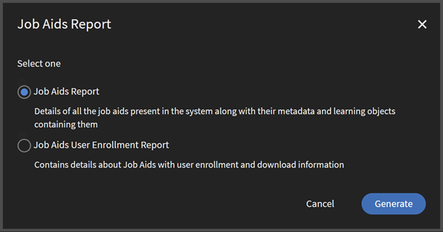

# Job Aids report

## Overview 

The Job Aids Report in Adobe Learning Manager provides detailed tracking of supplementary learning resources, PDFs, checklists, and SOPs, used in courses or certifications. The report tracks the following: 

* Job aid metadata (name, type, duration, creation details) 
* Distribution across catalogs, learning paths, and courses 
* The time and date when the job aid was published or deleted 
* Information of the user who has created the job aid 

The Job Aids report does not track: 

* The actual content of the job aid 
* Time spent viewing specific job aids 
* Offline usage after download 
* Version history of updated job aids 

This report serves as a critical tool for measuring the effectiveness of supplemental learning resources that supplement formal training programs. 

## Use cases 

**Content inventory management**

* Track all published job aids across the organization 
* Identify duplicate or redundant resources 
* Determine which job aids need updates based on creation date 

**Resource planning**

* Identify frequently used job aid topics for additional content development 
* Analyze which user has created the most used job aids 

**Catalog and Learning Path optimization**

* Audit job aid distribution across catalogs to ensure proper audience targeting 
* Identify Learning Paths that effectively incorporate supplementary resources 

## How to download the Job Aids report 

1. Log in to Adobe Learning Manager as an administrator. 
2. Select **[!UICONTROL Reports]** from the left navigation menu. 
3. Select **[!UICONTROL Custom Reports]** within Reports and then select **[!UICONTROL Excel Reports]**. 
4. Select **[!UICONTROL Job Aids Report]**. 
5. Select an option and then select **[!UICONTROL Generate]** to download the report. 
    a. **[!UICONTROL Job Aids Report: ]**Download a report of all Job Aids containing Learning Objects and their metadata. 

    

    b. **[!UICONTROL Job Aids User Enrollment Report]**: Contains details about Job Aids, such as user enrollment and download information. After you select this option, you can select either: 

      * **[!UICONTROL All Job Aids]**: If there are fewer than 10 million job aids, the report will include all of them by default. If there are more than 10 million, an error will occur, and you must manually select the required job aids. 
      * **[!UICONTROL Selected Job Aids]**: Selecting this option allows you to specify up to 10 job aids for the report. Adobe Learning Manager will check if the number exceeds 10 million. 
    
This reports contains the following fields: 

a. Job Aids Report:

| Column | Description |
|--------|-------------|
| Job Aid Name | The title of the job aid as seen by learners. |
| Language(s) | Indicates the language(s) in which the job aid is available. |
| Job Aid Link | Direct access to job aid files and external URLs from within the report. Deleted job aids remain accessible if still linked to active courses. |
| Id | A unique identifier assigned to each job aid for tracking. |
| Type | Specifies the type of job aid, such as PDF, video, or document. |
| Duration (minutes) | The estimated time (in minutes) required to view the job aid content. |
| State | Indicates the status of the job aid, such as Published, Draft, or Withdrawn. |
| Date Published (UTC TimeZone) | The date and time when the job aid was published, based on UTC. |
| Created By Name | The full name of the author who created the job aid. |
| Created By Email | The email address of the job aid creator. |
| Created By User Unique ID | The User Unique ID is an external ID generated by accounts in case they don't have email IDs of all users, or unique email IDs of all users. This column shows the unique ID of the job aid creator.  **Note:** This column will be visible only if it's enabled in the account. Contact your Customer Success Manager for more information. |
| Catalog(s) | Lists the catalog(s) in which the job aid is published and made available to learners. |
| Learning Path(s) | The Learning Path the job aid is a part of. |
| Course(s) | Lists the courses that include or link to this job aid. |
| Tags | Keywords or labels applied to help categorize and improve discoverability. |
| Skills | Skills associated with the job aid. |

b. Job Aids User Enrollment Report

| Field | Description |
|-------|-------------|
| Job Aid Name | The name of the job aid accessed by the learner. |
| Job Aid Link | Direct access to job aid files and external URLs from within the report. Deleted job aids remain accessible if still linked to active courses. |
| Type | Indicates the type of learning content, for example, VIDEO, PDF, etc. |
| State | Shows the status of the job aid for the learner, such as Enrolled, Completed, or Downloaded. |
| Date Enrolled (UTC TimeZone) | The date and time the learner first accessed the job aid. |
| Date Completed (UTC TimeZone) | The date and time the learner marked the job aid as completed. |
| Download Date (UTC TimeZone) | The date and time when the job aid was downloaded by the learner. |
| Learner Name | Full name of the learner who accessed the job aid. |
| Email | Email address of the learner. |
| User Unique ID | A unique external ID for users, especially when email IDs are not available or not unique. Used for tracking, API updates, audits, and automated data sync. Visible only if enabled for the account. Contact Customer Success Manager for details. |
| Manager Name | Name of the learner's reporting manager. |
| Manager Email | Email address of the learner's manager. |
| Manager User Unique ID | The unique ID of the learner's manager. Visible only if enabled for the account. |
| Assigned By Name | Name of the user who assigned the job aid to the learner. |
| Assigned By Email | Email of the user who assigned the job aid to the learner. |
| Assigned By User Unique ID | Unique ID of the user who assigned the job aid. Visible only if enabled for the account. |
| Created By Name | Name of the user who created the job aid. |
| Created By Email | Email address of the creator of the job aid. |
| Created By User Unique ID | Unique ID of the user who created the job aid. Visible only if enabled for the account. |
