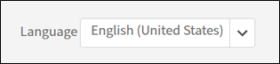
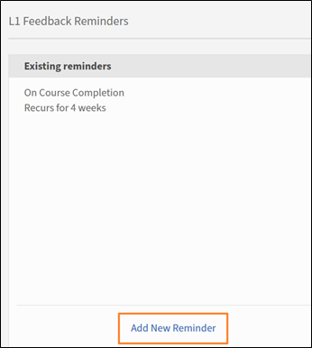
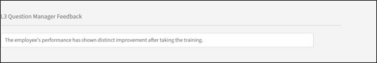
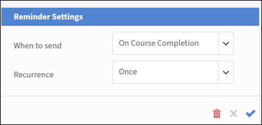

# Basic settings in Adobe Learning Manager 

## Overview 

The Basic information section serves as the foundation of your Adobe Learning Manager setup, containing essential organizational parameters that define how your learning platform operates across different regions, languages, and business contexts. 

## Key benefits 

* Provides region-specific content delivery and user experience. 
* Standardizes time displays, date formats, and currency representations. 
* Provides automatic daylight savings time adjustments for selected time zones. 
* Reduces the need for manual adjustments across the platform. 

## Configure basic settings 

### Access basic information settings 

1. Log in to Adobe Learning Manager as an administrator. 
2. Select **[!UICONTROL Settings]** in the left navigation bar. 

    

3. Select **[!UICONTROL Basic Info]** in the **[!UICONTROL Basics]** category. 

    

4. Select **[!UICONTROL Change]** to modify the basic settings. 

### Change basic settings 

**Country/Region**

The Country/Region dropdown in Adobe Learning Manager's administrator settings allows you to specify the country or region associated with their organization. This setting is used for localization purposes, ensuring that the platform aligns with regional preferences, compliance requirements, and time zones.  

**Timezone** 

The Timezone dropdown allows you to define the default time zone for the platform. This ensures that all time-sensitive activities, such as course schedules, deadlines, and reports, are accurately aligned with the organization's or learners' local time. 

**Locale** 

Locale refers to the language and regional settings for the account. The Locale dropdown allows administrators to configure the language in which the platform's interface and content are displayed to users. This option ensures that learners and administrators can interact with the platform in their preferred language. 

**Financial year starts from** 

This option allows you to define the start month of your organization's financial year. For example, if your organization's financial year starts in December, you can set this option to December. The reports and analytics will then align with this fiscal period. 

**Currency** 

The Currency option allows you to define the default currency for the account. This currency is used for pricing learning objects, such as courses, Learning Paths, and certifications. For example, if your organization operates in the United States, you can set the currency to USD ($). Similarly, for operations in Europe, you might select EUR (&euro;). 

### Change feedback settings 

Feedback settings in Adobe Learning Manager provide administrators with tools to collect and manage feedback from learners (L1) and managers (L3). These settings ensure courses and learning objectives are evaluated effectively, enabling continuous improvement. 

Before you start gathering valuable insights from your learners, you need to enable the L1 feedback feature and set its parameters. This first step involves navigating to the Feedback Settings area and turning on the feature for all new courses, as well as choosing the primary language for your feedback forms.  

### Enable L1 feedback 

On the L1 Feedback tab, locate the toggle switch labeled Enable L1 Feedback for newly created Course and Learning Path. Select the switch to turn it on. This will automatically include an L1 feedback form for any new courses you create. 

 

**Select a default language**

Use the Language dropdown to select the default language for your feedback forms. This ensures that the questions are presented to learners in the correct language. 

 

**Configure questionnaires for different course types**

Adobe Learning Manager allows you to customize the questions based on whether your course is a self-paced module or an instructor-led classroom session. This ensures that the feedback you receive is specific and relevant. In this step, you will select and refine the questions for both Self Paced Courses and Classroom Courses to gather the most meaningful data. 

**For Self-Paced Courses**: 

* **Mandatory question**: The questionnaire includes a mandatory question, "How likely is it that you would recommend this course to a colleague?". This is a standard Net Promoter Score (NPS) question that provides a key metric for overall course satisfaction. 
* **Customize questions**: Review the list of provided questions. To include a question in the feedback form, ensure the toggle switch next to it is set to Yes. To remove a question, toggle the switch to No. 
* **Add Custom questions**: If you have additional questions specific to your self-paced content, select the Add More link to create and add new, custom statements to the questionnaire. 

**For Classroom Courses**: 

* **Customize questions**: Review the list of questions tailored for classroom-based training. Toggle the switch next to each question to Yes to include it or No to exclude it from the feedback form. 
* **Add Custom questions**: To add new questions that are specific to your classroom environment or facilitation style, select the Add More link to create and add them to the list.

**Set up feedback reminders** 

To maximize your response rates, it's a good practice to configure automated reminders. This step shows you how to set up and schedule these reminders, defining when they are sent, how often they recur, and for how long. By proactively reminding learners, you can significantly increase the amount of feedback you collect. 

1. **Add a new reminder**: In the **[!UICONTROL L1 Feedback Reminders]** section, select **[!UICONTROL Add New Reminder]**. 

    

2. **Define reminder schedule**: In the **Reminder Settings** panel that appears, use the dropdown menus and input fields to configure the reminder: 

    a. **[!UICONTROL When to send]**: Select whether the reminder is sent **[!UICONTROL On Course Completion]** or **[!UICONTROL After Course]** completion. 
    b. **[!UICONTROL Recurrence]**: Select the frequency of the reminder (for example, Every week). 
    c. **[!UICONTROL For]**: Specify the total duration (in weeks) for which the reminders will be sent (for example, 4 weeks). 

3. **[!UICONTROL  Save the reminder]**: Select the blue checkmark icon to save the new reminder configuration. You can repeat this process to add more reminders if needed. 
    
    

4. Select **[!UICONTROL Save]** in the upper-right corner of the page to apply the L1 feedback settings. 

### Enable L3 feedback 

Before you can gather feedback from a learner's manager, you need to configure the L3 feedback settings. This first step involves navigating to the Feedback Settings page and selecting the L3 Feedback tab. From here, you can set the language for the feedback request and review the primary question that will be sent to the manager. 

**Select L3 Feedback tab** 

Select the L3 Feedback tab on the Feedback Settings page. 

**Review the feedback statement**

The L3 feedback is requested from the learner's manager as a single statement they can agree or disagree with. The default statement provided is: "The employee's performance has shown distinct improvement after taking the training." You can edit this statement to better suit your organization's needs. 

**Select a default language**  

Select the Language dropdown to select the default language for the feedback request. 

**Set up feedback reminders** 

To ensure that managers provide timely feedback, you need to set up automated reminders. This step involves configuring when these reminders are sent and how often they recur. The screenshot shows that L3 feedback reminders can be configured to be sent once upon course completion, but you can add more reminders if needed. 

1. **[!UICONTROL Add a new reminder]**: To create a new reminder, select the **[!UICONTROL Add New Reminder]** link. 
2. **[!UICONTROL Define reminder schedule]**: In the **[!UICONTROL Reminder Settings]** panel, select the dropdown menus and input fields to configure the reminder: 
    a. **[!UICONTROL When to send]**: Select when the reminder is sent. The options are- **[!UICONTROL On Course Completion]** and **[!UICONTROL After Course completion]**. 
    b. **[!UICONTROL Recurrence]**: Select the frequency of the reminder. If the recurrence is **[!UICONTROL Once]**, it means the manager will receive one notification to provide feedback. The available options are- Once, Every day, Every week, and Every month. 
3. After setting up the schedule, select the blue checkmark icon to save the reminder configuration. The reminder appears in the list of existing reminders. 

    

4. Select **[!UICONTROL Save]** in the upper-right corner of the page to apply the L3 feedback settings. 

## General settings

### Overview

The general settings in Adobe Learning Manager provide administrators with a centralized location to configure the overall learner experience and administrative processes. These settings allow you to enable or disable various features to tailor the platform to your organization's specific needs.

Key configurable general settings include:

* **Course effectiveness and moderation:** Choose to display a course effectiveness rating to learners and enable a course moderation feature that requires admin approval for all course changes.
* **Learner engagement features:** You can enable or disable features like the **Discussion Board** for course comments, the skills from external sources for learners, and **Digest Emails** to keep learners informed about new content and progress.
* **Content and course management:** Settings allow for configuring **Multiple Attempts** for interactive e-learning, adding **Unique Learning Object Ids** to content, and setting the default behavior for **Module Version Updates**.
* **User management:** Enable **Auto-register Users** to automatically add new users to the system and **Auto-delete Internal Users** who have been inactive for a specified period.
* **Customization and display**: You have control over what learners see, such as enabling or disabling **Filter Panels** for searching, showing **Catalog Labels**, and customizing up to three **Footer Links**.

### Course Moderation

Course moderation allows you to oversee and manage updates made to courses by authors. It ensures that any changes to course content are reviewed and approved by administrators before being published to learners. Selecting Course Moderation requires authors to seek approval from administrators to publish a course of they've made any changes to the course. 

When an author updates a course, for example, adds or removes a module or modules, and tries to publish the course,

1. You receive notifications whenever the author republishes a course with changes.
2. Select the notification to view the changes made by the author.
3. Compare the old and new content.
4. Approve or reject changes:
    a. Approve the changes to republish the course with updates.
    b. Reject the changes to keep the previous version of the course active.
5. Authors are notified of your decision, whether it is approval or rejection.

### Discussion Board

The Discussion Board option in Adobe Learning Manager allows learners to engage in discussions related to courses, modules, or learning programs. You can enable and manage this feature to foster collaboration and knowledge sharing among learners. Discussion boards are linked to specific courses or modules, making them contextually relevant.

As a learner, you can interact with other learners and your instructors using the Discussion tab. You can view the posts for any course that you view or enroll in. If an administrator has enabled discussions for a course, you can view the Discussion tab next to the Notes tab for that course.  

When you select the Discussions tab of a course, you can see the existing posts and comments for that course. If you have already enrolled into the course, you can also start typing posts or comments for other users to see. After you type the message, click Post. Your post must contain at least 10 characters. 

The post is immediately visible in the Discussions tab. You can sort the posts as Newest First or Oldest First and delete those posts that you wrote. Even after you unenroll from the course, you can still view all the posts and delete the posts that you wrote.

As administrator, you can moderate discussions to ensure relevance and appropriateness. Learners receive notifications for replies or updates in discussions they are part of.

### Multiple Attempts

Selecting this option allows authors to set the number of re-attempts possible at a course or module level. It allows learners to retake the course or assessment once completed.  This setting is useful for courses that include quizzes, tests, or course types that require evaluation.

### Visibility of Skills, Tags, Products and Roles

This option decides whether learners only see skills or tags that are assigned, or those that are part of the catalogs visible to learners, or all skills and tags. This includes skills, tags, products, and roles that are associated with courses or Learning Paths.

Select **[!UICONTROL Edit]** to restrict what a learner can see:

 
Learners then explore skills and tags visible to them and subscribe to skills of their choice.

### Unique Learning Object Ids

The option allows you to assign a unique identifier to each learning object (such as courses, Learning Paths, certifications, or job aids). This ensures that every learning object has a distinct ID, which can be useful for tracking, reporting, and integration with external systems. 

When enabled, authors see a field to add the Learning Object ID when creating a Learning Object. They can add the IDs accordingly. Unique IDs are suitable for integration with third-party systems, including Learning Record Stores (LRS) and Learning Management Systems (LMS). The unique IDs also make it easier for you or an author to search for specific Learning Objects and track them via Learner Transcripts.

### Show Filter Panels

This option allows you to control which filter options are available to learners in the learner application. These filters help learners refine their search results in the My Learning and Catalog sections for a learner. The following filter options are available for selection:

* Groups
* Catalogs
* Type
* Format
* Duration
* Skills
* Skill Levels
* Tags
* Price
* Price Range
* Locations
* Products
* Recommendation Levels

>[!NOTE]
>
>The filters **[!UICONTROL Format]** and **[!UICONTROL Duration]** are switched off by default and do not appear to the learners immediately. You must select them explicitly.

### Product Terminology

Adobe Learning Manager has certain product terminology to define Learning Objects, such as courses, Learning Paths, or job aids. You can customize the terminology in English and French, based on your preference. Download the Product Terminology template, and replace, for example, Learning Plan with Prescriptive Rule. Similarly, change similar entries in French. Then, upload the modified template, and select Save to update the terminologies in the product.

 
See Product Terminology in Adobe Learning Manager for more information.

### Module Version Update

This option allows administrators to update the content of a module without disrupting the progress of learners who are already enrolled in courses containing that module. This ensures that learners can continue their learning journey smoothly while authors can keep the content up-to-date. With the option enabled, authors can upload a new version of a module (for example, SCORM, AICC, or xAPI packages) to replace the existing one.

* Learners who have already started the module will continue with the version they were enrolled in.
* New learners will automatically access the updated version.
* Adobe Learning Manager keeps track of different versions of the module for reporting and auditing purposes.

### Auto-register Users

This option allows you to automatically register users to specific catalogs or learning content when they are added to the system. This ensures that users have immediate access to relevant learning materials without requiring manual intervention.

* New users are automatically registered to predefined catalogs or courses upon being added to the system.
* Administrators can define rules to determine which catalogs or courses users are auto-registered for, based on user attributes like roles, groups, or other criteria. See [Learning Plans in Adobe Learning Manager](/help/migrated/administrators/feature-summary/learning-plans.md) or [Automatically Enroll External User Groups in Courses Upon Registration](https://elearning.adobe.com/2024/05/automatically-enroll-external-user-groups-in-courses-upon-registration/) for more information.

### Auto-delete Internal Users

This option deletes users if they do not access Adobe Learning Manager for a specified duration.  Specify the number of days that a user can have access without logging into Adobe Learning Manager. Using this option, you can also automatically remove inactive internal users from the system after a specified period. This helps maintain a clean and organized user database by removing users who are no longer active. 

* Internal users who have been inactive for a defined duration are automatically deleted.
* Users are notified before deletion, giving them an opportunity to log in and prevent removal.
* To have their access restored, a deleted user must contact the account administrator.

### Show Catalog Labels

This option allows an author to set catalog labels when creating a Learning Object. A learner then sees the catalog labels in the Catalog section of the learner application. These labels help learners identify and differentiate between various catalogs available to them. If the option is deselected, the courses or Learning Objects move to the default catalog.

### Custom Compliance type

This option allows an author to define and manage compliance types tailored to their organization's specific requirements, while creating Learning Objects. Authors can add a compliance label and a deadline to the course they're creating.
This is particularly useful for tracking and enforcing compliance training for employees based on unique organizational policies.

### Learners can view their scores

Selecting this option ensures that learners can view their quiz scores in their Learner Transcripts. In the transcripts, the columns Quiz_score, Quiz_score_max, Highest_Quiz_score, and Highest_Quiz_score_max help a learner view their assessment scores. These scores help learners track their progress and understand their performance.

If you deselect the option, the quiz scores do not appear in the learners' Learner Transcripts.

### Digest Email

This option allows you to send summary emails to learners, providing updates on their learning activities, progress, and upcoming deadlines. These emails are designed to keep learners informed and engaged with their training programs. These emails capture learners' activities, such as courses completed.

You can change the frequency of the emails in the Email Template settings. Additionally, you can customize the content of the digest emails to include specific details relevant to learners.

>[!NOTE]
>
>* For active accounts, digest emails will be disabled by default, which you can enable it manually.
>* For trial accounts, the option for digest emails will remain disabled and you cannot enable the option.

### Enable Course/ Learning Path/ Certification/ Job Aid Card Icons

This option allows authors to add cover images on the learner's course cards for different types of learning content. These images help learners easily identify the type of content (for example, course, Learning Path, certification, or job aid) at a glance. While creating a Learning Object, authors can add cover images to courses.

If you do not select the option, the cards do not display any icons.

### Footer Links

This option allows you to customize the footer section of the learner app by adding links to external resources, company websites, or other relevant pages. These links appear at the bottom of the learner app interface and can be used to provide quick access to important information. The links can direct learners to external websites, help pages, or company policies. They provide learners with easy access to additional resources directly from the app.

Here's how you can customize the footer links:

1. **[!UICONTROL Add links]**: Select **[!UICONTROL Add More]** and enter the name and the URL or email ID in the specified fields. Ensure the URL is prefixed with http:// or https://.
2. **[!UICONTROL Replicate across locales]**: Select **[!UICONTROL Replicate]** to cascade the changes across all locales, ensuring all languages get the same name and URL.
3. Select **[!UICONTROL Save]** to apply the changes.

**Additional options:**

* Reset default values: Select the Reset icon to revert to default values in the Help and Contact Admin fields.
* Customize for all languages: Select a language from the drop-down list, then add the name and URL for that language. Save changes to update the footer links for the selected language.

### Report Timezone

This option allows you to set an account-level preference for exporting the Learning Transcripts and Session Summary report in specific time zones. The available options are:

* UTC (Default behavior)
* Account-level time zone preference

This option also ensures that the Learner Transcript downloaded using the Jobs API reflects the selected time zone. 

### Badgr Integration

Selecting the option allows learners to:

* Upload their badges to the Badgr website.
* Share the badges on social media.

How it works:

* Select the option in Badgr Integration section.
* Learners log in to their Badgr account from Adobe Learning Manager.
* Badges earned in Adobe Learning Manager are uploaded to the Badgr account automatically.

>[!NOTE]
>
>* Adobe Learning Manager does not provide a Badgr account as part of the integration. Learners must create their own Badgr account.
>* Learners can configure their Badgr account directly from the Badges page in the learner app.

See [Support for Badgr](/help/migrated/learners/feature-summary/badges.md#support-for-badgr-badges) badges for more information.

### Show Ratings

This option allows you to enable or disable the display of course ratings in the learner app. When enabled, learners can view ratings for courses, which helps them make informed decisions about enrolling in a course.

* If the option Course Effectiveness is selected, learners will be able to see only the value of the course effectiveness. The course effectiveness is calculated based on learner feedback (L1), quiz scores (L2), and manager feedback (L3).
* If the option Star rating is selected, learners will be able to view only the average star rating and the number of learners who have rated the course. The star rating is the average of all ratings given by learners upon completing a course.

For new accounts, the Show Ratings section will have the option Star rating enabled by default.

For existing accounts, if the account previously had the option Course effectiveness enabled, then the Show Ratings section will be enabled with the option Course effectiveness selected. If the option Course Effectiveness is disabled, then the Show Ratings section will also be disabled. When the Show Ratings section is enabled, the option Star rating will be enabled by default.

### Default view (Learner role)

This option refers to the learners' view of the course catalog. Select the List view checkbox to change the learners' view from the default grid view to the list view.

### Learning Paths

If you select **[!UICONTROL Enable Extended features of Learning Path]**, you can include Learning Paths inside Learning Paths and combine those Learning Paths with Courses. The option is irreversible.

### Instructor Management

This option ensures that authors can select instructors for a Virtual Classroom or Classroom session from a predetermined list. 

**Key features:**

* Restrict instructor selection: Only users with the instructor role can be assigned to sessions.
* Impact on migration workflows: This restriction does not apply to migration workflows.

### Module Preview

If you select Enable, authors can preview a course as learners after creating the course.

### Enable pricing for Courses/ Learning Paths/ Certifications

This option allows you to enable eCommerce functionality for courses, Learning Paths, and certifications. This feature is primarily used to integrate Adobe Learning Manager with Adobe Commerce, enabling organizations to monetize their training offerings.
Once you enable the feature, the Currency field appears on the Basic Info page.

When courses are chargeable, authors can specify the course, Learning Path, or certification price. Learners can purchase training directly from Adobe Learning Manager or [custom-built AEM sites](/help/migrated/integrate-aem-learning-manager.md).

>[!NOTE]
>
>Certain types of training, such as recurring certifications and manager-approved courses, cannot be purchased.

### Enable Multi Item SKU Cart

This option allows learners to add multiple training items (courses, Learning Paths, certifications) to a shopping cart and purchase them together. This feature is part of the eCommerce functionality integrated with Adobe Commerce.

This feature is particularly useful for organizations that sell multiple training items and want to streamline the purchasing process for learners. 

**Key features:** 

* Multiple purchases: Learners can add multiple items to their cart and purchase them in one transaction. See Multi-item cart for more information.
*Streamlined checkout: Reduces the need for learners to make separate purchases for each training item. 
* SKU management: Administrators can manage SKUs for courses, learning paths, and certifications to ensure proper tracking and reporting.

### Player settings

This option allows authors to customize the Fluidic Player for different courses at the course level. Authors can configure how training content is displayed to learners in the player. This includes settings related to content language, interface preferences, and playback options.

### Managers can mark complete

This option allows managers to mark course, certification, or Learning Path completion for their staff. This feature is useful in scenarios where learners have completed training outside the platform or need manual intervention to update their progress. 
Managers can mark course completion via:

* Checklist module: The Checklist Module allows managers to evaluate learners' performance based on specific tasks or criteria. Authors must enable this module during course creation and assign managers as reviewers.
* Course page: On the course page:
    a.    Select the **[!UICONTROL Learners]** tab in the left pane. 
    b.    Select the learner whose attendance you want to mark. 
    c.    Select **[!UICONTROL Actions]** > **[!UICONTROL Mark Completion]**. 

**Additional notes:**

* Managers can also export the learners list for reporting purposes. 
* If a course includes multiple instances, managers can view and manage learners separately for each instance.

### Retire

This option allows authors to retire training content (courses, learning paths, certifications) that is no longer relevant or needed. Retired content is removed from the learner's catalog but remains accessible in reports and historical data for tracking purposes. You have two options:

1. Once retired, enrolled Learners will be able to view and perform actions, but not yet enrolled Learners will lose access:
    a. Enrolled learners:
        i. Learners who are already enrolled in the retired course or learning path can still access the content.
        ii. They can continue to perform actions such as completing the course or viewing the material.
    b. Not yet enrolled learners:
        i. Learners who have not enrolled in the course or learning path before it was retired will no longer see the content in the catalog.
        ii. They will lose access to the retired content entirely.
2. Once retired, both enrolled and not yet enrolled Learners will lose access:
    a. Enrolled learners:
        i. Learners who were already enrolled in the course or learning path will lose access to the content once it is retired.
        ii. They will no longer be able to view or perform any actions on the retired content.
    b. Not yet enrolled learners:
        i. Learners who have not enrolled in the course or learning path will also lose access, as the content will no longer appear in the catalog.

### Auto Retire

This option allows authors to set a specific date for a course to automatically retire. When a course is retired, it is no longer available for new enrollments, but learners who are already enrolled can still access and complete the course.

Key notes:

* Once the Auto Retire date is set, the course will automatically move to the Retired state on the specified date.
* Retired courses are not visible in the course catalog for new learners, but existing learners can still access and complete them.

### Show all enrolled Course in search results

This option allows learners to view courses in search results even if the learners are part of their enrolled Learning Path or Certification.

### Skills import

This option allows you to import skills from external sources, such as LinkedIn Learning and Go1, using respective connectors. This functionality integrates external Skills Clouds and Talent Management Systems into Adobe Learning Manager, enhancing the platform's ability to manage and utilize skills effectively.

The skills from external content providers are added to the admin-defined skills repository in Adobe Learning Manager. These skills become available to authors during the course creation workflow.

1. Select **[!UICONTROL Enable]**.

    
 
2. Select a content provider from the **[!UICONTROL Select Skills Source]** dropdown. 
3. Select **[!UICONTROL Save]**.
Note that once the option is enabled, the action is irreversible. You cannot disable or change to another source later.
