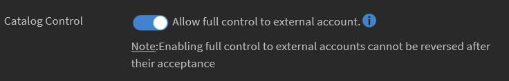
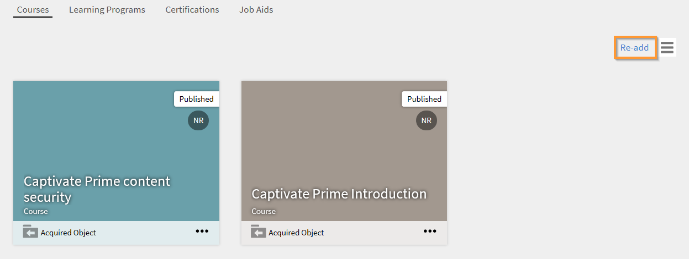

# Enable full control of shared catalog {#enable-full-control-of-shared-catalog}

Learning Manager Learning Programs are renamed to Learning Paths. This change happens immediately after the October 2021 release and the terminology of Learning Path is reflected for all roles.

## Create Catalog {#createcatalog}

As an Administrator, you can create a catalog of courses, Learning Programs, Job Aids, and Certifications.

For more information, see [Catalogs](https://helpx.adobe.com/captivate-prime/administrators/feature-summary/catalogs.html).

## Share Catalog {#sharecatalog}

You can share the catalogs with internal users of an organization or with any external users. However, the sharing is exclusive. In other words, an internally shared catalog cannot be shared with external groups and vice versa.

Courses, Learning programs, Job-Aids, and certifications are the supported learning objects for shared catalog. 

For more information, see [Share Catalogs](https://helpx.adobe.com/captivate-prime/administrators/feature-summary/catalogs.html#shared).

## Enable full control of shared catalog {#fullcontrol}

You can grant full access to your catalog to external accounts. The administrator of the account can then accept the catalog and can accordingly add or delete learning(s) or modules.

To grant full control to an external account,

1. After adding learning(s) to a catalog, you must share the catalog with external users.
1. On the External Account dialog box, add the subdomain and the email id of the Administrator of the external organization.
1. In the option Catalog Control, toggle the button to allow full control of the catalog to external users.

   

   When you allow full catalog control, the Administrator of the external organization accepts the request to allow modifications to the catalog. The author of the external organization then can edit the courses or add modules.

   See the sections below for more information.

## Administrator of external organization {#administratorofexternalorganization}

Once the Administrator of the previous organization enables full control of the catalog, the Administrator of the external organization accepts the request accepts the catalog and views it.

1. Click the notification icon to view the notification to accept the catalog.

   

1. To accept the invitation for the catalog, click Accept.
1. On the list of catalogs, if you launch the catalog that has been shared with you, you can see a message that the catalog now has full control.

   

1. You can modify the name of the catalog and description.

## Share catalog for Learning program, Certification, and Job aids {#sharecatalogforlearningprogramcertificationandjobaids}

Like granting full catalog control for courses, the Administrator can also grant full catalog control for the following:

* Learning Programs
* Certifications
* Job Aids

## Reset course {#resetcourse}

1. On the catalog card that has a broken link, click Reset Course.

   

1. You see an alert message after you click the Reset button. Resetting the course:

   * Removes all newly added content from the catalog.
   * Updates the catalog in sync with the original shared catalog.
   * Restores the relationship with the parent Learning Object.

   Resetting the catalog is irreversible. You cannot undo the changes that you have made to the catalog.

1. To accept the changes, click Yes.
1. On the Course Catalog, you can see that that the catalog does not have the message *Link Broken* anymore.

   When you view the catalog details, you can see that the catalog is now restored to its original state.

## Re-add a Learning Object {#readdalearningobject}

If you have removed a course, learning program, certification, or job aid inadvertantly, you can restore it.

To restore a deleted Learning Object, click Re-add.

This action reverses the action and restores the Learning Object in the catalog view.

After clicking the Re-add button, there is a confirmaton message that the Learning Object has been successfully added to the catalog.

## External organization {#externalorganization}

Once the Administrator of the externsal account has accepted the catalog, the author can now add courses and Learning Programs.

1. As a user, you receive a notification that the catalog is now available in your account.
1. To see the list of courses, click **Courses** on the left navigation pane. You can see all courses created by you and shared with you.
1. To view the course details, click **View Course** on the course card.

   

1. In the course detail page, you can see information about the course and the shared modules. To add a module, click Add Modules. When you add modules to the existing modules, the new modules appear at the end of the existing modules. You can always rearrange the modules.
1. After you have added the modules, click Republish.

   After you republish the modules, on the catalog card, you see a message *Link Broken*.

   Since you have updated the original catalog with new modules, the existing relationship with the acquired course no longer exists.

   The Learning Object will be out of sync with the source account as content of the Learning Object has been modified.

   

After having added and republished the module, if you feel that you had inadvertently added or deleted a course in the catalog previously, you can reset the module and revert the module to its original state when it was first shared with full control.
